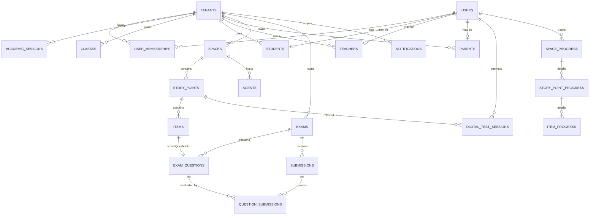
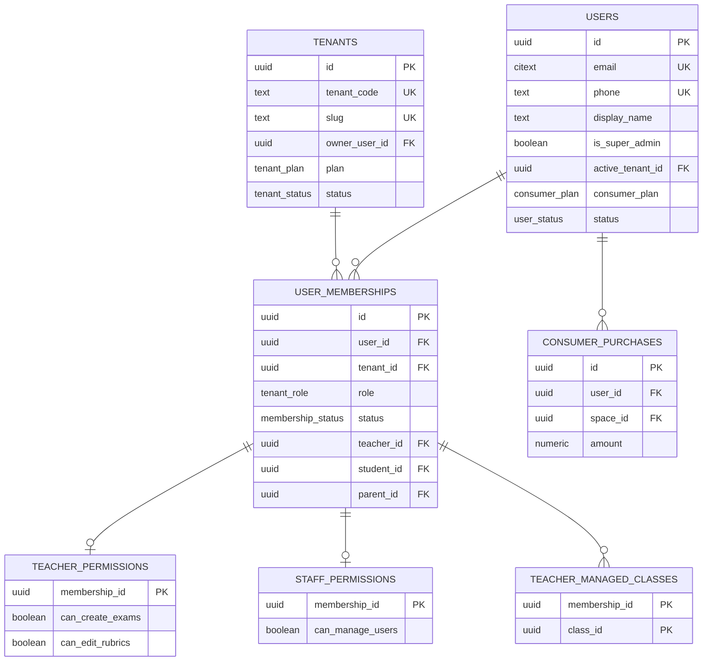
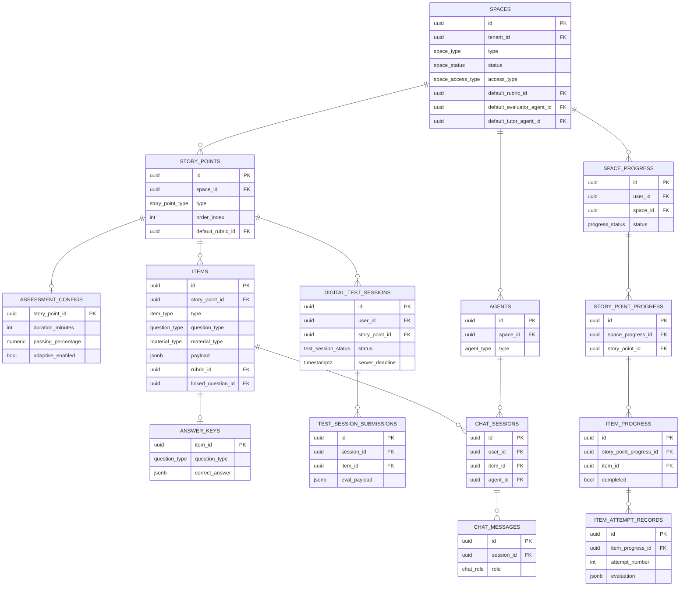
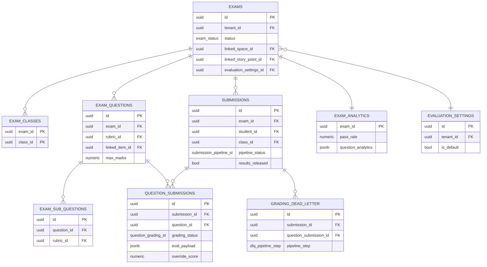
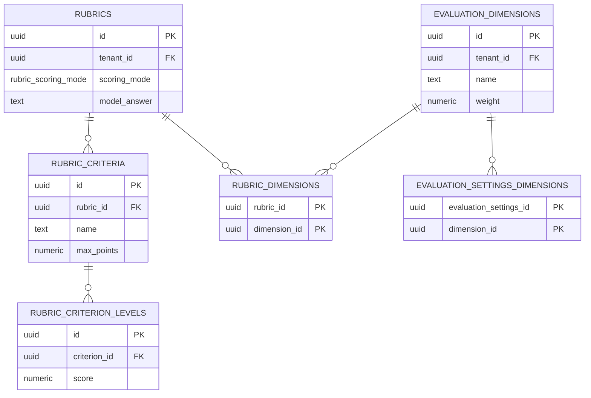

# Auto-LevelUp — SQL Domain Model & ERD

> Translation of the current Firestore document model into a normalized
> PostgreSQL schema, with full ERD, junction tables, indexes, and an honest
> evaluation of whether SQL is a good fit for this system.

**Source of truth:** `packages/shared-types/src/**` (mapped 1:1 in §1–§7).
**Dialect:** PostgreSQL 15+ (`JSONB`, `ENUM`, `gen_random_uuid()`,
`GENERATED ALWAYS AS`). **Naming:** `snake_case` tables, `_id` suffix for FKs,
plural table names, singular type/enum names.

---

## 0. Modeling principles

1. **Tenant-scoping is universal.** Every domain table (except `users`,
   `tenants`, `tenant_codes`, `platform_activity_log`,
   `announcements (scope='platform')`) has a `tenant_id` FK. This enables
   row-level security policies
   (`USING (tenant_id = current_setting('app.tenant_id')::uuid)`).
2. **Branded IDs in TS map to UUID v7** (sortable, time-prefixed) — the same
   nominal-type-safety property is achieved at the app layer via the existing
   `Brand<>` types; SQL itself doesn't have nominal types.
3. **Discriminated unions** (`ItemPayload`, `QuestionTypeData`) → `JSONB`
   columns with a CHECK constraint enforcing the discriminator. Modeling each of
   15 question subtypes as its own table is wrong cost/benefit: payloads are
   write-once-read-once and never joined on internals.
4. **Map<string, X> Firestore fields** (`SpaceProgress.storyPoints`,
   `DigitalTestSession.submissions`, `Notification.byPurpose`) → first-class
   child tables. This is the **biggest win** of SQL over the current model.
5. **Arrays of FKs** (`Class.studentIds`, `Space.classIds`) → junction tables.
   Eliminates the dual-write integrity problem the current schema has (e.g.
   `Class.studentIds` ↔ `Student.classIds`).
6. **Denormalized aggregates** (`Space.stats`, `Tenant.usage`,
   `Space.ratingAggregate`) → keep as columns OR move to materialized views
   refreshed by triggers. Both options shown.
7. **Soft delete via `archived_at TIMESTAMPTZ NULL`**, not a `deleted` boolean —
   preserves "when".
8. **Audit columns** standardized: `created_at`, `updated_at`, `created_by`,
   `updated_by` on every entity; `updated_at` maintained by trigger.
9. **All timestamps** = `TIMESTAMPTZ` (UTC). The Firestore `FirestoreTimestamp`
   shape goes away.

---

## 1. Enums (centralized)

```sql
-- Identity
CREATE TYPE auth_provider          AS ENUM ('email', 'phone', 'google', 'apple');
CREATE TYPE user_status            AS ENUM ('active', 'suspended', 'deleted');
CREATE TYPE consumer_plan          AS ENUM ('free', 'pro', 'premium');
CREATE TYPE tenant_plan            AS ENUM ('free', 'trial', 'basic', 'premium', 'enterprise');
CREATE TYPE tenant_status          AS ENUM ('active', 'suspended', 'trial', 'expired', 'deactivated');
CREATE TYPE tenant_role            AS ENUM ('superAdmin','tenantAdmin','teacher','student','parent','scanner','staff');
CREATE TYPE membership_status      AS ENUM ('active', 'inactive', 'suspended');
CREATE TYPE join_source            AS ENUM ('admin_created','bulk_import','invite_code','self_register','migration','tenant_code');
CREATE TYPE entity_lifecycle       AS ENUM ('active', 'archived');
CREATE TYPE billing_cycle          AS ENUM ('monthly', 'annual');

-- Content / LevelUp
CREATE TYPE space_type             AS ENUM ('learning','practice','assessment','resource','hybrid');
CREATE TYPE space_status           AS ENUM ('draft','published','archived');
CREATE TYPE space_access_type      AS ENUM ('class_assigned','tenant_wide','public_store');
CREATE TYPE story_point_type       AS ENUM ('standard','timed_test','quiz','practice','test');
CREATE TYPE item_type              AS ENUM ('question','material','interactive','assessment','discussion','project','checkpoint');
CREATE TYPE question_type          AS ENUM ('mcq','mcaq','true-false','numerical','text','paragraph','code',
                                            'fill-blanks','fill-blanks-dd','matching','jumbled','audio',
                                            'image_evaluation','group-options','chat_agent_question');
CREATE TYPE material_type          AS ENUM ('text','video','pdf','link','interactive','story','rich');
CREATE TYPE difficulty             AS ENUM ('easy','medium','hard','expert');
CREATE TYPE blooms_level           AS ENUM ('remember','understand','apply','analyze','evaluate','create');
CREATE TYPE agent_type             AS ENUM ('tutor','evaluator');
CREATE TYPE rubric_scoring_mode    AS ENUM ('criteria_based','dimension_based','holistic','hybrid');
CREATE TYPE dimension_priority     AS ENUM ('HIGH','MEDIUM','LOW');
CREATE TYPE progress_status        AS ENUM ('not_started','in_progress','completed');
CREATE TYPE question_progress_st   AS ENUM ('pending','correct','incorrect','partial');
CREATE TYPE chat_role              AS ENUM ('user','assistant','system');
CREATE TYPE test_session_status    AS ENUM ('in_progress','completed','expired','abandoned');
CREATE TYPE test_session_type      AS ENUM ('timed_test','quiz','practice');
CREATE TYPE question_status        AS ENUM ('not_visited','not_answered','answered','marked_for_review','answered_and_marked');
CREATE TYPE attachment_type        AS ENUM ('image','pdf','audio');
CREATE TYPE mistake_classification AS ENUM ('Conceptual','Silly Error','Knowledge Gap','None');

-- AutoGrade
CREATE TYPE exam_status            AS ENUM ('draft','question_paper_uploaded','question_paper_extracted',
                                            'published','grading','completed','results_released','archived');
CREATE TYPE submission_pipeline_st AS ENUM ('uploaded','ocr_processing','ocr_failed','scouting','scouting_failed',
                                            'scouting_complete','grading','grading_partial','grading_failed',
                                            'grading_complete','finalization_failed','ready_for_review','reviewed',
                                            'failed','manual_review_needed');
CREATE TYPE question_grading_st    AS ENUM ('pending','processing','graded','needs_review','failed','manual','overridden');
CREATE TYPE upload_source          AS ENUM ('web','scanner');
CREATE TYPE dlq_pipeline_step      AS ENUM ('ocr','scouting','grading');
CREATE TYPE dlq_resolution         AS ENUM ('retry_success','manual_grade','dismissed');

-- Cross-cutting
CREATE TYPE notification_type      AS ENUM ('exam_results_released','new_exam_assigned','new_space_assigned',
                                            'submission_graded','grading_complete','student_at_risk',
                                            'deadline_reminder','space_published','bulk_import_complete',
                                            'ai_budget_alert','system_announcement');
CREATE TYPE announcement_scope     AS ENUM ('platform','tenant');
CREATE TYPE announcement_status    AS ENUM ('draft','published','archived');
CREATE TYPE achievement_category   AS ENUM ('learning','consistency','excellence','exploration','social','milestone');
CREATE TYPE achievement_rarity     AS ENUM ('common','uncommon','rare','epic','legendary');
CREATE TYPE achievement_tier       AS ENUM ('bronze','silver','gold','platinum','diamond');
CREATE TYPE insight_type           AS ENUM ('weak_topic_recommendation','exam_preparation','streak_encouragement',
                                            'improvement_celebration','at_risk_intervention','cross_system_correlation');
CREATE TYPE insight_priority       AS ENUM ('high','medium','low');
CREATE TYPE at_risk_reason         AS ENUM ('low_exam_score','no_recent_activity','low_space_completion',
                                            'declining_performance','zero_streak');
CREATE TYPE app_error_code         AS ENUM ('VALIDATION_FAILED','NOT_FOUND','PERMISSION_DENIED','UNAUTHENTICATED',
                                            'RATE_LIMITED','CONFLICT','PRECONDITION_FAILED','INTERNAL_ERROR','QUOTA_EXCEEDED');
CREATE TYPE platform_activity      AS ENUM ('tenant_created','tenant_updated','tenant_deactivated','tenant_reactivated',
                                            'user_created','users_bulk_imported');
```

---

## 2. Identity domain

### 2.1 `users` (platform-level, ≈ `UnifiedUser`)

```sql
CREATE TABLE users (
    id                    UUID PRIMARY KEY,                       -- = Firebase Auth UID
    email                 CITEXT UNIQUE,
    phone                 TEXT UNIQUE,
    display_name          TEXT NOT NULL,
    first_name            TEXT,
    last_name             TEXT,
    photo_url             TEXT,

    -- Consumer (B2C)
    country               CHAR(2),
    age                   SMALLINT CHECK (age BETWEEN 0 AND 150),
    grade                 TEXT,
    onboarding_completed  BOOLEAN NOT NULL DEFAULT FALSE,
    preferences           JSONB NOT NULL DEFAULT '{}'::jsonb,
    consumer_plan         consumer_plan,
    total_spend           NUMERIC(12,2) NOT NULL DEFAULT 0,

    -- Platform
    is_super_admin        BOOLEAN NOT NULL DEFAULT FALSE,
    active_tenant_id      UUID REFERENCES tenants(id) ON DELETE SET NULL,

    status                user_status NOT NULL DEFAULT 'active',
    last_login            TIMESTAMPTZ,
    created_at            TIMESTAMPTZ NOT NULL DEFAULT now(),
    updated_at            TIMESTAMPTZ NOT NULL DEFAULT now()
);

CREATE TABLE user_auth_providers (
    user_id      UUID NOT NULL REFERENCES users(id) ON DELETE CASCADE,
    provider     auth_provider NOT NULL,
    PRIMARY KEY (user_id, provider)
);

-- Consumer purchase ledger (was UnifiedUser.consumerProfile.purchaseHistory[])
CREATE TABLE consumer_purchases (
    id              UUID PRIMARY KEY DEFAULT gen_random_uuid(),
    user_id         UUID NOT NULL REFERENCES users(id) ON DELETE CASCADE,
    space_id        UUID NOT NULL REFERENCES spaces(id) ON DELETE RESTRICT,
    space_title     TEXT NOT NULL,            -- denormalized snapshot
    amount          NUMERIC(12,2) NOT NULL,
    currency        CHAR(3) NOT NULL,
    transaction_id  TEXT NOT NULL UNIQUE,
    purchased_at    TIMESTAMPTZ NOT NULL DEFAULT now()
);

CREATE TABLE consumer_enrolled_spaces (
    user_id   UUID NOT NULL REFERENCES users(id)  ON DELETE CASCADE,
    space_id  UUID NOT NULL REFERENCES spaces(id) ON DELETE CASCADE,
    enrolled_at TIMESTAMPTZ NOT NULL DEFAULT now(),
    PRIMARY KEY (user_id, space_id)
);
```

### 2.2 `tenants`

```sql
CREATE TABLE tenants (
    id                  UUID PRIMARY KEY DEFAULT gen_random_uuid(),
    name                TEXT NOT NULL,
    short_name          TEXT,
    slug                TEXT NOT NULL UNIQUE,
    description         TEXT,
    tenant_code         TEXT NOT NULL UNIQUE,    -- e.g. SUB001
    owner_user_id       UUID NOT NULL REFERENCES users(id) ON DELETE RESTRICT,

    contact_email       CITEXT NOT NULL,
    contact_phone       TEXT,
    contact_person      TEXT,
    website             TEXT,

    -- Address (flattened — small + fixed)
    address_street      TEXT,
    address_city        TEXT,
    address_state       TEXT,
    address_country     CHAR(2),
    address_zip         TEXT,

    status              tenant_status NOT NULL DEFAULT 'trial',
    trial_ends_at       TIMESTAMPTZ,

    -- Subscription (flattened — read often, write rarely)
    plan                tenant_plan NOT NULL DEFAULT 'trial',
    billing_cycle       billing_cycle,
    billing_email       CITEXT,
    subscription_expires_at  TIMESTAMPTZ,
    current_period_start     TIMESTAMPTZ,
    current_period_end       TIMESTAMPTZ,
    cancel_at_period_end     BOOLEAN NOT NULL DEFAULT FALSE,
    max_students        INTEGER,
    max_teachers        INTEGER,
    max_spaces          INTEGER,
    max_exams_per_month INTEGER,

    -- Feature flags (each as a column — searchable, indexable)
    feat_auto_grade        BOOLEAN NOT NULL DEFAULT TRUE,
    feat_level_up          BOOLEAN NOT NULL DEFAULT TRUE,
    feat_scanner_app       BOOLEAN NOT NULL DEFAULT FALSE,
    feat_ai_chat           BOOLEAN NOT NULL DEFAULT TRUE,
    feat_ai_grading        BOOLEAN NOT NULL DEFAULT TRUE,
    feat_analytics         BOOLEAN NOT NULL DEFAULT TRUE,
    feat_parent_portal     BOOLEAN NOT NULL DEFAULT FALSE,
    feat_bulk_import       BOOLEAN NOT NULL DEFAULT TRUE,
    feat_api_access        BOOLEAN NOT NULL DEFAULT FALSE,

    -- Settings
    gemini_key_ref         TEXT,                    -- Secret Manager reference, not the key itself
    gemini_key_set         BOOLEAN NOT NULL DEFAULT FALSE,
    default_evaluation_settings_id UUID,            -- FK added later (forward ref)
    default_ai_model       TEXT,
    timezone               TEXT,
    locale                 TEXT,
    grading_policy         TEXT,

    -- Branding
    logo_url               TEXT,
    banner_url             TEXT,
    favicon_url            TEXT,
    primary_color          TEXT,
    accent_color           TEXT,

    -- Onboarding
    onboarding_completed   BOOLEAN NOT NULL DEFAULT FALSE,
    onboarding_completed_at TIMESTAMPTZ,
    onboarding_steps       TEXT[] NOT NULL DEFAULT '{}',

    -- Deactivation
    deactivation_reason          TEXT,
    deactivated_at               TIMESTAMPTZ,
    deactivated_by_user_id       UUID REFERENCES users(id) ON DELETE SET NULL,
    previous_status              tenant_status,
    reactivated_at               TIMESTAMPTZ,
    reactivated_by_user_id       UUID REFERENCES users(id) ON DELETE SET NULL,

    created_at          TIMESTAMPTZ NOT NULL DEFAULT now(),
    created_by_user_id  UUID REFERENCES users(id) ON DELETE SET NULL,
    updated_at          TIMESTAMPTZ NOT NULL DEFAULT now(),
    updated_by_user_id  UUID REFERENCES users(id) ON DELETE SET NULL
);

-- Live counters — kept fresh via triggers OR materialized view
CREATE TABLE tenant_stats (
    tenant_id              UUID PRIMARY KEY REFERENCES tenants(id) ON DELETE CASCADE,
    total_students         INTEGER NOT NULL DEFAULT 0,
    total_teachers         INTEGER NOT NULL DEFAULT 0,
    total_classes          INTEGER NOT NULL DEFAULT 0,
    total_spaces           INTEGER NOT NULL DEFAULT 0,
    total_exams            INTEGER NOT NULL DEFAULT 0,
    active_students_30d    INTEGER NOT NULL DEFAULT 0,
    -- Usage
    current_students       INTEGER NOT NULL DEFAULT 0,
    current_teachers       INTEGER NOT NULL DEFAULT 0,
    current_spaces         INTEGER NOT NULL DEFAULT 0,
    exams_this_month       INTEGER NOT NULL DEFAULT 0,
    ai_calls_this_month    INTEGER NOT NULL DEFAULT 0,
    storage_bytes          BIGINT NOT NULL DEFAULT 0,
    last_updated_at        TIMESTAMPTZ NOT NULL DEFAULT now()
);
```

### 2.3 `user_memberships` (the user ↔ tenant hub)

Replaces the `{uid}_{tenantId}` composite key with a clean PK + unique
constraint.

```sql
CREATE TABLE user_memberships (
    id              UUID PRIMARY KEY DEFAULT gen_random_uuid(),
    user_id         UUID NOT NULL REFERENCES users(id)   ON DELETE CASCADE,
    tenant_id       UUID NOT NULL REFERENCES tenants(id) ON DELETE CASCADE,
    tenant_code     TEXT NOT NULL,
    role            tenant_role NOT NULL,
    status          membership_status NOT NULL DEFAULT 'active',
    join_source     join_source NOT NULL,

    -- Role-specific entity FKs (exactly one set, enforced by CHECK)
    teacher_id      UUID REFERENCES teachers(id) ON DELETE SET NULL,
    student_id      UUID REFERENCES students(id) ON DELETE SET NULL,
    parent_id       UUID REFERENCES parents(id)  ON DELETE SET NULL,
    scanner_id      UUID,
    staff_id        UUID,
    school_id       UUID,

    last_active_at  TIMESTAMPTZ,
    created_at      TIMESTAMPTZ NOT NULL DEFAULT now(),
    updated_at      TIMESTAMPTZ NOT NULL DEFAULT now(),

    UNIQUE (user_id, tenant_id),
    CHECK (
        (role = 'teacher'      AND teacher_id IS NOT NULL) OR
        (role = 'student'      AND student_id IS NOT NULL) OR
        (role = 'parent'       AND parent_id  IS NOT NULL) OR
        (role IN ('superAdmin','tenantAdmin','staff','scanner'))
    )
);

-- Granular teacher permissions (1:1 with membership for role='teacher')
CREATE TABLE teacher_permissions (
    membership_id          UUID PRIMARY KEY REFERENCES user_memberships(id) ON DELETE CASCADE,
    can_create_exams       BOOLEAN NOT NULL DEFAULT TRUE,
    can_edit_rubrics       BOOLEAN NOT NULL DEFAULT TRUE,
    can_manually_grade     BOOLEAN NOT NULL DEFAULT TRUE,
    can_view_all_exams     BOOLEAN NOT NULL DEFAULT FALSE,
    can_create_spaces      BOOLEAN NOT NULL DEFAULT FALSE,
    can_manage_content     BOOLEAN NOT NULL DEFAULT FALSE,
    can_view_analytics     BOOLEAN NOT NULL DEFAULT FALSE,
    can_configure_agents   BOOLEAN NOT NULL DEFAULT FALSE
);

-- Granular staff permissions (1:1 with membership for role='staff')
CREATE TABLE staff_permissions (
    membership_id          UUID PRIMARY KEY REFERENCES user_memberships(id) ON DELETE CASCADE,
    can_manage_users       BOOLEAN NOT NULL DEFAULT FALSE,
    can_manage_classes     BOOLEAN NOT NULL DEFAULT FALSE,
    can_manage_billing     BOOLEAN NOT NULL DEFAULT FALSE,
    can_view_analytics     BOOLEAN NOT NULL DEFAULT TRUE,
    can_manage_settings    BOOLEAN NOT NULL DEFAULT FALSE,
    can_export_data        BOOLEAN NOT NULL DEFAULT FALSE
);

-- Teacher's managed-class set (was permissions.managedClassIds[])
CREATE TABLE teacher_managed_classes (
    membership_id  UUID NOT NULL REFERENCES user_memberships(id) ON DELETE CASCADE,
    class_id       UUID NOT NULL REFERENCES classes(id)          ON DELETE CASCADE,
    PRIMARY KEY (membership_id, class_id)
);

-- Teacher's managed-space set
CREATE TABLE teacher_managed_spaces (
    membership_id  UUID NOT NULL REFERENCES user_memberships(id) ON DELETE CASCADE,
    space_id       UUID NOT NULL REFERENCES spaces(id)           ON DELETE CASCADE,
    PRIMARY KEY (membership_id, space_id)
);
```

> **`PlatformClaims` (JWT) and `tenant_codes` indexes go away.** Claims are
> session-only — recomputed on login from `user_memberships`. Tenant code
> uniqueness is a UNIQUE constraint on `tenants.tenant_code`.

---

## 3. Tenant entities

```sql
CREATE TABLE academic_sessions (
    id             UUID PRIMARY KEY DEFAULT gen_random_uuid(),
    tenant_id      UUID NOT NULL REFERENCES tenants(id) ON DELETE CASCADE,
    name           TEXT NOT NULL,
    start_date     DATE NOT NULL,
    end_date       DATE NOT NULL,
    is_current     BOOLEAN NOT NULL DEFAULT FALSE,
    status         entity_lifecycle NOT NULL DEFAULT 'active',
    created_at     TIMESTAMPTZ NOT NULL DEFAULT now(),
    updated_at     TIMESTAMPTZ NOT NULL DEFAULT now(),
    CHECK (end_date >= start_date)
);

-- Only one current session per tenant
CREATE UNIQUE INDEX academic_sessions_one_current_per_tenant
    ON academic_sessions(tenant_id) WHERE is_current = TRUE;

CREATE TABLE classes (
    id                   UUID PRIMARY KEY DEFAULT gen_random_uuid(),
    tenant_id            UUID NOT NULL REFERENCES tenants(id)            ON DELETE CASCADE,
    academic_session_id  UUID REFERENCES academic_sessions(id)           ON DELETE SET NULL,
    name                 TEXT NOT NULL,
    grade                TEXT NOT NULL,
    section              TEXT,
    student_count        INTEGER NOT NULL DEFAULT 0,    -- denormalized; trigger-maintained
    status               entity_lifecycle NOT NULL DEFAULT 'active',
    created_at           TIMESTAMPTZ NOT NULL DEFAULT now(),
    updated_at           TIMESTAMPTZ NOT NULL DEFAULT now(),
    UNIQUE (tenant_id, name, academic_session_id)
);

CREATE TABLE students (
    id                UUID PRIMARY KEY DEFAULT gen_random_uuid(),
    tenant_id         UUID NOT NULL REFERENCES tenants(id) ON DELETE CASCADE,
    user_id           UUID NOT NULL REFERENCES users(id)   ON DELETE RESTRICT,
    roll_number       TEXT,
    section           TEXT,
    grade             TEXT,
    admission_number  TEXT,
    date_of_birth     DATE,
    status            entity_lifecycle NOT NULL DEFAULT 'active',
    created_at        TIMESTAMPTZ NOT NULL DEFAULT now(),
    updated_at        TIMESTAMPTZ NOT NULL DEFAULT now(),
    UNIQUE (tenant_id, user_id),
    UNIQUE (tenant_id, admission_number)
);

CREATE TABLE teachers (
    id              UUID PRIMARY KEY DEFAULT gen_random_uuid(),
    tenant_id       UUID NOT NULL REFERENCES tenants(id) ON DELETE CASCADE,
    user_id         UUID NOT NULL REFERENCES users(id)   ON DELETE RESTRICT,
    employee_id     TEXT,
    department      TEXT,
    designation     TEXT,
    status          entity_lifecycle NOT NULL DEFAULT 'active',
    last_login      TIMESTAMPTZ,
    created_at      TIMESTAMPTZ NOT NULL DEFAULT now(),
    updated_at      TIMESTAMPTZ NOT NULL DEFAULT now(),
    UNIQUE (tenant_id, user_id),
    UNIQUE (tenant_id, employee_id)
);

CREATE TABLE teacher_subjects (
    teacher_id  UUID NOT NULL REFERENCES teachers(id) ON DELETE CASCADE,
    subject     TEXT NOT NULL,
    PRIMARY KEY (teacher_id, subject)
);

CREATE TABLE parents (
    id              UUID PRIMARY KEY DEFAULT gen_random_uuid(),
    tenant_id       UUID NOT NULL REFERENCES tenants(id) ON DELETE CASCADE,
    user_id         UUID NOT NULL REFERENCES users(id)   ON DELETE RESTRICT,
    status          entity_lifecycle NOT NULL DEFAULT 'active',
    last_login      TIMESTAMPTZ,
    created_at      TIMESTAMPTZ NOT NULL DEFAULT now(),
    updated_at      TIMESTAMPTZ NOT NULL DEFAULT now(),
    UNIQUE (tenant_id, user_id)
);

-- ── M:N junctions (replace the dual-write Firestore arrays) ──
CREATE TABLE class_students (
    class_id    UUID NOT NULL REFERENCES classes(id)  ON DELETE CASCADE,
    student_id  UUID NOT NULL REFERENCES students(id) ON DELETE CASCADE,
    enrolled_at TIMESTAMPTZ NOT NULL DEFAULT now(),
    PRIMARY KEY (class_id, student_id)
);

CREATE TABLE class_teachers (
    class_id    UUID NOT NULL REFERENCES classes(id)  ON DELETE CASCADE,
    teacher_id  UUID NOT NULL REFERENCES teachers(id) ON DELETE CASCADE,
    PRIMARY KEY (class_id, teacher_id)
);

CREATE TABLE parent_students (
    parent_id   UUID NOT NULL REFERENCES parents(id)  ON DELETE CASCADE,
    student_id  UUID NOT NULL REFERENCES students(id) ON DELETE CASCADE,
    PRIMARY KEY (parent_id, student_id)
);
```

---

## 4. LevelUp domain

### 4.1 `spaces` + assignment junctions

```sql
CREATE TABLE spaces (
    id                          UUID PRIMARY KEY DEFAULT gen_random_uuid(),
    tenant_id                   UUID NOT NULL REFERENCES tenants(id) ON DELETE CASCADE,
    title                       TEXT NOT NULL,
    slug                        TEXT,
    description                 TEXT,
    thumbnail_url               TEXT,

    type                        space_type NOT NULL,
    subject                     TEXT,

    access_type                 space_access_type NOT NULL DEFAULT 'class_assigned',
    academic_session_id         UUID REFERENCES academic_sessions(id) ON DELETE SET NULL,

    default_evaluator_agent_id  UUID,        -- FK added after agents table
    default_tutor_agent_id      UUID,

    default_time_limit_minutes  INTEGER,
    allow_retakes               BOOLEAN NOT NULL DEFAULT FALSE,
    max_retakes                 INTEGER,
    show_correct_answers        BOOLEAN NOT NULL DEFAULT TRUE,

    default_rubric_id           UUID REFERENCES rubrics(id) ON DELETE SET NULL,

    -- Store fields
    price                       NUMERIC(12,2),
    currency                    CHAR(3),
    published_to_store          BOOLEAN NOT NULL DEFAULT FALSE,
    store_description           TEXT,
    store_thumbnail_url         TEXT,

    status                      space_status NOT NULL DEFAULT 'draft',
    published_at                TIMESTAMPTZ,
    archived_at                 TIMESTAMPTZ,
    version                     INTEGER NOT NULL DEFAULT 1,

    -- Denormalized stats (refresh via trigger)
    total_story_points          INTEGER NOT NULL DEFAULT 0,
    total_items                 INTEGER NOT NULL DEFAULT 0,
    total_students              INTEGER NOT NULL DEFAULT 0,
    avg_completion_rate         NUMERIC(5,2),
    avg_rating                  NUMERIC(3,2),
    total_reviews               INTEGER NOT NULL DEFAULT 0,

    created_by_user_id          UUID NOT NULL REFERENCES users(id) ON DELETE RESTRICT,
    created_at                  TIMESTAMPTZ NOT NULL DEFAULT now(),
    updated_at                  TIMESTAMPTZ NOT NULL DEFAULT now(),
    UNIQUE (tenant_id, slug)
);

CREATE TABLE space_classes (
    space_id  UUID NOT NULL REFERENCES spaces(id)  ON DELETE CASCADE,
    class_id  UUID NOT NULL REFERENCES classes(id) ON DELETE CASCADE,
    PRIMARY KEY (space_id, class_id)
);

CREATE TABLE space_teachers (
    space_id    UUID NOT NULL REFERENCES spaces(id)   ON DELETE CASCADE,
    teacher_id  UUID NOT NULL REFERENCES teachers(id) ON DELETE CASCADE,
    PRIMARY KEY (space_id, teacher_id)
);

CREATE TABLE space_labels (
    space_id  UUID NOT NULL REFERENCES spaces(id) ON DELETE CASCADE,
    label     TEXT NOT NULL,
    PRIMARY KEY (space_id, label)
);

CREATE TABLE content_versions (
    id              UUID PRIMARY KEY DEFAULT gen_random_uuid(),
    space_id        UUID NOT NULL REFERENCES spaces(id) ON DELETE CASCADE,
    version         INTEGER NOT NULL,
    entity_type     TEXT NOT NULL CHECK (entity_type IN ('space','storyPoint','item')),
    entity_id       UUID NOT NULL,
    change_type     TEXT NOT NULL CHECK (change_type IN ('created','updated','published','archived')),
    change_summary  TEXT NOT NULL,
    changed_by_user_id UUID NOT NULL REFERENCES users(id) ON DELETE SET NULL,
    changed_at      TIMESTAMPTZ NOT NULL DEFAULT now()
);
```

### 4.2 `story_points` + assessment config

`AssessmentConfig` is deep + optional + only relevant for assessment-type story
points → factor into a 1:1 child table.

```sql
CREATE TABLE story_points (
    id                       UUID PRIMARY KEY DEFAULT gen_random_uuid(),
    space_id                 UUID NOT NULL REFERENCES spaces(id)  ON DELETE CASCADE,
    tenant_id                UUID NOT NULL REFERENCES tenants(id) ON DELETE CASCADE,

    title                    TEXT NOT NULL,
    description              TEXT,
    order_index              INTEGER NOT NULL,
    type                     story_point_type NOT NULL DEFAULT 'standard',
    difficulty               difficulty,
    estimated_time_minutes   INTEGER,
    default_rubric_id        UUID REFERENCES rubrics(id) ON DELETE SET NULL,

    -- Stats
    total_items              INTEGER NOT NULL DEFAULT 0,
    total_questions          INTEGER NOT NULL DEFAULT 0,
    total_materials          INTEGER NOT NULL DEFAULT 0,
    total_points             INTEGER NOT NULL DEFAULT 0,

    archived_at              TIMESTAMPTZ,
    created_by_user_id       UUID NOT NULL REFERENCES users(id) ON DELETE RESTRICT,
    created_at               TIMESTAMPTZ NOT NULL DEFAULT now(),
    updated_at               TIMESTAMPTZ NOT NULL DEFAULT now(),
    UNIQUE (space_id, order_index) DEFERRABLE INITIALLY DEFERRED
);

CREATE TABLE story_point_sections (
    id            UUID PRIMARY KEY DEFAULT gen_random_uuid(),
    story_point_id UUID NOT NULL REFERENCES story_points(id) ON DELETE CASCADE,
    title         TEXT NOT NULL,
    description   TEXT,
    order_index   INTEGER NOT NULL,
    UNIQUE (story_point_id, order_index) DEFERRABLE INITIALLY DEFERRED
);

CREATE TABLE assessment_configs (
    story_point_id              UUID PRIMARY KEY REFERENCES story_points(id) ON DELETE CASCADE,
    duration_minutes            INTEGER,
    instructions                TEXT,
    max_attempts                INTEGER,
    shuffle_questions           BOOLEAN NOT NULL DEFAULT FALSE,
    shuffle_options             BOOLEAN NOT NULL DEFAULT FALSE,
    show_results_immediately    BOOLEAN NOT NULL DEFAULT TRUE,
    passing_percentage          NUMERIC(5,2),
    -- Adaptive
    adaptive_enabled            BOOLEAN NOT NULL DEFAULT FALSE,
    adaptive_initial_difficulty difficulty,
    adaptive_adjustment         TEXT CHECK (adaptive_adjustment IN ('gradual','aggressive')),
    adaptive_min_per_difficulty INTEGER,
    adaptive_max_consecutive    INTEGER,
    -- Schedule
    schedule_start_at           TIMESTAMPTZ,
    schedule_end_at             TIMESTAMPTZ,
    late_grace_minutes          INTEGER,
    -- Retry
    retry_cooldown_minutes      INTEGER,
    retry_lock_after_passing    BOOLEAN NOT NULL DEFAULT FALSE
);
```

### 4.3 `items` (the UnifiedItem table)

Polymorphic payload → `JSONB` with a discriminator column + CHECK constraint.
The 30+ subtype shapes (`MCQData`, `CodeData`, etc.) are kept as JSON-serialized
objects validated by the app layer (Zod schemas already exist in
`packages/shared-types/src/schemas/`).

```sql
CREATE TABLE items (
    id                  UUID PRIMARY KEY DEFAULT gen_random_uuid(),
    tenant_id           UUID NOT NULL REFERENCES tenants(id)       ON DELETE CASCADE,
    space_id            UUID NOT NULL REFERENCES spaces(id)        ON DELETE CASCADE,
    story_point_id      UUID NOT NULL REFERENCES story_points(id)  ON DELETE CASCADE,
    section_id          UUID REFERENCES story_point_sections(id)   ON DELETE SET NULL,

    type                item_type NOT NULL,
    -- Discriminator surfaced as column when known (question/material) for fast filtering
    question_type       question_type,
    material_type       material_type,
    payload             JSONB NOT NULL,                            -- the discriminated union

    title               TEXT,
    content             TEXT,
    difficulty          difficulty,
    blooms_level        blooms_level,
    order_index         INTEGER NOT NULL,

    rubric_id           UUID REFERENCES rubrics(id) ON DELETE SET NULL,
    linked_question_id  UUID REFERENCES exam_questions(id) ON DELETE SET NULL,

    -- Metadata (flattened common fields; rest in JSONB)
    total_points        INTEGER,
    max_marks           INTEGER,
    estimated_time      INTEGER,
    is_retriable        BOOLEAN NOT NULL DEFAULT TRUE,
    featured            BOOLEAN NOT NULL DEFAULT FALSE,
    view_count          INTEGER NOT NULL DEFAULT 0,
    success_rate        NUMERIC(5,2),
    analytics_extra     JSONB NOT NULL DEFAULT '{}'::jsonb,  -- ItemAnalytics overflow
    meta_extra          JSONB NOT NULL DEFAULT '{}'::jsonb,  -- ItemMetadata overflow

    version             INTEGER NOT NULL DEFAULT 1,
    archived_at         TIMESTAMPTZ,
    created_by_user_id  UUID REFERENCES users(id) ON DELETE SET NULL,
    created_at          TIMESTAMPTZ NOT NULL DEFAULT now(),
    updated_at          TIMESTAMPTZ NOT NULL DEFAULT now(),

    CHECK (
        (type = 'question' AND question_type IS NOT NULL AND material_type IS NULL) OR
        (type = 'material' AND material_type IS NOT NULL AND question_type IS NULL) OR
        (type NOT IN ('question','material') AND question_type IS NULL AND material_type IS NULL)
    )
);

CREATE TABLE item_topics (
    item_id  UUID NOT NULL REFERENCES items(id) ON DELETE CASCADE,
    topic    TEXT NOT NULL,
    PRIMARY KEY (item_id, topic)
);

CREATE TABLE item_labels (
    item_id  UUID NOT NULL REFERENCES items(id) ON DELETE CASCADE,
    label    TEXT NOT NULL,
    PRIMARY KEY (item_id, label)
);

CREATE TABLE item_attachments (
    id          UUID PRIMARY KEY DEFAULT gen_random_uuid(),
    item_id     UUID NOT NULL REFERENCES items(id) ON DELETE CASCADE,
    file_name   TEXT NOT NULL,
    url         TEXT NOT NULL,
    type        attachment_type NOT NULL,
    size_bytes  BIGINT NOT NULL,
    mime_type   TEXT NOT NULL
);

-- Server-only secret answers (was the AnswerKey subcollection)
CREATE TABLE answer_keys (
    item_id              UUID PRIMARY KEY REFERENCES items(id) ON DELETE CASCADE,
    question_type        question_type NOT NULL,
    correct_answer       JSONB NOT NULL,
    acceptable_answers   JSONB,
    evaluation_guidance  TEXT,
    model_answer         TEXT,
    created_at           TIMESTAMPTZ NOT NULL DEFAULT now(),
    updated_at           TIMESTAMPTZ NOT NULL DEFAULT now()
);
```

### 4.4 `agents`

```sql
CREATE TABLE agents (
    id                   UUID PRIMARY KEY DEFAULT gen_random_uuid(),
    tenant_id            UUID NOT NULL REFERENCES tenants(id) ON DELETE CASCADE,
    space_id             UUID NOT NULL REFERENCES spaces(id)  ON DELETE CASCADE,

    type                 agent_type NOT NULL,
    name                 TEXT NOT NULL,
    identity             TEXT NOT NULL,

    -- Tutor-specific
    system_prompt        TEXT,
    default_language     TEXT,
    max_conversation_turns INTEGER,

    -- Evaluator-specific
    rules                TEXT,
    strictness           TEXT CHECK (strictness IN ('lenient','moderate','strict')),
    feedback_style       TEXT CHECK (feedback_style IN ('brief','detailed','encouraging')),

    -- Shared overrides
    model_override       TEXT,
    temperature_override NUMERIC(3,2),

    created_by_user_id   UUID NOT NULL REFERENCES users(id) ON DELETE RESTRICT,
    created_at           TIMESTAMPTZ NOT NULL DEFAULT now(),
    updated_at           TIMESTAMPTZ NOT NULL DEFAULT now()
);

CREATE TABLE agent_supported_languages (
    agent_id UUID NOT NULL REFERENCES agents(id) ON DELETE CASCADE,
    language TEXT NOT NULL,
    PRIMARY KEY (agent_id, language)
);

-- Evaluator objectives (was AgentEvaluationObjective[])
CREATE TABLE agent_evaluation_objectives (
    id          UUID PRIMARY KEY DEFAULT gen_random_uuid(),
    agent_id    UUID NOT NULL REFERENCES agents(id) ON DELETE CASCADE,
    name        TEXT NOT NULL,
    points      NUMERIC(6,2) NOT NULL,
    description TEXT,
    order_index INTEGER NOT NULL DEFAULT 0
);

-- Add now-deferred FKs from spaces
ALTER TABLE spaces
    ADD CONSTRAINT spaces_default_evaluator_fk
        FOREIGN KEY (default_evaluator_agent_id) REFERENCES agents(id) ON DELETE SET NULL,
    ADD CONSTRAINT spaces_default_tutor_fk
        FOREIGN KEY (default_tutor_agent_id) REFERENCES agents(id) ON DELETE SET NULL;
```

### 4.5 Test sessions & per-question state

The `Record<string, TestSubmission>` map in Firestore becomes a real child table
— the single biggest readability/correctness improvement.

```sql
CREATE TABLE digital_test_sessions (
    id                       UUID PRIMARY KEY DEFAULT gen_random_uuid(),
    tenant_id                UUID NOT NULL REFERENCES tenants(id)        ON DELETE CASCADE,
    user_id                  UUID NOT NULL REFERENCES users(id)          ON DELETE CASCADE,
    space_id                 UUID NOT NULL REFERENCES spaces(id)         ON DELETE CASCADE,
    story_point_id           UUID NOT NULL REFERENCES story_points(id)   ON DELETE CASCADE,

    session_type             test_session_type NOT NULL,
    attempt_number           INTEGER NOT NULL,
    status                   test_session_status NOT NULL DEFAULT 'in_progress',
    is_latest                BOOLEAN NOT NULL DEFAULT TRUE,

    started_at               TIMESTAMPTZ NOT NULL DEFAULT now(),
    ended_at                 TIMESTAMPTZ,
    duration_minutes         INTEGER NOT NULL,
    server_deadline          TIMESTAMPTZ,           -- TTL anchor for watchdog

    total_questions          INTEGER NOT NULL,
    answered_questions       INTEGER NOT NULL DEFAULT 0,
    question_order           UUID[] NOT NULL,       -- ordered itemId list
    last_visited_index       INTEGER,

    points_earned            NUMERIC(10,2),
    total_points             NUMERIC(10,2),
    marks_earned             NUMERIC(10,2),
    total_marks              NUMERIC(10,2),
    percentage               NUMERIC(5,2),

    -- Adaptive state (flat — accessed together)
    adaptive_current_difficulty difficulty,
    adaptive_consecutive_correct   INTEGER NOT NULL DEFAULT 0,
    adaptive_consecutive_incorrect INTEGER NOT NULL DEFAULT 0,
    adaptive_answered_by_difficulty JSONB,

    analytics                JSONB,                 -- TestAnalytics (read-once, on results screen)
    submitted_at             TIMESTAMPTZ,
    auto_submitted           BOOLEAN NOT NULL DEFAULT FALSE,
    created_at               TIMESTAMPTZ NOT NULL DEFAULT now(),
    updated_at               TIMESTAMPTZ NOT NULL DEFAULT now(),

    UNIQUE (user_id, story_point_id, attempt_number)
);

-- Was DigitalTestSession.submissions: Record<itemId, TestSubmission>
CREATE TABLE test_session_submissions (
    id                  UUID PRIMARY KEY DEFAULT gen_random_uuid(),
    session_id          UUID NOT NULL REFERENCES digital_test_sessions(id) ON DELETE CASCADE,
    item_id             UUID NOT NULL REFERENCES items(id)                  ON DELETE RESTRICT,
    question_type       question_type NOT NULL,
    answer              JSONB,
    submitted_at        TIMESTAMPTZ NOT NULL DEFAULT now(),
    time_spent_seconds  INTEGER NOT NULL DEFAULT 0,

    -- Evaluation result
    eval_score          NUMERIC(10,2),
    eval_max_score      NUMERIC(10,2),
    eval_correctness    NUMERIC(5,4),
    eval_percentage     NUMERIC(5,2),
    eval_correct        BOOLEAN,
    eval_confidence     NUMERIC(5,4),
    eval_payload        JSONB,                       -- full UnifiedEvaluationResult

    UNIQUE (session_id, item_id)
);

-- 5-status question tracking (visited / marked_for_review per question)
CREATE TABLE test_session_question_status (
    session_id  UUID NOT NULL REFERENCES digital_test_sessions(id) ON DELETE CASCADE,
    item_id     UUID NOT NULL REFERENCES items(id) ON DELETE CASCADE,
    status      question_status NOT NULL DEFAULT 'not_visited',
    visited     BOOLEAN NOT NULL DEFAULT FALSE,
    marked_for_review BOOLEAN NOT NULL DEFAULT FALSE,
    PRIMARY KEY (session_id, item_id)
);

CREATE TABLE test_session_difficulty_log (
    session_id     UUID NOT NULL REFERENCES digital_test_sessions(id) ON DELETE CASCADE,
    question_index INTEGER NOT NULL,
    difficulty     difficulty NOT NULL,
    correct        BOOLEAN NOT NULL,
    PRIMARY KEY (session_id, question_index)
);
```

### 4.6 Progress (the two-tier model becomes three normal tables)

```sql
CREATE TABLE space_progress (
    id              UUID PRIMARY KEY DEFAULT gen_random_uuid(),
    tenant_id       UUID NOT NULL REFERENCES tenants(id) ON DELETE CASCADE,
    user_id         UUID NOT NULL REFERENCES users(id)   ON DELETE CASCADE,
    space_id        UUID NOT NULL REFERENCES spaces(id)  ON DELETE CASCADE,
    status          progress_status NOT NULL DEFAULT 'not_started',
    points_earned   NUMERIC(10,2) NOT NULL DEFAULT 0,
    total_points    NUMERIC(10,2) NOT NULL DEFAULT 0,
    marks_earned    NUMERIC(10,2),
    total_marks     NUMERIC(10,2),
    percentage      NUMERIC(5,2)  NOT NULL DEFAULT 0,
    started_at      TIMESTAMPTZ,
    completed_at    TIMESTAMPTZ,
    updated_at      TIMESTAMPTZ NOT NULL DEFAULT now(),
    UNIQUE (user_id, space_id)
);

CREATE TABLE story_point_progress (
    id                  UUID PRIMARY KEY DEFAULT gen_random_uuid(),
    space_progress_id   UUID NOT NULL REFERENCES space_progress(id) ON DELETE CASCADE,
    story_point_id      UUID NOT NULL REFERENCES story_points(id)   ON DELETE CASCADE,
    status              progress_status NOT NULL DEFAULT 'not_started',
    points_earned       NUMERIC(10,2) NOT NULL DEFAULT 0,
    total_points        NUMERIC(10,2) NOT NULL DEFAULT 0,
    percentage          NUMERIC(5,2)  NOT NULL DEFAULT 0,
    completed_items     INTEGER NOT NULL DEFAULT 0,
    total_items         INTEGER NOT NULL DEFAULT 0,
    completed_at        TIMESTAMPTZ,
    updated_at          TIMESTAMPTZ NOT NULL DEFAULT now(),
    UNIQUE (space_progress_id, story_point_id)
);

CREATE TABLE item_progress (
    id                  UUID PRIMARY KEY DEFAULT gen_random_uuid(),
    story_point_progress_id UUID NOT NULL REFERENCES story_point_progress(id) ON DELETE CASCADE,
    item_id             UUID NOT NULL REFERENCES items(id) ON DELETE CASCADE,
    item_type           item_type NOT NULL,
    completed           BOOLEAN NOT NULL DEFAULT FALSE,
    completed_at        TIMESTAMPTZ,
    time_spent_seconds  INTEGER NOT NULL DEFAULT 0,
    interactions        INTEGER NOT NULL DEFAULT 0,
    last_updated_at     TIMESTAMPTZ NOT NULL DEFAULT now(),

    -- Question-specific (NULL for material/etc.)
    qp_status           question_progress_st,
    attempts_count      INTEGER NOT NULL DEFAULT 0,
    best_score          NUMERIC(10,2),
    latest_score        NUMERIC(10,2),
    points_earned       NUMERIC(10,2),
    total_points        NUMERIC(10,2),
    percentage          NUMERIC(5,2),
    solved              BOOLEAN NOT NULL DEFAULT FALSE,

    -- Material-specific
    progress_pct        NUMERIC(5,2),

    last_answer         JSONB,
    last_evaluation     JSONB,                          -- StoredEvaluation
    UNIQUE (story_point_progress_id, item_id)
);

-- Attempt history (was AttemptRecord[] capped at 20)
CREATE TABLE item_attempt_records (
    id                  UUID PRIMARY KEY DEFAULT gen_random_uuid(),
    item_progress_id    UUID NOT NULL REFERENCES item_progress(id) ON DELETE CASCADE,
    attempt_number      INTEGER NOT NULL,
    answer              JSONB,
    evaluation          JSONB NOT NULL,
    score               NUMERIC(10,2) NOT NULL,
    max_score           NUMERIC(10,2) NOT NULL,
    attempted_at        TIMESTAMPTZ NOT NULL DEFAULT now(),
    UNIQUE (item_progress_id, attempt_number)
);
```

### 4.7 Chat, question bank, reviews

```sql
CREATE TABLE chat_sessions (
    id              UUID PRIMARY KEY DEFAULT gen_random_uuid(),
    tenant_id       UUID NOT NULL REFERENCES tenants(id)       ON DELETE CASCADE,
    user_id         UUID NOT NULL REFERENCES users(id)         ON DELETE CASCADE,
    space_id        UUID NOT NULL REFERENCES spaces(id)        ON DELETE CASCADE,
    story_point_id  UUID NOT NULL REFERENCES story_points(id)  ON DELETE CASCADE,
    item_id         UUID NOT NULL REFERENCES items(id)         ON DELETE CASCADE,
    agent_id        UUID REFERENCES agents(id)                 ON DELETE SET NULL,
    agent_name      TEXT,
    session_title   TEXT NOT NULL,
    preview_message TEXT NOT NULL,
    message_count   INTEGER NOT NULL DEFAULT 0,
    language        TEXT NOT NULL DEFAULT 'en',
    is_active       BOOLEAN NOT NULL DEFAULT TRUE,
    system_prompt   TEXT NOT NULL,
    last_active_at  TIMESTAMPTZ NOT NULL DEFAULT now(),
    created_at      TIMESTAMPTZ NOT NULL DEFAULT now(),
    updated_at      TIMESTAMPTZ NOT NULL DEFAULT now()
);

CREATE TABLE chat_messages (
    id           UUID PRIMARY KEY DEFAULT gen_random_uuid(),
    session_id   UUID NOT NULL REFERENCES chat_sessions(id) ON DELETE CASCADE,
    role         chat_role NOT NULL,
    text         TEXT NOT NULL,
    media_urls   TEXT[],
    input_tokens INTEGER,
    output_tokens INTEGER,
    created_at   TIMESTAMPTZ NOT NULL DEFAULT now()
);

CREATE TABLE question_bank_items (
    id              UUID PRIMARY KEY DEFAULT gen_random_uuid(),
    tenant_id       UUID NOT NULL REFERENCES tenants(id) ON DELETE CASCADE,
    question_type   question_type NOT NULL,
    title           TEXT,
    content         TEXT NOT NULL,
    explanation     TEXT,
    base_points     INTEGER,
    question_data   JSONB NOT NULL,
    subject         TEXT NOT NULL,
    difficulty      difficulty NOT NULL,
    blooms_level    blooms_level,
    usage_count     INTEGER NOT NULL DEFAULT 0,
    average_score   NUMERIC(5,2),
    last_used_at    TIMESTAMPTZ,
    created_by_user_id UUID NOT NULL REFERENCES users(id) ON DELETE RESTRICT,
    created_at      TIMESTAMPTZ NOT NULL DEFAULT now(),
    updated_at      TIMESTAMPTZ NOT NULL DEFAULT now()
);

CREATE TABLE question_bank_topics (
    qb_item_id UUID NOT NULL REFERENCES question_bank_items(id) ON DELETE CASCADE,
    topic      TEXT NOT NULL,
    PRIMARY KEY (qb_item_id, topic)
);

CREATE TABLE question_bank_tags (
    qb_item_id UUID NOT NULL REFERENCES question_bank_items(id) ON DELETE CASCADE,
    tag        TEXT NOT NULL,
    PRIMARY KEY (qb_item_id, tag)
);

CREATE TABLE space_reviews (
    id          UUID PRIMARY KEY DEFAULT gen_random_uuid(),
    tenant_id   UUID NOT NULL REFERENCES tenants(id) ON DELETE CASCADE,
    space_id    UUID NOT NULL REFERENCES spaces(id)  ON DELETE CASCADE,
    user_id     UUID NOT NULL REFERENCES users(id)   ON DELETE CASCADE,
    user_name   TEXT,
    rating      SMALLINT NOT NULL CHECK (rating BETWEEN 1 AND 5),
    comment     TEXT,
    created_at  TIMESTAMPTZ NOT NULL DEFAULT now(),
    updated_at  TIMESTAMPTZ NOT NULL DEFAULT now(),
    UNIQUE (space_id, user_id)
);
```

---

## 5. AutoGrade domain

### 5.1 `exams`, `exam_questions`, `submissions`, `question_submissions`

```sql
CREATE TABLE exams (
    id                  UUID PRIMARY KEY DEFAULT gen_random_uuid(),
    tenant_id           UUID NOT NULL REFERENCES tenants(id) ON DELETE CASCADE,
    title               TEXT NOT NULL,
    subject             TEXT NOT NULL,
    exam_date           TIMESTAMPTZ NOT NULL,
    duration_minutes    INTEGER NOT NULL,
    academic_session_id UUID REFERENCES academic_sessions(id) ON DELETE SET NULL,
    total_marks         NUMERIC(8,2) NOT NULL,
    passing_marks       NUMERIC(8,2) NOT NULL,

    -- Grading config
    auto_grade                         BOOLEAN NOT NULL DEFAULT TRUE,
    allow_rubric_edit                  BOOLEAN NOT NULL DEFAULT TRUE,
    allow_manual_override              BOOLEAN NOT NULL DEFAULT TRUE,
    require_override_reason            BOOLEAN NOT NULL DEFAULT TRUE,
    release_results_automatically      BOOLEAN NOT NULL DEFAULT FALSE,
    evaluation_settings_id             UUID REFERENCES evaluation_settings(id) ON DELETE SET NULL,

    -- Question paper metadata
    question_paper_image_count         INTEGER,
    question_paper_extracted_at        TIMESTAMPTZ,
    question_paper_question_count      INTEGER,

    -- Cross-domain linkage
    linked_space_id      UUID REFERENCES spaces(id)       ON DELETE SET NULL,
    linked_story_point_id UUID REFERENCES story_points(id) ON DELETE SET NULL,
    linked_space_title   TEXT,

    status               exam_status NOT NULL DEFAULT 'draft',

    -- Denormalized stats
    total_submissions    INTEGER NOT NULL DEFAULT 0,
    graded_submissions   INTEGER NOT NULL DEFAULT 0,
    avg_score            NUMERIC(8,2),
    pass_rate            NUMERIC(5,2),

    created_by_user_id   UUID NOT NULL REFERENCES users(id) ON DELETE RESTRICT,
    created_at           TIMESTAMPTZ NOT NULL DEFAULT now(),
    updated_at           TIMESTAMPTZ NOT NULL DEFAULT now()
);

CREATE TABLE exam_classes (
    exam_id  UUID NOT NULL REFERENCES exams(id)   ON DELETE CASCADE,
    class_id UUID NOT NULL REFERENCES classes(id) ON DELETE CASCADE,
    PRIMARY KEY (exam_id, class_id)
);

CREATE TABLE exam_topics (
    exam_id UUID NOT NULL REFERENCES exams(id) ON DELETE CASCADE,
    topic   TEXT NOT NULL,
    PRIMARY KEY (exam_id, topic)
);

CREATE TABLE exam_question_paper_images (
    id         UUID PRIMARY KEY DEFAULT gen_random_uuid(),
    exam_id    UUID NOT NULL REFERENCES exams(id) ON DELETE CASCADE,
    url        TEXT NOT NULL,
    page_order INTEGER NOT NULL,
    UNIQUE (exam_id, page_order)
);

CREATE TABLE exam_questions (
    id              UUID PRIMARY KEY DEFAULT gen_random_uuid(),
    exam_id         UUID NOT NULL REFERENCES exams(id) ON DELETE CASCADE,
    tenant_id       UUID NOT NULL REFERENCES tenants(id) ON DELETE CASCADE,
    text            TEXT NOT NULL,
    max_marks       NUMERIC(8,2) NOT NULL,
    order_index     INTEGER NOT NULL,
    rubric_id       UUID REFERENCES rubrics(id) ON DELETE SET NULL,
    question_type   TEXT CHECK (question_type IN ('standard','diagram','multi-part')),
    linked_item_id  UUID REFERENCES items(id) ON DELETE SET NULL,
    extracted_by    TEXT CHECK (extracted_by IN ('ai','manual')),
    extracted_at    TIMESTAMPTZ,
    extraction_confidence NUMERIC(5,4),
    readability_issue BOOLEAN NOT NULL DEFAULT FALSE,
    created_at      TIMESTAMPTZ NOT NULL DEFAULT now(),
    updated_at      TIMESTAMPTZ NOT NULL DEFAULT now(),
    UNIQUE (exam_id, order_index) DEFERRABLE INITIALLY DEFERRED
);

CREATE TABLE exam_question_images (
    question_id UUID NOT NULL REFERENCES exam_questions(id) ON DELETE CASCADE,
    url         TEXT NOT NULL,
    page_order  INTEGER NOT NULL,
    PRIMARY KEY (question_id, page_order)
);

CREATE TABLE exam_sub_questions (
    id          UUID PRIMARY KEY DEFAULT gen_random_uuid(),
    question_id UUID NOT NULL REFERENCES exam_questions(id) ON DELETE CASCADE,
    label       TEXT NOT NULL,
    text        TEXT NOT NULL,
    max_marks   NUMERIC(8,2) NOT NULL,
    rubric_id   UUID REFERENCES rubrics(id) ON DELETE SET NULL,
    order_index INTEGER NOT NULL
);

CREATE TABLE submissions (
    id                 UUID PRIMARY KEY DEFAULT gen_random_uuid(),
    tenant_id          UUID NOT NULL REFERENCES tenants(id)   ON DELETE CASCADE,
    exam_id            UUID NOT NULL REFERENCES exams(id)     ON DELETE CASCADE,
    student_id         UUID NOT NULL REFERENCES students(id)  ON DELETE RESTRICT,
    class_id           UUID NOT NULL REFERENCES classes(id)   ON DELETE RESTRICT,
    student_name       TEXT NOT NULL,    -- snapshot at submission time
    roll_number        TEXT NOT NULL,

    -- Answer sheet upload
    upload_source      upload_source NOT NULL,
    uploaded_by_user_id UUID NOT NULL REFERENCES users(id) ON DELETE SET NULL,
    uploaded_at        TIMESTAMPTZ NOT NULL,

    -- Scouting (from Panopticon) → JSONB (write-once)
    scouting_routing_map JSONB,
    scouting_confidence  JSONB,
    scouting_completed_at TIMESTAMPTZ,

    -- Summary
    total_score        NUMERIC(8,2) NOT NULL DEFAULT 0,
    max_score          NUMERIC(8,2) NOT NULL DEFAULT 0,
    percentage         NUMERIC(5,2),
    grade              TEXT,
    questions_graded   INTEGER NOT NULL DEFAULT 0,
    total_questions    INTEGER NOT NULL DEFAULT 0,
    completed_at       TIMESTAMPTZ,

    pipeline_status    submission_pipeline_st NOT NULL DEFAULT 'uploaded',
    pipeline_error     TEXT,
    retry_count        INTEGER NOT NULL DEFAULT 0,

    results_released       BOOLEAN NOT NULL DEFAULT FALSE,
    results_released_at    TIMESTAMPTZ,
    results_released_by_user_id UUID REFERENCES users(id) ON DELETE SET NULL,

    created_at         TIMESTAMPTZ NOT NULL DEFAULT now(),
    updated_at         TIMESTAMPTZ NOT NULL DEFAULT now(),
    UNIQUE (exam_id, student_id)
);

CREATE TABLE submission_answer_sheets (
    id          UUID PRIMARY KEY DEFAULT gen_random_uuid(),
    submission_id UUID NOT NULL REFERENCES submissions(id) ON DELETE CASCADE,
    url         TEXT NOT NULL,
    page_order  INTEGER NOT NULL,
    UNIQUE (submission_id, page_order)
);

CREATE TABLE question_submissions (
    id                 UUID PRIMARY KEY DEFAULT gen_random_uuid(),
    submission_id      UUID NOT NULL REFERENCES submissions(id)   ON DELETE CASCADE,
    question_id        UUID NOT NULL REFERENCES exam_questions(id) ON DELETE CASCADE,
    exam_id            UUID NOT NULL REFERENCES exams(id)         ON DELETE CASCADE,

    -- Mapping (was QuestionMapping)
    mapping_page_indices INTEGER[] NOT NULL,
    mapping_image_urls   TEXT[]    NOT NULL,
    mapping_scouted_at   TIMESTAMPTZ NOT NULL,

    -- Evaluation
    eval_score          NUMERIC(8,2),
    eval_max_score      NUMERIC(8,2),
    eval_correctness    NUMERIC(5,4),
    eval_percentage     NUMERIC(5,2),
    eval_confidence     NUMERIC(5,4),
    eval_payload        JSONB,           -- full UnifiedEvaluationResult
    eval_rubric_id      UUID REFERENCES rubrics(id) ON DELETE SET NULL,

    grading_status     question_grading_st NOT NULL DEFAULT 'pending',
    grading_error      TEXT,
    grading_retry_count INTEGER NOT NULL DEFAULT 0,

    -- Manual override (nullable group)
    override_score     NUMERIC(8,2),
    override_reason    TEXT,
    override_by_user_id UUID REFERENCES users(id) ON DELETE SET NULL,
    override_at        TIMESTAMPTZ,
    override_original_score NUMERIC(8,2),

    created_at         TIMESTAMPTZ NOT NULL DEFAULT now(),
    updated_at         TIMESTAMPTZ NOT NULL DEFAULT now(),
    UNIQUE (submission_id, question_id)
);
```

### 5.2 Evaluation settings, DLQ, analytics

```sql
CREATE TABLE evaluation_settings (
    id              UUID PRIMARY KEY DEFAULT gen_random_uuid(),
    tenant_id       UUID NOT NULL REFERENCES tenants(id) ON DELETE CASCADE,
    name            TEXT NOT NULL,
    description     TEXT,
    is_default      BOOLEAN NOT NULL DEFAULT FALSE,
    is_public       BOOLEAN NOT NULL DEFAULT FALSE,

    -- Display
    show_strengths              BOOLEAN NOT NULL DEFAULT TRUE,
    show_key_takeaway           BOOLEAN NOT NULL DEFAULT TRUE,
    prioritize_by_importance    BOOLEAN NOT NULL DEFAULT TRUE,

    -- Confidence
    confidence_threshold        NUMERIC(5,4) NOT NULL DEFAULT 0.7,
    auto_approve_threshold      NUMERIC(5,4) NOT NULL DEFAULT 0.9,
    require_review_partial      BOOLEAN NOT NULL DEFAULT FALSE,

    -- Quota
    monthly_budget_usd          NUMERIC(10,2) NOT NULL DEFAULT 0,
    daily_call_limit            INTEGER NOT NULL DEFAULT 0,
    warning_threshold_percent   SMALLINT NOT NULL DEFAULT 80,

    created_by_user_id UUID REFERENCES users(id) ON DELETE SET NULL,
    created_at      TIMESTAMPTZ NOT NULL DEFAULT now(),
    updated_at      TIMESTAMPTZ NOT NULL DEFAULT now()
);

CREATE TABLE evaluation_settings_dimensions (
    evaluation_settings_id UUID NOT NULL REFERENCES evaluation_settings(id) ON DELETE CASCADE,
    dimension_id           UUID NOT NULL REFERENCES evaluation_dimensions(id) ON DELETE CASCADE,
    PRIMARY KEY (evaluation_settings_id, dimension_id)
);

CREATE TABLE grading_dead_letter (
    id                    UUID PRIMARY KEY DEFAULT gen_random_uuid(),
    tenant_id             UUID NOT NULL REFERENCES tenants(id) ON DELETE CASCADE,
    submission_id         UUID NOT NULL REFERENCES submissions(id) ON DELETE CASCADE,
    question_submission_id UUID REFERENCES question_submissions(id) ON DELETE SET NULL,
    pipeline_step         dlq_pipeline_step NOT NULL,
    error                 TEXT NOT NULL,
    error_stack           TEXT,
    attempts              INTEGER NOT NULL DEFAULT 1,
    last_attempt_at       TIMESTAMPTZ NOT NULL,
    resolved_at           TIMESTAMPTZ,
    resolved_by_user_id   UUID REFERENCES users(id) ON DELETE SET NULL,
    resolution_method     dlq_resolution,
    created_at            TIMESTAMPTZ NOT NULL DEFAULT now()
);

CREATE TABLE exam_analytics (
    exam_id              UUID PRIMARY KEY REFERENCES exams(id) ON DELETE CASCADE,
    tenant_id            UUID NOT NULL REFERENCES tenants(id) ON DELETE CASCADE,
    total_submissions    INTEGER NOT NULL,
    graded_submissions   INTEGER NOT NULL,
    avg_score            NUMERIC(8,2),
    avg_percentage       NUMERIC(5,2),
    pass_rate            NUMERIC(5,2),
    median_score         NUMERIC(8,2),
    score_distribution   JSONB NOT NULL,        -- buckets, gradeDistribution
    question_analytics   JSONB NOT NULL,        -- per-question (write-once on release)
    class_breakdown      JSONB NOT NULL,
    topic_performance    JSONB NOT NULL,
    computed_at          TIMESTAMPTZ NOT NULL DEFAULT now(),
    last_updated_at      TIMESTAMPTZ NOT NULL DEFAULT now()
);
```

---

## 6. Shared content: rubrics & evaluation dimensions

`UnifiedRubric` is referenced from at least 4 places (`spaces`, `story_points`,
`items`, `exam_questions`, `exam_sub_questions`). Promoting it to a first-class
table eliminates schema duplication and lets rubric edits propagate without
rewrites.

```sql
CREATE TABLE rubrics (
    id                   UUID PRIMARY KEY DEFAULT gen_random_uuid(),
    tenant_id            UUID NOT NULL REFERENCES tenants(id) ON DELETE CASCADE,
    scoring_mode         rubric_scoring_mode NOT NULL,
    holistic_guidance    TEXT,
    holistic_max_score   NUMERIC(8,2),
    passing_percentage   NUMERIC(5,2),
    show_model_answer    BOOLEAN NOT NULL DEFAULT FALSE,
    model_answer         TEXT,
    evaluator_guidance   TEXT,
    is_preset            BOOLEAN NOT NULL DEFAULT FALSE,
    preset_name          TEXT,
    preset_category      TEXT,
    created_at           TIMESTAMPTZ NOT NULL DEFAULT now(),
    updated_at           TIMESTAMPTZ NOT NULL DEFAULT now()
);

CREATE TABLE rubric_criteria (
    id           UUID PRIMARY KEY DEFAULT gen_random_uuid(),
    rubric_id    UUID NOT NULL REFERENCES rubrics(id) ON DELETE CASCADE,
    name         TEXT NOT NULL,
    description  TEXT,
    max_points   NUMERIC(8,2) NOT NULL,
    weight       NUMERIC(5,4),
    order_index  INTEGER NOT NULL DEFAULT 0
);

CREATE TABLE rubric_criterion_levels (
    id           UUID PRIMARY KEY DEFAULT gen_random_uuid(),
    criterion_id UUID NOT NULL REFERENCES rubric_criteria(id) ON DELETE CASCADE,
    score        NUMERIC(8,2) NOT NULL,
    label        TEXT NOT NULL,
    description  TEXT NOT NULL,
    order_index  INTEGER NOT NULL DEFAULT 0
);

-- Dimensions can be tenant-scoped or global (tenant_id NULL = global preset)
CREATE TABLE evaluation_dimensions (
    id                       UUID PRIMARY KEY DEFAULT gen_random_uuid(),
    tenant_id                UUID REFERENCES tenants(id) ON DELETE CASCADE,
    name                     TEXT NOT NULL,
    description              TEXT NOT NULL,
    icon                     TEXT,
    priority                 dimension_priority NOT NULL,
    prompt_guidance          TEXT NOT NULL,
    enabled                  BOOLEAN NOT NULL DEFAULT TRUE,
    is_default               BOOLEAN NOT NULL DEFAULT FALSE,
    is_custom                BOOLEAN NOT NULL DEFAULT TRUE,
    expected_feedback_count  INTEGER,
    weight                   NUMERIC(5,4) NOT NULL,
    scoring_scale            NUMERIC(5,2) NOT NULL,
    created_by_user_id       UUID REFERENCES users(id) ON DELETE SET NULL,
    created_at               TIMESTAMPTZ NOT NULL DEFAULT now()
);

CREATE TABLE rubric_dimensions (
    rubric_id    UUID NOT NULL REFERENCES rubrics(id) ON DELETE CASCADE,
    dimension_id UUID NOT NULL REFERENCES evaluation_dimensions(id) ON DELETE CASCADE,
    order_index  INTEGER NOT NULL DEFAULT 0,
    PRIMARY KEY (rubric_id, dimension_id)
);

-- Now the forward-referenced FK
ALTER TABLE tenants
    ADD CONSTRAINT tenants_default_eval_fk
        FOREIGN KEY (default_evaluation_settings_id) REFERENCES evaluation_settings(id) ON DELETE SET NULL;
```

---

## 7. Cross-cutting tables

```sql
-- ── Progress aggregates ────────────────────────────────────────────────
CREATE TABLE student_progress_summaries (
    student_id              UUID PRIMARY KEY REFERENCES students(id) ON DELETE CASCADE,
    tenant_id               UUID NOT NULL REFERENCES tenants(id) ON DELETE CASCADE,
    -- AutoGrade
    ag_total_exams          INTEGER NOT NULL DEFAULT 0,
    ag_completed_exams      INTEGER NOT NULL DEFAULT 0,
    ag_avg_score            NUMERIC(5,4) NOT NULL DEFAULT 0,
    ag_avg_percentage       NUMERIC(5,2) NOT NULL DEFAULT 0,
    ag_marks_obtained       NUMERIC(10,2) NOT NULL DEFAULT 0,
    ag_marks_available      NUMERIC(10,2) NOT NULL DEFAULT 0,
    ag_subject_breakdown    JSONB NOT NULL DEFAULT '{}'::jsonb,
    ag_recent_exams         JSONB NOT NULL DEFAULT '[]'::jsonb,
    -- LevelUp
    lu_total_spaces         INTEGER NOT NULL DEFAULT 0,
    lu_completed_spaces     INTEGER NOT NULL DEFAULT 0,
    lu_avg_completion       NUMERIC(5,2) NOT NULL DEFAULT 0,
    lu_points_earned        NUMERIC(10,2) NOT NULL DEFAULT 0,
    lu_points_available     NUMERIC(10,2) NOT NULL DEFAULT 0,
    lu_avg_accuracy         NUMERIC(5,4) NOT NULL DEFAULT 0,
    lu_streak_days          INTEGER NOT NULL DEFAULT 0,
    lu_subject_breakdown    JSONB NOT NULL DEFAULT '{}'::jsonb,
    lu_recent_activity      JSONB NOT NULL DEFAULT '[]'::jsonb,
    -- Cross
    overall_score           NUMERIC(5,4) NOT NULL DEFAULT 0,
    strength_areas          TEXT[] NOT NULL DEFAULT '{}',
    weakness_areas          TEXT[] NOT NULL DEFAULT '{}',
    is_at_risk              BOOLEAN NOT NULL DEFAULT FALSE,
    at_risk_reasons         at_risk_reason[] NOT NULL DEFAULT '{}',
    last_updated_at         TIMESTAMPTZ NOT NULL DEFAULT now()
);

CREATE TABLE class_progress_summaries (
    class_id            UUID PRIMARY KEY REFERENCES classes(id) ON DELETE CASCADE,
    tenant_id           UUID NOT NULL REFERENCES tenants(id) ON DELETE CASCADE,
    class_name          TEXT NOT NULL,
    student_count       INTEGER NOT NULL DEFAULT 0,
    ag_avg_score        NUMERIC(8,2),
    ag_completion_rate  NUMERIC(5,2),
    ag_top_performers   JSONB,
    ag_bottom_performers JSONB,
    lu_avg_completion   NUMERIC(5,2),
    lu_active_rate      NUMERIC(5,2),
    lu_top_point_earners JSONB,
    at_risk_count       INTEGER NOT NULL DEFAULT 0,
    last_updated_at     TIMESTAMPTZ NOT NULL DEFAULT now()
);

CREATE TABLE at_risk_detections (
    id           UUID PRIMARY KEY DEFAULT gen_random_uuid(),
    tenant_id    UUID NOT NULL REFERENCES tenants(id) ON DELETE CASCADE,
    student_id   UUID NOT NULL REFERENCES students(id) ON DELETE CASCADE,
    is_at_risk   BOOLEAN NOT NULL,
    details      JSONB NOT NULL DEFAULT '{}'::jsonb,
    detected_at  TIMESTAMPTZ NOT NULL DEFAULT now()
);

CREATE TABLE at_risk_detection_reasons (
    detection_id UUID NOT NULL REFERENCES at_risk_detections(id) ON DELETE CASCADE,
    reason       at_risk_reason NOT NULL,
    PRIMARY KEY (detection_id, reason)
);

-- ── Insights ───────────────────────────────────────────────────────────
CREATE TABLE learning_insights (
    id                  UUID PRIMARY KEY DEFAULT gen_random_uuid(),
    tenant_id           UUID NOT NULL REFERENCES tenants(id)  ON DELETE CASCADE,
    student_id          UUID NOT NULL REFERENCES students(id) ON DELETE CASCADE,
    type                insight_type NOT NULL,
    priority            insight_priority NOT NULL,
    title               TEXT NOT NULL,
    description         TEXT NOT NULL,
    action_type         TEXT NOT NULL CHECK (action_type IN ('practice_space','review_exam','seek_help','celebrate')),
    action_entity_id    UUID,
    action_entity_title TEXT,
    dismissed_at        TIMESTAMPTZ,
    created_at          TIMESTAMPTZ NOT NULL DEFAULT now()
);

-- ── Gamification ───────────────────────────────────────────────────────
CREATE TABLE achievements (
    id             UUID PRIMARY KEY DEFAULT gen_random_uuid(),
    tenant_id      UUID NOT NULL REFERENCES tenants(id) ON DELETE CASCADE,
    title          TEXT NOT NULL,
    description    TEXT NOT NULL,
    icon           TEXT NOT NULL,
    category       achievement_category NOT NULL,
    rarity         achievement_rarity NOT NULL,
    tier           achievement_tier NOT NULL,
    -- Criteria flattened
    criteria_type  TEXT NOT NULL,           -- enum subset; could be its own ENUM
    criteria_threshold INTEGER NOT NULL,
    criteria_subject TEXT,
    criteria_space_id UUID REFERENCES spaces(id) ON DELETE SET NULL,
    points_reward  INTEGER NOT NULL,
    is_active      BOOLEAN NOT NULL DEFAULT TRUE,
    created_at     TIMESTAMPTZ NOT NULL DEFAULT now(),
    updated_at     TIMESTAMPTZ NOT NULL DEFAULT now()
);

CREATE TABLE student_achievements (
    id               UUID PRIMARY KEY DEFAULT gen_random_uuid(),
    tenant_id        UUID NOT NULL REFERENCES tenants(id) ON DELETE CASCADE,
    user_id          UUID NOT NULL REFERENCES users(id)   ON DELETE CASCADE,
    achievement_id   UUID NOT NULL REFERENCES achievements(id) ON DELETE CASCADE,
    earned_at        TIMESTAMPTZ NOT NULL DEFAULT now(),
    seen             BOOLEAN NOT NULL DEFAULT FALSE,
    UNIQUE (user_id, achievement_id)
);

CREATE TABLE student_levels (
    user_id            UUID PRIMARY KEY REFERENCES users(id) ON DELETE CASCADE,
    tenant_id          UUID NOT NULL REFERENCES tenants(id) ON DELETE CASCADE,
    level              INTEGER NOT NULL DEFAULT 1,
    current_xp         INTEGER NOT NULL DEFAULT 0,
    xp_to_next_level   INTEGER NOT NULL DEFAULT 100,
    total_xp           INTEGER NOT NULL DEFAULT 0,
    tier               achievement_tier NOT NULL DEFAULT 'bronze',
    achievement_count  INTEGER NOT NULL DEFAULT 0,
    updated_at         TIMESTAMPTZ NOT NULL DEFAULT now()
);

CREATE TABLE study_goals (
    id            UUID PRIMARY KEY DEFAULT gen_random_uuid(),
    tenant_id     UUID NOT NULL REFERENCES tenants(id) ON DELETE CASCADE,
    user_id       UUID NOT NULL REFERENCES users(id)   ON DELETE CASCADE,
    title         TEXT NOT NULL,
    description   TEXT,
    target_type   TEXT NOT NULL CHECK (target_type IN ('spaces','story_points','items','exams','minutes')),
    target_count  INTEGER NOT NULL,
    current_count INTEGER NOT NULL DEFAULT 0,
    start_date    DATE NOT NULL,
    end_date      DATE NOT NULL,
    completed     BOOLEAN NOT NULL DEFAULT FALSE,
    completed_at  TIMESTAMPTZ,
    created_at    TIMESTAMPTZ NOT NULL DEFAULT now()
);

CREATE TABLE study_sessions (
    id              UUID PRIMARY KEY DEFAULT gen_random_uuid(),
    tenant_id       UUID NOT NULL REFERENCES tenants(id) ON DELETE CASCADE,
    user_id         UUID NOT NULL REFERENCES users(id)   ON DELETE CASCADE,
    session_date    DATE NOT NULL,
    minutes_studied INTEGER NOT NULL,
    items_completed INTEGER NOT NULL DEFAULT 0,
    points_earned   NUMERIC(10,2) NOT NULL DEFAULT 0,
    UNIQUE (user_id, session_date)
);

CREATE TABLE study_session_spaces (
    session_id UUID NOT NULL REFERENCES study_sessions(id) ON DELETE CASCADE,
    space_id   UUID NOT NULL REFERENCES spaces(id) ON DELETE CASCADE,
    PRIMARY KEY (session_id, space_id)
);

-- ── Notifications ──────────────────────────────────────────────────────
CREATE TABLE notifications (
    id              UUID PRIMARY KEY DEFAULT gen_random_uuid(),
    tenant_id       UUID NOT NULL REFERENCES tenants(id) ON DELETE CASCADE,
    recipient_user_id UUID NOT NULL REFERENCES users(id) ON DELETE CASCADE,
    recipient_role  tenant_role NOT NULL,
    type            notification_type NOT NULL,
    title           TEXT NOT NULL,
    body            TEXT NOT NULL,
    entity_type     TEXT,
    entity_id       UUID,
    action_url      TEXT,
    is_read         BOOLEAN NOT NULL DEFAULT FALSE,
    created_at      TIMESTAMPTZ NOT NULL DEFAULT now(),
    read_at         TIMESTAMPTZ
);

CREATE TABLE notification_preferences (
    user_id        UUID NOT NULL REFERENCES users(id) ON DELETE CASCADE,
    tenant_id      UUID NOT NULL REFERENCES tenants(id) ON DELETE CASCADE,
    enabled_types  notification_type[] NOT NULL DEFAULT '{}',
    mute_until     TIMESTAMPTZ,
    PRIMARY KEY (user_id, tenant_id)
);

-- ── Announcements ──────────────────────────────────────────────────────
CREATE TABLE announcements (
    id              UUID PRIMARY KEY DEFAULT gen_random_uuid(),
    tenant_id       UUID REFERENCES tenants(id) ON DELETE CASCADE,  -- NULL = platform-wide
    title           TEXT NOT NULL,
    body            TEXT NOT NULL,
    author_user_id  UUID NOT NULL REFERENCES users(id) ON DELETE SET NULL,
    author_name     TEXT NOT NULL,
    scope           announcement_scope NOT NULL,
    status          announcement_status NOT NULL DEFAULT 'draft',
    published_at    TIMESTAMPTZ,
    archived_at     TIMESTAMPTZ,
    expires_at      TIMESTAMPTZ,
    created_at      TIMESTAMPTZ NOT NULL DEFAULT now(),
    updated_at      TIMESTAMPTZ NOT NULL DEFAULT now(),
    CHECK (
        (scope = 'platform' AND tenant_id IS NULL) OR
        (scope = 'tenant'   AND tenant_id IS NOT NULL)
    )
);

CREATE TABLE announcement_target_roles (
    announcement_id UUID NOT NULL REFERENCES announcements(id) ON DELETE CASCADE,
    role            tenant_role NOT NULL,
    PRIMARY KEY (announcement_id, role)
);

CREATE TABLE announcement_target_classes (
    announcement_id UUID NOT NULL REFERENCES announcements(id) ON DELETE CASCADE,
    class_id        UUID NOT NULL REFERENCES classes(id) ON DELETE CASCADE,
    PRIMARY KEY (announcement_id, class_id)
);

CREATE TABLE announcement_reads (
    announcement_id UUID NOT NULL REFERENCES announcements(id) ON DELETE CASCADE,
    user_id         UUID NOT NULL REFERENCES users(id) ON DELETE CASCADE,
    read_at         TIMESTAMPTZ NOT NULL DEFAULT now(),
    PRIMARY KEY (announcement_id, user_id)
);

-- ── LLM cost tracking ─────────────────────────────────────────────────
CREATE TABLE llm_call_logs (
    id            BIGSERIAL PRIMARY KEY,
    tenant_id     UUID NOT NULL REFERENCES tenants(id) ON DELETE CASCADE,
    function_name TEXT NOT NULL,
    model         TEXT NOT NULL,
    input_tokens  INTEGER NOT NULL,
    output_tokens INTEGER NOT NULL,
    total_tokens  INTEGER GENERATED ALWAYS AS (input_tokens + output_tokens) STORED,
    cost_usd      NUMERIC(10,6) NOT NULL,
    latency_ms    INTEGER NOT NULL,
    status        TEXT NOT NULL CHECK (status IN ('success','error')),
    error_message TEXT,
    user_id       UUID REFERENCES users(id) ON DELETE SET NULL,
    exam_id       UUID REFERENCES exams(id) ON DELETE SET NULL,
    space_id      UUID REFERENCES spaces(id) ON DELETE SET NULL,
    created_at    TIMESTAMPTZ NOT NULL DEFAULT now()
);

CREATE TABLE daily_cost_summaries (
    tenant_id           UUID NOT NULL REFERENCES tenants(id) ON DELETE CASCADE,
    summary_date        DATE NOT NULL,
    total_calls         INTEGER NOT NULL,
    total_input_tokens  BIGINT NOT NULL,
    total_output_tokens BIGINT NOT NULL,
    total_cost_usd      NUMERIC(10,4) NOT NULL,
    by_purpose          JSONB NOT NULL DEFAULT '{}'::jsonb,
    by_model            JSONB NOT NULL DEFAULT '{}'::jsonb,
    budget_limit_usd    NUMERIC(10,2),
    budget_used_percent NUMERIC(5,2),
    budget_alert_sent   BOOLEAN NOT NULL DEFAULT FALSE,
    computed_at         TIMESTAMPTZ NOT NULL DEFAULT now(),
    PRIMARY KEY (tenant_id, summary_date)
);

-- ── Platform-level activity log (super-admin) ─────────────────────────
CREATE TABLE platform_activity_log (
    id          BIGSERIAL PRIMARY KEY,
    action      platform_activity NOT NULL,
    actor_user_id UUID NOT NULL REFERENCES users(id) ON DELETE SET NULL,
    actor_email TEXT NOT NULL,
    tenant_id   UUID REFERENCES tenants(id) ON DELETE SET NULL,
    metadata    JSONB NOT NULL DEFAULT '{}'::jsonb,
    created_at  TIMESTAMPTZ NOT NULL DEFAULT now()
);
```

---

## 8. Indexes (matches `firestore.indexes.json`)

```sql
-- Identity
CREATE INDEX users_active_tenant_idx           ON users(active_tenant_id);
CREATE INDEX user_memberships_user_status_idx  ON user_memberships(user_id, status);
CREATE INDEX user_memberships_tenant_role_idx  ON user_memberships(tenant_id, role, status);

-- Spaces
CREATE INDEX spaces_tenant_status_updated_idx  ON spaces(tenant_id, status, updated_at DESC);
CREATE INDEX spaces_access_type_idx            ON spaces(tenant_id, access_type, status);
CREATE INDEX spaces_created_by_idx             ON spaces(created_by_user_id, status);
CREATE INDEX space_classes_class_idx           ON space_classes(class_id);
CREATE INDEX space_teachers_teacher_idx        ON space_teachers(teacher_id);

-- StoryPoints / Items
CREATE INDEX story_points_space_order_idx      ON story_points(space_id, order_index) WHERE archived_at IS NULL;
CREATE INDEX items_story_point_order_idx       ON items(story_point_id, order_index)  WHERE archived_at IS NULL;
CREATE INDEX items_type_story_idx              ON items(type, story_point_id);
CREATE INDEX items_question_type_idx           ON items(question_type) WHERE question_type IS NOT NULL;

-- Exams
CREATE INDEX exams_tenant_status_date_idx      ON exams(tenant_id, status, exam_date);
CREATE INDEX exams_created_by_idx              ON exams(created_by_user_id, status);
CREATE INDEX exams_space_link_idx              ON exams(linked_space_id, updated_at DESC);

-- Submissions
CREATE INDEX submissions_exam_student_idx      ON submissions(exam_id, student_id);
CREATE INDEX submissions_exam_status_idx       ON submissions(exam_id, pipeline_status);
CREATE INDEX submissions_exam_class_idx        ON submissions(exam_id, class_id, results_released);
CREATE INDEX submissions_student_recent_idx    ON submissions(student_id, created_at DESC);

-- Test sessions
CREATE INDEX dts_user_storypoint_idx           ON digital_test_sessions(user_id, story_point_id);
CREATE INDEX dts_user_space_recent_idx         ON digital_test_sessions(user_id, space_id, created_at DESC);
CREATE INDEX dts_deadline_idx                  ON digital_test_sessions(status, server_deadline)
                                               WHERE status = 'in_progress';   -- partial index for watchdog

-- Progress
CREATE INDEX space_progress_user_idx           ON space_progress(user_id, updated_at DESC);
CREATE INDEX space_progress_space_completion   ON space_progress(space_id, percentage DESC);

-- Classes / Students
CREATE INDEX classes_grade_status_idx          ON classes(tenant_id, grade, status);
CREATE INDEX classes_session_status_idx        ON classes(academic_session_id, status);
CREATE INDEX students_class_status_idx         ON class_students(class_id);
CREATE INDEX students_grade_section_idx        ON students(tenant_id, grade, section, status);

-- LLM logs
CREATE INDEX llm_logs_tenant_created_idx       ON llm_call_logs(tenant_id, created_at DESC);
CREATE INDEX llm_logs_function_idx             ON llm_call_logs(function_name, created_at DESC);

-- Chat
CREATE INDEX chat_sessions_user_space_recent   ON chat_sessions(user_id, space_id, created_at DESC);

-- Notifications
CREATE INDEX notifications_recipient_unread    ON notifications(recipient_user_id, is_read, created_at DESC);
```

---

## 9. ERD diagrams

### 9.1 High-level system view



### 9.2 Identity & multi-tenancy



### 9.3 LevelUp (content + progress)



### 9.4 AutoGrade (exams → submissions → grading)



### 9.5 Shared rubric system



---

## 10. Is this a good SQL system?

**Short answer: yes — for the _domain shape_, with three specific caveats.** It
is a meaningfully cleaner data model than the current Firestore implementation.
But "good SQL schema" ≠ "good system" — the operational/runtime tradeoffs are
non-trivial.

### 10.1 What gets _better_ in SQL

| Issue in current Firestore model                                                                                                                | What SQL gives you                                                                        |
| ----------------------------------------------------------------------------------------------------------------------------------------------- | ----------------------------------------------------------------------------------------- |
| Dual-write arrays (`Class.studentIds` ↔ `Student.classIds`) that drift                                                                          | Single source of truth in `class_students` junction; impossible to drift                  |
| `Record<string, X>` maps (`SpaceProgress.storyPoints`, `DigitalTestSession.submissions`, `Notification.byPurpose`) — opaque, no querying inside | First-class child tables, indexable, joinable, aggregatable                               |
| Polymorphic payloads validated only client-side via Zod                                                                                         | `JSONB` + discriminator column + `CHECK` constraint — still flexible but enforced at DB   |
| Cross-domain bidirectional link (`UnifiedItem.linkedQuestionId` ↔ `ExamQuestion.linkedItemId`) manually kept in sync                            | Single FK + foreign key constraint                                                        |
| Denormalized stats can drift (`Tenant.stats`, `Space.stats`)                                                                                    | Materialized views OR transactional triggers — easy to repair via `REFRESH`               |
| Multi-collection consistency requires transactions you can't always do across collection groups                                                 | Multi-row atomic transactions are trivial                                                 |
| Cascade deletes scattered across triggers (`onClassArchived`, `onStudentArchived`, `onSpaceDeleted`)                                            | Declarative `ON DELETE CASCADE`/`SET NULL`                                                |
| Composite key conventions (`{uid}_{tenantId}`)                                                                                                  | Real surrogate PK + unique constraint                                                     |
| Branded TS IDs lose safety at trust boundaries                                                                                                  | UUIDs all the way through; nominal types reinforced at app layer                          |
| Index sprawl in `firestore.indexes.json` (~400 lines)                                                                                           | Standard B-tree / GIN indexes, including partial indexes (`WHERE status = 'in_progress'`) |
| `userMembership` permissions copied into claims → 1KB JWT cap forces `classIdsOverflow` flag                                                    | No JWT, no overflow — RLS reads `user_memberships` directly                               |

### 10.2 What gets _harder_ in SQL

| Cost                                                                                                                                      | Mitigation                                                                                                                                                                                                                                                                               |
| ----------------------------------------------------------------------------------------------------------------------------------------- | ---------------------------------------------------------------------------------------------------------------------------------------------------------------------------------------------------------------------------------------------------------------------------------------- |
| **Real-time** — Firestore's `onSnapshot` is gone. Live test sessions, chat, leaderboards need replacement.                                | Postgres `LISTEN/NOTIFY` + a thin WebSocket layer, OR Supabase Realtime, OR pull-based with SWR. ~4 features that genuinely need live updates: test sessions (deadline), chat messages, notification badges, exam grading status.                                                        |
| **Mobile/offline-first apps**                                                                                                             | Need an offline cache layer (Realm, WatermelonDB, or Powersync/Supabase offline) that's far heavier than Firestore's built-in offline persistence.                                                                                                                                       |
| **Storage** — Firebase Storage was alongside Firestore.                                                                                   | Decoupled now — S3/GCS + a `storage_objects` table for tracking. Marginally more code.                                                                                                                                                                                                   |
| **Auth integration** — Firebase Auth issues JWTs, hot-path checked by rules.                                                              | Either keep Firebase Auth as IDP and decode JWTs in Postgres via `current_setting('app.user_id')`, OR migrate to Supabase Auth / Auth0. The `users.id = Firebase UID` mapping makes coexistence trivial.                                                                                 |
| **Polymorphic `ItemPayload`** — 7 top-level types × 15 question subtypes × 7 material subtypes.                                           | Use `JSONB`. Modeling each subtype as a table = 30 tables nobody queries by structured columns. **The single CHECK enforcing the discriminator is enough.** Zod schemas already exist — keep them as the validation layer before write.                                                  |
| **Read amplification on the student dashboard** — currently a single Firestore read fetches a denormalized doc; in SQL it's a 4-way join. | Materialized view `student_dashboard_view` refreshed on `space_progress` update — or just accept the join cost (it's well-indexed).                                                                                                                                                      |
| **Multi-tenancy enforcement**                                                                                                             | Use Postgres Row-Level Security: every domain table gets `CREATE POLICY tenant_isolation USING (tenant_id = current_setting('app.tenant_id')::uuid)`. This is _better_ than the current `belongsToTenant()` security rule pattern because it can't be bypassed at the application layer. |
| **Cost** — Firestore charges per read; Postgres is fixed instance cost.                                                                   | Net win at scale (>200K MAU), net loss below. Auto-LevelUp's current scale (<10K MAU per tenant) makes Postgres ~2-3× cheaper _if you self-host_ or use Supabase.                                                                                                                        |

### 10.3 Specific risk: the polymorphic content model

The single biggest design tension. Three options:

1. **JSONB payload + discriminator** (current proposal) — flexible, validated by
   Zod on the way in. Loses type-level enforcement of subtype shape at DB level.
2. **Table-per-subtype** — `mcq_items`, `code_items`, `paragraph_items`, … (~30
   tables). Strong typing but: every read needs a `UNION ALL` of all subtype
   tables, every new subtype is a migration, and the `payload` is _never_
   queried by inner shape anywhere in the codebase.
3. **Hybrid** — `items` base table + per-subtype sidecar table joined on
   `item_id`. Best of both, but doubles the write path and makes pagination
   across mixed-type lists expensive.

**Recommendation: option 1.** The payload is opaque to SQL by design — it gets
serialized to the frontend rendering layer untouched. The discipline of Zod
schemas at the boundary is the right defense.

### 10.4 Verdict

The proposed SQL schema is a **strong fit** for the _modeling_ concerns. It
would correct 6+ structural issues in the current model that you'd otherwise
carry forward.

It is a **reasonable fit** for the _runtime_ concerns _if_ you accept losing
built-in real-time / offline and don't mind operating Postgres (or paying for
managed). For the Auto-LevelUp use case (multi-tenant EdTech, web-primary,
dashboards heavy on aggregation), the SQL operational profile is actually
_better aligned_ than Firestore's — aggregation is what NoSQL is worst at.

It would **not** be a good idea to migrate now: the platform just stabilized
after the Academy evolution cycles, V2 API consolidation is fresh. Treat this
document as a target architecture for a future migration _or_ as a clear
specification of the domain that the current Firestore model implements
imperfectly.

---

## 11. Migration sketch (if ever pursued)

1. **Bootstrap with read-replica**: stand up Postgres alongside Firestore. Run
   dual-writes for 4 weeks via Firestore triggers → Cloud Run shim → Postgres.
2. **Backfill historical data**: one-shot ETL per collection. Use Firestore's
   `exportDocuments` + a Node script that transforms doc shape → SQL inserts.
3. **Read-cut phase 1**: switch _read-only_ analytics endpoints (`getSummary`,
   `generateReport`, `examAnalytics`) to Postgres. These benefit most and have
   no real-time requirements.
4. **Read-cut phase 2**: switch admin/teacher portal reads. They tolerate 30s
   staleness.
5. **Real-time replacement**: introduce `LISTEN/NOTIFY` + WebSocket for test
   sessions, chat, notification badges.
6. **Read-cut phase 3**: student portal. This is where offline + real-time
   matter most — be prepared for ~4 weeks of careful work.
7. **Write-cut**: stop writing to Firestore. Keep it as cold backup for 90 days.

Realistic effort: **3–5 engineer-months** end-to-end for a team familiar with
both stacks.

---

## Appendix A — Table inventory (53 tables)

**Identity (8)**: `users`, `user_auth_providers`, `consumer_purchases`,
`consumer_enrolled_spaces`, `tenants`, `tenant_stats`, `user_memberships`,
`teacher_permissions`, `staff_permissions`, `teacher_managed_classes`,
`teacher_managed_spaces`

**Tenant entities (9)**: `academic_sessions`, `classes`, `students`, `teachers`,
`teacher_subjects`, `parents`, `class_students`, `class_teachers`,
`parent_students`

**LevelUp (20)**: `spaces`, `space_classes`, `space_teachers`, `space_labels`,
`content_versions`, `story_points`, `story_point_sections`,
`assessment_configs`, `items`, `item_topics`, `item_labels`, `item_attachments`,
`answer_keys`, `agents`, `agent_supported_languages`,
`agent_evaluation_objectives`, `digital_test_sessions`,
`test_session_submissions`, `test_session_question_status`,
`test_session_difficulty_log`, `space_progress`, `story_point_progress`,
`item_progress`, `item_attempt_records`, `chat_sessions`, `chat_messages`,
`question_bank_items`, `question_bank_topics`, `question_bank_tags`,
`space_reviews`

**AutoGrade (12)**: `exams`, `exam_classes`, `exam_topics`,
`exam_question_paper_images`, `exam_questions`, `exam_question_images`,
`exam_sub_questions`, `submissions`, `submission_answer_sheets`,
`question_submissions`, `evaluation_settings`, `evaluation_settings_dimensions`,
`grading_dead_letter`, `exam_analytics`

**Shared (5)**: `rubrics`, `rubric_criteria`, `rubric_criterion_levels`,
`evaluation_dimensions`, `rubric_dimensions`

**Cross-cutting (13)**: `student_progress_summaries`,
`class_progress_summaries`, `at_risk_detections`, `at_risk_detection_reasons`,
`learning_insights`, `achievements`, `student_achievements`, `student_levels`,
`study_goals`, `study_sessions`, `study_session_spaces`, `notifications`,
`notification_preferences`, `announcements`, `announcement_target_roles`,
`announcement_target_classes`, `announcement_reads`, `llm_call_logs`,
`daily_cost_summaries`, `platform_activity_log`

Total ≈ 70 tables (counting all junctions). Compare to ~25 top-level Firestore
collections + ~10 subcollections + N maps-inside-docs. The table-count increase
reflects _making the implicit structure explicit_, not adding domain complexity.
