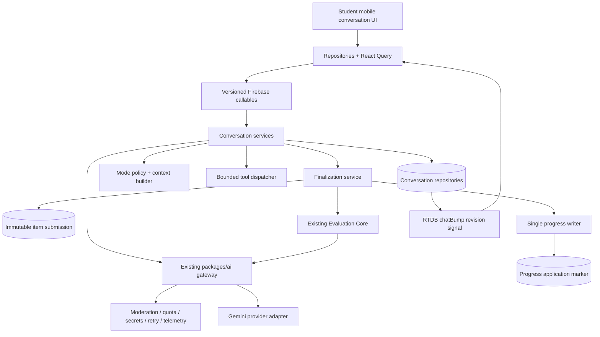
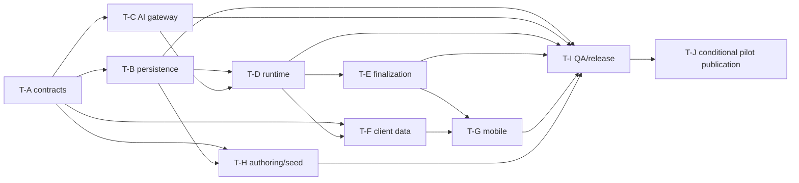

# Student Conversational AI — Authoritative Low-Level Design

**Status:** Authoritative implementation baseline  
**Architecture owner:** Conversational AI workstream  
**Date:** 2026-07-18  
**Target:** Student mobile first; shared runtime for tutor, question help, and
agent assessment  
**Implementation scope:** Phases 1–5 defined in this document  
**Change policy:** This document authorizes decomposition and implementation
planning. It performs no production data write; the conditional pilot
authorization boundary is recorded in section 15.3.

## 1. Authority, scope, and precedence

This is the implementation-level source of truth for student conversational AI.
It reconciles the discussion plan with the current monorepo and freezes the
interfaces, persistence rules, lifecycle, module ownership, dependency order,
and release gates needed to implement the feature without inventing a second LLM
stack.

Where implementation guidance conflicts, precedence is:

1. this LLD;
2. `AI-EVALUATION-CORE-PLAN.md` for the already-implemented Evaluation Core;
3. `STUDENT-CONVERSATIONAL-AI-ARCHITECTURE-PLAN.md` for background and product
   rationale;
4. current legacy chat behavior only as a migration input, never as the target
   contract.

The one intentional override of the Evaluation Core discussion is projection
policy: raw interviewer observations, evidence notes, and provisional scores are
server-only. Learners may see neutral coverage state during an interview and the
configured learner-safe evaluation after finalization. This does not replace or
fork Evaluation Core.

This LLD covers:

- the three conversation modes and their isolation boundaries;
- system architecture and dependency direction;
- Firestore paths, schemas, indexes, security, transactions, and idempotency;
- callable contracts and typed client projections;
- service modules, classes/interfaces, functions, and state machines;
- gateway/provider changes required for a real bounded tool loop;
- prompt, context, history, model-policy, moderation, quota, telemetry, and
  caching rules;
- immutable assessed submissions, Evaluation Core integration, and exactly-once
  progress effects;
- student-mobile state, UI composition, resume, retry, and offline behavior;
- teacher authoring, domain adapters, and seed-engine support;
- migration, testing, rollout, workstream ownership, acceptance criteria, and
  risks.

Out of scope:

- a general-purpose autonomous agent framework;
- arbitrary HTTP, browser, filesystem, shell, database, or callable tools;
- multi-agent delegation;
- assessment memory across attempts or learners;
- web-student UI in the first release;
- production content creation or production seeding in this architecture task;
- provider token streaming before the durable turn lifecycle is proven.

## 2. Repository evidence and reconciliation

The design is based on source files, not generated `lib/` output. This evidence
table records the pre-Terra implementation baseline inspected on 2026-07-18;
target contracts elsewhere in this LLD take precedence as workstreams land.

| Area                     | Current source behavior                                                                                                                                                               | Target decision                                                                                                                                                                                               |
| ------------------------ | ------------------------------------------------------------------------------------------------------------------------------------------------------------------------------------- | ------------------------------------------------------------------------------------------------------------------------------------------------------------------------------------------------------------- |
| AI gateway               | `packages/ai/src/gateway.ts` owns secrets, moderation, quota, circuit breaking, retry, cost, and telemetry.                                                                           | Every conversational model step and final evaluation continues through this gateway. There is no parallel LLM client or orchestration SDK.                                                                    |
| Gemini provider          | `packages/ai/src/provider/gemini.ts` sends one user content block through `@google/generative-ai`; it returns function calls but cannot continue with typed tool results.             | Extend the existing provider seam with role-preserving messages, function-call IDs, and function responses. Migrate the adapter to `@google/genai` only inside `packages/ai`, behind compatibility tests.     |
| Model selection          | Agent `modelOverride` is a free string. Teacher web currently offers non-Gemini names while Gemini is the only wired provider.                                                        | Persist stable model-policy IDs, not provider model names. The gateway resolves and validates provider-compatible models before secret lookup or a billable call.                                             |
| Prompt registry          | `agentChat` and `aiChat` serialize context/history into strings.                                                                                                                      | Add versioned mode-specific prompt templates and typed history. Retain the old keys only for compatibility.                                                                                                   |
| Evaluation Core          | `packages/services/src/evaluation/` already resolves config, calls the gateway with a response schema, and normalizes a unified result.                                               | Reuse `evaluateWithAi` and its schema. Finalization passes a frozen config snapshot; it must not re-resolve mutable item/agent/settings documents.                                                            |
| Current agent turn       | `evaluation/agent-chat.ts` declares `record_observation` and `end_conversation`, while `levelup/chat.ts` parses calls and may issue an unrelated second generation.                   | Conversation Runtime owns a validated, bounded tool loop. Tools become `record_evidence` and `recommend_completion`; a recommendation never silently grades or ends an interview.                             |
| Current chat persistence | `chatSessions` has random message IDs, timestamp ordering, no sequence/turn ledger, no turn lease, and no durable domain idempotency.                                                 | Use new `conversationSessions` with deterministic session/turn/message IDs, monotonic sequence, leases, revisions, and recovery records.                                                                      |
| Current chat scope       | A supplied session is checked for owner/active state but not checked against the supplied space/story point/item. Item lookup uses an ID-only collection-group query.                 | A session’s immutable context is authoritative. All content reads use the exact `itemDoc(tenantId, spaceId, storyPointId, itemId)` path; request context cannot redirect an existing session.                 |
| Current failures         | A gateway failure can be converted into a persisted deterministic fallback assistant answer.                                                                                          | Persist a failed-recoverable turn and show retry. Never manufacture a successful assistant response after a failed model call.                                                                                |
| Current completion       | A model `end_conversation` call or client-derived max-turn count can end the session.                                                                                                 | Server lifecycle is the only authority. The model can recommend completion, the learner explicitly finishes, and the hard maximum closes sending and triggers/requires finalization according to mode policy. |
| Current grading          | `levelup/chat.ts` may evaluate/apply progress when chat ends; mobile can then call `recordItemAttempt`, evaluating and applying progress again.                                       | Only `finishConversation` can create an assessment submission. Only `progress.applySubmission` can apply that submission. The generic check/attempt path is disabled for `chat_agent_question`.               |
| Current progress         | `repo-admin/progress.ts` transactionally keeps the best item score but has no source-submission ledger.                                                                               | Preserve the single progress writer and add an atomic per-submission application marker under the progress aggregate.                                                                                         |
| Current mobile           | `ChatAgentQuestion` keeps session ID locally, derives completion, ignores returned lifecycle/evaluation, has no send-error UI, and treats a live RTDB listener as perpetual typing.   | Mobile renders the server projection through a shared controller. It persists only safe local draft/pending identifiers, resumes by session ID, and derives typing from the active turn.                      |
| Current realtime         | `useChatStream` listens to an RTDB `chatBump` signal then refetches the callable; it is not token streaming.                                                                          | Keep this signal-over-RTDB/data-over-callable pattern. Reuse `chatBump`; do not put transcript or private state in RTDB.                                                                                      |
| Question schema          | Domain prompt data exposes `agentInstructions`, `maxTurns`, and `modelAnswer`; authoring collapses objectives into instructions and drops richer relationships.                       | Add lossless public assessment prompt fields and keep private objectives/guidance in the existing deny-all answer-key document.                                                                               |
| Agent authoring          | Agents are tenant-level documents carrying `spaceId`; raw model names and prompt fields are mutable with no explicit version.                                                         | Keep the canonical tenant-level collection, add `version`, `modelPolicyId`, and an `interviewer` type, and snapshot the resolved configuration into each session/submission.                                  |
| Seed engine              | It is deterministic and prefix-aware, but its question-type input excludes chat-agent questions, nested verification is incomplete, and answer-key doc IDs differ from service paths. | Extend the existing config/schema/FK/canonical pipeline. Use the item ID as the single answer-key doc ID. Add exact nested verification and dry-run manifests; do not add production content in this task.    |
| Production root          | `LVLUP_COLLECTION_PREFIX=v2_` makes `tenantDoc()` resolve to `v2_tenants/{tenantId}`. Existing ID-only collection-group reads can still see duplicate unprefixed data.                | `tenantDoc()` is the only runtime root. Production physical paths are under `v2_tenants`. Migration into that root is a rollout prerequisite; there is no cross-root fallback.                                |

## 3. Frozen architecture decisions

| ID      | Decision                                                                                                                                                                                                                                                                                                                                   |
| ------- | ------------------------------------------------------------------------------------------------------------------------------------------------------------------------------------------------------------------------------------------------------------------------------------------------------------------------------------------ |
| CAI-001 | `packages/ai` is the only provider gateway. Conversation Runtime may orchestrate gateway calls but may not create a provider client, resolve secrets, calculate cost, or bypass moderation/quota/telemetry.                                                                                                                                |
| CAI-002 | The first release uses a deterministic product-owned TypeScript runtime in `packages/services`. LangGraph, Google ADK, Claude Agent SDK, and OpenAI Agents SDK are not systems of record.                                                                                                                                                  |
| CAI-003 | The logical Firestore root is always `tenantDoc(tenantId)`. In production it resolves to `v2_tenants/{tenantId}`. New code never hardcodes `tenants/` or `v2_tenants/`.                                                                                                                                                                    |
| CAI-004 | Conversation content/config reads are exact and parent-scoped. ID-only collection-group item reads are forbidden in start, turn, and finalization paths.                                                                                                                                                                                   |
| CAI-005 | `tutor`, `question_help`, and `agent_assessment` are immutable session modes. A session cannot be converted between modes.                                                                                                                                                                                                                 |
| CAI-006 | Firestore is durable authority; callables are the only client data surface. RTDB carries only the existing revision/last-message bump and never messages, status authority, prompts, evidence, or results.                                                                                                                                 |
| CAI-007 | Server session/turn state is authoritative. Client message counts, route state, subscriptions, and local timers never close or grade a session.                                                                                                                                                                                            |
| CAI-008 | Every mutation uses transport idempotency and a durable domain identifier. Session and turn identities are deterministic from server scope plus client UUIDs.                                                                                                                                                                              |
| CAI-009 | Mutable conversations, durable turn execution, private evidence, immutable submission payloads, evaluation attempts, and progress effects are separate records.                                                                                                                                                                            |
| CAI-010 | The assessment interviewer gathers evidence. The existing Evaluation Core is the sole authoritative conversational grader.                                                                                                                                                                                                                 |
| CAI-011 | The agent may recommend completion but cannot write a score, update progress, or unilaterally pretend a learner submitted. Explicit finish is the normal path; a hard maximum prevents another message and invokes the configured forced-finalization policy.                                                                              |
| CAI-012 | Raw evidence notes, private objectives, provisional scores, prompts, answer keys, model identifiers, token/cost data, and tool results never enter learner projections.                                                                                                                                                                    |
| CAI-013 | Session start freezes a canonical, hashed configuration snapshot. Submission copies that snapshot; finalization does not re-read mutable grading configuration.                                                                                                                                                                            |
| CAI-014 | One assessment session creates at most one `itemSubmission`. One submission creates at most one progress application marker in the same transaction as the aggregate update.                                                                                                                                                               |
| CAI-015 | The gateway/provider seam is extended with typed messages and function responses. A textual “tool result” pasted into a new unrelated prompt is not a tool loop.                                                                                                                                                                           |
| CAI-016 | Tools are allowlisted by mode, validated with Zod/JSON Schema, authorized, time-bounded, output-bounded, auditable, and idempotent by invocation ID.                                                                                                                                                                                       |
| CAI-017 | Agent documents store a stable `modelPolicyId`. Provider-specific models are resolved centrally and validated before any billable work.                                                                                                                                                                                                    |
| CAI-018 | Phase 1–5 ships message-at-a-time responses. RTDB bump refetch remains; token streaming is a later protocol change.                                                                                                                                                                                                                        |
| CAI-019 | There is no cross-session memory in the first release. Assessment and question-help never use it. Tutor summaries, if enabled later, are explicit versioned session artifacts rather than hidden global memory.                                                                                                                            |
| CAI-020 | The current Evaluation Core response schema and normalization remain the grading integration point. Conversation code supplies frozen input and owns persistence/idempotency around it.                                                                                                                                                    |
| CAI-021 | Legacy `sendChatMessage` becomes a time-boxed adapter for tutor-compatible traffic. It must not create new agent-assessment submissions. Migration uses dual-read only where required and never dual-write.                                                                                                                                |
| CAI-022 | Context snapshots are reused application-side. Explicit provider context caching stays off until the Gemini adapter is migrated and cache economics are proven; caches are never lifecycle authority.                                                                                                                                      |
| CAI-023 | No production seed/content write is part of this architecture task. The user has authorized a later, separately executed pilot-question write only after the runtime, canonical-root migration, safety/test gates, and a reviewed dry-run manifest pass. That authorization is not permission for an immediate or broader production seed. |

## 4. System architecture



Dependency direction is strict:

```text
domain + api-contract
        |
        +--> repo-admin paths/repos
        +--> packages/ai provider/gateway contracts
        |
        +--> conversation services --> Evaluation Core
        |             |
        |             +--> progress single writer
        |
        +--> functions/sdk-v1 composition
        +--> repositories --> query --> mobile
        +--> authoring adapters + seed engine
```

The runtime is not a replacement gateway. Its only AI operation is:

```ts
ctx.ai.generate(request, callContext);
```

The composition root remains `functions/sdk-v1/src/bootstrap.ts`, with the
concrete gateway adapted through `functions/sdk-v1/src/ai-seam.ts`.

### 4.1 Mode isolation

| Policy               | `tutor`                                              | `question_help`                                          | `agent_assessment`                                                                      |
| -------------------- | ---------------------------------------------------- | -------------------------------------------------------- | --------------------------------------------------------------------------------------- |
| Required scope       | Exact space, story point, or item scope              | Exact item plus optional attempt reference/current draft | Exact item and server-created attempt number                                            |
| Hidden answer/rubric | Never                                                | Never                                                    | Only frozen evaluator input; interviewer never receives model answer/evaluator guidance |
| Tools                | Learner-visible scoped retrieval and recommendations | Learner-visible item/course retrieval and hint usage     | Evidence recording and completion recommendation                                        |
| Progress write       | None                                                 | None                                                     | Exactly once after successful authoritative evaluation                                  |
| Completion           | Learner closes/finishes                              | Learner closes/finishes                                  | Explicit finish, confirmed early finish, or hard-limit policy                           |
| Transcript use       | Learning history                                     | Help metadata; never the submitted answer                | Frozen transcript is the submitted answer                                               |
| Cross-session memory | Off in v1                                            | Forbidden                                                | Forbidden                                                                               |

### 4.2 Runtime constants

These are server constants, covered by tests and adjustable only through a
versioned policy:

```ts
export const CONVERSATION_LIMITS = {
  maxInputTextChars: 4_000,
  maxDraftSnapshotBytes: 32 * 1024,
  maxMediaItems: 3,
  maxModelStepsPerTurn: 4,
  maxToolCallsPerTurn: 6,
  maxToolResultBytes: 8 * 1024,
  maxAllToolResultsBytes: 32 * 1024,
  toolTimeoutMs: 5_000,
  turnLeaseMs: 10 * 60_000,
  finalizationLeaseMs: 10 * 60_000,
  evaluationLeaseMs: 10 * 60_000,
  maxTurnAttempts: 3,
  maxEvaluationAttempts: 3,
  tutorMaxLearnerTurns: 24,
  questionHelpMaxLearnerTurns: 20,
  assessmentMinTurnsFloor: 1,
  assessmentMaxTurnsCeiling: 12,
} as const;
```

Gateway-internal provider retries remain gateway-owned. `maxTurnAttempts` counts
durable reclaim attempts of one logical learner turn; it does not replace
provider retry.

## 5. Canonical domain contracts

All service-domain timestamps are ISO-8601 strings. The Admin adapter continues
converting them to/from Firestore timestamps at the edge.

### 5.1 Identifiers and contexts

```ts
export type ConversationSessionId = Brand<string, "ConversationSessionId">;
export type ConversationMessageId = Brand<string, "ConversationMessageId">;
export type ConversationTurnId = Brand<string, "ConversationTurnId">;
export type ConversationEvidenceId = Brand<string, "ConversationEvidenceId">;
export type ItemSubmissionId = Brand<string, "ItemSubmissionId">;

export type ConversationMode = "tutor" | "question_help" | "agent_assessment";

export type TutorContext =
  | { kind: "tutor"; scope: "space"; spaceId: string }
  | {
      kind: "tutor";
      scope: "story_point";
      spaceId: string;
      storyPointId: string;
    }
  | {
      kind: "tutor";
      scope: "item";
      spaceId: string;
      storyPointId: string;
      itemId: string;
    };

export interface QuestionHelpContext {
  kind: "question_help";
  spaceId: string;
  storyPointId: string;
  itemId: string;
  attemptId?: string;
}

export interface AgentAssessmentContext {
  kind: "agent_assessment";
  spaceId: string;
  storyPointId: string;
  itemId: string;
  attemptNumber: number; // server-assigned; never accepted from start request
}

export type ConversationContext =
  | TutorContext
  | QuestionHelpContext
  | AgentAssessmentContext;
```

`contextBaseKey` is a server-generated canonical string used for the
one-resumable-session lock:

```text
tutor:space:{spaceId}
tutor:story_point:{spaceId}:{storyPointId}
tutor:item:{spaceId}:{storyPointId}:{itemId}
question_help:{spaceId}:{storyPointId}:{itemId}:{attemptId-or-none}
agent_assessment:{spaceId}:{storyPointId}:{itemId}
```

`contextKey` equals `contextBaseKey` for tutor/question help and appends
`:attempt:{attemptNumber}` for assessment. Both are server-derived; clients
never author either value.

IDs must be Firestore-safe and deterministic:

```ts
sessionId =
  "c_" +
  sha256Base64Url(canonicalTuple([tenantId, uid, clientRequestId])).slice(
    0,
    26
  );
turnId =
  "ct_" +
  sha256Base64Url(canonicalTuple([sessionId, clientMessageId])).slice(0, 26);
userMsgId =
  "cm_u_" +
  sha256Base64Url(canonicalTuple([sessionId, clientMessageId])).slice(0, 24);
sessionKeyId =
  "csk_" +
  sha256Base64Url(canonicalTuple([tenantId, uid, mode, contextBaseKey])).slice(
    0,
    24
  );
agentMsgId = `cm_a_${turnId}_${ordinal}`;
openingMsgId = `cm_open_${sessionId}`;
evidenceId = `ce_${turnId}_${toolCallOrdinal}`;
submissionId = "cis_" + sha256Base64Url(sessionId).slice(0, 26);
evaluationAttemptId = `ciea_${submissionId}_${attemptNumber}`;
```

`canonicalTuple` is the shared length-prefixed UTF-8 tuple encoder; raw string
concatenation is forbidden. The full untruncated source UUIDs remain stored on
the session/turn for collision verification. If a deterministic document exists
with a different source tuple, fail `CONFLICT`; never merge it.

### 5.2 Lifecycle types

```ts
export type ConversationSessionStatus =
  | "active"
  | "ready_to_finish"
  | "finalizing"
  | "grading_pending"
  | "grading_failed"
  | "completed"
  | "abandoned";

export type ConversationTurnStatus =
  | "claimed"
  | "model_running"
  | "tool_running"
  | "completed"
  | "failed_recoverable"
  | "failed_terminal";

export type SubmissionWorkflowStatus =
  | "frozen"
  | "grading_pending"
  | "grading"
  | "grading_failed"
  | "evaluated"
  | "progress_applied";

export interface Lease {
  token: string;
  ownerRequestId: string;
  acquiredAt: string;
  expiresAt: string;
}
```

`ready_to_finish` is advisory unless `hardLimitReached` is true. The learner may
send another turn from `ready_to_finish` while the hard limit is not reached;
that turn atomically returns the session to `active` before execution and may
produce a new recommendation.

### 5.3 Message and turn types

```ts
export type ConversationContentBlock =
  | { type: "text"; text: string }
  | {
      type: "media";
      mediaKind: "image";
      storagePath: string;
      mimeType: string;
      altText?: string;
    }
  | {
      type: "citation";
      sourceId: string;
      label: string;
      itemId?: string;
      storyPointId?: string;
    };

export interface ConversationMessage {
  id: ConversationMessageId;
  sessionId: ConversationSessionId;
  sequence: number;
  role: "learner" | "assistant";
  content: ConversationContentBlock[];
  origin: "opening" | "turn";
  turnId?: ConversationTurnId;
  clientMessageId?: string;
  deliveryStatus: "accepted" | "complete";
  createdAt: string;
  completedAt?: string;
  redaction?: {
    status: "none" | "redacted";
    reasonCode?: string;
  };
}

export interface ConversationToolInvocation {
  id: string; // `${turnId}:${step}:${ordinal}`
  step: number;
  ordinal: number;
  toolName: ConversationToolName;
  status: "requested" | "running" | "succeeded" | "failed";
  argsHash: string;
  sanitizedArgs: JsonValue;
  sanitizedResult?: JsonValue;
  resultBytes?: number;
  startedAt?: string;
  completedAt?: string;
  errorCode?: string;
}

export interface ConversationTurn {
  id: ConversationTurnId;
  sessionId: ConversationSessionId;
  clientMessageId: string;
  learnerMessageId: ConversationMessageId;
  status: ConversationTurnStatus;
  attemptCount: number;
  lease?: Lease;
  promptVersion: string;
  configurationFingerprint: string;
  toolsetVersion: string;
  modelPolicyId: ModelPolicyId;
  modelRequestIds: string[];
  toolInvocations: ConversationToolInvocation[];
  assistantMessageIds: ConversationMessageId[];
  traceId: string;
  error?: {
    code: AppErrorCode;
    retryable: boolean;
    safeMessage: string;
  };
  claimedAt: string;
  completedAt?: string;
}
```

No provider chain-of-thought, hidden reasoning, raw prompt, secret context, or
unsanitized tool payload is stored. `origin="opening"` is allowed only for the
deterministic first assistant message and has no `turnId`; it is
static/config-derived and never requires a start-time model call. Every
`origin="turn"` message must carry the matching `turnId`. Learner messages can
never use `origin="opening"`.

### 5.4 Assessment authoring contracts

The public item prompt is learner-safe:

```ts
export interface AgentAssessmentQuestionPrompt {
  questionType: "chat_agent_question";
  scenario: string;
  publicLearningObjectives: Array<{
    id: string;
    label: string;
  }>;
  conversationStarters?: string[];
  interviewerAgentId: string;
  completionPolicy: {
    minLearnerTurns: number; // 1..max
    maxLearnerTurns: number; // <= 12
    allowEarlyFinish: boolean;
    hardLimitAction: "auto_finalize";
  };
}
```

Private assessment data extends the existing deny-all answer-key document:

```ts
export interface AgentAssessmentAnswerKeyData {
  questionType: "chat_agent_question";
  modelAnswer?: string;
  evaluationGuidance?: string;
  privateEvaluationObjectives: Array<{
    id: string;
    rubricDimensionId: string;
    description: string;
    evidenceRequirement?: string;
  }>;
}
```

The learner-answer shape is a server-authority reference, not a client-assembled
transcript:

```ts
export interface AgentAssessmentLearnerAnswer {
  questionType: "chat_agent_question";
  sessionId: ConversationSessionId;
  submissionId?: ItemSubmissionId;
}
```

The submission ID appears only after finalization. Evaluation loads the frozen
transcript from the submission/session repository; it never trusts a transcript
supplied through `recordItemAttempt`.

The item’s canonical `rubric`/`rubricId` remains the scoring rubric. Each
private objective must reference an existing rubric dimension for
dimension-based rubrics. Public and private objective IDs may correspond, but
private descriptions and evidence requirements are never projected to a learner.

The agent schema becomes:

```ts
export type AgentType = "tutor" | "interviewer" | "evaluator";

export interface ConversationAgent {
  id: string;
  tenantId: string;
  spaceId: string;
  type: AgentType;
  name: string;
  publicDescription?: string;
  identity?: string;
  systemPrompt?: string; // private
  rules?: string[]; // private
  openingMessage?: string;
  evaluationObjectives?: string[]; // evaluator persona only; not item objectives
  strictness?: number;
  feedbackStyle?: string;
  supportedLanguages?: string[];
  defaultLanguage?: string;
  maxConversationTurns?: number;
  modelPolicyId: ModelPolicyId;
  temperatureOverride?: number;
  isActive: boolean;
  version: number; // increment on every semantic update
  createdAt: string;
  updatedAt: string;
  createdBy: string;
  updatedBy: string;
}

export type ModelPolicyId =
  | "conversation.fast"
  | "conversation.quality"
  | "evaluation.quality";
```

`evaluationObjectives` on a legacy agent is not used as item-specific assessment
configuration. Migration either maps it to a reviewed item answer key or marks
the item `needs_authoring_review`.

### 5.5 Frozen configuration

```ts
export interface ConversationConfigurationSnapshot {
  schemaVersion: 1;
  fingerprint: string; // SHA-256 over RFC-8785-style canonical JSON excluding fingerprint
  mode: ConversationMode;
  locale: string;
  prompt: {
    key:
      | "conversationTutor"
      | "conversationQuestionHelp"
      | "conversationAssessment";
    version: string;
  };
  safetyPolicy: { id: string; version: string };
  toolset: { id: string; version: string; toolNames: ConversationToolName[] };
  runtimeModelPolicyId: ModelPolicyId;
  runtimeAgent: {
    source: "configured" | "builtin";
    id: string;
    version: number;
    type: "tutor" | "interviewer";
    identity?: string;
    systemPrompt?: string;
    rules: string[];
    openingMessage?: string;
  };
  context: {
    contentVersions: Array<{
      resourceType: string;
      resourceId: string;
      version: number;
    }>;
    interviewerContext: JsonValue; // excludes model answer/rubric guidance
    evaluatorContext?: {
      question: JsonValue;
      answerKey: JsonValue;
      rubric: JsonValue;
      evaluationSettings: JsonValue;
      evaluatorAgent?: JsonValue;
      evaluatorModelPolicyId: ModelPolicyId;
      evaluatorPromptVersion: string;
    };
  };
  completionPolicy?: AgentAssessmentQuestionPrompt["completionPolicy"];
  createdAt: string;
}
```

The snapshot is stored only on callable-only documents. Client projections
expose safe source IDs/versions and the fingerprint, not the snapshot body.

## 6. Conversation state machines

### 6.1 Session transitions

| From                                   | Command/event                | Guard                                                                 | To                | Effect                                                                           |
| -------------------------------------- | ---------------------------- | --------------------------------------------------------------------- | ----------------- | -------------------------------------------------------------------------------- |
| none                                   | start                        | authorized exact context; feature/mode enabled                        | `active`          | Create deterministic session and frozen configuration.                           |
| `active`                               | send                         | no active turn; below hard max                                        | `active`          | Claim one turn and append one learner message.                                   |
| `ready_to_finish`                      | send                         | not hard-limited                                                      | `active`          | Clear prior recommendation, claim turn, append learner message.                  |
| `active`                               | turn succeeds                | no completion recommendation                                          | `active`          | Append assistant response and clear active turn.                                 |
| `active`                               | turn succeeds                | interviewer recommends completion                                     | `ready_to_finish` | Persist safe recommendation metadata.                                            |
| `active`                               | turn succeeds at hard max    | assessment                                                            | `ready_to_finish` | Set `hardLimitReached=true`; close composer; enqueue/invoke forced finalization. |
| `active`                               | turn succeeds at hard max    | tutor or question help                                                | `completed`       | Append the final assistant response and close without submission/progress.       |
| `active`                               | turn fails recoverably       | lease remains fenced                                                  | `active`          | Clear active turn; expose retry for the same learner message.                    |
| `active`                               | turn fails terminally        | below hard max                                                        | `active`          | Keep the accepted learner message; allow a new turn.                             |
| `active`                               | turn fails terminally        | assessment learner count reached hard max                             | `ready_to_finish` | Set server hard-limit metadata and enqueue/invoke forced finalization.           |
| `active`                               | turn fails terminally        | tutor/help learner count reached hard max                             | `completed`       | Close without fake output, submission, or progress.                              |
| `active` or `ready_to_finish`          | finish                       | minimum met, or early finish is allowed and confirmed; no active turn | `finalizing`      | Freeze through current sequence and acquire finalization lease.                  |
| `finalizing`                           | submission frozen            | assessment                                                            | `grading_pending` | Create/return deterministic submission.                                          |
| `grading_pending`                      | evaluation lease acquired    | assessment                                                            | `grading_pending` | Evaluation runs outside transaction.                                             |
| `grading_pending`                      | evaluated + progress applied | assessment                                                            | `completed`       | Attach learner-safe result pointer.                                              |
| `grading_pending`                      | retryable evaluation failure | assessment                                                            | `grading_failed`  | Preserve submission and next retry.                                              |
| `grading_failed`                       | worker retry                 | attempts remain                                                       | `grading_pending` | Reacquire evaluation lease.                                                      |
| `finalizing`                           | finish                       | tutor/help                                                            | `completed`       | Close without submission or progress.                                            |
| `active` or non-hard `ready_to_finish` | abandon                      | no active turn/finalization                                           | `abandoned`       | Close without assessment submission.                                             |

Terminal states are `completed` and `abandoned`. Operational redaction/retention
is a separate audited workflow and does not reopen the state machine.

Invalid transitions return `INVALID_TRANSITION` with
`{currentStatus, allowedActions}`. A request against the wrong immutable context
returns `PRECONDITION_FAILED`; it never silently changes scope.

### 6.2 Turn transitions

```text
missing
  -> claimed
  -> model_running
  -> tool_running -> model_running  (bounded)
  -> completed

claimed | model_running | tool_running
  -> failed_recoverable
  -> claimed             (same clientMessageId, stale/released lease)

failed_recoverable
  -> failed_terminal     (attempt ceiling or non-retryable policy error)
```

Only one turn may hold `session.activeTurnId`. A duplicate `clientMessageId`
never appends a second learner message:

- completed: return the stored result;
- unexpired in-flight lease: return `IDEMPOTENCY_CONFLICT` with retry metadata;
- failed-recoverable or expired lease: reclaim the same turn;
- failed-terminal: return the stored terminal error.

### 6.3 Mobile view states

The mobile controller uses the server projection plus local draft/pending state:

```ts
export type ConversationUiState =
  | "bootstrapping"
  | "active"
  | "sending"
  | "send_failed"
  | "ready_to_finish"
  | "finalizing"
  | "grading_pending"
  | "grading_failed"
  | "completed"
  | "abandoned"
  | "fatal";
```

`sending` means the authoritative projection has this client message/turn in
flight or the initial callable has not yet reconciled. A live RTDB subscription
never implies typing.

## 7. Canonical Firestore and realtime model

### 7.1 Path policy

All paths below are logical and must be built from
`packages/services/src/repo-admin/paths.ts`. With the production environment,
`tenantDoc("t1")` is `v2_tenants/t1`.

| Record                           | Logical path                                                                    |
| -------------------------------- | ------------------------------------------------------------------------------- |
| Active-context/attempt key       | `${tenantDoc(t)}/conversationSessionKeys/{keyId}`                               |
| Session                          | `${tenantDoc(t)}/conversationSessions/{sessionId}`                              |
| Message                          | `${tenantDoc(t)}/conversationSessions/{sessionId}/messages/{messageId}`         |
| Turn                             | `${tenantDoc(t)}/conversationSessions/{sessionId}/turns/{turnId}`               |
| Private evidence                 | `${tenantDoc(t)}/conversationSessions/{sessionId}/privateEvidence/{evidenceId}` |
| Assessment submission            | `${tenantDoc(t)}/itemSubmissions/{submissionId}`                                |
| Evaluation attempt               | `${tenantDoc(t)}/itemSubmissions/{submissionId}/evaluationAttempts/{attemptId}` |
| Progress aggregate               | `${tenantDoc(t)}/spaceProgress/{uid}_{spaceId}`                                 |
| Progress application             | `${tenantDoc(t)}/spaceProgress/{uid}_{spaceId}/applications/{submissionId}`     |
| Existing answer key              | `${itemDoc(t,s,sp,item)}/answerKeys/{itemId}`                                   |
| Existing agent                   | `${tenantDoc(t)}/agents/{agentId}`                                              |
| Existing evaluation settings     | `${tenantDoc(t)}/evaluationSettings/{settingsId}`                               |
| Existing transport/domain dedupe | `${tenantDoc(t)}/idempotency/{uid}_{key}`                                       |

Required path-builder additions:

```ts
conversationSessionsPath(tenantId): string;
conversationSessionDoc(tenantId, sessionId): string;
conversationSessionKeyDoc(tenantId, ownerUid, mode, contextBaseKey): string;
conversationMessagesPath(tenantId, sessionId): string;
conversationMessageDoc(tenantId, sessionId, messageId): string;
conversationTurnsPath(tenantId, sessionId): string;
conversationTurnDoc(tenantId, sessionId, turnId): string;
conversationEvidencePath(tenantId, sessionId): string;
conversationEvidenceDoc(tenantId, sessionId, evidenceId): string;
itemSubmissionsPath(tenantId): string;
itemSubmissionDoc(tenantId, submissionId): string;
itemSubmissionAttemptDoc(tenantId, submissionId, attemptId): string;
progressApplicationDoc(tenantId, uid, spaceId, submissionId): string;
```

The seed engine mirrors the configuration/content path builders. It must not
seed runtime sessions, assessment submissions, evaluation attempts, or progress
application markers as ordinary product fixtures; those records are created by
runtime tests through services.

### 7.2 Session document

```ts
export interface ConversationSessionDoc {
  schemaVersion: 1;
  id: ConversationSessionId;
  tenantId: string;
  ownerUid: string;
  learnerStudentId?: string;
  mode: ConversationMode;
  context: ConversationContext;
  contextBaseKey: string;
  contextKey: string;
  title: string;
  locale: string;
  status: ConversationSessionStatus;

  publicConfig: {
    openingMessage?: string;
    publicLearningObjectives?: Array<{ id: string; label: string }>;
    conversationStarters?: string[];
    completionPolicy?: {
      minLearnerTurns: number;
      maxLearnerTurns: number;
      allowEarlyFinish: boolean;
      hardLimitAction: "auto_finalize";
    };
    configurationFingerprint: string;
    sourceVersions: Array<{
      resourceType: "space" | "story_point" | "item" | "interviewer_agent";
      resourceId: string;
      version: number;
    }>;
  };

  configurationSnapshot: ConversationConfigurationSnapshot; // private
  clientRequestId: string;
  nextSequence: number;
  revision: number;
  learnerTurnCount: number;
  activeTurnId?: ConversationTurnId;
  activeTurnLeaseExpiresAt?: string;

  completionRecommendation?: {
    reasonCode:
      | "objectives_covered"
      | "learner_requested"
      | "insufficient_new_evidence"
      | "hard_limit";
    coveredPublicObjectiveIds: string[];
    remainingPublicObjectiveIds: string[];
    hardLimitReached: boolean;
    recommendedAt: string;
  };

  finalization?: {
    lease?: Lease;
    frozenThroughSequence?: number;
    frozenRevision?: number;
    transcriptHash?: string;
    submissionId?: ItemSubmissionId;
    requestedReason?: "learner_requested" | "hard_limit";
    earlyFinishConfirmed?: boolean;
    startedAt?: string;
    completedAt?: string;
  };

  safeResult?: {
    submissionId: ItemSubmissionId;
    evaluation: StoredEvaluation; // cost/private fields stripped
    progressApplied: boolean;
  };

  lastMessagePreview?: string; // learner-safe, normalized, max 160 chars
  lastMessageAt?: string;
  createdAt: string;
  updatedAt: string;
  completedAt?: string;
  abandonedAt?: string;
}
```

`configurationSnapshot`, lease tokens, internal trace IDs, and operational
errors are never copied into `ConversationSessionView`.

The deterministic context-key document serializes concurrent starts:

```ts
export interface ConversationSessionKeyDoc {
  schemaVersion: 1;
  id: string; // hash(ownerUid, mode, contextBaseKey)
  tenantId: string;
  ownerUid: string;
  mode: ConversationMode;
  contextBaseKey: string;
  activeSessionId?: ConversationSessionId;
  nextAttemptNumber: number; // starts at 1; used by assessment
  revision: number;
  updatedAt: string;
}
```

It is an authority/mutex record, not a client projection. Completing or
abandoning a session conditionally clears `activeSessionId` only when it still
points at that session.

### 7.3 Message, turn, and private-evidence documents

Messages use the `ConversationMessage` shape from section 5. Sequence starts at
1 and is unique within a session. A user message is created during the
turn-claim transaction. Assistant messages are created during the successful
turn-commit transaction.

Turn documents use `ConversationTurn`, with these additional operational fields:

```ts
interface ConversationTurnDoc extends ConversationTurn {
  tenantId: string;
  ownerUid: string;
  sessionRevisionAtClaim: number;
  requestInputHash: string; // canonical hash of text, media metadata, and draft snapshot
  inputModeration?: JsonValue;
  outputModeration?: JsonValue;
  usageAggregate?: {
    inputTokens: number;
    outputTokens: number;
    cachedInputTokens: number;
    costUsd: number;
  };
  updatedAt: string;
}
```

Private evidence is a server-only audit artifact:

```ts
export interface ConversationEvidenceDoc {
  schemaVersion: 1;
  id: ConversationEvidenceId;
  tenantId: string;
  sessionId: ConversationSessionId;
  turnId: ConversationTurnId;
  objectiveId: string;
  rubricDimensionId: string;
  messageSequences: number[];
  note: string;
  confidence: number; // 0..1, observational only
  recorder: {
    type: "interviewer_model";
    promptVersion: string;
    configurationFingerprint: string;
  };
  createdAt: string;
}
```

Evidence contains no authoritative score. `messageSequences` must exist in the
same session and must reference learner messages accepted no later than the
recording turn.

### 7.4 Immutable item submission

“Immutable submission” means the `payload` is write-once. The workflow envelope
can advance through grading and progress application using compare-and-set
transactions.

```ts
export interface ItemSubmissionDoc {
  schemaVersion: 1;
  id: ItemSubmissionId;
  tenantId: string;
  ownerUid: string;
  learnerStudentId?: string;
  spaceId: string;
  storyPointId: string;
  itemId: string;
  sessionId: ConversationSessionId;
  attemptNumber: number;

  payload: {
    mode: "agent_assessment";
    frozenThroughSequence: number;
    transcript: Array<{
      sequence: number;
      role: "learner" | "assistant";
      content: ConversationContentBlock[];
      createdAt: string;
    }>;
    transcriptHash: string;
    configurationSnapshot: ConversationConfigurationSnapshot;
    configurationFingerprint: string;
    finalizationReason: "learner_requested" | "hard_limit";
    earlyFinish: boolean;
    frozenAt: string;
  };

  workflow: {
    status: SubmissionWorkflowStatus;
    evaluationLease?: Lease;
    evaluationAttemptCount: number;
    nextRetryAt?: string;
    lastError?: {
      code: string;
      retryable: boolean;
      safeMessage: string;
    };
    progressAppliedAt?: string;
  };

  evaluation?: {
    result: UnifiedEvaluationResult; // append-once
    safeResult: StoredEvaluation;
    resultHash: string;
    evaluatorPromptVersion: string;
    evaluatorModelPolicyId: ModelPolicyId;
    evaluatedAt: string;
  };

  createdAt: string;
  updatedAt: string;
}
```

The repository rejects:

- a second create with a different transcript or configuration fingerprint;
- any update to `payload`;
- replacing an existing `evaluation`;
- progress application before `evaluation` exists and validates.

Each provider evaluation attempt is independently auditable:

```ts
export interface ItemSubmissionEvaluationAttemptDoc {
  id: string;
  submissionId: ItemSubmissionId;
  attemptNumber: number;
  leaseTokenHash: string;
  status: "running" | "succeeded" | "failed";
  gatewayRequestId?: string;
  traceId: string;
  errorCode?: string;
  retryable?: boolean;
  startedAt: string;
  completedAt?: string;
}
```

The attempt document stores no prompt, transcript, private rubric, or answer
key.

### 7.5 Progress application marker

```ts
export interface ProgressApplicationDoc {
  schemaVersion: 1;
  id: ItemSubmissionId;
  tenantId: string;
  ownerUid: string;
  spaceId: string;
  storyPointId: string;
  itemId: string;
  submissionId: ItemSubmissionId;
  evaluationResultHash: string;
  score: number;
  maxScore: number;
  appliedAt: string;
}
```

`ProgressRepo.applySubmission` runs one Firestore transaction that reads:

1. the item submission;
2. the application marker;
3. the existing space-progress aggregate.

It verifies the submission is evaluated, returns the existing result when the
marker exists, otherwise applies the evaluation through the existing best-score
reducer, writes the aggregate, writes the marker, and marks the submission
`progress_applied`. All three writes commit atomically. The existing
`ProgressRepo.update` remains for non-submission flows.

### 7.6 Firestore indexes and field exclusions

Add these composite indexes to `firestore.indexes.json`:

| Collection group       | Query scope | Fields in order                                                                         | Consumer                                 |
| ---------------------- | ----------- | --------------------------------------------------------------------------------------- | ---------------------------------------- |
| `conversationSessions` | COLLECTION  | `ownerUid ASC, mode ASC, updatedAt DESC, __name__ DESC`                                 | Learner mode history                     |
| `conversationSessions` | COLLECTION  | `ownerUid ASC, mode ASC, contextBaseKey ASC, updatedAt DESC, __name__ DESC`             | Exact-context history                    |
| `conversationSessions` | COLLECTION  | `ownerUid ASC, status ASC, updatedAt DESC, __name__ DESC`                               | Active/completed history                 |
| `conversationSessions` | COLLECTION  | `ownerUid ASC, mode ASC, status ASC, updatedAt DESC, __name__ DESC`                     | Mode history filtered by status          |
| `conversationSessions` | COLLECTION  | `ownerUid ASC, mode ASC, contextBaseKey ASC, status ASC, updatedAt DESC, __name__ DESC` | Exact-context history filtered by status |
| `conversationSessions` | COLLECTION  | `status ASC, activeTurnLeaseExpiresAt ASC, __name__ ASC`                                | Per-tenant stale-turn watchdog           |
| `conversationSessions` | COLLECTION  | `status ASC, finalization.lease.expiresAt ASC, __name__ ASC`                            | Per-tenant finalization watchdog         |
| `itemSubmissions`      | COLLECTION  | `ownerUid ASC, itemId ASC, createdAt DESC, __name__ DESC`                               | Learner attempt history                  |
| `itemSubmissions`      | COLLECTION  | `workflow.status ASC, workflow.nextRetryAt ASC, __name__ ASC`                           | Per-tenant evaluation retry worker       |

All user-facing pagination cursors contain both the ordered timestamp and
document ID. Timestamp-only cursors are forbidden because they skip/duplicate
documents with equal timestamps.

Disable indexing for large/private fields:

- `conversationSessions.configurationSnapshot`;
- `messages.content`;
- `turns.toolInvocations`;
- `turns.inputModeration`;
- `turns.outputModeration`;
- `itemSubmissions.payload`;
- `itemSubmissions.evaluation.result`;
- `privateEvidence.note`.

Message sequence ordering uses the default single-field `sequence` index. Direct
deterministic document reads enforce uniqueness; no query is used to “find” a
session, turn, or submission by a non-unique field.

### 7.7 Security and realtime

Production `v2_*` roots are already deny-all to clients. Add explicit deny-all
matches for the unprefixed development/emulator paths so an empty prefix does
not accidentally inherit the permissive legacy chat rules:

```text
/tenants/{tenantId}/conversationSessions/{document=**}
/tenants/{tenantId}/conversationSessionKeys/{document=**}
/tenants/{tenantId}/itemSubmissions/{document=**}
/tenants/{tenantId}/spaceProgress/{progressId}/applications/{document=**}
```

All reads/writes go through callables/Admin SDK. Rules tests must prove a
student, parent, teacher, tenant admin, super admin, and unauthenticated client
cannot directly read any of these documents.

Reuse RTDB:

```text
chatBump/{tenantId}/{ownerUid}/{sessionId}
```

Payload:

```ts
interface ConversationBump {
  rev: number;
  lastMessageAt?: string;
}
```

This is the existing `LevelupProjectionPort.bumpChat` payload. The Admin SDK
writes the bump after the Firestore commit. A failed bump is recoverable by
foreground refetch and must never roll back durable state. Existing RTDB
owner-read/admin-write rules remain sufficient. A bump invalidates
`conversationKeys.detail(sessionId)`; status, messages, and results arrive only
from `getConversation`.

## 8. Callable/API contracts

All request and response schemas are Zod `.strict()`. Tenant identity is
claim-derived; `tenantId` is forbidden in every body. The API client envelope
supplies `__apiVersion` and, for `idempotent: true`, a stable UUIDv7
`__idempotencyKey`.

Domain IDs are still required because a new transport invocation, process
restart, or offline replay can carry a different envelope:

- start: `clientRequestId`;
- send: `clientMessageId`;
- finish/abandon: `clientRequestId`.

### 8.1 Shared request types

```ts
export type StartConversationContext =
  | TutorContext
  | (Omit<QuestionHelpContext, "kind"> & { kind: "question_help" })
  | {
      kind: "agent_assessment";
      spaceId: string;
      storyPointId: string;
      itemId: string;
    };

export interface ConversationMediaInput {
  mediaKind: "image";
  storagePath: string;
  mimeType: string;
  altText?: string;
}

export interface QuestionHelpDraftSnapshot {
  revision: number;
  answer: JsonValue;
}
```

Media paths must start with the authenticated tenant’s storage namespace, must
be an allowed image MIME type/size, and are resolved to bytes only by the
existing gateway image-store adapter. Audio attachments are not accepted in
Phases 1–5 because the current gateway has no audio-media seam.

### 8.2 `v1.levelup.startConversation`

```ts
export interface StartConversationRequest {
  clientRequestId: string; // UUIDv7/UUID
  mode: ConversationMode;
  context: StartConversationContext;
  locale?: string;
}

export interface StartConversationResponse {
  session: ConversationSessionView;
  messages: ConversationMessageView[];
  resumed: boolean;
}
```

Rules:

- `mode` must equal `context.kind`;
- resolve tenant/learner authorization and exact parent-scoped resources;
- reject archived/unpublished/inaccessible content;
- for assessment, validate `chat_agent_question`, agent, rubric, answer-key
  objectives, settings, and model policy before creating a session;
- if one resumable same-owner/same-mode/same-context session exists, return it;
- assessment attempt number is allocated transactionally only when no resumable
  attempt exists;
- write the frozen snapshot and safe opening message, if configured.

Definition:

```ts
{
  rateTier: "write",
  authMode: "authed",
  idempotent: true,
  idempotencyKey: "transport",
  invalidates: ["conversations"]
}
```

### 8.3 `v1.levelup.sendConversationTurn`

```ts
export interface SendConversationTurnRequest {
  sessionId: string;
  clientMessageId: string; // UUIDv7/UUID, stable until reconciled
  input: {
    text: string;
    media?: ConversationMediaInput[];
    questionHelpDraft?: QuestionHelpDraftSnapshot;
  };
}

export interface SendConversationTurnResponse {
  session: ConversationSessionView;
  acceptedMessage: ConversationMessageView;
  assistantMessages: ConversationMessageView[];
  turn: ConversationTurnView;
  replayed: boolean;
}
```

Rules:

- body context IDs are absent; the session context is authoritative;
- `questionHelpDraft` is allowed only in `question_help`, size-bounded, treated
  as learner-controlled input, and never treated as an answer key;
- one user message may be optimistic locally, keyed by `clientMessageId`;
- a provider/tool error returns/persists a failed turn rather than appending a
  fake assistant answer;
- replay returns the exact persisted result.

Definition:

```ts
{
  rateTier: "ai",
  authMode: "authed",
  idempotent: true,
  idempotencyKey: "transport",
  invalidates: ["conversations"]
}
```

### 8.4 `v1.levelup.finishConversation`

```ts
export interface FinishConversationRequest {
  sessionId: string;
  clientRequestId: string;
  reason: "learner_requested";
  earlyFinishConfirmed?: boolean;
}

export interface FinishConversationResponse {
  session: ConversationSessionView;
  submission?: ItemSubmissionView;
  result:
    | { status: "completed"; evaluation?: StoredEvaluation }
    | { status: "grading_pending"; retryAfterMs: number }
    | { status: "grading_failed"; retryable: boolean; retryAfterMs?: number };
  replayed: boolean;
}
```

The server derives hard-limit finalization; the client cannot claim it. A
callable may finish evaluation inline within the existing AI-tier timeout, but
durable state is committed before the external model call. If the client times
out, retry/get returns the same submission/workflow.

Definition:

```ts
{
  rateTier: "ai",
  authMode: "authed",
  idempotent: true,
  idempotencyKey: "transport",
  invalidates: ["conversations", "progress"],
  authoritySensitive: true
}
```

### 8.5 Reads and abandon

```ts
export interface GetConversationRequest {
  sessionId: string;
  messageCursor?: string;
  messageLimit?: number; // 1..100, default 50
}

export interface GetConversationResponse {
  session: ConversationSessionView;
  messages: ConversationMessageView[];
  nextMessageCursor: string | null;
  activeTurn?: ConversationTurnView;
}

export interface ListConversationsRequest {
  mode?: ConversationMode;
  status?: ConversationSessionStatus;
  context?: StartConversationContext;
  cursor?: string;
  limit?: number; // 1..50
}

export interface ListConversationsResponse {
  items: ConversationSessionSummaryView[];
  nextCursor: string | null;
}

export interface AbandonConversationRequest {
  sessionId: string;
  clientRequestId: string;
}

export interface AbandonConversationResponse {
  session: ConversationSessionView;
  replayed: boolean;
}
```

`getConversation` and `listConversations` are read-tier. When `context` is
present, the server derives the exact `contextBaseKey`; an explicit `mode`, if
also present, must match `context.kind`. Partial parent/child filters are
rejected rather than translated into collection-group discovery.
`getConversation` defaults to the newest 50 messages, returns that page in
ascending sequence order, and uses `nextMessageCursor` to page toward older
messages; clients merge by message ID/sequence. `abandonConversation` is
write-tier, idempotent, and authority-sensitive. There is no public “retry
grading” callable; the worker/callable resume path owns it. A failed turn is
retried by sending the same `clientMessageId`, so a second retry API is
unnecessary.

### 8.6 Learner-safe projections

```ts
export interface ItemSubmissionView {
  id: string;
  sessionId: string;
  attemptNumber: number;
  workflow: {
    status: SubmissionWorkflowStatus;
    retryable?: boolean;
    nextRetryAt?: string;
    progressAppliedAt?: string;
  };
  evaluation?: StoredEvaluation;
  createdAt: string;
  updatedAt: string;
}

export interface ConversationSessionSummaryView {
  id: string;
  mode: ConversationMode;
  context: ConversationContext;
  contextBaseKey: string;
  title: string;
  locale: string;
  status: ConversationSessionStatus;
  learnerTurnCount: number;
  lastMessagePreview?: string;
  lastMessageAt?: string;
  updatedAt: string;
  completedAt?: string;
}

export interface ConversationSessionView {
  id: string;
  mode: ConversationMode;
  context: ConversationContext;
  contextBaseKey: string;
  contextKey: string;
  title: string;
  locale: string;
  status: ConversationSessionStatus;
  revision: number;
  learnerTurnCount: number;
  publicConfig: ConversationSessionDoc["publicConfig"];
  completionRecommendation?: ConversationSessionDoc["completionRecommendation"];
  activeTurn?: {
    id: string;
    status: "running" | "failed_recoverable";
    clientMessageId: string;
  };
  grading?: {
    status: "pending" | "failed";
    retryable: boolean;
    retryAfterMs?: number;
    safeMessage?: string;
  };
  result?: {
    submissionId: string;
    evaluation: StoredEvaluation;
    progressApplied: boolean;
  };
  allowedActions: Array<"send" | "finish" | "abandon" | "retry_turn">;
  createdAt: string;
  updatedAt: string;
  completedAt?: string;
}

export interface ConversationMessageView {
  id: string;
  sequence: number;
  role: "learner" | "assistant";
  origin: "opening" | "turn";
  content: ConversationContentBlock[];
  clientMessageId?: string;
  deliveryStatus: "accepted" | "complete";
  createdAt: string;
  completedAt?: string;
}

export interface ConversationTurnView {
  id: string;
  clientMessageId: string;
  status: "running" | "completed" | "failed_recoverable" | "failed_terminal";
  assistantMessageIds: string[];
  error?: {
    code: AppErrorCode;
    retryable: boolean;
    safeMessage: string;
  };
}
```

Projection allowlists, not recursive “strip these few keys” logic, define
responses. `grading` is derived server-side from the referenced submission and
contains no attempt count, provider error, model identity, or trace data.

### 8.7 Error semantics

| Condition                                   | App error                                                                                                              | Retry                   |
| ------------------------------------------- | ---------------------------------------------------------------------------------------------------------------------- | ----------------------- |
| Invalid IDs/body/size/mode-context mismatch | `VALIDATION_ERROR`                                                                                                     | No                      |
| Session/content missing                     | `NOT_FOUND`                                                                                                            | No                      |
| Wrong owner or inaccessible content/media   | `PERMISSION_DENIED`                                                                                                    | No                      |
| Feature/mode disabled                       | `FEATURE_DISABLED`                                                                                                     | No                      |
| Provider quota exhausted                    | `QUOTA_EXCEEDED`                                                                                                       | Only after quota change |
| Too many calls                              | `RATE_LIMITED`                                                                                                         | Yes, client backoff     |
| Same domain turn still running              | `IDEMPOTENCY_CONFLICT`                                                                                                 | Yes, use `retryAfterMs` |
| Another different turn owns the session     | `CONFLICT`                                                                                                             | Yes, refetch            |
| Session state disallows action              | `INVALID_TRANSITION`                                                                                                   | Usually no; refetch     |
| Early finish lacks confirmation/minimum     | `PRECONDITION_FAILED`                                                                                                  | No until confirmed      |
| Recoverable model/tool failure              | Successful callable response with failed-recoverable turn, or typed `INTERNAL_ERROR` only if no state can be projected | Same `clientMessageId`  |
| Evaluation pending after callable timeout   | Successful `grading_pending` response on retry/get                                                                     | Worker/callable resumes |

The existing `mapError` alias from service `FAILED_PRECONDITION` to wire
`PRECONDITION_FAILED` remains valid. New services should use canonical app codes
in documentation and tests.

## 9. Repository interfaces and transaction rules

### 9.1 Repository ports

```ts
export interface LevelupContentRepo {
  getSpace(tenantId: string, spaceId: string): Promise<Doc | null>;
  getStoryPoint(
    tenantId: string,
    spaceId: string,
    storyPointId: string
  ): Promise<Doc | null>;
  getItem(
    tenantId: string,
    spaceId: string,
    storyPointId: string,
    itemId: string
  ): Promise<Doc | null>;
  getAnswerKey(
    tenantId: string,
    spaceId: string,
    storyPointId: string,
    itemId: string
  ): Promise<Doc | null>;
  getAgent(
    tenantId: string,
    spaceId: string,
    agentId: string
  ): Promise<Doc | null>;
  getEvaluationSettings(
    tenantId: string,
    settingsId: string
  ): Promise<Doc | null>;
  getRubricPreset(
    tenantId: string,
    rubricPresetId: string
  ): Promise<Doc | null>;
}

export interface ConversationReposExtension {
  // Required member of the injected Repos surface.
  levelupContent: LevelupContentRepo;
}

export interface ConversationListFilter {
  mode?: ConversationMode;
  status?: ConversationSessionStatus;
  contextBaseKey?: string;
  cursor?: string;
  limit: number;
}

export interface MessagePageRequest {
  cursor?: string;
  limit: number;
}

export interface ConversationRepo {
  start(input: StartConversationTxInput): Promise<StartConversationTxResult>;
  getSession(
    tenantId: string,
    sessionId: string
  ): Promise<ConversationSessionDoc | null>;
  getTurn(
    tenantId: string,
    sessionId: string,
    turnId: string
  ): Promise<ConversationTurnDoc | null>;
  listSessions(
    tenantId: string,
    ownerUid: string,
    filter: ConversationListFilter
  ): Promise<Page<ConversationSessionDoc>>;
  listMessages(
    tenantId: string,
    sessionId: string,
    page: MessagePageRequest
  ): Promise<Page<ConversationMessage>>;
  listRecoveryCandidates(
    tenantId: string,
    now: string,
    limit: number
  ): Promise<ConversationSessionDoc[]>;
  claimTurn(
    input: ClaimConversationTurnInput
  ): Promise<ClaimConversationTurnResult>;
  markTurnPhase(input: MarkTurnPhaseInput): Promise<ConversationTurn>;
  commitTurn(
    input: CommitConversationTurnInput
  ): Promise<CommitConversationTurnResult>;
  failTurn(
    input: FailConversationTurnInput
  ): Promise<FailConversationTurnResult>;
  acquireFinalization(
    input: AcquireFinalizationInput
  ): Promise<FinalizationClaim>;
  freezeSubmission(
    input: FreezeSubmissionInput
  ): Promise<FreezeSubmissionResult>;
  completeFinalization(
    input: CompleteConversationFinalizationInput
  ): Promise<CompleteConversationFinalizationResult>;
  abandon(input: AbandonConversationInput): Promise<AbandonConversationResult>;
}

export interface ItemSubmissionRepo {
  get(
    tenantId: string,
    submissionId: string
  ): Promise<ItemSubmissionDoc | null>;
  acquireEvaluation(input: AcquireEvaluationInput): Promise<EvaluationClaim>;
  commitEvaluation(
    input: CommitSubmissionEvaluationInput
  ): Promise<ItemSubmissionDoc>;
  failEvaluation(
    input: FailSubmissionEvaluationInput
  ): Promise<ItemSubmissionDoc>;
  listRetryable(
    tenantId: string,
    now: string,
    limit: number
  ): Promise<ItemSubmissionDoc[]>;
  listRecoveryCandidates(
    tenantId: string,
    now: string,
    limit: number
  ): Promise<ItemSubmissionDoc[]>;
}

export interface ProgressRepo {
  update(
    tenantId: string,
    input: ProgressUpdateInput,
    now?: string
  ): Promise<ProgressResult>;
  applySubmission(
    tenantId: string,
    submissionId: ItemSubmissionId,
    now?: string
  ): Promise<{ applied: boolean; progress: ProgressResult }>;
}
```

Repositories expose domain methods rather than raw Firestore references.
Services do not assemble collection paths.

The transaction DTOs are also frozen; implementation may factor shared fields
but may not weaken their fencing or replay outcomes:

```ts
export interface ConversationSourceVersionCheck {
  resourceType:
    | "space"
    | "story_point"
    | "item"
    | "agent"
    | "evaluation_settings"
    | "rubric"
    | "answer_key";
  spaceId?: string;
  storyPointId?: string;
  resourceId: string;
  expectedVersion?: number;
  expectedCanonicalHash?: string;
}

export interface StartConversationTxInput {
  tenantId: string;
  ownerUid: string;
  learnerStudentId?: string;
  sessionId: ConversationSessionId;
  clientRequestId: string;
  mode: ConversationMode;
  startContext: StartConversationContext; // assessment has no attempt number
  contextBaseKey: string;
  sessionBase: Pick<
    ConversationSessionDoc,
    "title" | "locale" | "publicConfig" | "configurationSnapshot"
  >;
  sourceVersionChecks: ConversationSourceVersionCheck[];
  openingMessage?: {
    id: ConversationMessageId;
    content: ConversationContentBlock[];
  };
  now: string;
}

export interface StartConversationTxResult {
  session: ConversationSessionDoc;
  messages: ConversationMessage[];
  resumed: boolean;
}

export interface ClaimConversationTurnInput {
  tenantId: string;
  ownerUid: string;
  sessionId: ConversationSessionId;
  turnId: ConversationTurnId;
  clientMessageId: string;
  requestInputHash: string;
  learnerMessage: {
    id: ConversationMessageId;
    content: ConversationContentBlock[];
    createdAt: string;
  };
  lease: Lease;
  now: string;
}

export interface ClaimConversationTurnResult {
  outcome: "claimed" | "reclaimed" | "completed_replay" | "terminal_replay";
  session: ConversationSessionDoc;
  turn: ConversationTurnDoc;
  learnerMessage: ConversationMessage;
  assistantMessages: ConversationMessage[];
}

export interface MarkTurnPhaseInput {
  tenantId: string;
  sessionId: ConversationSessionId;
  turnId: ConversationTurnId;
  leaseToken: string;
  status: "model_running" | "tool_running";
  modelRequestId?: string;
  toolInvocation?: ConversationToolInvocation;
  usageDelta?: ConversationTurnDoc["usageAggregate"];
  now: string;
}

export interface CommitConversationTurnInput {
  tenantId: string;
  sessionId: ConversationSessionId;
  turnId: ConversationTurnId;
  leaseToken: string;
  configurationFingerprint: string;
  assistantMessages: Array<{
    id: ConversationMessageId;
    content: ConversationContentBlock[];
    createdAt: string;
    completedAt: string;
  }>;
  evidence: ConversationEvidenceDoc[];
  completionRecommendation?: NonNullable<
    ConversationSessionDoc["completionRecommendation"]
  >;
  modelRequestIds: string[];
  usageAggregate: NonNullable<ConversationTurnDoc["usageAggregate"]>;
  now: string;
}

export interface CommitConversationTurnResult {
  session: ConversationSessionDoc;
  turn: ConversationTurnDoc;
  assistantMessages: ConversationMessage[];
  hardLimitAutoFinalize: boolean;
}

export interface FailConversationTurnInput {
  tenantId: string;
  sessionId: ConversationSessionId;
  turnId: ConversationTurnId;
  leaseToken: string;
  terminal: boolean;
  error: NonNullable<ConversationTurn["error"]>;
  now: string;
}

export interface FailConversationTurnResult {
  session: ConversationSessionDoc;
  turn: ConversationTurnDoc;
  hardLimitAutoFinalize: boolean;
}

export type AcquireFinalizationInput = {
  tenantId: string;
  sessionId: ConversationSessionId;
  ownerRequestId: string;
  lease: Lease;
  now: string;
} & (
  | {
      source: "learner";
      ownerUid: string;
      earlyFinishConfirmed?: boolean;
    }
  | { source: "hard_limit" | "recovery" }
);

export interface FinalizationClaim {
  outcome: "claimed" | "submission_replay" | "completed_replay";
  session: ConversationSessionDoc;
  frozenThroughSequence: number;
  frozenRevision: number;
  submission?: ItemSubmissionDoc;
}

export interface FreezeSubmissionInput {
  tenantId: string;
  sessionId: ConversationSessionId;
  finalizationLeaseToken: string;
  submissionId: ItemSubmissionId;
  payload: ItemSubmissionDoc["payload"];
  now: string;
}

export interface FreezeSubmissionResult {
  session: ConversationSessionDoc;
  submission: ItemSubmissionDoc;
  replayed: boolean;
}

export interface CompleteConversationFinalizationInput {
  tenantId: string;
  sessionId: ConversationSessionId;
  submissionId: ItemSubmissionId;
  expectedFrozenRevision: number;
  expectedTranscriptHash: string;
  now: string;
}

export interface CompleteConversationFinalizationResult {
  session: ConversationSessionDoc;
  replayed: boolean;
}

export interface AbandonConversationInput {
  tenantId: string;
  ownerUid: string;
  sessionId: ConversationSessionId;
  clientRequestId: string;
  now: string;
}

export interface AbandonConversationResult {
  session: ConversationSessionDoc;
  replayed: boolean;
}

export interface AcquireEvaluationInput {
  tenantId: string;
  submissionId: ItemSubmissionId;
  ownerRequestId: string;
  lease: Lease;
  now: string;
}

export interface EvaluationClaim {
  outcome: "claimed" | "evaluated_replay" | "terminal_failure";
  submission: ItemSubmissionDoc;
  attempt?: ItemSubmissionEvaluationAttemptDoc;
}

export interface CommitSubmissionEvaluationInput {
  tenantId: string;
  submissionId: ItemSubmissionId;
  attemptId: string;
  leaseToken: string;
  evaluation: NonNullable<ItemSubmissionDoc["evaluation"]>;
  now: string;
}

export interface FailSubmissionEvaluationInput {
  tenantId: string;
  submissionId: ItemSubmissionId;
  attemptId: string;
  leaseToken: string;
  error: NonNullable<ItemSubmissionDoc["workflow"]["lastError"]>;
  nextRetryAt?: string;
  now: string;
}
```

`claimTurn` throws `IDEMPOTENCY_CONFLICT` for an unexpired lease on the same
turn and `CONFLICT` when another turn owns the session. The replay outcomes
perform no write/model call. `acquireEvaluation` allocates the next attempt
number and deterministic attempt ID transactionally. `listRetryable` always
requires a tenant ID. `completeFinalization` transactionally reads the exact
session, immutable submission, deterministic progress-application marker, and
matching context-key document. It requires the same submission binding, frozen
revision, transcript hash, a committed evaluation, workflow `progress_applied`,
and the application marker. It derives `safeResult` from the stored evaluation
rather than accepting learner-visible result data from its caller; then it sets
`completed`/`completedAt`, preserves the frozen metadata/submission binding
while clearing any finalization lease, increments revision, and conditionally
clears the context key. Replaying the same completed binding performs no write;
a different binding/hash is `CONFLICT`. The two `listRecoveryCandidates` methods
run and deterministically merge the bounded per-status/per-lease queries
described in sections 7.6 and 13.2; they do not attempt an unsupported “missing
marker” query—the recovery service verifies candidate progress markers by
deterministic document read. No repo port performs a cross-root collection-group
scan.

### 9.2 Start transaction

`startConversation` performs all slow configuration resolution before the write
transaction, then revalidates versions inside it:

1. Authorize the exact scope and load content through exact paths.
2. Build/validate the safe and private configuration snapshot.
3. Derive deterministic `sessionId` from
   `(tenantId, ownerUid, clientRequestId)`.
4. Transactionally read the deterministic session and deterministic
   `conversationSessionKey` for `(ownerUid, mode, contextBaseKey)`.
5. If the request-derived session exists, verify its full source tuple and
   return it.
6. If the key points to any nonterminal session (`active`, `ready_to_finish`,
   `finalizing`, `grading_pending`, or `grading_failed`), read and return that
   session. This is the concurrency-safe resume/result-recovery path; no
   pre-transaction query decides uniqueness.
7. If the key points to a terminal/missing session, allocate `nextAttemptNumber`
   for assessment and conditionally advance the key. Never use `count()+1`.
8. Re-read item/agent/settings version fields and fail `CONFLICT` if they differ
   from the built snapshot.
9. Create the session, set the key’s `activeSessionId`, and create the optional
   opening assistant message with sequence 1.

The start transaction contains no model call.

### 9.3 Turn claim

One transaction:

1. Read session and deterministic turn document.
2. Verify tenant/owner and immutable mode/context.
3. If the deterministic turn exists, follow the duplicate/reclaim rules in
   section 6.2 before applying the hard-limit check; a failed final allowed turn
   must remain retryable. Require its stored `requestInputHash` to equal the
   canonical hash of the entire incoming `input`; reuse of a `clientMessageId`
   with different text, media, or draft data fails `CONFLICT`.
4. For a new turn only, verify allowed status, hard limit, and no finalization.
5. If a different unexpired `activeTurnId` exists, fail `CONFLICT`.
6. Create/reclaim the turn with a 10-minute lease.
7. Create the deterministic learner message only if absent.
8. Increment `nextSequence`, `revision`, and `learnerTurnCount` only on first
   creation.
9. Set `activeTurnId` and `activeTurnLeaseExpiresAt`.

The model/tool loop runs after this transaction. This ensures an accepted
learner message survives callable timeout and a retry never duplicates it.

### 9.4 Turn phase and commit

Phase updates are compare-and-set operations on `(turnId, lease.token)` and can
only move forward. Tools use deterministic invocation IDs, so a reclaimed turn
recognizes already-succeeded side-effect records.

Successful commit is one transaction:

1. Read session and turn.
2. Verify `session.activeTurnId`, lease token, snapshot fingerprint, and
   non-finalizing status.
3. Allocate contiguous sequence numbers for assistant messages.
4. Create assistant message documents; duplicate IDs must have the same content
   hash.
5. Create private evidence documents from validated staged evidence.
6. Mark turn completed and persist aggregate request IDs/usage.
7. Clear the active-turn fields, update counts/preview/revision, and set
   `active`, `ready_to_finish`, or the tutor/help hard-cap `completed` state.
   Any terminal transition conditionally clears the matching
   `conversationSessionKey.activeSessionId` in the same transaction.

Failure commit is one transaction that:

- marks the turn `failed_recoverable` or `failed_terminal`;
- stores a user-safe error only;
- clears the session’s active-turn fields if the lease still owns them;
- leaves the learner message exactly once;
- never appends an assistant fallback;
- for a terminal assessment failure at the already-claimed hard maximum, sets
  the server-owned hard-limit recommendation and queues finalization so the
  session cannot become permanently unsendable;
- for a terminal tutor/help failure at its hard maximum, closes the session and
  conditionally clears its context key without manufacturing assistant output.

### 9.5 Transaction/idempotency invariants

1. Transport dedupe protects a single callable retry; deterministic domain
   documents protect the workflow across new envelopes.
2. No external model/tool call occurs inside a Firestore transaction.
3. Every external work claim has a token and expiry; every commit compares that
   token.
4. Lease expiry permits reclaim but never deletion/recreation of the logical
   turn/submission.
5. A stale worker may complete its provider request, but its commit is rejected
   after lease loss.
6. Tool side effects must be idempotent by invocation ID. Phase 1–5 tools are
   read-only except private evidence/recommendation records committed with the
   turn.
7. Session `revision` increases on every durable client-visible change.
8. Sequence allocation and message writes are atomic with the relevant session
   revision.
9. A submission payload and final evaluation are append-once and hash-checked.
10. Progress application marker and aggregate update are atomic.

## 10. Conversation Runtime and bounded tool loop

### 10.1 Service interfaces

```ts
export interface ConversationRuntime {
  start(
    input: StartConversationRequest,
    ctx: AuthContext
  ): Promise<StartConversationResponse>;

  executeTurn(
    input: SendConversationTurnRequest,
    ctx: AuthContext
  ): Promise<SendConversationTurnResponse>;
}

export interface ConversationContextBuilder {
  buildStartSnapshot(input: {
    tenantId: string;
    ownerUid: string;
    mode: ConversationMode;
    context: StartConversationContext;
    locale: string;
  }): Promise<ConversationConfigurationSnapshot>;

  buildTurnMessages(input: {
    session: ConversationSessionDoc;
    messages: ConversationMessage[];
    currentLearnerMessage: ConversationMessage;
    questionHelpDraft?: QuestionHelpDraftSnapshot;
  }): Promise<AiMessage[]>;
}

export interface ConversationToolHandler<TArgs, TResult> {
  name: ConversationToolName;
  modes: readonly ConversationMode[];
  argsSchema: ZodType<TArgs>;
  resultSchema: ZodType<TResult>;
  authorize(args: TArgs, scope: ConversationToolScope): Promise<void>;
  execute(args: TArgs, scope: ConversationToolScope): Promise<TResult>;
  sanitize(result: TResult): JsonValue;
}

export interface ConversationToolRegistry {
  declarationsFor(
    mode: ConversationMode,
    toolsetVersion: string
  ): ProviderToolDecl[];
  resolve(
    mode: ConversationMode,
    toolsetVersion: string,
    toolName: string
  ): ConversationToolHandler<unknown, unknown>;
}

export interface ConversationFinalizer {
  finish(
    input: FinishConversationRequest,
    ctx: AuthContext
  ): Promise<FinishConversationResponse>;
  resume(
    tenantId: string,
    sessionId: string,
    ctx: SystemContext
  ): Promise<void>;
}
```

Concrete service entry points remain plain functions for the existing service
style:

```ts
startConversationService(input, ctx);
sendConversationTurnService(input, ctx);
finishConversationService(input, ctx);
getConversationService(input, ctx);
listConversationsService(input, ctx);
abandonConversationService(input, ctx);
resumeConversationFinalizationsService(ctx);
```

The interfaces make orchestration testable; they do not introduce dependency
injection outside the existing `AuthContext`.

### 10.2 Turn execution algorithm

`sendConversationTurnService`:

1. Validate the strict request and authorize session ownership.
2. Claim/replay/reclaim the deterministic turn transaction.
3. If replayed completed/terminal, project and return without a gateway call.
4. Load ordered messages and verify the configuration fingerprint.
5. Build typed messages according to the immutable mode and context snapshot.
6. Resolve the model policy and allowlisted tool declarations.
7. Call `ctx.ai.generate` with moderation enabled and a stable turn trace.
8. If tool calls are returned:
   - enforce model/tool step and byte ceilings;
   - reject undeclared or wrong-mode tools;
   - validate arguments;
   - authorize exact tenant/owner/resource scope;
   - execute with timeout and deterministic invocation ID;
   - validate/sanitize the result;
   - persist the invocation phase;
   - append typed function call and function response to the same model history;
   - call the same gateway again with `rootRequestId=turnId` and parent request
     linkage.
9. Require a non-empty learner-facing assistant response by the final step. A
   tool-only response at the step ceiling is a failed-recoverable turn; it is
   not followed by an unrelated textual prompt.
10. Output-moderate through the gateway, stage evidence/recommendation results,
    and atomically commit the turn.
11. Write the RTDB bump best-effort and return the server projection.
12. If hard-limit auto-finalization was reached by a successful or terminally
    failed final allowed turn, invoke/resume finalization after the turn commit.
    A failure leaves durable `ready_to_finish + hardLimitReached`; the worker
    resumes it.

### 10.3 Tool allowlists

```ts
export type ConversationToolName =
  | "retrieve_scope_context"
  | "get_learner_visible_progress_summary"
  | "recommend_learning_content"
  | "retrieve_item_context"
  | "record_hint_usage"
  | "record_evidence"
  | "recommend_completion";
```

| Tool                                   | Modes                | Durable side effect        | Restrictions                                                                                                  |
| -------------------------------------- | -------------------- | -------------------------- | ------------------------------------------------------------------------------------------------------------- |
| `retrieve_scope_context`               | tutor, question help | None                       | Reads published/authorized learner-safe space/story/item projections only; bounded snippets with citations.   |
| `get_learner_visible_progress_summary` | tutor                | None                       | Returns the same safe progress projection available to that learner; no teacher/private analytics.            |
| `recommend_learning_content`           | tutor                | None                       | Chooses only from retrieved authorized content IDs; no arbitrary links.                                       |
| `retrieve_item_context`                | question help        | None                       | Uses exact session item and learner-safe projection; answer key/rubric guidance are structurally unavailable. |
| `record_hint_usage`                    | question help        | Staged analytics metadata  | Idempotent by invocation ID; records hint category only, never evaluates the draft.                           |
| `record_evidence`                      | assessment           | Staged private evidence    | Objective/dimension must exist in frozen snapshot; message sequences must be valid; no score argument.        |
| `recommend_completion`                 | assessment           | Staged safe recommendation | Objective IDs must exist. It cannot close, grade, submit, or write progress.                                  |

First-release tools cannot:

- accept a Firestore path, URL, callable name, SQL, shell command, or code to
  execute;
- switch tenant/user/session/item;
- read an answer key in tutor/question-help mode;
- write a score or progress record;
- expose raw tool results to the client;
- return more than their per-tool and per-turn byte budgets.

### 10.4 Assessment tool schemas

```ts
const RecordEvidenceArgsSchema = z
  .object({
    objectiveId: z.string(),
    rubricDimensionId: z.string(),
    messageSequences: z.array(z.number().int().positive()).min(1).max(8),
    note: z.string().min(1).max(1_000),
    confidence: z.number().min(0).max(1),
  })
  .strict();

const RecommendCompletionArgsSchema = z
  .object({
    reason: z.enum([
      "objectives_covered",
      "learner_requested",
      "insufficient_new_evidence",
    ]),
    coveredObjectiveIds: z.array(z.string()).max(32),
    remainingObjectiveIds: z.array(z.string()).max(32),
  })
  .strict();
```

The handler ignores any model-supplied tenant/resource identity because scope
comes from the claimed session.

## 11. Existing AI gateway/provider integration

### 11.1 Required additive types

Extend, do not replace, the current seams:

```ts
export type AiMessage =
  | {
      role: "developer";
      parts: Array<{ type: "text"; text: string; provenance: "agent_config" }>;
    }
  | {
      role: "user";
      parts: Array<
        | {
            type: "text";
            text: string;
            provenance: "learner" | "trusted_context";
          }
        | { type: "image"; image: AiImageRef }
      >;
    }
  | {
      role: "assistant";
      parts: Array<
        | { type: "text"; text: string; provenance: "model_output" }
        | {
            type: "tool_call";
            callId: string;
            name: string;
            args: Record<string, unknown>;
          }
      >;
    }
  | {
      role: "tool";
      parts: Array<{
        type: "tool_result";
        callId: string;
        name: string;
        result: JsonValue;
      }>;
    };

export interface ProviderToolCall {
  callId: string;
  name: string;
  args: Record<string, unknown>;
}

export interface AiRequest {
  // existing fields remain
  promptKey: PromptKey;
  variables: Record<string, JsonValue>;
  modelPolicyId?: ModelPolicyId;
  messages?: AiMessage[];
  tools?: ProviderToolDecl[];
  toolChoice?: "auto" | "none";
}

export interface AiResponse<T = unknown> {
  // existing fields remain
  requestId: string;
  toolCalls?: ProviderToolCall[];
  moderation?: { input: ModerationCategory[]; output: ModerationCategory[] };
}
```

Provider input changes from one `system`/`user` pair to:

```ts
export interface ProviderInput {
  model: string;
  system: string; // platform prompt-registry instruction only
  messages: ProviderMessage[];
  images?: ProviderImage[];
  temperature?: number;
  maxTokens?: number;
  responseSchema?: unknown;
  tools?: ProviderToolDecl[];
  toolChoice?: "auto" | "none";
}
```

Legacy non-conversation requests are adapted to one user message.
`responseSchema` and `tools` remain mutually exclusive for the Gemini adapter.

Conversation Runtime and Evaluation Core submit `modelPolicyId`, never a raw
provider model. The gateway rejects a request that carries both `modelPolicyId`
and the legacy `model` field. Legacy non-conversation callers may keep an
allowlisted raw `model` during migration. `evaluateWithAi` reads the frozen
evaluator agent policy, defaulting to `evaluation.quality`, and forwards it as
`modelPolicyId`; it never inherits `runtimeModelPolicyId`.

`functions/sdk-v1/src/ai-seam.ts` must pass through:

- `requestId`;
- tool call IDs/names/args;
- moderation metadata;
- cached input token usage;
- the existing text/json/token/cost/model fields.

Its contract tests must fail if a concrete gateway result field required by
services is silently dropped. The current structural `as unknown` boundary is
not considered type safety.

### 11.2 Prompt registry

Add:

```ts
PROMPTS.conversationTutor;
PROMPTS.conversationQuestionHelp;
PROMPTS.conversationAssessment;
```

All use the existing `ai_chat` purpose. Add `levelup.question_help` to
`LlmFeature`; retain `levelup.tutor` and `levelup.agent_question`.

Prompt responsibilities:

- platform system text defines safety, mode, data/instruction precedence,
  allowed tools, response style, and prohibition on hidden-data disclosure;
- the `developer`/agent-config block is subordinate to platform policy;
- context packets are canonical JSON/text data parts with explicit provenance
  and size limits;
- role-preserving history follows the stable prefix;
- the current learner message is last;
- tool call/result parts are appended without flattening them to pseudo-user
  text.

Prompt versions are explicit constants such as `conversationAssessment:1`;
changing behavior increments the version and produces a new session snapshot
fingerprint.

### 11.3 Model policy

Add a central resolver in `packages/ai/src/models.ts`:

```ts
export interface ResolvedModelPolicy {
  id: ModelPolicyId;
  provider: "gemini";
  model: string;
  temperature: number;
  maxTokens: number;
}

resolveModelPolicy(
  policyId: ModelPolicyId,
  purpose: AiPurpose,
  env?: NodeJS.ProcessEnv
): ResolvedModelPolicy;

validateProviderModel(provider: "gemini" | "claude", model: string): void;
```

Initial mapping:

- `conversation.fast` -> `DEFAULT_FLASH_MODEL`;
- `conversation.quality` -> environment-approved conversation model, defaulting
  to `DEFAULT_PRO_MODEL`;
- `evaluation.quality` -> `DEFAULT_PRO_MODEL`.

Only configured Gemini model patterns/allowlist entries are accepted while
Gemini is the active provider. Legacy `gpt-*`, `claude-*`, and unknown names
fail configuration validation before a provider/secret/quota operation.
Authoring never sees raw API keys or environment model names.

### 11.4 Moderation, quota, and telemetry

- `moderate: true` is mandatory for every conversational gateway step.
- Input moderation covers all learner-role text in the current request; output
  moderation covers final assistant text. Tool results are independently
  sanitized before being sent back.
- Quota is charged per gateway request/model step. A multi-step tool turn
  aggregates request IDs/usage on the durable turn.
- Callable rate limiting remains an outer abuse control; it does not replace
  gateway quota.
- The stable `traceId` and `rootRequestId` are the turn ID. Each later model
  step uses the previous gateway `requestId` as `parentRequestId`.
- Final evaluation uses submission ID as root resource/attempt context and the
  learner as `subjectUserId`/billing attribution according to existing gateway
  rules.
- Telemetry stores metadata only. Prompt, transcript, tool evidence, answer key,
  and private context do not cross the telemetry seam.
- Cost and token usage remain server-only.

### 11.5 Context caching

There are two distinct optimizations:

1. **Application context reuse:** the frozen configuration/context snapshot is
   stored on the session and reused. It is implemented in Phase 1.
2. **Provider context cache:** an optional gateway concern. It is off by default
   through Phase 4.

Provider caching may be enabled in Phase 5 only after the Gemini adapter moves
to `@google/genai`, provider tests pass, and measured reuse justifies it. Its
key is:

```text
sha256(
  provider |
  model |
  promptKey |
  promptVersion |
  configurationFingerprint |
  toolsetVersion |
  locale
)
```

The stable cache prefix may contain platform policy, frozen agent config, tool
schemas, and stable authorized content. It must not contain a learner message,
tutor history, assessment transcript, raw answer-key data not required by the
interviewer, lease/state, or cross-learner data. Version changes invalidate by
key. Cache misses/expiry never change behavior or state.

## 12. Context and prompt construction

### 12.1 Exact data loaders

Conversation start must use:

```ts
ctx.repos.levelupContent.getSpace(tenantId, spaceId);
ctx.repos.levelupContent.getStoryPoint(tenantId, spaceId, storyPointId);
ctx.repos.levelupContent.getItem(tenantId, spaceId, storyPointId, itemId);
ctx.repos.levelupContent.getAnswerKey(tenantId, spaceId, storyPointId, itemId);
ctx.repos.levelupContent.getAgent(tenantId, spaceId, agentId);
ctx.repos.levelupContent.getEvaluationSettings(tenantId, settingsId);
ctx.repos.levelupContent.getRubricPreset(tenantId, rubricPresetId);
```

T-B owns `LevelupContentRepo`; each method is one deterministic document read
built from the exact prefix-aware path. `getAgent` additionally verifies the
stored agent’s `spaceId`; settings and rubric preset reads use their exact
tenant-scoped configuration paths. Post-load parent validation of a document
returned by `items.get(tenantId, itemId)` is not equivalent because the
collection-group query may already have selected the wrong duplicate. ID-only
collection-group reads remain available only for explicitly audited legacy paths
and must fail on duplicate matches; Conversation Runtime does not call them.

### 12.2 Mode packets

`tutor` packet:

- safe space/story/item title and published learner-visible content;
- exact citations/source IDs;
- session locale;
- agent persona/rules;
- recent conversation history;
- no answer key, model answer, rubric guidance, evaluator agent, private
  objectives, or teacher-only progress.

`question_help` packet:

- exact learner-visible item projection;
- the learner’s current draft snapshot, marked untrusted;
- relevant published content retrieved through allowed tools;
- this help session only;
- no answer key, hidden rubric fields, evaluator reasoning, or prior assessment
  evidence.

`agent_assessment` interviewer packet:

- scenario and public goals;
- private objective IDs/descriptions/evidence requirements;
- interviewer persona/rules and completion policy;
- full current short transcript;
- dimension identifiers needed to record evidence;
- no model answer, evaluator guidance, rubric scoring thresholds/weights unless
  strictly required for objective identity, final evaluator prompt, or prior
  attempt memory.

`agent_assessment` evaluator packet, used only at finalization:

- frozen question/scenario;
- full unsummarized transcript;
- frozen answer key/model answer if authored;
- complete frozen rubric and settings;
- frozen evaluator agent;
- no provisional interviewer score. Evidence records may be retained for audit
  but are not treated as grading truth.

### 12.3 History limits

- Assessment keeps the full transcript and caps learner turns at 12. It is never
  summarized before evaluation.
- Question help keeps the full bounded help session and closes after the 20th
  learner turn/assistant response.
- Tutor keeps original durable history, sends at most the latest 48 messages
  plus stable context, and closes after 24 learner turns so a new scoped thread
  can start. Hidden cross-session summarization is not introduced in this
  release.
- Every context builder enforces byte/token budgets before calling the gateway
  and returns `PRECONDITION_FAILED` for an oversized authoring/context
  configuration.

Learner/retrieved text is encoded as data and cannot introduce a new
system/developer role. Delimiter characters are escaped by the provider adapter;
string concatenation with raw pseudo-role headers is forbidden.

## 13. Assessment finalization and Evaluation Core

### 13.1 Durable finalization algorithm

For `tutor` and `question_help`, finish only closes the session transactionally.

For `agent_assessment`:

1. **Claim/freeze boundary transaction**
   - read session;
   - verify owner, status, no active turn, completion policy, and early-finish
     confirmation;
   - if already completed/pending, return/resume existing submission;
   - set `status=finalizing`;
   - set `frozenThroughSequence=nextSequence-1` and `frozenRevision=revision`;
   - acquire finalization lease;
   - block further sends/abandon.

2. **Assemble frozen payload outside transaction**
   - read messages through the frozen sequence;
   - require contiguous unique sequences and no incomplete assistant message;
   - include only learner/assistant transcript content;
   - compute canonical `transcriptHash`;
   - copy the already-frozen configuration snapshot.
   - deterministically adapt block content for Evaluation Core: concatenate text
     and learner-safe citation labels in sequence order, insert stable image
     placeholders, and pass the corresponding validated image storage refs
     through `EvaluationAnswer.media`; never drop an attachment or serialize a
     storage path into prompt prose.
   - map stored roles `learner -> user` and `assistant -> assistant` for the
     existing `TranscriptTurn` boundary.

3. **Create submission transaction**
   - re-read session and verify lease/frozen revision;
   - read deterministic submission ID;
   - if it exists, require identical transcript/config hashes and reuse it;
   - otherwise write the immutable payload;
   - set session `submissionId` and `status=grading_pending`;
   - release finalization lease.

4. **Acquire evaluation transaction**
   - read submission;
   - return existing evaluation if present;
   - reject an unexpired competing lease;
   - acquire evaluation lease and create deterministic attempt document.

5. **Evaluate outside transaction**
   - call the existing `evaluateWithAi`;
   - pass frozen `agent`, `rubric`, `settings`, question, transcript, and
     context directly;
   - pass the frozen `evaluatorModelPolicyId` (never the interviewer/runtime
     policy);
   - do not call `scoreOne` or `resolveLevelupEvaluationConfig` again;
   - use deterministic evaluation settings and the existing structured schema.

6. **Commit evaluation transaction**
   - compare evaluation lease;
   - validate score/max score/correctness/percentage/rubric bounds;
   - append evaluation and its hash once;
   - mark attempt succeeded and workflow `evaluated`.

7. **Apply progress transaction**
   - call `ctx.repos.progress.applySubmission(tenantId, submissionId)`;
   - atomically create the application marker and update the existing aggregate;
   - a replay returns `applied=false` with the same authoritative progress.

8. **Complete session transaction**
   - call `ctx.repos.conversations.completeFinalization` with the frozen
     revision and transcript hash;
   - verify the immutable submission/evaluation and deterministic application
     marker, deriving the safe result rather than trusting caller data;
   - set `status=completed`, clear leases, increment revision, and conditionally
     clear the matching context key.

9. **Signal**
   - write `chatBump` best-effort;
   - return completed projection.

### 13.2 Failure and recovery

- A crash after step 1 is resumed because frozen sequence/revision are durable.
- A crash after step 3 resumes the deterministic submission; it does not create
  another.
- A timeout during evaluation leaves an evaluation lease. Retry waits for expiry
  or the worker resumes after it.
- A stale evaluator cannot commit after losing its lease.
- Retryable evaluation errors set `grading_failed`, `nextRetryAt`, and a safe
  error; transcript/config remain available.
- After three failed evaluation attempts, the workflow remains `grading_failed`
  for operational review. It does not ask the learner to repeat.
- A progress transaction failure leaves the submission evaluated. Retry applies
  the same submission.
- A session-completion write failure leaves the submission/progress
  authoritative; get/worker repairs the session pointer.

`resumeConversationFinalizations` runs every five minutes with `SystemContext`,
bounded batches, and lease-safe claims. It enumerates tenants from the
prefix-aware tenant root and queries each tenant collection directly; it never
uses a cross-root collection-group recovery query. It handles:

- hard-limit sessions awaiting auto-finalization;
- stale `finalizing` sessions;
- due `grading_failed` submissions;
- evaluated submissions missing progress markers;
- progress-applied submissions whose session is not completed.

The worker never grades a mutable transcript.

### 13.3 Evaluation Core boundary

Retain:

- `packages/services/src/evaluation/types.ts`;
- `prompt.ts`;
- `response-schema.ts`;
- `evaluate.ts`;
- result normalization and learner-safe cost stripping.

Add an explicit snapshot helper:

```ts
freezeLevelupEvaluationConfig(
  resolved: ResolvedEvaluationConfig,
  sourceVersions: SourceVersion[]
): FrozenEvaluationConfig;
```

`resolveLevelupEvaluationConfig` is used at session start. `evaluateWithAi`
remains persistence-agnostic. Conversation Finalizer owns submission, leases,
attempts, idempotency, and progress.

For the new assessment path, `EvaluationAnswer.transcript` and `.media` come
only from the immutable submission adapter. The finalizer does not populate the
legacy `observations` input: interviewer evidence remains a private audit aid,
not a second scoring signal. Update `evaluation/prompt.ts` so a transcript with
attached images explicitly tells the evaluator to consider the stable image
placeholders/attachments; legacy non-conversation evaluation behavior remains
unchanged.

The snapshot freezes two independent policies for assessment:
`runtimeModelPolicyId` drives interviewer turns, while
`evaluatorContext.evaluatorModelPolicyId` drives the one authoritative
Evaluation Core call. Tutor and question-help snapshots omit `evaluatorContext`.

The current `evaluation/agent-chat.ts` becomes a legacy adapter or delegates
prompt construction to Conversation Runtime. It is not a second final evaluator
and its old learner-visible observation shape is removed from new projections.

### 13.4 Learner result projection

After finalization, return only:

- bounded `StoredEvaluation`, including the final score/max score/percentage;
- configured summary/strengths/improvements;
- normalized structured feedback/rubric breakdown fields already admitted by the
  Evaluation Core schema;
- submission ID and completion timestamp.

Never return:

- private evidence notes/confidence;
- private evaluation objectives;
- model answer or guidance;
- agent/evaluator system prompts;
- raw unified response fields not allowlisted;
- provider/model, prompt content, tokens, cost, request IDs, or lease data.

## 14. Student-mobile architecture

### 14.1 Layering

Do not call Firebase Functions directly from components. Preserve:

```text
mobile component
  -> @levelup/query hook/controller
  -> @levelup/repositories conversationRepo
  -> @levelup/api-client generated callable
  -> versioned contract
```

Add one `ConversationScaffold` with mode-specific configuration. Existing
`ChatAgentQuestion` and `AiTutorChatScreen` become adapters/consumers of it;
they do not maintain separate chat engines.

The client-data workstream exports these exact public symbols:

```ts
conversationKeys.all;
conversationKeys.lists();
conversationKeys.list(filter);
conversationKeys.details();
conversationKeys.detail(sessionId);
conversationKeys.messages(sessionId, page);

useConversations(filter);
useConversation(sessionId);
useStartConversation();
useSendConversationTurn();
useFinishConversation();
useAbandonConversation();
useConversationBump(sessionId);
```

The first six hooks wrap only the versioned callable repository.
`useConversationBump` wraps the existing RTDB signal and invalidates
`conversationKeys.detail(sessionId)`; it never returns transcript/status data or
acts as a typing signal.

### 14.2 Controller

```ts
export interface ConversationController {
  state: ConversationUiState;
  session?: ConversationSessionView;
  messages: ConversationMessageView[];
  draft: string;
  pendingClientMessageId?: string;
  error?: ApiError;
  canSend: boolean;
  canFinish: boolean;
  canAbandon: boolean;

  start(): Promise<void>;
  setDraft(value: string): void;
  send(): Promise<void>;
  retrySend(): Promise<void>;
  finish(options?: { earlyFinishConfirmed?: boolean }): Promise<void>;
  abandon(): Promise<void>;
  refresh(): Promise<void>;
}
```

`useConversationController` is a reducer over server events:

| Event                   | Required behavior                                                                           |
| ----------------------- | ------------------------------------------------------------------------------------------- |
| start success           | Persist safe session reference and render server messages/status.                           |
| send pressed            | Generate/store one UUIDv7 `clientMessageId`; add one optimistic learner bubble keyed by it. |
| send success            | Replace optimistic bubble by matching `clientMessageId`; never dedupe by text.              |
| send transport failure  | Keep draft/message ID and show retry; retry uses the same ID.                               |
| RTDB bump               | Debounced invalidate/refetch only.                                                          |
| active turn returned    | Show turn-scoped activity indicator.                                                        |
| failed-recoverable turn | Show inline failure/retry on that learner message.                                          |
| ready-to-finish         | Show recommendation and explicit finish action; keep composer only if hard limit is false.  |
| finish pending          | Disable composer/actions and show durable finalizing/grading state.                         |
| completed               | Render learner-safe result; clear pending local state.                                      |

### 14.3 Local persistence

Use the already-installed AsyncStorage for a small, versioned safe record:

```ts
interface LocalConversationResumeState {
  schemaVersion: 1;
  sessionId?: string;
  mode: ConversationMode;
  contextKey: string;
  draft?: string;
  pendingClientMessageId?: string;
  pendingInput?: SendConversationTurnRequest["input"];
  pendingInputHash?: string;
  updatedAt: string;
}
```

Never persist:

- answer keys, rubrics, private objectives/evidence, prompts, tool results,
  evaluation internals;
- full server transcript as a second source of truth;
- tokens/cost/model data.

On launch/resume, fetch the session before retrying. If the pending
`clientMessageId` already exists, reconcile it; otherwise offer retry with that
same ID and byte-identical pending input. Clear `pendingInput` immediately after
authoritative reconciliation/abandon. The generic offline queue remains disabled
for conversational sends because ordering is session-serialized. Drafts may be
edited offline, but send requires connectivity.

### 14.4 Shared UI

`ConversationScaffold` composes:

- mode/context header;
- public scenario/objectives when applicable;
- optional opening message/starters;
- accessible transcript with stable message IDs;
- per-message failure/retry;
- keyboard-safe composer;
- turn-scoped activity indicator;
- reconnect/offline banner;
- finish/early-finish confirmation;
- finalizing/grading state;
- learner-safe result.

Accessibility:

- announce new assistant messages and state changes through
  live-region/accessibility APIs without repeatedly reading the whole
  transcript;
- accessible role/name for learner and tutor/interviewer;
- minimum touch targets and dynamic type;
- focus moves to the inline error/retry or result heading;
- color is not the sole status signal.

### 14.5 Mode flows

Tutor:

- route requires a valid typed scope or a selected space; empty IDs are invalid;
- session picker filters `mode=tutor` and the current scope/context;
- it never selects the globally latest assessment/help session;
- source cards use safe citations from retrieval tools.

Question help:

- opens from a question as a sheet/full screen with exact item context and
  current draft snapshot;
- returning preserves the learner’s draft;
- closing/finishing help does not submit, evaluate, or update progress;
- copy states that help is guidance, not grading.

Agent assessment:

- show scenario, public objectives, and completion policy before starting;
- retain authoritative `sessionId` separately from the generic learner answer;
- the transcript displayed in the item is read from the session;
- show neutral turn/coverage progress only;
- explicit **Finish interview** action;
- confirm early finish when required;
- hard limit seals the composer and transitions to finalization;
- `ContentViewerScreen` and `PracticeModeScreen` must not call
  `recordItemAttempt` or `evaluateAnswer` for `chat_agent_question`;
- completed result is restored through `getConversation` after
  navigation/relogin.

## 15. Teacher authoring and seed pipeline

### 15.1 Domain and authoring rules

`chat_agent_question` remains the content discriminator for compatibility. The
editor must preserve all canonical fields losslessly:

- scenario;
- public objective IDs/labels;
- conversation starters;
- interviewer agent ID;
- evaluator agent override/default source in authoring-only item metadata;
- minimum/maximum turn policy and early-finish policy;
- private objectives in the authoring-only answer key;
- rubric/rubric ID and evaluation guidance.

Save validation:

1. interviewer agent exists under the same tenant, belongs to the item’s space,
   has type `interviewer`, is active, and has a valid model policy;
2. any item evaluator override exists under the same tenant/space, has type
   `evaluator`, is active, and has a valid evaluation model policy; otherwise
   the validated space/built-in Evaluation Core default is frozen;
3. min/max turns are within global limits and `min <= max`;
4. public objective IDs are unique;
5. private objective IDs and rubric-dimension references are valid;
6. a rubric exists and has valid weights/score bounds;
7. answer-key private fields are extracted into the existing deny-all
   subcollection;
8. learner projection contains none of the evaluator metadata or private fields;
9. saving an agent increments `version` transactionally on semantic change.

Atomic agent-save ownership is split at one reviewed interface:

```ts
export type ConversationAgentSemanticWrite = Omit<
  ConversationAgent,
  | "id"
  | "tenantId"
  | "version"
  | "createdAt"
  | "updatedAt"
  | "createdBy"
  | "updatedBy"
>;

export type SaveVersionedAgentInput =
  | {
      id?: undefined;
      expectedVersion?: 0;
      actorUid: string;
      data: ConversationAgentSemanticWrite;
    }
  | {
      id: string;
      expectedVersion: number; // >= 1; required for every update
      actorUid: string;
      data: ConversationAgentSemanticWrite;
    };

export interface SaveVersionedAgentResult {
  id: string;
  created: boolean;
  semanticChanged: boolean;
  version: number;
  agent: ConversationAgent;
}

export interface VersionedAgentRepo {
  save(
    tenantId: string,
    input: SaveVersionedAgentInput,
    now?: string
  ): Promise<SaveVersionedAgentResult>;
}
```

T-B owns this repo contract/Firestore implementation/in-memory twin in
`repo-admin`. Its transaction reads the exact `${tenantDoc(t)}/agents/{id}`
document, requires `expectedVersion` on update, rejects a mismatch as
`CONFLICT`, creates at version 1, increments exactly once only when the
canonical semantic shape changes, and returns the existing version for a
semantic no-op. `id`, `tenantId`, `version`, and audit timestamps/users are not
accepted inside `data`; the repo preserves `createdAt/createdBy`, sets
`updatedAt/updatedBy` from `now/actorUid`, and treats `spaceId` as immutable
after creation.

T-H owns authorization, domain/FK/model-policy validation, construction of the
complete canonical semantic payload, and the `saveAgentService` call to
`ctx.repos.agentVersions.save`. It must not use a read-then-generic-upsert
sequence. T-A owns the callable refinement (`id` requires
`expectedVersion >= 1`) and response fields
`{id, created, semanticChanged, version}`. Conversation start’s transactional
source-version re-read is a separate T-B persistence concern and consumes the
same stored `version`.

The legacy `deleted:true` authoring action becomes a versioned `isActive:false`
deactivation through this same CAS path. Phase 1–5 does not hard-delete an agent
that may be referenced by content or a frozen session.

The web `item-editor-contract.ts` must no longer join objectives into a single
`agentInstructions` string. Both teacher-web and mobile-teacher either support
the complete schema or deliberately hide unsupported editing behind a clear
read-only state; neither may save a partial shape that drops fields.

`AgentConfigPanel`:

- offers `tutor`, `interviewer`, and `evaluator`;
- uses `modelPolicyId`, not names such as `gpt-4`;
- loads/saves every private agent field through the authoring-gated callable;
- displays validation errors before content can reference an
  inactive/incompatible agent.

### 15.2 Seed config and canonicalization

Extend the existing `@levelup/seed` surface rather than adding a standalone
script:

```ts
export interface ChatAgentQuestionSeedConfig {
  key: string;
  kind: "question";
  questionType: "chat_agent_question";
  order?: number;
  prompt: string;
  scenario: string;
  publicLearningObjectives: Array<{ key: string; label: string }>;
  conversationStarters?: string[];
  interviewerAgentKey: string;
  evaluatorAgentKey?: string; // maps to item.meta.evaluatorAgentId
  completionPolicy: {
    minLearnerTurns: number;
    maxLearnerTurns: number;
    allowEarlyFinish: boolean;
  };
  answer: {
    modelAnswer?: string;
    evaluationGuidance?: string;
    privateEvaluationObjectives: Array<{
      key: string;
      rubricDimensionKey: string;
      description: string;
      evidenceRequirement?: string;
    }>;
  };
  rubricPresetKey?: string;
  rubric?: UnifiedRubricInput;
}
```

Required seed changes:

- add canonical `chat_agent_question` to config types/Zod/canonical question
  mapping;
- add item -> interviewer-agent/evaluator-agent FKs and objective ->
  rubric-dimension validation;
- keep dependency order
  `agents/rubrics -> spaces -> story points -> items -> answerKeys`;
- write the public prompt on the item and private objective/guidance on the
  answer key;
- standardize the answer-key document ID to `itemId`, matching `answerKeyDoc`;
- mirror prefix-aware paths from repo-admin;
- deterministic IDs and merge-upsert behavior remain;
- add exact nested verify entries for story points, items, answer keys, agents,
  and assessment configuration, not only top-level counts;
- emit a dry-run manifest of
  `{logicalKey, resolvedId, exactPath, canonicalHash, action}`;
- compare a second emulator run to prove no duplicate/change when input is
  unchanged.

Seed fixtures may exercise runtime records only by calling emulator services
after content creation. The config-to-database seed must not fabricate evaluated
submissions or progress application markers.

### 15.3 Phase-4 content boundary

Phase 4 in this LLD enables authoring and seed infrastructure and may add
reviewed emulator/staging fixtures. The user has approved eventual publication
of the pilot chat questions, but that approval becomes executable only at this
boundary:

- all applicable runtime, canonical-root migration, safety, test, and rollout
  gates in this LLD have passed with evidence;
- completed canonical-root migration;
- teacher review of public/private objectives and rubric;
- staging evaluation calibration;
- a separately reviewed production seed/change manifest containing the exact
  tenant, paths, IDs, canonical hashes, actions, and rollback/disable plan.

The production write is a separate execution workstream and audit event; this
architecture task performs no write. The authorization covers only the reviewed
pilot manifest. A tenant, content, or scope expansion requires new approval.

## 16. Implementation phases 1–5

### Phase 1 — Canonical contracts, data authority, and read/start foundation

Deliver:

- domain schemas/brands/enums for conversations, agents, assessment prompts,
  answer keys, submissions, and feature flags;
- six strict callable contracts and learner-safe projection schemas;
- prefix-aware path builders, exact scoped content/config getters,
  conversation/submission repositories, in-memory twins, indexes, and rules;
- deterministic IDs, session/turn/submission schema validators, and
  state-transition reducer;
- explicit-off tenant flags:
  - `conversations`;
  - `conversationTutor`;
  - `conversationQuestionHelp`;
  - `conversationAssessment`;
- `startConversation`, `getConversation`, and `listConversations`;
- configuration snapshot/fingerprint builder;
- read-only production inventory and migration dry-run tooling.

Exit gate:

- all new domain/contracts parse and strict-contract tests pass;
- student/teacher/admin direct Firestore access is denied in prefixed and
  unprefixed tests;
- exact paths cannot select an item/agent from another root/parent;
- duplicate deterministic requests return the same session;
- mutable config changes after start do not change the stored snapshot;
- production migration dry run reports zero unresolved path/FK/schema conflicts
  before any write is authorized.

### Phase 2 — Gateway typed history, model policy, turns, and tools

Deliver:

- additive typed-message/tool-result support in the existing AI
  gateway/provider;
- model-policy resolution and provider/model validation;
- mode-specific prompt templates and telemetry feature;
- AI-seam result parity including request IDs/moderation/tool-call IDs;
- context builders and budgets for all three modes;
- turn claim/replay/reclaim/commit/fail;
- bounded tool registry/executor and mode allowlists;
- `sendConversationTurn`;
- legacy `sendChatMessage` tutor-only adapter behind a flag.

Exit gate:

- no conversation service imports a provider SDK or secret manager;
- a two-step function call is sent as a typed call/result continuation through
  the gateway;
- duplicate/retried sends create one learner message and at most one committed
  assistant result;
- stale workers cannot commit after lease loss;
- wrong-mode/invalid/oversized tools fail without side effects;
- a Gemini-only deployment rejects non-Gemini raw model overrides before a
  billable call;
- moderation, quota, request/attempt telemetry, and cost accounting cover every
  model step;
- no gateway failure is converted to a successful fallback response.

### Phase 3 — Immutable assessment submission and finalization

Deliver:

- finalization lease/freeze workflow;
- deterministic immutable `itemSubmission` payload and evaluation-attempt
  ledger;
- frozen-config Evaluation Core invocation;
- transactional `progress.applySubmission`;
- `finishConversation`, `abandonConversation`, and recovery scheduler;
- hard-limit auto-finalization;
- learner-safe completed/pending/failed projections;
- guard in practice services/UI contracts preventing generic chat-agent
  regrading.

Exit gate:

- every crash boundary in section 13 resumes from durable state;
- 100 concurrent identical finish requests create one submission, one evaluation
  result, and one progress marker;
- a different transcript/config cannot overwrite a deterministic submission;
- final evaluation uses the frozen snapshot even after source docs change;
- an evaluated submission recovers from a progress/session-pointer failure
  without re-evaluating;
- raw evidence/private configuration/cost never appears in responses;
- `recordItemAttempt`/`evaluateAnswer` reject or bypass already-finalized
  `chat_agent_question` flows.

### Phase 4 — Mobile modes, authoring, and seed support

Deliver:

- repository/query/controller/scaffold stack;
- tutor, question-help, and agent-assessment mobile composition;
- UUID-keyed optimistic send, retry, resume, safe local persistence, explicit
  finish, grading/result states;
- removal of client-derived completion and generic check-answer for assessed
  chat;
- lossless teacher-web/mobile-teacher authoring;
- agent type/model-policy/version authoring;
- seed config/schema/FK/canonical/path/verify support;
- reviewed emulator/staging fixtures only.

Exit gate:

- leave/restart/relogin resumes the same session/result;
- failed send retry uses the same message ID and produces one bubble;
- the typing indicator is visible only for an active turn;
- each mode lists/resumes only its own context;
- question help preserves the draft and writes no progress;
- assessment hard limit/early finish/finalizing/completed UI follows server
  state;
- authoring load-save-load is lossless for every public/private field;
- student item/list projections contain no answer-key/private objective;
- seed dry run and two emulator runs are deterministic and exact-path verified;
- no production seed has run.

### Phase 5 — Migration, quality, calibration, and controlled rollout

Deliver:

- verified canonical-root/config migration;
- legacy tutor-session read compatibility adapter;
- service, emulator, query, mobile, authoring, rules, seed, failure-injection,
  safety, and load tests;
- staging transcript calibration against human grading;
- dashboards/alerts and runbook;
- gated internal/canary rollout and rollback drill;
- time-boxed legacy deprecation metrics.

Exit gate:

- all test/acceptance gates in sections 20–22 pass;
- migration verification hashes/counts/FKs match and rollback is rehearsed;
- zero high/critical prompt-injection or data-leak findings;
- score calibration and cost/latency thresholds are approved;
- canary shows no duplicate messages/submissions/progress applications;
- recovery worker backlog and lease age stay within alert thresholds;
- the pilot production manifest receives the required content/operational review
  under the recorded, conditional authorization in section 15.3.

## 17. File-level implementation map

“New” filenames are normative unless implementation discovers an established
equivalent. Generated `lib/`, build output, and `.claude/worktrees` are never
edited.

### 17.1 Domain and API contracts

| Action | File                                                                                                                                                                                     | Change                                                                                                                                                                     |
| ------ | ---------------------------------------------------------------------------------------------------------------------------------------------------------------------------------------- | -------------------------------------------------------------------------------------------------------------------------------------------------------------------------- |
| New    | `packages/domain/src/entities/levelup/conversation.ts`                                                                                                                                   | Session/message/turn/evidence/submission schemas and client projections.                                                                                                   |
| Modify | `packages/domain/src/entities/levelup/index.ts`                                                                                                                                          | Export canonical conversation types.                                                                                                                                       |
| Modify | `packages/domain/src/entities/content/question-types/registry.ts`                                                                                                                        | Replace lossy chat-agent prompt/answer/learner shapes with approved assessment shapes; learner answer references session/submission rather than a client-built transcript. |
| Modify | `packages/domain/src/entities/content/answer-key.ts`                                                                                                                                     | Private assessment objectives.                                                                                                                                             |
| Modify | `packages/domain/src/entities/levelup/agent.ts`                                                                                                                                          | `interviewer`, `version`, `modelPolicyId`; legacy override read adapter.                                                                                                   |
| Modify | `packages/domain/src/enums/content.ts`                                                                                                                                                   | Agent type enum.                                                                                                                                                           |
| Modify | `packages/domain/src/entities/identity/tenant.ts`                                                                                                                                        | Explicit-off granular conversation feature flags.                                                                                                                          |
| Modify | `packages/domain/src/primitives/branded-id.zod.ts` and `brand.ts`                                                                                                                        | Conversation/submission brands and Zod factories.                                                                                                                          |
| Modify | domain barrel/tests                                                                                                                                                                      | Export and pin brands/schema strictness without weakening the existing registry gate.                                                                                      |
| New    | `packages/api-contract/src/callables/levelup/_conversation-shared.ts`                                                                                                                    | Shared contexts/views/Zod schemas.                                                                                                                                         |
| New    | `start-conversation.ts`, `send-conversation-turn.ts`, `finish-conversation.ts`, `get-conversation.ts`, `list-conversations.ts`, `abandon-conversation.ts` under the same callable folder | Contracts and flags from section 8.                                                                                                                                        |
| Modify | `packages/api-contract/src/callables/levelup/save-agent.ts` and save-item/edit view contracts                                                                                            | Canonical agent/model-policy/version and lossless assessment authoring wire shapes.                                                                                        |
| Modify | `packages/api-contract/src/callables/levelup/index.ts`                                                                                                                                   | Register six callables.                                                                                                                                                    |
| Modify | `tests/sdk/fixtures.ts`                                                                                                                                                                  | Valid fixtures for every new callable.                                                                                                                                     |
| Modify | API registry/authority/no-tenant tests                                                                                                                                                   | Pin strictness, idempotency, authority, and tenant-boundary rules.                                                                                                         |

### 17.2 Firestore repositories and migration

| Action      | File                                                                       | Change                                                                                          |
| ----------- | -------------------------------------------------------------------------- | ----------------------------------------------------------------------------------------------- |
| Modify      | `packages/services/src/repo-admin/paths.ts`                                | Path builders in section 7.                                                                     |
| Modify      | `packages/services/src/repo-admin/types.ts`                                | Conversation/submission/progress and versioned-agent ports.                                     |
| New         | `packages/services/src/repo-admin/agent.ts`                                | Atomic agent expected-version CAS and semantic version increment.                               |
| New         | `packages/services/src/repo-admin/scoped-content.ts`                       | Exact space/story/item/answer-key document reads for Conversation Runtime.                      |
| New         | `packages/services/src/repo-admin/conversation.ts`                         | Session/message/turn/evidence transactions.                                                     |
| New         | `packages/services/src/repo-admin/item-submission.ts`                      | Immutable payload/evaluation leases and attempts.                                               |
| Modify      | `packages/services/src/repo-admin/progress.ts`                             | Atomic submission marker + existing reducer.                                                    |
| Modify      | `packages/services/src/repo-admin/index.ts`                                | Wire repos.                                                                                     |
| Modify      | `packages/services/src/repo-admin/testing/index.ts`                        | Transaction-faithful conversation/submission/agent twins; deterministic replay support.         |
| Modify      | `firestore.indexes.json`                                                   | Indexes/field exclusions in section 7.6.                                                        |
| Modify      | `firestore.rules`                                                          | Explicit deny-all unprefixed runtime records; retain v2 deny-all.                               |
| Verify only | `database.rules.json`                                                      | Existing owner-read/Admin-write `chatBump` rule remains; no transcript/status payload is added. |
| New         | `scripts/migration/src/levelup/migrate-conversation-runtime.ts`            | Prefix-aware content/config migration and legacy-session inventory with dry-run manifest.       |
| New         | `scripts/migration/src/verify/verify-conversation-runtime.ts`              | Exact paths, schemas, hashes, FKs, counts, duplicate roots.                                     |
| Modify      | `scripts/migration/src/run-migration.ts` and LevelUp verifier registration | Register the migration/verification stage.                                                      |

### 17.3 AI gateway/provider

| Action | File                                             | Change                                                                                                                                                 |
| ------ | ------------------------------------------------ | ------------------------------------------------------------------------------------------------------------------------------------------------------ |
| Modify | `packages/ai/src/provider/provider.ts`           | Typed provider messages, call IDs, function responses.                                                                                                 |
| Modify | `packages/ai/src/provider/gemini.ts`             | Role/function conversion; later `@google/genai` adapter migration behind tests.                                                                        |
| Modify | `packages/ai/src/provider/stub.ts`               | Deterministic multi-step/tool fixtures.                                                                                                                |
| Modify | `packages/ai/src/gateway.ts`                     | `messages`, tool continuation validation, model validation, response metadata.                                                                         |
| Modify | `packages/ai/src/models.ts`                      | Model-policy resolver/allowlist.                                                                                                                       |
| Modify | `packages/ai/src/prompts/registry.ts`            | Three versioned templates.                                                                                                                             |
| Modify | `packages/ai/src/telemetry/types.ts`             | `levelup.question_help`; preserve request causation.                                                                                                   |
| Modify | `packages/ai/src/index.ts`                       | Export new types/resolvers.                                                                                                                            |
| Modify | `packages/services/src/shared/ai.ts`             | Structural service seam parity.                                                                                                                        |
| Modify | `packages/functions-shared/src/context/ports.ts` | Structural callable-context AI port parity for typed messages, tools, request causation, and complete response metadata.                               |
| Modify | `functions/sdk-v1/src/ai-seam.ts`                | Complete result adapter.                                                                                                                               |
| Modify | `functions/sdk-v1/src/bootstrap.ts`              | Compose the extended gateway through the existing seam; preserve the emulator stub, moderation/quota/telemetry, and single sanctioned wiring boundary. |
| Modify | AI/SDK seam tests                                | Typed history, tools, moderation, model policy, causation, result parity.                                                                              |

### 17.4 Conversation services and function wiring

| Action | File                                                                                                     | Change                                                                                            |
| ------ | -------------------------------------------------------------------------------------------------------- | ------------------------------------------------------------------------------------------------- |
| New    | `packages/services/src/conversation/ids.ts`                                                              | Deterministic IDs/collision checks.                                                               |
| New    | `state-machine.ts`                                                                                       | Pure transition guards/allowed actions.                                                           |
| New    | `policy.ts`                                                                                              | Explicit-on tenant mode gates, limits, completion rules.                                          |
| New    | `context-builder.ts`                                                                                     | Exact safe/private snapshot and typed message construction.                                       |
| New    | `projections.ts`                                                                                         | Strict learner allowlists.                                                                        |
| New    | `tools/types.ts`, `tools/registry.ts`, `tools/tutor.ts`, `tools/question-help.ts`, `tools/assessment.ts` | Allowlisted bounded tools.                                                                        |
| New    | `start.ts`, `turn.ts`, `reads.ts`, `abandon.ts`                                                          | Core services.                                                                                    |
| New    | `finalize.ts`, `submission-evaluation.ts`, `recovery.ts`                                                 | Phase-3 finalization and worker.                                                                  |
| New    | `packages/services/src/conversation/index.ts`                                                            | Barrel.                                                                                           |
| Modify | `packages/services/src/evaluation/resolve.ts`                                                            | Frozen snapshot helper/source version capture.                                                    |
| Modify | `packages/services/src/evaluation/agent-chat.ts`                                                         | Legacy adapter only; remove as new-runtime orchestrator.                                          |
| Modify | `packages/services/src/levelup/practice.ts`                                                              | Prevent a second chat-agent assessment path and use exact scoped item reads where context exists. |
| Modify | `packages/services/src/levelup/chat.ts`                                                                  | Time-boxed tutor compatibility adapter; no new assessment finalization.                           |
| Modify | `packages/services/src/levelup/index.ts` and `packages/services/src/index.ts`                            | Export services.                                                                                  |
| Modify | `functions/sdk-v1/src/levelup.ts`                                                                        | Sole callable/scheduler registration owner.                                                       |
| Modify | `functions/sdk-v1/src/__tests__/callable-coverage.test.ts`                                               | Pin exports.                                                                                      |

### 17.5 Client data layer and mobile

| Action | File                                                                                                                                                          | Change                                                                |
| ------ | ------------------------------------------------------------------------------------------------------------------------------------------------------------- | --------------------------------------------------------------------- |
| New    | `packages/repositories/src/levelup-content/conversation.ts`                                                                                                   | Shaped API-only conversation repo.                                    |
| Modify | `packages/repositories/src/levelup-content/index.ts`                                                                                                          | Export/assemble repo.                                                 |
| Modify | `packages/query/src/keys/registry.ts`                                                                                                                         | `conversationKeys` with detail/list/messages scopes.                  |
| New    | `packages/query/src/levelup-content/conversations.ts`                                                                                                         | Queries/mutations/controller-facing hooks.                            |
| Modify | `packages/query/src/levelup-content/subscriptions.ts`                                                                                                         | Generic bump-refetch hook over existing RTDB path.                    |
| Modify | `packages/query/src/levelup-content/index.ts`, `packages/query/src/index.ts`, invalidation graph/tests                                                        | Public hooks and exact invalidations.                                 |
| New    | `apps/mobile-student/src/features/conversation/types.ts`                                                                                                      | Local controller types.                                               |
| New    | `useConversationController.ts`, `persistence.ts`, `__tests__/reducer.test.ts` in that feature folder                                                          | Reducer, AsyncStorage resume state, failure tests.                    |
| New    | `apps/mobile-student/src/components/conversation/ConversationScaffold.tsx`                                                                                    | Shared composition.                                                   |
| New    | `ConversationTranscript.tsx`, `ConversationComposer.tsx`, `ConversationStatusCard.tsx`, `ConversationResult.tsx`, `ConversationModeHeader.tsx` in that folder | Focused accessible components.                                        |
| Modify | `apps/mobile-student/src/components/questions/ChatAgentQuestion.tsx`                                                                                          | Thin assessment adapter; remove independent engine/client completion. |
| Modify | `apps/mobile-student/src/screens/profile/AiTutorChatScreen.tsx`                                                                                               | Shared scaffold and typed scope/session picker.                       |
| New    | `apps/mobile-student/src/components/questions/QuestionHelpSheet.tsx`                                                                                          | Question-help composition.                                            |
| Modify | `apps/mobile-student/src/components/question-view.tsx`                                                                                                        | Typed context and help entry.                                         |
| Modify | `ContentViewerScreen.tsx` and `PracticeModeScreen.tsx`                                                                                                        | Preserve drafts; remove generic chat-agent check/attempt.             |
| Modify | `apps/mobile-student/src/lib/routes.ts`                                                                                                                       | Typed conversation route parameters.                                  |

### 17.6 Authoring and seed

| Action               | File                                                                                      | Change                                                                                                        |
| -------------------- | ----------------------------------------------------------------------------------------- | ------------------------------------------------------------------------------------------------------------- |
| Modify               | `apps/teacher-web/src/components/spaces/item-authoring-model.ts`                          | Full assessment editor data/validation.                                                                       |
| Modify               | `apps/teacher-web/src/components/spaces/item-editor-contract.ts` and tests                | Lossless canonical round-trip.                                                                                |
| Modify               | `apps/teacher-web/src/components/spaces/ItemEditor.tsx`                                   | Scenario/public/private objectives/starters/agent/policy/rubric UI.                                           |
| Modify               | `apps/teacher-web/src/components/spaces/AgentConfigPanel.tsx`                             | Agent types, policy IDs, version-safe save.                                                                   |
| Modify               | `apps/mobile-teacher/src/components/item-editor.tsx` and related authoring views          | Complete schema or explicit read-only handling.                                                               |
| Modify               | `packages/services/src/levelup/content.ts`                                                | Authoring FK/invariant validation and scoped answer-key projection.                                           |
| Modify               | `packages/services/src/levelup/agents-presets.ts`                                         | Validate canonical agent payload and consume T-B’s versioned-agent CAS; no generic upsert.                    |
| Consume T-A contract | Save-agent/save-item view contracts                                                       | T-H implements UI/services against the T-A-owned canonical shapes; it does not edit these files concurrently. |
| Modify               | `packages/seed/src/config/types.ts`, `schema.ts`, `fk.ts`                                 | Chat assessment seed input and references.                                                                    |
| Modify               | `packages/seed/src/engine/canonical.ts`, `pipeline.ts`, `paths.ts`, `ids.ts`, `verify.ts` | Canonical public/private writes, stable answer-key ID, exact verification.                                    |
| Modify               | seed determinism/path tests                                                               | Dry-run manifest and repeat-run invariants.                                                                   |

## 18. Non-overlapping Terra workstreams

One workstream owns every shared file. Cross-workstream needs are delivered
through reviewed interfaces, not concurrent edits to the same file.

| Workstream                             | Exclusive ownership                                                                                                                                                                                                                                      | Outputs                                                                                 | Depends on                          |
| -------------------------------------- | -------------------------------------------------------------------------------------------------------------------------------------------------------------------------------------------------------------------------------------------------------- | --------------------------------------------------------------------------------------- | ----------------------------------- |
| T-A — Domain/contracts                 | `packages/domain/**`, `packages/api-contract/**`, `tests/sdk/fixtures.ts`                                                                                                                                                                                | Schemas, projections, callables, flags, fixtures                                        | None                                |
| T-B — Persistence/migration            | `packages/services/src/repo-admin/**`, `firestore.indexes.json`, `firestore.rules`, `database.rules.json`, `scripts/migration/**`                                                                                                                        | Paths/repos/transactions/indexes/rules/migration                                        | T-A                                 |
| T-C — AI gateway/provider              | `packages/ai/**`, `packages/services/src/shared/ai.ts`, `packages/functions-shared/src/context/ports.ts`, `functions/sdk-v1/src/{ai-seam,bootstrap}.ts`, their adapter tests                                                                             | Typed messages/tools/model policies/seam parity and composition-root wiring             | T-A                                 |
| T-D — Runtime/context/tools            | `packages/services/src/conversation/{ids,state-machine,policy,context-builder,projections,start,turn,reads,abandon,tools/**,index}.ts`, `packages/services/src/{index.ts,levelup/index.ts}`, `functions/sdk-v1/src/levelup.ts`, legacy `levelup/chat.ts` | Start/send/read/abandon/runtime/tool loop and sole service/function integration barrels | T-A, T-B, T-C                       |
| T-E — Finalization/evaluation/progress | `packages/services/src/conversation/{finalize,submission-evaluation,recovery}.ts`, `packages/services/src/evaluation/**`, `packages/services/src/levelup/{practice,progress-updater}.ts`, finalization unit tests                                        | Submission/evaluation/progress/recovery                                                 | T-A, T-B, T-D                       |
| T-F — Client data layer                | `packages/repositories/src/levelup-content/**`, `packages/query/src/**` conversation-specific files/tests                                                                                                                                                | Repos, keys, hooks, bump invalidation                                                   | T-A; callable registration from T-D |
| T-G — Student mobile                   | `apps/mobile-student/**`                                                                                                                                                                                                                                 | Controller/scaffold/three modes/resume/accessibility                                    | T-A, T-E, T-F                       |
| T-H — Authoring/seed                   | teacher-web files listed above, `apps/mobile-teacher/**` relevant authoring files, `packages/seed/**`, `packages/services/src/levelup/{content,agents-presets}.ts`                                                                                       | Lossless authoring and deterministic seed support                                       | T-A, T-B                            |
| T-I — QA/release                       | new cross-package emulator/E2E/load/red-team suites, release runbook/dashboard config; no production implementation files                                                                                                                                | Quality evidence, calibration, canary/rollback decision                                 | T-A through T-H                     |
| T-J — Conditional pilot publication    | the exact reviewed pilot content config/change manifest, execution audit, and rollback/disable record; no runtime implementation files                                                                                                                   | Apply only the approved tenant/path/hash/action manifest                                | T-I and every section 15.3 approval |

Conflict rule:

- T-D alone edits `functions/sdk-v1/src/levelup.ts` and service barrels,
  including registration of T-E exports.
- T-B alone edits repo-admin shared types/index/testing twin; T-E supplies
  required method semantics as an interface change request.
- T-B owns the versioned-agent CAS and audit invariants; T-H owns its validated
  service caller and never edits the repo implementation.
- T-C alone edits all three AI seam shapes and `bootstrap.ts`; T-D consumes the
  resulting service interface.
- T-A alone edits shared domain/API contracts.
- T-H owns `content.ts`/`agents-presets.ts`; T-E owns `practice.ts`/progress.
- Each implementation workstream owns unit tests beside its files. T-I owns only
  cross-cutting integration/release suites.

Dependency graph:



T-B, T-C, T-F contract scaffolding, and T-H can run in parallel after T-A. T-D
starts after T-B/T-C interfaces compile. T-E starts after turn/session authority
exists. T-G can build static components after T-A but cannot integrate/accept
until T-E/T-F. T-J is not an immediately executable workstream: it may be
started only after T-I supplies passing gate evidence and the exact manifest
receives the separate section 15.3 review.

## 19. Migration and compatibility

### 19.1 Migration principles

- Dry-run first; writes require separate approval.
- Prefix-aware builders are mandatory.
- Source documents are never deleted during the initial cutover.
- Every target document has deterministic identity, source path, canonical hash,
  and migration version.
- Re-running the same manifest is a no-op.
- A conflicting existing target fails the tenant migration; it is never
  merge-guessed.
- New runtime never uses cross-root fallback.
- No legacy assessment is retroactively graded or applied to progress.

### 19.2 Preflight inventory

For each tenant, report:

- prefixed/unprefixed spaces, story points, items, answer keys, agents,
  settings, chat sessions/messages;
- duplicate IDs across roots/parents and differing canonical hashes;
- invalid agent model overrides/types/space links;
- chat-agent items missing agent, objectives, answer key, rubric, or policy;
- session message storage form (embedded versus subcollection),
  ordering/timestamp collisions, owner/context validity;
- indexes/rules/env prefix and Functions deployment version.

The report is immutable JSON checked into an approved migration artifact
location, not this LLD.

### 19.3 Canonical-root/config migration

Order:

1. copy/verify tenant/space/story/item documents to the prefix-aware target
   while preserving IDs and versions;
2. copy answer keys to exact nested target with doc ID equal to item ID;
3. consolidate legacy/global/nested agents into `${tenantDoc(t)}/agents/{id}`
   with `spaceId`;
4. map known Gemini models to policy IDs; mark incompatible/unknown agents
   inactive with `needsAuthoringReview`;
5. migrate evaluation settings/rubric references;
6. transform only lossless chat-agent question config; ambiguous
   `agentInstructions`/objective data is not published and is marked for teacher
   review;
7. verify strict domain schemas, FKs, content counts, and canonical hashes;
8. only then enable new exact-path reads in staging.

The current older migration scripts that hardcode unprefixed targets or nested
agents are historical inputs, not the new runtime migration authority.

### 19.4 Legacy session migration

- Legacy `chatSessions` are not copied into `conversationSessions`, because they
  have no trustworthy frozen configuration or turn ledger. The compatibility
  adapter continues to project valid tutor history read-only from its source.
- Embedded and subcollection messages are reconciled only inside that legacy
  projection by explicit source IDs; timestamp/text heuristics may identify a
  conflict but may not silently deduplicate it.
- Legacy question/assessment-like sessions are classified privately as
  `legacy_ungraded` and remain read-only in the old surface; that label is not a
  `ConversationSessionStatus`. They never create submissions, evaluations, or
  progress markers.
- Store migration provenance privately; never expose old `systemPrompt`/tokens
  to learners.
- `listChatSessions/getChatSession` may dual-read legacy during the
  compatibility window. New conversation APIs read only new records.

### 19.5 Callable compatibility

`sendChatMessage` behavior after Phase 2:

- maps valid tutor-compatible requests to the new runtime and projects the
  legacy response shape;
- cannot accept empty context;
- cannot start/continue `chat_agent_question` assessment when
  `conversationAssessment` is enabled; returns `FEATURE_DISABLED`/upgrade-safe
  copy until the new mobile flow is available;
- never dual-writes old and new session collections.

Deprecation sequence:

1. ship new reads/runtime behind flags;
2. migrate/dual-read old tutor history;
3. release new mobile;
4. enable tutor runtime for canary;
5. measure old callable callers by app version;
6. enable assessment only for supported app versions;
7. remove legacy writes;
8. remove dual-read after the agreed retention window.

### 19.6 Rollback

Rollback turns off new starts/sends by mode flag but keeps:

- get/list for existing sessions;
- finish/finalization/recovery for already-started assessments;
- learner result reads;
- legacy tutor reads.

Do not roll back by deleting target documents or copying mutable new state into
legacy chat. Fix forward or disable entry points while durable work drains.

## 20. Test strategy

### 20.1 Domain and contract tests

- strict parse/unknown-key rejection for all document and callable schemas;
- mode/context discriminated union;
- status and transition totality;
- brands/ID deterministic vectors/collision mismatch;
- no `tenantId` request body;
- idempotency/authority flags and callable fixtures;
- projection snapshot tests proving every private field is absent;
- authoring public/private round-trip.

### 20.2 Repository/emulator tests

- prefix empty and `v2_` exact paths;
- same item ID under two parents/roots cannot be misread;
- versioned-agent create/update CAS, concurrent mismatch, semantic no-op,
  immutable `spaceId`, preserved create audit, and versioned deactivation;
- concurrent session starts;
- concurrent turn claims and expired-lease reclaim;
- contiguous sequence allocation;
- tutor/question-help cap commit completes the session and clears its exact
  context lock after persisting success, or after terminal failure without a
  fabricated assistant message;
- failure before/after every turn transaction;
- immutable submission conflict;
- evaluation lease fencing;
- 100-way finish concurrency;
- progress marker/aggregate atomicity;
- final completion rejects a mismatched frozen revision/transcript/submission,
  derives the safe result from stored evaluation, and replays without a write;
- recovery-worker stage repair;
- pagination with equal timestamps/document-ID tie breaker;
- Firestore/RTDB rules.

Use the Firestore emulator for transaction behavior; the in-memory twin is
necessary but not sufficient.

### 20.3 AI gateway/tool tests

- legacy request adaptation to typed messages;
- Gemini role conversion and function call/result continuation;
- tool call ID preservation;
- responseSchema/tools mutual exclusion;
- step/call/timeout/byte ceilings;
- undeclared/wrong-mode/bad-argument tool rejection;
- model-policy/provider mismatch before provider invocation;
- input/output moderation across multi-step turns;
- quota/circuit/retry on each step;
- request root/parent trace and feature attribution;
- SDK AI seam complete mapping, including `requestId`/moderation/cached tokens;
- deterministic stub multi-step fixtures.

### 20.4 Service tests

For every mode:

- authorize exact scope/owner;
- start/resume/new attempt;
- context contains required safe fields and excludes forbidden fields;
- send happy path, replay, in-flight conflict, reclaim, terminal failure;
- no manufactured fallback message;
- completion recommendation versus actual finish;
- tutor/question-help successful and terminal-failure cap transitions;
- assessment hard limit enters finalization rather than direct completion.

Assessment:

- early finish confirmation/minimum;
- snapshot remains stable after source mutation;
- evaluator receives full transcript and frozen config;
- Evaluation Core invoked once per successful submission;
- retryable/terminal grading failure;
- progress once;
- generic practice path cannot grade the same chat submission.

### 20.5 Client/query/mobile tests

- repository wire shape and no direct transport use;
- key-factory isolation by session/mode/context;
- bump invalidates detail once after debounce;
- optimistic user message keyed by UUID, not text;
- rollback/retry preserves ID;
- reducer transition table;
- AsyncStorage safe-field whitelist/migration;
- component states for offline, sending, failed, ready, finalizing, pending,
  completed;
- screen-reader labels/focus/dynamic type;
- tutor scoped session picker;
- question-help draft return;
- assessment no generic check.

Run cross-platform component tests and Playwright against the Expo web build for
state flows. A physical iOS/Android release-candidate checklist covers keyboard,
process death, network switching, accessibility announcements, and app-version
gating.

### 20.6 Authoring/seed/migration tests

- agent type/policy/version validation;
- missing/wrong-space/inactive interviewer rejection;
- objective/rubric FK validation;
- private fields stored only in answer key;
- web/mobile-teacher load-save-load;
- seed Zod/FK/canonical output;
- answer-key exact doc ID;
- dry-run manifest stability;
- two emulator seed runs have identical hashes/counts;
- migration conflict/no-op/resume/rollback;
- legacy session transform with timestamp ties and embedded/subcollection
  conflicts.

### 20.7 Safety and adversarial fixtures

At minimum:

- learner requests system prompt/rubric/model answer;
- content/draft says to ignore previous instructions or call a forbidden tool;
- tool arguments try another tenant/session/item/path;
- Unicode/delimiter/JSON role injection;
- very long/recursive tool output;
- media path outside tenant;
- interviewer tries to write a score/end silently;
- question-help attempts answer-key retrieval;
- assessment attempts cross-session memory;
- output includes private objective note.

Fail release on any cross-tenant, answer-key, private prompt/objective/evidence,
or cost telemetry leak.

## 21. Rollout and operations

### 21.1 Feature-gate semantics

New conversation features are explicit-on:

```ts
tenant.features.conversations === true;
tenant.features[modeFlag] === true;
```

Missing is disabled. Disabling a flag:

- blocks new sessions immediately;
- blocks new sends unless an operator chooses drain mode;
- does not block get/list;
- does not block finish/recovery of an existing assessment.

### 21.2 Rollout order

1. Merge contracts/repos/gateway changes with all flags off.
2. Deploy rules/indexes and wait for index readiness.
3. Run emulator/staging migration and verification.
4. Deploy runtime; exercise stub and real staging provider.
5. Calibrate authored staging assessments against human scores.
6. Release mobile with UI hidden while flags remain off.
7. Enable internal tutor canary.
8. Enable internal question help.
9. Enable assessment for one internal class/tenant and supported app versions.
10. Expand by tenant after 48-hour observation gates.
11. Approve and separately apply pilot production content.
12. Retire legacy writes after old-app usage is below the agreed threshold.

### 21.3 Metrics and alerts

Required metrics:

- sessions started/resumed by mode;
- turn claimed/completed/failed/replayed/reclaimed;
- active/stale lease age;
- per-turn model steps/tool calls/tool failures;
- moderation/quota/rate-limit/circuit outcomes;
- gateway latency/tokens/cached tokens/cost by mode/policy;
- completion recommendation/early finish/hard limit;
- submissions frozen/evaluated/grading failed;
- duplicate-submission conflict count;
- progress application applied/replayed/failed;
- recovery backlog/oldest item;
- mobile send retry/resume/result recovery;
- legacy callable traffic by app version;
- score distribution and human-vs-AI calibration delta.

Page/rollback alerts:

- any private-data/cross-tenant leak;
- any distinct payload collision at a deterministic ID;
- duplicate progress effect;
- recovery backlog older than two scheduler intervals;
- grading failure or turn failure above the canary threshold;
- cost/turn or model-step count outside policy;
- p95 latency above the approved canary budget.

### 21.4 Canary quality gates

Before expansion:

- zero duplicate accepted learner messages in replay tests/telemetry;
- zero duplicate submission/progress effects;
- at least 98% successful turns excluding explicit moderation/quota rejection;
- at least 99% automatic recovery in injected retryable-failure scenarios;
- p95 normal no-tool turn and finalization latency within product-approved
  targets;
- evaluator score calibration within the approved rubric-specific tolerance;
- no critical/high safety findings;
- per-completed-assessment cost within the approved tenant budget.

Latency and score-tolerance values are finalized from staging data, not invented
in code.

## 22. Acceptance criteria

### 22.1 Architecture/integration

- [ ] All conversational model/evaluation calls traverse `packages/ai`.
- [ ] Existing moderation, quota, secret resolution, circuit breaking, retries,
      cost, and telemetry remain active.
- [ ] Evaluation Core is reused; no duplicate evaluator/prompt/schema framework
      exists.
- [ ] Production data uses only the prefix-aware canonical root and exact scoped
      content paths.
- [ ] Callables are the only client data surface; RTDB contains revision signals
      only.

### 22.2 Lifecycle/idempotency

- [ ] Mode/context/config snapshot are immutable.
- [ ] One active turn per session.
- [ ] Same client message ID returns one accepted message/result.
- [ ] Model/tool/finalization leases are fenced.
- [ ] Failures are recoverable without fake assistant output.
- [ ] Tutor/question-help caps complete and clear the exact context lock;
      assessment caps enter durable finalization.
- [ ] Server state alone controls ready/finish/finalize/complete.

### 22.3 Assessment

- [ ] Interviewer cannot score/update progress/end silently.
- [ ] Full frozen transcript/config are auditable.
- [ ] One session creates at most one immutable submission.
- [ ] One submission is evaluated append-once from frozen input.
- [ ] One submission updates progress at most once.
- [ ] Failed grading can resume without learner repetition.
- [ ] Generic practice/check flow cannot regrade a completed conversation.
- [ ] Learner receives only configured safe result fields.

### 22.4 Tutor and question help

- [ ] Tutor has a valid visible scope and scoped history.
- [ ] Question help uses exact learner-visible item/draft context.
- [ ] Neither mode can read answer keys/private rubric/objectives/evidence.
- [ ] Neither mode writes progress or creates an assessment submission.
- [ ] No cross-session memory is used.

### 22.5 Mobile

- [ ] Start, leave, process-kill, relaunch, resume, send retry, finish, and
      result recovery work.
- [ ] Optimistic messages reconcile by UUID.
- [ ] Typing/activity reflects the active turn only.
- [ ] Offline state and retry are understandable.
- [ ] Early finish and hard-limit UX are deterministic.
- [ ] Assessment has no generic check-answer action.
- [ ] Accessibility/device acceptance passes.

### 22.6 Authoring/seed/migration/release

- [ ] Authoring preserves every public/private field losslessly.
- [ ] Invalid agent/policy/objective/rubric links cannot publish.
- [ ] Seed support is deterministic, exact-path verified, and production data is
      not written by this task.
- [ ] Any pilot production write occurs only as a separate audited execution
      after the required gates and review of the exact tenant/path/hash/action
      manifest; the approval does not extend beyond that manifest.
- [ ] Migration is dry-run, hash/FK verified, resumable, and non-destructive.
- [ ] Test matrix, safety gates, calibration, canary, monitoring, and rollback
      drill pass.

## 23. Risks and mitigations

| Risk                                       | Consequence                                     | Mitigation                                                                                                                 |
| ------------------------------------------ | ----------------------------------------------- | -------------------------------------------------------------------------------------------------------------------------- |
| Duplicate roots/ID-only reads              | Wrong tenant/item/config selected               | Exact parent-scoped paths; verified v2 migration; fail on duplicates.                                                      |
| Structural AI seam drift                   | Silent missing JSON/tools/telemetry fields      | Complete adapter mapping and contract tests; reduce `as unknown` surface later.                                            |
| Free-form model overrides                  | Provider error after user begins/cost ambiguity | Stable policy IDs and preflight provider validation.                                                                       |
| Tool-loop runaway                          | Cost/latency/unsafe action                      | Hard step/call/time/byte ceilings and mode allowlist.                                                                      |
| Lease expiry while slow call completes     | Two model calls race                            | Long bounded leases, fencing token on commit, request causation, idempotent tools.                                         |
| Firestore transaction contention           | Send/finalization failures                      | One active turn, short transactions, external calls outside transactions, retry/recovery.                                  |
| Existing fat progress aggregate growth     | Firestore document-size pressure                | Submission marker is a subcollection; monitor aggregate size and schedule a separate progress-model redesign before limit. |
| Hidden-data prompt leakage                 | Academic integrity/privacy harm                 | Structurally unavailable tools/context, projection allowlists, adversarial tests, separate interviewer/evaluator.          |
| Mobile duplicate optimistic state          | Duplicate bubbles/sends                         | Persist stable UUID and reconcile by ID, not text.                                                                         |
| Evaluation failure after interview         | Learner appears stuck/loses work                | Freeze first, show grading pending, background recovery, never ask to repeat.                                              |
| Authoring adapter data loss                | Broken/unsafe assessments                       | One canonical schema, lossless round-trip tests, incomplete editor cannot save.                                            |
| Seed merge semantics preserve stale fields | Private/public schema drift                     | Canonical hash verification, explicit field cleanup migration, exact answer-key ID.                                        |
| Feature rollback strands assessments       | Unfinished learners                             | Flags stop entry but always permit read/finish/recovery drain.                                                             |
| Framework pressure creates parallel state  | Split authority/debugging                       | Product-owned runtime and Firestore authority; future framework only behind an adapter after contracts stabilize.          |

## 24. Deferred decisions

The following are intentionally deferred and must not block Phases 1–5:

- token streaming protocol;
- conversational audio attachment/provider transport;
- cross-session opt-in tutor memory;
- vector database or external retrieval service;
- multi-agent/workflow framework;
- non-Gemini provider;
- long-running Cloud Run deployment;
- web-student conversation UI;
- automated retention/redaction policy beyond existing tenant/legal
  requirements.

Any future choice must preserve deterministic product IDs, Firestore/submission
authority, gateway ownership, private-data boundaries, and Evaluation Core
separation.

## 25. Definition of done

The architecture is implemented only when the Phase 1–5 gates and section 22
checklists pass in source, emulator, staging, and canary evidence. Passing unit
tests alone is not completion. Pilot-question publication is authorized only as
the separate, manifest-reviewed execution described in section 15.3; it remains
prohibited before those gates pass.
