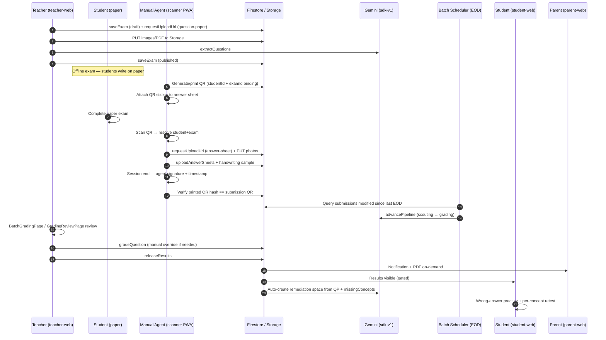
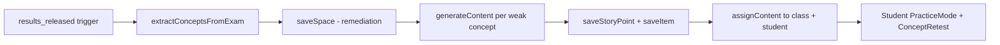

# Exam → QR Agent → Batch Evaluation → Learning Space

**Document ID:** `EXAM-QR-BATCH-JOURNEY`  
**Version:** 1.0  
**Last updated:** 2026-07-14  
**Status:** Production requirements (tracker)  
**Priority journey:** P0 — Teacher question paper → manual exam → QR agent PWA →
batch AI evaluation → reports → auto-learning space

---

## Executive Summary

LvlUp's first-priority journey connects **offline paper exams** to **AI-assisted
grading** and **personalized remediation**. A teacher creates an exam and
uploads a question-paper PDF; students write answers on paper; a **Manual
Agent** (field scanner) captures answer sheets via a mobile PWA using
**per-student+exam QR codes**; at end-of-day a **batch grading job** evaluates
submissions; results flow to students, parents, and teachers; and a **post-exam
learning space** is auto-created from the question paper and wrong-answer
analysis.

**What works today (July 2026):**

| Stage                                | Status                                      |
| ------------------------------------ | ------------------------------------------- |
| Teacher login (GRN001 flow)          | **EXISTS**                                  |
| Exam create + QP upload + AI extract | **EXISTS** (teacher-web)                    |
| Manual offline exam (paper)          | **Process** (outside software)              |
| Teacher-web answer sheet upload      | **EXISTS**                                  |
| Real-time AI grading pipeline        | **EXISTS** (`advancePipeline`)              |
| Teacher review + manual override     | **EXISTS**                                  |
| Results release + parent PDF         | **PARTIAL**                                 |
| Student results (print, not PDF)     | **PARTIAL**                                 |
| Parent in-app notification           | **PARTIAL** (legacy trigger; v1 outbox gap) |
| Post-exam auto-space                 | **GAP**                                     |
| QR Agent PWA                         | **GAP**                                     |
| Handwriting anti-fraud match         | **GAP**                                     |
| EOD batch grading scheduler          | **GAP** (15-min watchdog only)              |

**Critical P0 security requirements:**

1. **LD-01** — Answer keys must never leak to students/parents/scanners via API
   responses, Storage URLs, or post-exam space content
   (`docs/rebuild-spec/status/SDK-REVIEW-A-LEARNING-DOMAIN.md` LD-01).
2. **Cross-student handwriting match** — Handwriting verification MUST be scoped
   to `(tenantId, examId, studentId)`; a match across different students' QR
   codes is a **P0 fraud incident** and must hard-fail the session.

---

## Personas

| Persona          | App / Surface                           | Auth                                  | Primary goals                                                                          |
| ---------------- | --------------------------------------- | ------------------------------------- | -------------------------------------------------------------------------------------- |
| **Teacher**      | `apps/teacher-web` (:4569)              | School code + email + password        | Create exam, upload QP, review AI grades, release results, optional manual override    |
| **Student**      | `apps/student-web`                      | School code + roll/email + password   | View released results; practice in remediation space                                   |
| **Parent**       | `apps/parent-web`                       | School code + email + password        | View child results, download PDF, receive notifications                                |
| **Manual Agent** | `apps/scanner-web` (PWA, **not built**) | Admin-provisioned scanner credentials | Print QR, attach to sheets, scan QR, capture/upload photos, end session with signature |
| **Admin**        | `apps/admin-web`                        | School code + email + password        | Provision scanner accounts, classes, students; monitor exam pipeline                   |

**Test credentials (Greenwood):** `priya.sharma@greenwood.edu` / `Test@12345` /
school `GRN001` — see `TEST_CREDENTIALS.md`.

---

## Cross-Role Sequence Diagram



---

## Journey 1 — Teacher Login (GRN001 Flow)

**Route:** `/login` → `apps/teacher-web/src/pages/LoginPage.tsx`  
**Roles:** `teacher`, `tenantAdmin`

### Button-by-button flow

| Step | Screen / Control                        | Action                                                                                            | Validation                                  | Success                                     | Error states                       |
| ---- | --------------------------------------- | ------------------------------------------------------------------------------------------------- | ------------------------------------------- | ------------------------------------------- | ---------------------------------- |
| 1.1  | Login — School code field `#schoolCode` | Enter `GRN001`                                                                                    | Non-empty, 3–10 chars                       | Tenant resolved via `useLookupTenantByCode` | "Invalid school code" inline       |
| 1.2  | Continue                                | `evaluateTenantAccess`                                                                            | Tenant active, teacher app enabled          | Show email/password form                    | "School not found" / access denied |
| 1.3  | Email field                             | `priya.sharma@greenwood.edu`                                                                      | Valid email format                          | —                                           | Inline validation                  |
| 1.4  | Password field                          | Enter password                                                                                    | Min length policy                           | —                                           | Inline validation                  |
| 1.5  | Sign In                                 | `loginWithSchoolCode(schoolCode, email, password)` via `packages/shared-stores/src/auth-store.ts` | Firebase auth + membership `status: active` | Redirect to `from` or `/`                   | "Invalid credentials" toast        |
| 1.6  | Session bootstrap                       | `v1.identity.getMe`                                                                               | Role `teacher` or `tenantAdmin`             | Dashboard loads                             | Access Denied inline (wrong role)  |
| 1.7  | Tenant switch (footer)                  | `v1.identity.switchActiveTenant`                                                                  | Multi-tenant membership                     | Cache reset, reload                         | Permission error                   |

### UX requirements (production)

- [ ] Loading skeleton on school-code lookup (not blank screen)
- [ ] Remember last school code in `localStorage` (not password)
- [ ] Session expiry banner with re-auth CTA
- [ ] Audit log entry: `login.success` / `login.failed` with IP (admin
      visibility)

### Codebase mapping

| Item                 | Status     | File(s)                                                         |
| -------------------- | ---------- | --------------------------------------------------------------- |
| School code login    | **EXISTS** | `packages/shared-stores/src/auth-store.ts`, teacher `LoginPage` |
| getMe / switchTenant | **EXISTS** | `v1.identity.getMe`, `v1.identity.switchActiveTenant`           |
| GRN001 seed tenant   | **EXISTS** | `packages/seed` (Greenwood / `northgate` variants)              |

---

## Journey 2 — Create Question Paper / Exam

**Route:** `/exams/new` →
`apps/teacher-web/src/pages/exams/ExamCreatePage.tsx`  
**Wizard steps:** metadata → upload → review → publish

### Button-by-button flow

| Step | Screen / Control      | Action                                                                                | Validation                                                                 | Success                                               | Error states                                    |
| ---- | --------------------- | ------------------------------------------------------------------------------------- | -------------------------------------------------------------------------- | ----------------------------------------------------- | ----------------------------------------------- |
| 2.1  | Step 1 — Exam Details | Title, subject, topics (comma-sep), total/passing marks, duration, class multi-select | Title required; ≥1 class; marks > 0                                        | Enable "Next"                                         | Inline field errors                             |
| 2.2  | Optional linked space | Select published space                                                                | Space exists in tenant                                                     | `linkedSpaceId` saved                                 | —                                               |
| 2.3  | Next → Upload         | `saveExam` creates **draft** exam server-side                                         | Server returns `examId`                                                    | Step 2 active                                         | API error toast via `useApiError`               |
| 2.4  | Upload QP             | Drag/drop or file picker (PNG, JPEG, PDF)                                             | ≥1 file; max size TBD (recommend 20 MB/page)                               | Files in preview grid                                 | "Unsupported format"                            |
| 2.5  | Upload to Storage     | Per file: `v1.autograde.requestUploadUrl` → PUT → collect paths                       | Signed URL not expired (15 min TTL)                                        | `uploadedPaths[]` populated                           | Retry with fresh URL; progress bar              |
| 2.6  | Review step           | Confirm metadata + file count                                                         | ≥1 uploaded path                                                           | Enable publish actions                                | —                                               |
| 2.7  | Extract questions     | `v1.autograde.extractQuestions`                                                       | Exam has QP images                                                         | Status → `question_paper_extracted`; questions listed | AI timeout → retry CTA; dead-letter admin alert |
| 2.8  | Publish               | `saveExam({ status: "published" })`                                                   | Prior status `question_paper_extracted`; ≥1 question; rubric sums == marks | Exam published; `exam.published` outbox               | `assertTransition` failure if skipped extract   |
| 2.9  | Post-publish          | Navigate to `/exams/:examId`                                                          | —                                                                          | ExamDetailPage                                        | —                                               |

### Storage folder segmentation (canonical)

From `packages/services/src/autograde/request-upload-url.ts` →
`buildScopedPath`:

```
tenants/{tenantId}/exams/{examId}/question-paper/{timestamp}-{rand}.{ext}
tenants/{tenantId}/exams/{examId}/answer-sheets/{studentId}/{timestamp}-{rand}.{ext}
```

**Requirements:**

- [ ] PDF multi-page: split to images server-side OR upload per-page PNG
      (current: client uploads images)
- [ ] Storage rules: teacher write on `question-paper/*`; scanner write on
      `answer-sheets/{studentId}/*` only
- [ ] No public read on any exam asset; signed GET for AI pipeline only
- [ ] Virus/malware scan hook on upload (P1)

### Exam lifecycle states

From `packages/services/src/autograde/save-exam.ts` + `packages/access`:

```
draft → question_paper_uploaded → question_paper_extracted → published → grading → results_released
```

**Known seam (PARTIAL):** `ExamCreatePage` may set `question_paper_uploaded` in
one save; extract step requires explicit `extractQuestions` call. UI "Publish"
must not allow skip.

### Codebase mapping

| Item                           | Status      | File(s)                                                         |
| ------------------------------ | ----------- | --------------------------------------------------------------- |
| 4-step wizard UI               | **EXISTS**  | `ExamCreatePage.tsx`                                            |
| saveExam lifecycle             | **EXISTS**  | `packages/services/src/autograde/save-exam.ts`                  |
| requestUploadUrl               | **EXISTS**  | `packages/services/src/autograde/request-upload-url.ts`         |
| extractQuestions (Gemini pro)  | **EXISTS**  | `packages/services/src/autograde/extract-questions.ts`          |
| saveExamQuestion (edit rubric) | **GAP**     | Questions edited session-only in UI                             |
| PDF preview in wizard          | **PARTIAL** | PDF upload supported; preview limited                           |
| Legacy Storage trigger         | **PARTIAL** | `functions/autograde/on-question-paper-upload.ts` (legacy only) |

---

## Journey 3 — Manual Exam (Offline)

**Surface:** Physical classroom — no software interaction during exam.

### Requirements

| ID    | Requirement                                                                                   | Priority |
| ----- | --------------------------------------------------------------------------------------------- | -------- |
| ME-01 | Teacher distributes printed question paper (from uploaded PDF or school print shop)           | P0       |
| ME-02 | Students write answers in designated answer booklet regions                                   | P0       |
| ME-03 | Manual Agent receives blank answer sheets + QR stickers pre-printed per `(examId, studentId)` | P0       |
| ME-04 | Exam window recorded: `examDate` + `duration` on exam doc                                     | P0       |
| ME-05 | No digital device required for students during exam                                           | P0       |

### Edge cases

| Case              | Handling                                                        |
| ----------------- | --------------------------------------------------------------- |
| Student absent    | No QR scan; submission missing → teacher marks absent in roster |
| Late arrival      | Agent scans QR only if teacher authorizes (class roster flag)   |
| Replacement sheet | Void prior QR; reissue new QR with `revision: 2` in payload     |
| Exam cancelled    | Exam status `archived`; QR scans return `EXAM_CANCELLED`        |

---

## Journey 4 — Manual Agent PWA (QR + Photo Upload)

**Target app:** `apps/scanner-web` (port 4574 per deprecated spec) — **NOT
BUILT**  
**Reference spec:** `old-deprecated/requirements/scanner-app/requirements.md`  
**Backend seams:** `scanner` role, `requestUploadUrl`, `uploadAnswerSheets` —
**EXISTS**

### Button-by-button flow

| Step | Screen / Control   | Action                                                              | Validation                                         | Success                                | Error states                              |
| ---- | ------------------ | ------------------------------------------------------------------- | -------------------------------------------------- | -------------------------------------- | ----------------------------------------- |
| 4.1  | Login              | School code + scanner username + password                           | Active membership, role `scanner`                  | Dashboard                              | Invalid creds; class scope empty          |
| 4.2  | Select exam        | List exams `status ∈ {published, grading}` for scanner's `classIds` | Exam date window                                   | Exam selected                          | Empty state + support CTA                 |
| 4.3  | Print QR batch     | Admin pre-generated OR on-demand per roster                         | One QR per `(tenantId, examId, studentId)`         | QR sheet PDF printable                 | Printer offline → save PDF                |
| 4.4  | Attach QR          | Agent sticks QR on answer sheet cover                               | QR readable at 15 cm                               | —                                      | Damaged QR → reprint                      |
| 4.5  | Scan QR            | Camera opens; decode payload                                        | Signature valid; not expired; exam published       | Student+exam resolved; open capture UI | `QR_EXPIRED`, `QR_TAMPERED`, `WRONG_EXAM` |
| 4.6  | Capture pages      | Camera or gallery; multi-page                                       | ≥1 image; max 30 pages; JPEG compress 1920px @ 85% | Preview grid                           | Storage full → offline queue              |
| 4.7  | Handwriting sample | First page includes **pre-printed reference line** student copied   | Sample region detected                             | `handwritingSample` stored             | `HANDWRITING_SAMPLE_MISSING`              |
| 4.8  | Submit             | `requestUploadUrl` × N → PUT → `uploadAnswerSheets`                 | Paths in tenant scope                              | Submission `pipelineStatus: uploaded`  | Network retry with idempotency key        |
| 4.9  | Session end        | Agent signature pad + confirm                                       | Timestamp + GPS optional                           | Session closed; audit record           | —                                         |

### QR Code Specification

**Payload format (JSON, base64url-encoded, signed):**

```json
{
  "v": 1,
  "t": "<tenantId>",
  "e": "<examId>",
  "s": "<studentId>",
  "c": "<classId>",
  "r": 1,
  "iat": "<ISO8601>",
  "exp": "<ISO8601>",
  "jti": "<uuid>"
}
```

**Signature:** HMAC-SHA256 over canonical JSON using tenant-scoped secret
`qr-signing-{tenantId}` (Secret Manager).

| Rule              | Requirement                                                                                           |
| ----------------- | ----------------------------------------------------------------------------------------------------- |
| Uniqueness        | `jti` UUID per printed QR; DB record `tenants/{t}/examQrTokens/{jti}`                                 |
| Binding           | Scan MUST match `studentId` + `examId` + `tenantId` exactly                                           |
| Expiry            | Default `exp = examDate + 7 days`; configurable per tenant                                            |
| One-time use      | After successful `uploadAnswerSheets`, mark `consumedAt`; re-scan requires teacher unlock             |
| Printed ↔ digital | Store `qrPayloadHash` on submission; session end verifies hash of scanned QR == hash of printed batch |

**New Firestore collection:**

```
tenants/{tenantId}/examQrTokens/{jti}
  examId, studentId, classId, printedAt, printedBy, consumedAt, revokedAt, qrPayloadHash
```

### Handwriting Verification Requirements

**Purpose:** Detect sheet swapping — Student A's answers submitted under Student
B's QR.

| ID    | Requirement                                                                                           | Priority |
| ----- | ----------------------------------------------------------------------------------------------------- | -------- |
| HW-01 | Capture **reference handwriting sample** from designated box on sheet (student copies printed phrase) | P0       |
| HW-02 | On submit, compute embedding/signature of reference region only                                       | P0       |
| HW-03 | Store embedding at `submissions/{id}.handwritingProfile` scoped to `(tenantId, examId, studentId)`    | P0       |
| HW-04 | **Anti-leak:** MUST NOT compare embeddings across different `studentId` values                        | P0       |
| HW-05 | On re-scan same student same exam, compare to **prior submission for same (t,e,s)** only              | P0       |
| HW-06 | Cross-student match attempt → `FRAUD_SUSPECTED` status, block release, alert teacher+admin            | P0       |
| HW-07 | Low confidence → flag `needs_review`; do not auto-fail student                                        | P1       |
| HW-08 | Agent session end: verify QR printed in batch matches QR scanned for each submission in session       | P0       |

**Implementation note:** No handwriting code exists today. Grading uses Gemini
vision inline (`process-answer-grading.ts`). New service:
`v1.autograde.verifyHandwriting` (proposed).

### Codebase mapping

| Item                                       | Status     | File(s)                                        |
| ------------------------------------------ | ---------- | ---------------------------------------------- |
| Scanner role in access policy              | **EXISTS** | `packages/access/src/policy.ts` (`SCANNERISH`) |
| requestUploadUrl class scope for scanner   | **EXISTS** | `request-upload-url.ts` L35–43                 |
| uploadAnswerSheets `uploadSource: scanner` | **EXISTS** | `upload-answer-sheets.ts`                      |
| Scanner PWA app                            | **GAP**    | No `apps/scanner-web`                          |
| QR generation/validation                   | **GAP**    | —                                              |
| Handwriting verification                   | **GAP**    | —                                              |
| Offline upload queue                       | **GAP**    | Spec in deprecated `upload-queue.md`           |
| Camera capture PWA                         | **GAP**    | Spec in deprecated `camera-capture.md`         |

---

## Journey 5 — Session End (Agent)

| Step | Requirement                                                                             |
| ---- | --------------------------------------------------------------------------------------- |
| 5.1  | Agent draws signature on canvas; stored as `agentSessions/{sessionId}.signatureImage`   |
| 5.2  | `endedAt` timestamp (server authoritative)                                              |
| 5.3  | Session summary: count submissions, count failures, list `FRAUD_SUSPECTED`              |
| 5.4  | QR audit: for each submission in session, `printedQrHash === scannedQrHash`             |
| 5.5  | Mismatch → hold submissions (`pipelineStatus: qr_mismatch_hold`) until teacher resolves |
| 5.6  | Push summary notification to teacher: "Agent session complete — N sheets uploaded"      |

**New entities:**

```
tenants/{tenantId}/agentSessions/{sessionId}
  agentUid, examId, classIds[], startedAt, endedAt, signaturePath, submissionIds[], qrAuditPass
```

---

## Journey 6 — Batch Evaluation (EOD)

**Current behavior:** Event-driven — each `uploadAnswerSheets` enqueues
`advancePipeline` via Cloud Tasks.  
**Target behavior:** EOD batch job processes all submissions with
`modifiedAt > lastBatchRun` for exams in `grading` status.

### Pipeline steps (per submission)

From `packages/services/src/autograde/pipeline/`:

1. **Scouting** — `process-answer-mapping.ts` (Gemini flash, `answerMapping`
   prompt)
2. **Grading** — `process-answer-grading.ts` (Gemini pro, `answerGrading`
   prompt)
3. **Finalize** — aggregate scores, set `pipelineStatus: ready_for_review`

### Batch scheduler specification

| Field       | Value                                                                            |
| ----------- | -------------------------------------------------------------------------------- |
| Name        | `eodExamGradingBatch`                                                            |
| Schedule    | Cron `0 18 * * *` (6 PM tenant local; configurable per tenant)                   |
| Trigger     | `modifiedAt` on submissions + exams in `grading`                                 |
| Idempotency | `batchRuns/{runId}` with `processedSubmissionIds`                                |
| Concurrency | Max 10 submissions parallel per tenant (AI quota aware)                          |
| Fallback    | Existing `staleSubmissionWatchdog` every 15 min (`stale-submission-watchdog.ts`) |

**New callable / task:**

- `v1.autograde.runGradingBatch` (admin/system) — manual trigger
- Cloud Scheduler → `eodGradingBatchService` per tenant

### Codebase mapping

| Item                             | Status     | File(s)                                                        |
| -------------------------------- | ---------- | -------------------------------------------------------------- |
| advancePipeline (Cloud Tasks)    | **EXISTS** | `packages/services/src/autograde/pipeline/advance-pipeline.ts` |
| staleSubmissionWatchdog (15 min) | **EXISTS** | `stale-submission-watchdog.ts`                                 |
| BatchGradingPage (teacher UI)    | **EXISTS** | `apps/teacher-web/src/pages/BatchGradingPage.tsx`              |
| EOD cron batch job               | **GAP**    | —                                                              |
| Modified-date batch cursor       | **GAP**    | —                                                              |
| RTDB live progress               | **EXISTS** | `v1.autograde.examGrading` subscription                        |

---

## Journey 7 — Results Distribution

### Teacher review + release

| Step | Screen                                                       | Action                                                             |
| ---- | ------------------------------------------------------------ | ------------------------------------------------------------------ |
| 7.1  | `/grading` BatchGradingPage                                  | Filter by exam, status `ready_for_review`                          |
| 7.2  | `/exams/:examId/submissions/:submissionId` GradingReviewPage | Review AI marks per question                                       |
| 7.3  | Override                                                     | `v1.autograde.gradeQuestion({ mode: "manual", score, reason })`    |
| 7.4  | Release                                                      | `v1.autograde.releaseResults` on ExamDetailPage or SubmissionsPage |

### Student results

| Step         | Route                                   | Status                                                  |
| ------------ | --------------------------------------- | ------------------------------------------------------- |
| List         | `/results` ProgressPage                 | **EXISTS** — summary; **GAP** per-exam drill-down links |
| Detail       | `/exams/:examId/results` ExamResultPage | **EXISTS** — scores, `missingConcepts` tags             |
| PDF download | —                                       | **GAP** — only `window.print()` today                   |

### Parent results + notification

| Step                | Route / Action                                         | Status                                                          |
| ------------------- | ------------------------------------------------------ | --------------------------------------------------------------- |
| Child picker        | `/results?student=`                                    | **EXISTS**                                                      |
| PDF                 | `v1.analytics.generateReport({ type: "exam-result" })` | **EXISTS** in parent-web                                        |
| In-app notification | Legacy `on-results-released.ts` trigger                | **EXISTS** (legacy)                                             |
| v1 outbox path      | `releaseResultsService` → outbox                       | **GAP** — missing `recipientUids`                               |
| FCM push            | —                                                      | **GAP** — no sender; `registerDeviceToken` unused in parent-web |

### PDF report generation

**Service:** `packages/services/src/analytics/cost-and-report.ts` →
`generateReportService`  
**Storage output:** `tenants/{tenantId}/reports/{folder}/{fileName}`  
**TTL:** Signed URL 1 hour

**Requirements:**

- [ ] Gate PDF on `resultsReleased === true` (currently **GAP**)
- [ ] Student PDF parity with parent
- [ ] Optional auto-generate PDF on release → store path on submission doc
- [ ] Email delivery (P2) via outbox

### Codebase mapping

| Item                    | Status     | File(s)                                                      |
| ----------------------- | ---------- | ------------------------------------------------------------ |
| releaseResults          | **EXISTS** | `packages/services/src/autograde/release-results.ts`         |
| Results gating in reads | **EXISTS** | `packages/services/src/autograde/reads.ts`                   |
| generateReport          | **EXISTS** | `functions/analytics/src/callable/generate-report.ts`        |
| Parent PDF button       | **EXISTS** | `apps/parent-web/src/pages/ExamResultsPage.tsx`              |
| Student PDF             | **GAP**    | `apps/student-web/src/pages/ExamResultPage.tsx` (print only) |
| FCM push                | **GAP**    | —                                                            |
| Manual override         | **EXISTS** | `GradingReviewPage.tsx`, `grade-question.ts`                 |

---

## Journey 8 — Post-Exam Learning Space (Auto-Remediation)

**Target:** After `releaseResults`, auto-create a **remediation space** from:

1. Question paper PDF (structure + concepts)
2. Per-student `missingConcepts` from RELMS grading
3. Wrong-answer items for practice + per-concept retest

### Pipeline (proposed)



### Button-by-button (student)

| Step | Route                  | Action                                                            |
| ---- | ---------------------- | ----------------------------------------------------------------- |
| 8.1  | Dashboard insight      | "Practice weak areas from {examTitle}" → remediation space        |
| 8.2  | `/spaces/:spaceId`     | View auto-generated story points per concept                      |
| 8.3  | Wrong-answer mode      | Filter items where exam question was incorrect                    |
| 8.4  | `/spaces/.../practice` | `v1.levelup.evaluateAnswer` with reasoning                        |
| 8.5  | Concept retest         | Timed mini-test per concept cluster                               |
| 8.6  | Brush-up               | PDF answer explanations (from QP extraction, not answer key leak) |

### Codebase mapping

| Item                          | Status      | File(s)                                              |
| ----------------------------- | ----------- | ---------------------------------------------------- |
| linkedSpaceId (manual)        | **EXISTS**  | `ExamCreatePage`, `Exam` type                        |
| saveSpace / saveItem          | **EXISTS**  | `packages/services/src/levelup/content.ts`           |
| generateContent               | **PARTIAL** | Rejects `sourcePdfPath` (`generate.ts` L71–76)       |
| missingConcepts in grading    | **EXISTS**  | RELMS prompt / `process-answer-grading.ts`           |
| Auto-space on release trigger | **GAP**     | —                                                    |
| Wrong-answer practice filter  | **GAP**     | `PracticeModePage.tsx` practices full story point    |
| Per-concept retest            | **GAP**     | —                                                    |
| LD-01 safe content projection | **PARTIAL** | `content.ts` stripAnswerFields — convention not type |

---

## Data Model / Schema

### Firestore collections (canonical paths)

Prefix: `LVLUP_COLLECTION_PREFIX` env (e.g. `v2_`) applies to **top-level**
names only via `packages/services/src/repo-admin/paths.ts`.

| Collection         | Path                                                   | Key fields                                                                    |
| ------------------ | ------------------------------------------------------ | ----------------------------------------------------------------------------- |
| Exam               | `{prefix}tenants/{t}/exams/{examId}`                   | `status`, `questionPaper.images[]`, `gradingConfig`, `linkedSpaceId`, `stats` |
| ExamQuestion       | `{prefix}tenants/{t}/exams/{examId}/questions/{qId}`   | rubric, `maxMarks`, extracted text                                            |
| Submission         | `{prefix}tenants/{t}/submissions/{id}`                 | `examId`, `studentId`, `answerSheets`, `pipelineStatus`, `resultsReleased`    |
| QuestionSubmission | flat `_kind: "questionSubmission"` in submissions coll | `evaluation.missingConcepts[]`, `manualOverride`                              |
| ExamQrToken        | `{prefix}tenants/{t}/examQrTokens/{jti}`               | **NEW** — QR lifecycle                                                        |
| AgentSession       | `{prefix}tenants/{t}/agentSessions/{sessionId}`        | **NEW** — scanner session audit                                               |
| Space              | `{prefix}tenants/{t}/spaces/{spaceId}`                 | remediation space                                                             |
| StoryPoint / Item  | nested under space                                     | practice + retest content                                                     |
| Notifications      | `{prefix}tenants/{t}/notifications/{id}`               | parent/student alerts                                                         |
| Outbox             | `{prefix}tenants/{t}/outbox/{id}`                      | async side effects                                                            |
| GradingDeadLetter  | `{prefix}tenants/{t}/gradingDeadLetter/{id}`           | failed AI steps                                                               |

### Firebase Storage paths

```
tenants/{tenantId}/exams/{examId}/question-paper/{stamp}-{rand}.{ext}
tenants/{tenantId}/exams/{examId}/answer-sheets/{studentId}/{stamp}-{rand}.{ext}
tenants/{tenantId}/reports/{folder}/{fileName}
tenants/{tenantId}/agentSessions/{sessionId}/signature.png   # NEW
```

### RTDB (if used)

```
gradingProgress/{tenantId}/exam/{examId}/agg   — live grading counters
notifications/{tenantId}/{recipientId}/unreadCount
```

### Auth claims (Firebase custom claims)

| Claim           | Used for                                                             |
| --------------- | -------------------------------------------------------------------- |
| `tenantId`      | Active tenant scope                                                  |
| `role`          | `teacher`, `scanner`, `tenantAdmin`, `staff`, `student`, `parent`    |
| `classIds[]`    | Scanner/teacher class scope                                          |
| `permissions[]` | Fine-grained (`answerSheets.upload`, `exam.publish`, `grade.manual`) |

---

## API / Callables Inventory

### Existing (use as-is)

| Callable                                                                     | Purpose                   |
| ---------------------------------------------------------------------------- | ------------------------- |
| `v1.identity.getMe`                                                          | Session bootstrap         |
| `v1.identity.switchActiveTenant`                                             | Tenant switch             |
| `v1.autograde.saveExam`                                                      | Exam CRUD + lifecycle     |
| `v1.autograde.requestUploadUrl`                                              | Signed upload grants      |
| `v1.autograde.extractQuestions`                                              | AI QP extraction          |
| `v1.autograde.uploadAnswerSheets`                                            | Answer sheet ingestion    |
| `v1.autograde.gradeQuestion`                                                 | Manual / AI / retry grade |
| `v1.autograde.releaseResults`                                                | Results release           |
| `v1.autograde.listExams` / `getExam` / `listQuestions`                       | Reads                     |
| `v1.autograde.listSubmissions` / `getSubmission` / `listQuestionSubmissions` | Reads                     |
| `v1.analytics.generateReport`                                                | PDF reports               |
| `v1.levelup.saveSpace` / `saveStoryPoint` / `saveItem`                       | Content authoring         |
| `v1.levelup.evaluateAnswer` / `recordItemAttempt`                            | Practice                  |
| `v1.levelup.generateContent`                                                 | AI item drafts            |
| `v1.identity.registerDeviceToken`                                            | Push token storage        |

### New (required for full journey)

| Callable                                 | Purpose                                   | Priority |
| ---------------------------------------- | ----------------------------------------- | -------- |
| `v1.autograde.generateExamQrBatch`       | Generate signed QR payloads for roster    | P0       |
| `v1.autograde.validateQrScan`            | Validate QR + return student/exam context | P0       |
| `v1.autograde.verifyHandwriting`         | Scoped handwriting check                  | P0       |
| `v1.autograde.closeAgentSession`         | Signature + QR audit + summary            | P0       |
| `v1.autograde.runGradingBatch`           | EOD / manual batch grading                | P0       |
| `v1.autograde.saveExamQuestion`          | Persist rubric edits                      | P1       |
| `v1.levelup.createRemediationSpace`      | Auto-space from exam + results            | P1       |
| `v1.levelup.extractConceptsFromExam`     | PDF → concept map                         | P1       |
| `v1.levelup.generateWrongAnswerPractice` | Items from wrong QS                       | P1       |
| `v1.notification.sendPush`               | FCM fan-out                               | P1       |

### Async infrastructure

| Component                           | Status                           |
| ----------------------------------- | -------------------------------- |
| `advancePipeline` Cloud Task        | **EXISTS**                       |
| `staleSubmissionWatchdog` scheduler | **EXISTS** (15 min)              |
| `onResultsReleased` trigger         | **EXISTS** (legacy + v1 partial) |
| `eodGradingBatch` scheduler         | **GAP**                          |
| `onResultsReleased` → auto-space    | **GAP**                          |

---

## AI Integration Points

| Stage                  | Prompt key                | Model              | Input                  | Output                               |
| ---------------------- | ------------------------- | ------------------ | ---------------------- | ------------------------------------ |
| Question extraction    | `questionExtraction`      | `gemini-2.5-pro`   | QP storage images      | Questions + rubrics                  |
| Answer mapping         | `answerMapping`           | `gemini-2.5-flash` | Answer sheet images    | Question ↔ page map                  |
| Answer grading (RELMS) | `answerGrading`           | `gemini-2.5-pro`   | Mapped images + rubric | Score, feedback, `missingConcepts[]` |
| Concept extraction     | `conceptExtraction` (NEW) | pro                | QP text                | Concept taxonomy                     |
| Remediation content    | `contentDraft`            | flash/pro          | Concept + exemplar     | Practice items                       |
| Handwriting embed      | `handwritingEmbed` (NEW)  | flash              | Reference region crop  | Embedding vector                     |

**Secrets:** per-tenant `tenant-{tenantId}-gemini` in Secret Manager
(`packages/ai/src/secrets/secret-manager.ts`).

**Cost tracking:** `tenants/{t}/llmCallLogs/{id}`.

---

## Security / P0 Anti-Patterns

| ID        | Anti-pattern                            | Mitigation                                                                                                                 |
| --------- | --------------------------------------- | -------------------------------------------------------------------------------------------------------------------------- |
| **LD-01** | Answer key leak via `ItemView` / API    | Typed stripped views; server projection tests; never include rubric correct answers in remediation items shown to students |
| **AF-01** | Cross-student handwriting match         | Embeddings scoped to `(t,e,s)`; database query MUST include `studentId` filter                                             |
| **AF-02** | QR replay attack                        | `jti` one-time consume; expiry enforced                                                                                    |
| **AF-03** | QR swap (print A, scan B)               | Session-end hash audit; hold mismatched submissions                                                                        |
| **AF-04** | Scanner uploads to wrong student path   | `requestUploadUrl` binds `studentId` in path; server validates on `uploadAnswerSheets`                                     |
| **AF-05** | Pre-release score leak                  | `reads.ts` strips scores until `resultsReleased`                                                                           |
| **AF-06** | PDF report before release               | Add release gate to `generateReport`                                                                                       |
| **AF-07** | Cross-tenant Storage path injection     | `validatePathsInTenant` in `upload-answer-sheets.ts`                                                                       |
| **AF-08** | Tentative AI scores visible pre-release | BatchGradingPage must not expose to student/parent routes                                                                  |

---

## Edge Cases & Loopholes

| #   | Scenario                              | Risk                 | Required behavior                                                             | Status                       |
| --- | ------------------------------------- | -------------------- | ----------------------------------------------------------------------------- | ---------------------------- |
| E1  | Agent scans QR twice for same student | Duplicate submission | Idempotency key on `uploadAnswerSheets`; second scan = append pages or reject | PARTIAL (idempotency exists) |
| E2  | Student submits extra pages           | Grading noise        | Scout ignores unmapped pages; teacher can delete pages                        | PARTIAL                      |
| E3  | Illegible handwriting                 | Wrong grade          | `needs_review` → manual override                                              | EXISTS                       |
| E4  | AI hallucination on rubric            | Unfair mark          | Teacher override + audit                                                      | EXISTS                       |
| E5  | Sheet swap between students           | Fraud                | Handwriting verify (HW-06)                                                    | GAP                          |
| E6  | Agent offline mid-upload              | Data loss            | PWA offline queue + retry                                                     | GAP                          |
| E7  | Exam QP revised after publish         | Integrity            | Block QP change post-publish (`POST_PUBLISH_LOCKED_FIELDS`)                   | EXISTS                       |
| E8  | Parent sees pre-release via PDF URL   | Leak                 | Release gate on generateReport                                                | GAP                          |
| E9  | Remediation space exposes answers     | LD-01 leak           | Strip answer fields; separate answerKey subcollection                         | PARTIAL                      |
| E10 | Legacy + v1 duplicate triggers        | Double notifications | Deprecate legacy autograde triggers                                           | PARTIAL                      |
| E11 | v1 outbox empty recipients            | Silent failure       | Resolve parent/student UIDs in releaseResults outbox                          | GAP                          |
| E12 | Batch EOD during active scanning      | Race                 | Batch includes only `uploadComplete` submissions                              | GAP                          |

---

## Mobile / PWA Requirements (Agent App)

| ID     | Requirement                                            | Priority |
| ------ | ------------------------------------------------------ | -------- |
| PWA-01 | Installable manifest + service worker                  | P0       |
| PWA-02 | Camera capture with document edge detection overlay    | P0       |
| PWA-03 | Offline queue (IndexedDB) for images + retry           | P0       |
| PWA-04 | Image compression before upload (max 1920px, JPEG 85%) | P0       |
| PWA-05 | QR scanner (native BarcodeDetector or ZXing WASM)      | P0       |
| PWA-06 | Haptic + audio feedback on scan success/fail           | P1       |
| PWA-07 | Battery/network status indicator                       | P1       |
| PWA-08 | Min Android 10 / iOS 15 Safari                         | P0       |
| PWA-09 | Portrait lock during capture                           | P1       |
| PWA-10 | 30 MB total per submission hard cap                    | P0       |

---

## Firebase vs Future Native Apps

| Capability         | PWA (now)                             | iOS/Android (future)                                     |
| ------------------ | ------------------------------------- | -------------------------------------------------------- |
| QR scan            | Browser camera API                    | Native AVFoundation / CameraX — faster, better low-light |
| Offline queue      | IndexedDB + SW                        | SQLite + background upload                               |
| Push notifications | Web push (limited iOS)                | FCM native                                               |
| Handwriting ML     | Cloud Gemini                          | On-device preview + cloud verify                         |
| Signature capture  | Canvas                                | Native stylus support                                    |
| Deployment         | Firebase Hosting `scanner-web` target | App Store / Play Store                                   |

**Recommendation:** Ship PWA first on Firebase Hosting (same monorepo pattern as
teacher-web). Plan `apps/scanner-rn` only if camera/QR reliability insufficient
on target school devices.

---

## Phased Implementation Tracker

### P0 — Must ship for MVP journey

- [ ] **P0-01** Scaffold `apps/scanner-web` with login, exam select, QR scan,
      capture, upload
- [ ] **P0-02** `generateExamQrBatch` + `validateQrScan` callables +
      `examQrTokens` collection
- [ ] **P0-03** Handwriting verification service with cross-student block
      (HW-04, HW-06)
- [ ] **P0-04** Agent session end + QR printed/scanned audit
- [ ] **P0-05** `eodGradingBatch` scheduler (modified-date trigger)
- [ ] **P0-06** Fix v1 `releaseResults` outbox recipient resolution
- [ ] **P0-07** Student PDF download (parity with parent)
- [ ] **P0-08** `generateReport` release gate
- [ ] **P0-09** LD-01 regression tests on remediation content
- [ ] **P0-10** End-to-end Playwright: exam create → scanner upload → batch →
      release → student results

### P1 — Quality + automation

- [ ] **P1-01** Auto-create remediation space on `results_released`
- [ ] **P1-02** `extractConceptsFromExam` from QP
- [ ] **P1-03** Wrong-answer practice mode routed from `ExamResultPage`
- [ ] **P1-04** FCM push for parent results notification
- [ ] **P1-05** `saveExamQuestion` callable for rubric persistence
- [ ] **P1-06** Scanner offline queue (IndexedDB)
- [ ] **P1-07** Deprecate legacy `functions/autograde` triggers (migrate to
      sdk-v1)
- [ ] **P1-08** Admin UI: scanner account provisioning + QR batch print

### P2 — Polish

- [ ] **P2-01** Per-concept retest story point type
- [ ] **P2-02** Email PDF delivery on release
- [ ] **P2-03** Native scanner app evaluation
- [ ] **P2-04** Multi-language QR payload
- [ ] **P2-05** Brush-up viewer from QP PDF annotations

---

## Current Codebase Map (Quick Reference)

| Area                      | Path                                                        |
| ------------------------- | ----------------------------------------------------------- |
| Teacher exam UI           | `apps/teacher-web/src/pages/exams/`                         |
| Autograde services        | `packages/services/src/autograde/`                          |
| SDK v1 wiring             | `functions/sdk-v1/src/autograde.ts`                         |
| Legacy autograde          | `functions/autograde/src/`                                  |
| AI prompts                | `packages/ai/src/prompts/registry.ts`                       |
| Access policy             | `packages/access/src/policy.ts`                             |
| Firestore paths           | `packages/services/src/repo-admin/paths.ts`                 |
| Student results           | `apps/student-web/src/pages/ExamResultPage.tsx`             |
| Parent results            | `apps/parent-web/src/pages/ExamResultsPage.tsx`             |
| LevelUp content           | `packages/services/src/levelup/content.ts`                  |
| Scanner spec (deprecated) | `old-deprecated/requirements/scanner-app/requirements.md`   |
| Journey docs              | `tmp/pr-factory-backup/docs/journeys/02-teacher-journey.md` |
| LD-01 spec                | `docs/rebuild-spec/status/SDK-REVIEW-A-LEARNING-DOMAIN.md`  |

---

## Related Documents

- [Teacher Journey](../journeys/02-teacher-journey.md) (backup in
  `tmp/pr-factory-backup/docs/journeys/`)
- [Scanner App Requirements (deprecated)](../../old-deprecated/requirements/scanner-app/requirements.md)
- [SDK LD-01 Answer Key Leak](../rebuild-spec/status/SDK-REVIEW-A-LEARNING-DOMAIN.md)
- [Assign/Take Handover](../handover/QA-ASSIGN-TAKE-FLOW.md)
- Interactive tracker canvas: `canvases/exam-qr-batch-journey.canvas.tsx`

---

## Changelog

| Date       | Version | Author | Changes                                             |
| ---------- | ------- | ------ | --------------------------------------------------- |
| 2026-07-14 | 1.0     | Agent  | Initial production requirements from codebase audit |
