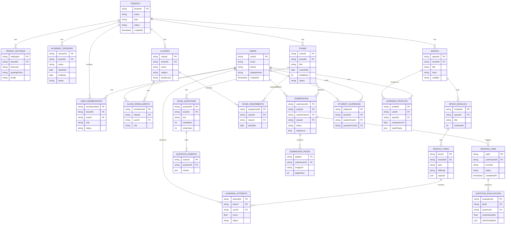

# LevelUp + AutoGrade B2B SaaS: Core Team and End-to-End Architecture

**Date:** 2026-02-17  
**Status:** Architecture + hiring blueprint  
**Audience:** Founders, product, engineering leadership

## 1. Core Decisions

1. **Tenant model:** Strict school-level multi-tenancy (`tenantId` on all
   business records).
2. **User model:** One shared identity + membership system for all products.
3. **Product model:** Unified `Spaces` (learning), `Exams` (assessment),
   `Submissions` (grading), and shared analytics.
4. **Stack direction:** **React + Firebase-first** for V1 (Auth, Firestore,
   Functions, Storage), with schema designed to remain portable to
   Supabase/Postgres later.
5. **App surfaces:** `admin`, `teacher`, `student`, `parent`, and `scanner`
   experience (scanner can remain separate lightweight app).

## 2. Unified ERD (Design First)

## 3. End-to-End Architecture

### 3.1 App Architecture

- `apps/admin-web`: tenant setup, billing, org/user/class management.
- `apps/teacher-web`: spaces/modules/items authoring, exam creation, grading QA.
- `apps/student-web`: learning journey, practice, exam results, remediation
  loops.
- `apps/parent-web`: child progress and exam insights.
- `apps/scanner-mobile`: scan/upload answer sheets, batch quality checks.

### 3.2 Backend Architecture (Firebase-First)

- **Auth:** Firebase Auth + custom claims (platform-level), memberships in
  Firestore for fine-grained tenant permissions.
- **API layer:** Cloud Functions (HTTP + callable) grouped by domains:
  - `identity` (users/memberships)
  - `learning` (spaces/modules/items/attempts)
  - `exam` (exam lifecycle/questions/assignments)
  - `grading` (submission ingest, job orchestration, evaluation writeback)
  - `analytics` (dashboards, mastery snapshots, risk scoring)
- **Data:** Firestore as source of truth with strict `tenantId` scoping.
- **Files:** Cloud Storage buckets partitioned by tenant and exam/submission
  IDs.
- **Async orchestration:** Cloud Tasks/PubSub for heavy grading pipelines.
- **AI providers:** pluggable grading providers (Gemini first), provider
  abstraction in grading service.

### 3.3 Security and Multi-Tenant Controls

- Every business entity includes `tenantId`.
- Firestore rules validate `tenantId` via membership lookup.
- Cross-tenant reads/writes denied by default.
- PII and marks-change events are audit-logged.
- Human override actions (manual regrading) require elevated teacher/admin
  permission.

## 4. Unified Product Flows

1. **Onboarding flow:** tenant created -> admin invited -> classes + users
   seeded.
2. **Learning flow:** teacher builds space/modules/items -> student practice
   attempts -> mastery profile updates.
3. **Exam flow:** teacher creates exam -> uploads paper/questions -> assigns
   class -> submissions uploaded (scanner) -> AI grading -> teacher moderation
   -> publish results.
4. **Remediation flow:** weak topics from exam evaluations map back to targeted
   space modules.

## 5. Core Feature Blueprint

- **Identity and Access:** SSO-ready login, memberships, RBAC, parent-child
  linking.
- **Learning Module System (LevelUp core):** spaces, modules, mixed item types,
  timed practice.
- **AutoGrade System:** question extraction, submission mapping, rubric grading,
  RELMS feedback.
- **School Operations:** class rosters, exam schedule, bulk imports, role
  automation.
- **Analytics:** student mastery, class heatmaps, exam reliability, parent
  reports.

## 6. Core Team Recruitment (Most Impactful 5)

### 1) Principal Platform Architect (Staff+/Founding)

- Owns multi-tenant architecture, service boundaries, and security model.
- Produces ADRs and API/domain contracts.
- Ensures LevelUp and AutoGrade concepts converge cleanly.

### 2) Principal Data Architect / Database Engineer

- Owns ERD evolution, indexing strategy, query design, and migration plan.
- Designs Firestore collection strategy for high-scale school workloads.
- Defines portability path to Supabase/Postgres if needed.

### 3) Staff Backend + AI Pipeline Engineer

- Builds grading/extraction orchestration, async job reliability, and provider
  abstraction.
- Owns submission-to-evaluation SLA and failure recovery.
- Implements moderation and human-in-the-loop grading controls.

### 4) Staff Frontend Architect (React)

- Owns unified design system, shared app shell, and role-based UX IA.
- Leads teacher/student/admin experience convergence.
- Defines frontend data contracts, cache patterns, and state boundaries.

### 5) Senior DevSecOps/SRE Engineer

- Owns CI/CD, environments, observability, disaster recovery, and security
  controls.
- Implements auditability, incident response, and cost/performance guardrails.
- Sets deployment and rollback strategy for multi-app platform.

## 7. Suggested Hiring Sequence

1. Principal Platform Architect (first)
2. Principal Data Architect (parallel early)
3. Staff Backend + AI Engineer
4. Staff Frontend Architect
5. Senior DevSecOps/SRE

## 8. 90-Day Architecture Delivery Plan

### Phase 1 (Weeks 1-3): Foundations

- Finalize ERD + canonical domain contracts.
- Implement shared auth/membership service.
- Set tenant security rules and audit logging baseline.

### Phase 2 (Weeks 4-7): Core Product Skeleton

- Teacher + student app shell with unified nav and role context.
- Learning domain APIs and key read models.
- Exam domain APIs and submission ingestion pipeline.

### Phase 3 (Weeks 8-12): Grading + Analytics Loop

- AI grading orchestration with retry and moderation queues.
- Publish exam results and remediation recommendations.
- Tenant-level analytics dashboards and SLA instrumentation.

## 9. Firebase vs Supabase (Pragmatic Decision)

- **Recommended now:** Firebase, because both current codebases are already
  Firebase-oriented and migration risk is low.
- **Keep future option:** write domain/repository interfaces so persistence can
  move to Supabase/Postgres without rewriting business logic.
- **Decision gate:** reassess at 6-9 months based on reporting complexity, SQL
  needs, and enterprise compliance requirements.
