# LevelUp + AutoGrade: Definitive Database Architecture

**Version:** 1.0 **Date:** 2026-02-17 **Status:** Final — Implementation
Reference **Audience:** Engineering, Data Architecture, Security

---

## Table of Contents

1. [Architecture Overview](#1-architecture-overview)
2. [Complete ERD](#2-complete-erd)
3. [Firestore Collection Hierarchy](#3-firestore-collection-hierarchy)
4. [Collection Schemas (Detailed)](#4-collection-schemas-detailed)
5. [Realtime Database (RTDB) Structure](#5-realtime-database-rtdb-structure)
6. [Indexing Strategy](#6-indexing-strategy)
7. [Security Rules Design](#7-security-rules-design)
8. [Cloud Storage Layout](#8-cloud-storage-layout)
9. [Data Migration Strategy](#9-data-migration-strategy)
10. [Access Patterns Reference](#10-access-patterns-reference)
11. [Scalability & Performance](#11-scalability--performance)
12. [Portability Path](#12-portability-path)

---

## 1. Architecture Overview

### 1.1 Technology Stack

| Layer            | Technology                    | Purpose                                                  |
| ---------------- | ----------------------------- | -------------------------------------------------------- |
| **Primary DB**   | Firestore                     | Structured data, org-scoped source of truth              |
| **Real-time DB** | Firebase RTDB                 | Leaderboards, live progress, resume tracking             |
| **File Storage** | Cloud Storage                 | Answer sheets, question papers, media                    |
| **Auth**         | Firebase Auth + custom claims | Identity; memberships in Firestore for fine-grained RBAC |
| **Functions**    | Cloud Functions (Gen 2)       | API, triggers, async grading pipeline                    |
| **Task Queue**   | Cloud Tasks                   | Heavy grading/extraction workloads                       |

### 1.2 Core Design Principles

1. **Strict org-scoped multi-tenancy** — every business record carries `orgId`;
   all collections live under `/organizations/{orgId}/` subcollections.
2. **Single identity, multi-membership** — one `users` record per person; one
   `userMemberships` record per (user, org) pair.
3. **Portability-ready** — repository/service interfaces abstract Firestore so
   the schema can be migrated to Supabase/Postgres without rewriting business
   logic.
4. **RTDB only for hot reads** — leaderboards, live grading progress, and resume
   tracking live in RTDB. All write-authoritative data is in Firestore.
5. **Audit everything** — marks changes and role changes write to immutable
   audit logs.
6. **Denormalize selectively** — org name, student name, and class name are
   denormalized on child documents only when required for list views.

---

## 2. Complete ERD

```mermaid
erDiagram
    %% Identity & Tenancy
    ORGANIZATIONS ||--o{ USER_MEMBERSHIPS : has
    ORGANIZATIONS ||--o{ ACADEMIC_SESSIONS : has
    ORGANIZATIONS ||--o{ CLASSES : has
    ORGANIZATIONS ||--o{ GROUPS : has
    ORGANIZATIONS ||--o{ EVALUATION_SETTINGS : has
    ORGANIZATIONS ||--o{ AUDIT_LOGS : has

    USERS ||--o{ USER_MEMBERSHIPS : has
    USERS ||--o{ STUDENT_GUARDIAN_LINKS : child
    USERS ||--o{ STUDENT_GUARDIAN_LINKS : guardian

    USER_MEMBERSHIPS ||--o{ CLASS_ENROLLMENTS : joins
    CLASSES ||--o{ CLASS_ENROLLMENTS : has

    %% Learning Domain (LevelUp)
    ORGANIZATIONS ||--o{ SPACES : owns
    SPACES ||--o{ LEARNING_UNITS : has
    LEARNING_UNITS ||--o{ UNIT_SECTIONS : has
    LEARNING_UNITS ||--o{ ITEMS : contains
    ITEMS ||--o{ LEARNING_ATTEMPTS : receives
    USER_MEMBERSHIPS ||--o{ LEARNING_ATTEMPTS : performs
    USER_MEMBERSHIPS ||--o{ UNIT_PROGRESS : tracks
    SPACES ||--o{ SPACE_AGENTS : configures
    USER_MEMBERSHIPS ||--o{ CHAT_SESSIONS : starts
    ITEMS ||--o{ CHAT_SESSIONS : about

    %% Exam Domain (AutoGrade)
    ORGANIZATIONS ||--o{ EXAMS : owns
    EXAMS ||--o{ EXAM_QUESTIONS : has
    EXAM_QUESTIONS ||--o{ QUESTION_RUBRICS : uses
    EXAMS ||--o{ EXAM_CLASS_ASSIGNMENTS : assigned_via
    CLASSES ||--o{ EXAM_CLASS_ASSIGNMENTS : receives

    %% Submission & Grading
    EXAMS ||--o{ SUBMISSIONS : receives
    USER_MEMBERSHIPS ||--o{ SUBMISSIONS : submits
    CLASSES ||--o{ SUBMISSIONS : scoped_to
    SUBMISSIONS ||--o{ SUBMISSION_PAGES : contains
    SUBMISSIONS ||--o{ QUESTION_SUBMISSIONS : has
    EXAM_QUESTIONS ||--o{ QUESTION_SUBMISSIONS : maps_to
    SUBMISSIONS ||--o{ GRADING_JOBS : triggers
    GRADING_JOBS ||--o{ QUESTION_EVALUATIONS : produces
    EXAM_QUESTIONS ||--o{ QUESTION_EVALUATIONS : evaluates

    %% Analytics
    USER_MEMBERSHIPS ||--o{ MASTERY_PROFILES : has
    SPACES ||--o{ MASTERY_PROFILES : scopes

    %% Entity definitions
    ORGANIZATIONS {
        string orgId PK
        string name
        string schoolCode
        string slug
        string plan
        string status
        string geminiApiKey
        timestamp createdAt
        timestamp updatedAt
    }
    ACADEMIC_SESSIONS {
        string sessionId PK
        string orgId FK
        string name
        date startDate
        date endDate
        string status
    }
    USERS {
        string uid PK
        string email
        string phone
        string fullName
        string displayName
        string photoURL
        string country
        int age
        string grade
        bool onboardingCompleted
        timestamp createdAt
        timestamp updatedAt
    }
    USER_MEMBERSHIPS {
        string membershipId PK
        string uid FK
        string orgId FK
        string role
        string status
        string[] classIds
        string[] subjectIds
        string[] childIds
        json permissions
        timestamp createdAt
        timestamp updatedAt
    }
    CLASSES {
        string classId PK
        string orgId FK
        string sessionId FK
        string name
        string subject
        string gradeLevel
        int studentCount
        timestamp createdAt
    }
    CLASS_ENROLLMENTS {
        string enrollmentId PK
        string classId FK
        string membershipId FK
        string role
        timestamp enrolledAt
    }
    GROUPS {
        string groupId PK
        string orgId FK
        string name
        string[] membershipIds
    }
    STUDENT_GUARDIAN_LINKS {
        string linkId PK
        string orgId FK
        string studentUid FK
        string guardianUid FK
        string relationship
    }
    SPACES {
        string spaceId PK
        string orgId FK
        string title
        string description
        string type
        string visibility
        string difficulty
        string[] labels
        timestamp createdAt
        timestamp updatedAt
    }
    LEARNING_UNITS {
        string unitId PK
        string spaceId FK
        string title
        int orderIndex
        string type
        int durationMinutes
        string[] sectionIds
        timestamp createdAt
        timestamp updatedAt
    }
    UNIT_SECTIONS {
        string sectionId PK
        string unitId FK
        string title
        int orderIndex
    }
    ITEMS {
        string itemId PK
        string spaceId FK
        string unitId FK
        string sectionId FK
        string type
        string title
        string difficulty
        string[] topics
        json payload
        json analytics
        int orderIndex
        timestamp createdAt
        timestamp updatedAt
    }
    SPACE_AGENTS {
        string agentId PK
        string spaceId FK
        string name
        string model
        string systemPrompt
        bool isDefault
    }
    LEARNING_ATTEMPTS {
        string attemptId PK
        string itemId FK
        string membershipId FK
        string mode
        json submission
        json evaluation
        float correctness
        int pointsEarned
        int totalPoints
        timestamp createdAt
    }
    UNIT_PROGRESS {
        string progressId PK
        string unitId FK
        string membershipId FK
        string status
        int pointsEarned
        int totalPoints
        float percentage
        json itemProgress
        timestamp updatedAt
        timestamp completedAt
    }
    CHAT_SESSIONS {
        string sessionId PK
        string itemId FK
        string membershipId FK
        string agentId FK
        int messageCount
        bool isActive
        timestamp createdAt
        timestamp updatedAt
    }
    MASTERY_PROFILES {
        string profileId PK
        string membershipId FK
        string spaceId FK
        float masteryScore
        json weakTopics
        json strongTopics
        timestamp updatedAt
    }
    EXAMS {
        string examId PK
        string orgId FK
        string sessionId FK
        string title
        string subject
        string[] topics
        timestamp examDate
        int durationMinutes
        int totalMarks
        int passingMarks
        string status
        json questionPaper
        json gradingConfig
        timestamp createdAt
        timestamp updatedAt
    }
    EXAM_QUESTIONS {
        string questionId PK
        string examId FK
        string text
        int maxMarks
        int orderIndex
        timestamp createdAt
    }
    QUESTION_RUBRICS {
        string rubricId PK
        string questionId FK
        json criteria
        timestamp updatedAt
    }
    EXAM_CLASS_ASSIGNMENTS {
        string assignmentId PK
        string examId FK
        string classId FK
        timestamp dueDate
        timestamp assignedAt
    }
    SUBMISSIONS {
        string submissionId PK
        string examId FK
        string membershipId FK
        string classId FK
        string studentName
        string rollNumber
        json answerSheets
        json scoutingResult
        json summary
        timestamp createdAt
        timestamp updatedAt
    }
    SUBMISSION_PAGES {
        string pageId PK
        string submissionId FK
        string imageUrl
        int pageIndex
        timestamp uploadedAt
    }
    QUESTION_SUBMISSIONS {
        string qSubmissionId PK
        string submissionId FK
        string questionId FK
        json mapping
        json evaluation
        string status
        timestamp createdAt
        timestamp updatedAt
    }
    GRADING_JOBS {
        string jobId PK
        string submissionId FK
        string provider
        string status
        json tokensUsed
        float cost
        timestamp startedAt
        timestamp completedAt
    }
    QUESTION_EVALUATIONS {
        string evaluationId PK
        string jobId FK
        string questionId FK
        float score
        float maxScore
        float confidenceScore
        json structuredFeedback
        json rubricBreakdown
        json summary
        string evaluationRubricId
        timestamp gradedAt
    }
    EVALUATION_SETTINGS {
        string settingsId PK
        string orgId FK
        string name
        bool isDefault
        json enabledDimensions
        json displaySettings
        timestamp createdAt
        timestamp updatedAt
    }
    AUDIT_LOGS {
        string logId PK
        string orgId FK
        string actorUid
        string action
        string targetType
        string targetId
        json before
        json after
        timestamp createdAt
    }
```



---

## 3. Firestore Collection Hierarchy

```
# ── GLOBAL COLLECTIONS ─────────────────────────────────────────────────────────

/users/{uid}
  # User profile. Document ID = Firebase Auth UID.

/userMemberships/{uid}_{orgId}
  # One per (user × org). Composite key. Drives all RBAC.

/platformStats/global
  # Single document for platform-wide aggregates.

/publicSpaces/{spaceId}
  # Thin reference collection for discoverable public spaces.
  # Points into /organizations/{orgId}/spaces/{spaceId}.

# ── ORGANIZATION ROOT ───────────────────────────────────────────────────────────

/organizations/{orgId}
  # One per school / institution.

  /academicSessions/{sessionId}
    # Academic year / semester definitions.

  /classes/{classId}
    # Class roster definitions.

    /enrollments/{enrollmentId}
      # Student or teacher enrollment in a class.

  /groups/{groupId}
    # Flexible groupings within an org (cohorts, clubs, remediation groups).

  /studentGuardianLinks/{linkId}
    # Parent–child relationships scoped to this org.

  # ── LEARNING DOMAIN (LevelUp) ──────────────────────────────────────────────

  /spaces/{spaceId}
    # Course, practice range, or assessment space.

    /learningUnits/{unitId}
      # Story point / chapter / module.

    /items/{itemId}
      # All content items (questions, materials, assessments, etc.).
      # Flat under space for efficient cross-unit queries.

    /agents/{agentId}
      # AI tutor/evaluator configurations for this space.

  /unitProgress/{uid}_{unitId}
    # Per-user learning progress per unit. Composite key.
    # (Placed under org, not under space, for efficient
    #  cross-space queries on a student's overall progress.)

  /learningAttempts/{attemptId}
    # Individual item submission attempts.

  /timedTestSessions/{sessionId}
    # Timed test execution state.

  /chatSessions/{sessionId}
    # AI chat session history.

  /masteryProfiles/{uid}_{spaceId}
    # Mastery and weak-topic tracking per user per space.

  # ── EXAM DOMAIN (AutoGrade) ────────────────────────────────────────────────

  /exams/{examId}
    # Exam lifecycle document.

    /questions/{questionId}
      # Extracted questions with rubrics.

  /examClassAssignments/{assignmentId}
    # Binding between an exam and one or more classes.

  /submissions/{submissionId}
    # Student answer sheet submission.

    /questionSubmissions/{questionId}
      # Per-question mapping + evaluation result.

  /gradingJobs/{jobId}
    # AI grading job tracking.

  /questionEvaluations/{evaluationId}
    # Final evaluation records (also embedded in questionSubmissions).

  # ── CONFIGURATION ──────────────────────────────────────────────────────────

  /evaluationSettings/{settingsId}
    # RELMS feedback rubric configurations.

  /auditLogs/{logId}
    # Immutable change log for marks and role changes.
```

---

## 4. Collection Schemas (Detailed)

### 4.1 Global Collections

#### `/users/{uid}`

```typescript
interface UserDoc {
  uid: string; // = document ID = Firebase Auth UID
  email?: string;
  phone?: string;
  fullName: string;
  displayName?: string; // Community/handle name
  photoURL?: string;
  country?: string;
  age?: number;
  grade?: string;
  preferences?: {
    theme: "light" | "dark" | "system";
    language: string; // BCP-47, e.g. 'en', 'hi'
    notifications: {
      email: boolean;
      push: boolean;
      sms: boolean;
    };
  };
  onboardingCompleted: boolean;
  createdAt: Timestamp;
  updatedAt: Timestamp;
}
```

#### `/userMemberships/{uid}_{orgId}`

```typescript
type MembershipRole =
  | "superAdmin" // Platform level — not org-scoped
  | "orgAdmin" // School administrator
  | "teacher"
  | "student"
  | "parent"
  | "scanner"; // Dedicated scanner device account

interface UserMembershipDoc {
  id: string; // = `${uid}_${orgId}`
  uid: string;
  orgId: string;
  orgName: string; // Denormalized for list views
  orgSlug: string;
  schoolCode: string;

  role: MembershipRole;
  status: "active" | "inactive" | "suspended";

  // Role-specific entity IDs (set once during provisioning)
  studentId?: string; // Domain ID within org
  teacherId?: string;
  parentId?: string;
  scannerId?: string;

  permissions: {
    // Content
    canCreateSpaces: boolean;
    canManageContent: boolean;
    canConfigureAgents: boolean;
    // Exams
    canCreateExams: boolean;
    canEditRubrics: boolean;
    canViewAllExams: boolean;
    canManuallyGrade: boolean;
    // Admin
    canViewAnalytics: boolean;
    canManageUsers: boolean;
    canManageClasses: boolean;
  };

  // Context relationships
  classIds?: string[]; // Classes assigned (teachers)
  subjectIds?: string[]; // Subjects taught
  childIds?: string[]; // Student UIDs (parents)

  createdAt: Timestamp;
  updatedAt: Timestamp;
}
```

**Default permissions by role:**

| Permission         | orgAdmin | teacher | student | parent | scanner |
| ------------------ | -------- | ------- | ------- | ------ | ------- |
| canCreateSpaces    | ✓        | ✓\*     |         |        |         |
| canManageContent   | ✓        | ✓\*     |         |        |         |
| canConfigureAgents | ✓        | ✓\*     |         |        |         |
| canCreateExams     | ✓        | ✓       |         |        |         |
| canEditRubrics     | ✓        | ✓       |         |        |         |
| canViewAllExams    | ✓        | ✓\*     |         |        |         |
| canManuallyGrade   | ✓        | ✓       |         |        |         |
| canViewAnalytics   | ✓        | ✓\*     |         |        |         |
| canManageUsers     | ✓        |         |         |        |         |
| canManageClasses   | ✓        |         |         |        |         |

`*` = granted only to classes the teacher is assigned to

---

### 4.2 Organization Root

#### `/organizations/{orgId}`

```typescript
interface OrganizationDoc {
  orgId: string;
  name: string;
  schoolCode: string; // Unique short code for login
  slug: string; // URL-friendly identifier
  logoUrl?: string;
  bannerUrl?: string;
  website?: string;
  contactEmail?: string;
  contactPhone?: string;
  address?: {
    street?: string;
    city?: string;
    state?: string;
    country?: string;
    postalCode?: string;
  };

  // Subscription
  plan: "trial" | "basic" | "premium" | "enterprise";
  status: "active" | "suspended" | "churned";
  trialEndsAt?: Timestamp;

  // AI configuration
  geminiApiKey?: string; // Encrypted at rest; used for org's own quota
  aiModel?: string; // e.g. 'gemini-2.5-flash'

  // Feature flags
  features: {
    learningEnabled: boolean;
    examGradingEnabled: boolean;
    scannerEnabled: boolean;
    analyticsEnabled: boolean;
    customBranding: boolean;
  };

  adminUids: string[]; // Quick lookup; authoritative source is userMemberships
  ownerUid: string;

  createdAt: Timestamp;
  updatedAt: Timestamp;
}
```

#### `/organizations/{orgId}/academicSessions/{sessionId}`

```typescript
interface AcademicSessionDoc {
  sessionId: string;
  orgId: string;
  name: string; // e.g. '2025-26 Academic Year'
  startDate: Timestamp;
  endDate: Timestamp;
  status: "upcoming" | "active" | "archived";
  createdAt: Timestamp;
}
```

#### `/organizations/{orgId}/classes/{classId}`

```typescript
interface ClassDoc {
  classId: string;
  orgId: string;
  sessionId?: string;
  name: string; // e.g. 'Grade 10 - Section A'
  subject?: string;
  gradeLevel: string;
  academicYear: string;
  teacherUids: string[]; // Teachers assigned
  studentCount: number; // Maintained by Cloud Function
  createdBy: string; // adminUid
  createdAt: Timestamp;
  updatedAt: Timestamp;
}
```

#### `/organizations/{orgId}/classes/{classId}/enrollments/{enrollmentId}`

```typescript
interface ClassEnrollmentDoc {
  enrollmentId: string;
  classId: string;
  orgId: string;
  membershipId: string; // `${uid}_${orgId}`
  uid: string;
  role: "student" | "teacher";
  enrolledAt: Timestamp;
  status: "active" | "dropped";
}
```

#### `/organizations/{orgId}/studentGuardianLinks/{linkId}`

```typescript
interface StudentGuardianLinkDoc {
  linkId: string;
  orgId: string;
  studentUid: string;
  guardianUid: string;
  relationship: "parent" | "guardian";
  createdAt: Timestamp;
}
```

---

### 4.3 Learning Domain

#### `/organizations/{orgId}/spaces/{spaceId}`

```typescript
type SpaceType = "default" | "practice_range" | "exam_prep";
type SpaceVisibility = "org" | "class" | "public";

interface SpaceDoc {
  spaceId: string;
  orgId: string;
  title: string;
  description?: string;
  thumbnailUrl?: string;

  type: SpaceType;
  visibility: SpaceVisibility;
  difficulty?: "beginner" | "intermediate" | "advanced";
  labels?: string[]; // e.g. ['math', 'algebra']
  topics?: string[];

  // Visibility targets
  classIds?: string[]; // If visibility == 'class'
  groupIds?: string[];

  // AI configuration
  defaultAgentId?: string;

  ownerUid: string;
  adminUids: string[];

  createdAt: Timestamp;
  updatedAt: Timestamp;
}
```

#### `/organizations/{orgId}/spaces/{spaceId}/learningUnits/{unitId}`

```typescript
type UnitType = "standard" | "timed_test" | "practice";

interface LearningUnitDoc {
  unitId: string;
  spaceId: string;
  orgId: string;
  title: string;
  description?: string;
  content?: string; // Landing page markdown
  orderIndex: number;
  type: UnitType;
  durationMinutes?: number; // For timed tests
  difficulty?: "easy" | "medium" | "hard";

  // Ordered section definitions (embedded — sections are lightweight)
  sections: Array<{
    id: string;
    title: string;
    orderIndex: number;
  }>;

  createdAt: Timestamp;
  updatedAt: Timestamp;
}
```

#### `/organizations/{orgId}/spaces/{spaceId}/items/{itemId}`

Items are stored flat under the space (not nested under units) to allow
efficient cross-unit queries.

```typescript
type ItemType =
  | "question"
  | "material"
  | "interactive"
  | "assessment"
  | "discussion"
  | "project"
  | "checkpoint";

interface ItemDoc {
  itemId: string;
  spaceId: string;
  unitId: string;
  sectionId?: string;
  orgId: string;

  type: ItemType;
  title?: string;
  content?: string;
  difficulty?: "easy" | "medium" | "hard";
  topics?: string[];
  labels?: string[];

  // Ordering within section / unit
  orderIndex: number;
  sectionOrderIndex?: number;

  // Type-specific payload (see below)
  payload:
    | QuestionPayload
    | MaterialPayload
    | AssessmentPayload
    | InteractivePayload;

  // AI analytics dimensions
  analytics?: {
    bloomsLevel?:
      | "remember"
      | "understand"
      | "apply"
      | "analyze"
      | "evaluate"
      | "create";
    cognitiveLoad?: "low" | "medium" | "high";
    skillsAssessed?: string[];
    primarySkill?: string;
    conceptCategory?: string;
    learningObjective?: string;
    curriculumStandards?: string[];
    conceptImportance?:
      | "foundational"
      | "important"
      | "advanced"
      | "optional"
      | "bonus";
    prerequisiteTopics?: string[];
    relatedTopics?: string[];
    commonMistakes?: string[];
    hintsAvailable?: boolean;
    customDimensions?: Record<string, string | string[] | number>;
  };

  createdAt: Timestamp;
  updatedAt: Timestamp;
}

// ─── Payload variants ──────────────────────────────────────────────────────────

interface QuestionPayload {
  questionType:
    | "mcq"
    | "mcaq"
    | "true-false"
    | "text"
    | "code"
    | "matching"
    | "fill-blanks"
    | "fill-blanks-dd"
    | "paragraph"
    | "jumbled"
    | "audio"
    | "group-options"
    | "numerical"
    | "image_evaluation"
    | "chat_agent_question";
  content: string;
  explanation?: string;
  basePoints: number;
  questionData: Record<string, unknown>; // Type-specific (options, testCases, etc.)
}

interface MaterialPayload {
  materialType:
    | "text"
    | "video"
    | "pdf"
    | "link"
    | "interactive"
    | "story"
    | "rich";
  url?: string;
  duration?: number;
  downloadable?: boolean;
  content?: string;
  richContent?: {
    blocks: Array<{
      id: string;
      type:
        | "heading"
        | "paragraph"
        | "image"
        | "video"
        | "audio"
        | "code"
        | "quote"
        | "list"
        | "divider";
      content: string;
      metadata?: Record<string, unknown>;
    }>;
    readingTime?: number;
    author?: { name: string; avatar?: string };
    tags?: string[];
  };
}

interface AssessmentPayload {
  assessmentType: "quiz" | "exam" | "project" | "peer_review";
  timeLimit?: number;
  attempts?: number;
  passingScore?: number;
  itemReferences?: string[];
  rubric?: Array<{ criterion: string; maxPoints: number; description: string }>;
}

interface InteractivePayload {
  interactiveType: "simulation" | "demo" | "code_playground" | "diagram";
  embedUrl?: string;
  config?: Record<string, unknown>;
}
```

#### `/organizations/{orgId}/spaces/{spaceId}/agents/{agentId}`

```typescript
interface SpaceAgentDoc {
  agentId: string;
  spaceId: string;
  orgId: string;
  name: string;
  description?: string;
  model: string; // e.g. 'gemini-2.5-flash' | 'claude-sonnet-4-5'
  provider: "gemini" | "claude" | "openai";
  systemPrompt: string;
  temperature?: number;
  isDefault: boolean;
  createdAt: Timestamp;
  updatedAt: Timestamp;
}
```

#### `/organizations/{orgId}/unitProgress/{uid}_{unitId}`

```typescript
interface UnitProgressDoc {
  id: string; // `${uid}_${unitId}`
  uid: string;
  unitId: string;
  spaceId: string;
  orgId: string;

  status: "not_started" | "in_progress" | "completed";
  pointsEarned: number;
  totalPoints: number;
  percentage: number; // 0–1

  // Map of itemId -> progress entry
  items: Record<
    string,
    {
      itemId: string;
      itemType: ItemType;
      completed: boolean;
      completedAt?: Timestamp;
      timeSpentSeconds?: number;
      interactions?: number;
      lastUpdatedAt: Timestamp;

      // Question-specific
      questionData?: {
        status: "pending" | "correct" | "incorrect" | "partial";
        attemptsCount: number;
        bestScore: number;
        pointsEarned: number;
        totalPoints: number;
        percentage: number;
        solved: boolean;
      };

      // Non-question items
      score?: number;
      feedback?: string;
    }
  >;

  updatedAt: Timestamp;
  completedAt?: Timestamp;
}
```

#### `/organizations/{orgId}/learningAttempts/{attemptId}`

```typescript
interface LearningAttemptDoc {
  attemptId: string;
  uid: string;
  membershipId: string; // `${uid}_${orgId}`
  orgId: string;
  spaceId: string;
  unitId: string;
  itemId: string;
  questionType?: string;
  mode: "tutorial" | "challenge" | "practice" | "assessment";
  submission: Record<string, unknown>;
  evaluation?: Record<string, unknown>;
  correctness: number; // 0–1
  pointsEarned: number;
  totalPoints: number;
  timeSpentSeconds?: number;
  createdAt: Timestamp;
}
```

#### `/organizations/{orgId}/timedTestSessions/{sessionId}`

```typescript
interface TimedTestSessionDoc {
  sessionId: string;
  uid: string;
  orgId: string;
  spaceId: string;
  unitId: string;
  attemptNumber: number;
  status: "in_progress" | "completed" | "expired" | "abandoned";
  startedAt: Timestamp;
  endedAt?: Timestamp;
  durationMinutes: number;
  totalQuestions: number;
  answeredQuestions: number;
  pointsEarned?: number;
  totalPoints?: number;
  percentage?: number;
  questionOrder: string[]; // itemIds in presentation order

  submissions: Record<
    string,
    {
      itemId: string;
      questionType: string;
      submittedAt: Timestamp;
      timeSpentSeconds: number;
      answer: unknown;
      evaluation?: unknown;
      correct: boolean;
      pointsEarned: number;
      totalPoints: number;
      markedForReview?: boolean;
    }
  >;

  markedForReview: Record<string, boolean>;
  visitedQuestions: Record<string, boolean>;

  createdAt: Timestamp;
  updatedAt: Timestamp;
}
```

#### `/organizations/{orgId}/chatSessions/{sessionId}`

```typescript
interface ChatSessionDoc {
  sessionId: string;
  uid: string;
  orgId: string;
  spaceId: string;
  unitId: string;
  itemId: string;
  agentId?: string;
  questionType?: string;
  sessionTitle: string;
  previewMessage: string;
  messageCount: number;
  language: string;
  isActive: boolean;
  messages: Array<{
    id: string;
    role: "user" | "assistant" | "system";
    text: string;
    timestamp: string; // ISO 8601
  }>;
  systemPrompt: string;
  createdAt: Timestamp;
  updatedAt: Timestamp;
}
```

#### `/organizations/{orgId}/masteryProfiles/{uid}_{spaceId}`

```typescript
interface MasteryProfileDoc {
  id: string; // `${uid}_${spaceId}`
  uid: string;
  spaceId: string;
  orgId: string;
  masteryScore: number; // 0–100 aggregate
  weakTopics: Array<{
    topic: string;
    score: number;
    lastAttemptAt: Timestamp;
  }>;
  strongTopics: Array<{
    topic: string;
    score: number;
  }>;
  examWeakAreas?: string[]; // From AutoGrade evaluations
  recommendedSpaceIds?: string[]; // Remediation targets
  updatedAt: Timestamp;
}
```

---

### 4.4 Exam Domain

#### `/organizations/{orgId}/exams/{examId}`

```typescript
type ExamStatus =
  | "draft"
  | "question_paper_uploaded"
  | "in_progress"
  | "completed";

interface ExamDoc {
  examId: string;
  orgId: string;
  sessionId?: string;
  title: string;
  subject: string;
  topics: string[];
  examDate: Timestamp;
  durationMinutes: number;
  totalMarks: number;
  passingMarks: number;
  status: ExamStatus;

  questionPaper?: {
    images: string[]; // Cloud Storage URLs
    extractedAt: Timestamp;
    questionCount: number;
  };

  gradingConfig: {
    autoGrade: boolean;
    allowRubricEdit: boolean;
    evaluationSettingsId: string; // References evaluationSettings collection
    customRubrics?: Record<
      string,
      { criteria: Array<{ description: string; marks: number }> }
    >;
  };

  createdBy: string; // UID
  createdAt: Timestamp;
  updatedAt: Timestamp;
}
```

#### `/organizations/{orgId}/exams/{examId}/questions/{questionId}`

```typescript
interface ExamQuestionDoc {
  questionId: string;
  examId: string;
  orgId: string;
  text: string; // LaTeX or plain text
  maxMarks: number;
  orderIndex: number;

  rubric: {
    criteria: Array<{
      description: string;
      marks: number;
    }>;
  };

  createdAt: Timestamp;
  updatedAt: Timestamp;
}
```

#### `/organizations/{orgId}/examClassAssignments/{assignmentId}`

```typescript
interface ExamClassAssignmentDoc {
  assignmentId: string;
  examId: string;
  classId: string;
  orgId: string;
  dueDate?: Timestamp;
  assignedAt: Timestamp;
  assignedBy: string;
}
```

#### `/organizations/{orgId}/submissions/{submissionId}`

```typescript
type SubmissionStatus =
  | "pending"
  | "scouting"
  | "grading"
  | "completed"
  | "failed";

interface SubmissionDoc {
  submissionId: string;
  examId: string;
  orgId: string;
  classId: string;
  membershipId: string; // `${uid}_${orgId}`
  uid: string;
  studentName: string; // Denormalized
  rollNumber: string;

  answerSheets: {
    images: string[]; // Cloud Storage URLs
    uploadedAt: Timestamp;
    uploadedBy: string;
  };

  scoutingResult?: {
    routingMap: Record<string, number[]>; // questionId → pageIndices
    completedAt: Timestamp;
  };

  summary: {
    totalScore: number;
    maxScore: number;
    percentage: number;
    grade: string;
    status: SubmissionStatus;
    questionsGraded?: number;
    totalQuestions?: number;
    completedAt?: Timestamp;
  };

  createdAt: Timestamp;
  updatedAt: Timestamp;
}
```

#### `/organizations/{orgId}/submissions/{submissionId}/questionSubmissions/{questionId}`

```typescript
interface QuestionSubmissionDoc {
  id: string; // = questionId (e.g. "Q1")
  submissionId: string;
  questionId: string;
  examId: string;
  orgId: string;

  mapping: {
    pageIndices: number[];
    imageUrls: string[];
    scoutedAt: Timestamp;
  };

  evaluation?: QuestionEvaluationData;

  status: "scouted" | "graded" | "manual_override";
  createdAt: Timestamp;
  updatedAt: Timestamp;
}

interface QuestionEvaluationData {
  score: number;
  maxScore: number;
  confidenceScore: number; // 0–1
  structuredFeedback: Record<
    string,
    Array<{
      issue: string;
      whyItMatters?: string;
      howToFix: string;
      severity: "critical" | "major" | "minor";
      relatedConcept?: string;
    }>
  >;
  strengths: string[];
  weaknesses: string[];
  missingConcepts: string[];
  rubricBreakdown: Array<{
    criterion: string;
    awarded: number;
    max: number;
    feedback?: string;
  }>;
  summary: {
    keyTakeaway: string;
    overallComment: string;
  };
  mistakeClassification?:
    | "Conceptual"
    | "Silly Error"
    | "Knowledge Gap"
    | "None";
  evaluationRubricId: string;
  dimensionsUsed: string[];
  tokensUsed: { input: number; output: number };
  cost: number;
  gradedAt: Timestamp;
}
```

#### `/organizations/{orgId}/gradingJobs/{jobId}`

```typescript
interface GradingJobDoc {
  jobId: string;
  submissionId: string;
  orgId: string;
  provider: "gemini" | "claude" | "openai";
  model: string;
  status: "queued" | "running" | "completed" | "failed" | "retrying";
  retryCount: number;
  totalQuestions: number;
  gradedQuestions: number;
  tokensUsed?: { input: number; output: number };
  cost?: number;
  errorMessage?: string;
  startedAt: Timestamp;
  completedAt?: Timestamp;
}
```

---

### 4.5 Configuration & Audit

#### `/organizations/{orgId}/evaluationSettings/{settingsId}`

```typescript
interface EvaluationSettingsDoc {
  settingsId: string;
  orgId: string;
  name: string; // e.g. 'Default', 'Physics Lab'
  description?: string;
  isDefault: boolean; // Exactly one per org must be true
  isPublic?: boolean; // Global preset, visible to all orgs

  enabledDimensions: Array<{
    id: string;
    name: string;
    description: string;
    icon?: string;
    priority: "HIGH" | "MEDIUM" | "LOW";
    promptGuidance: string;
    enabled: boolean;
    isDefault: boolean;
    isCustom: boolean;
    expectedFeedbackCount?: number;
    createdAt?: Timestamp;
    createdBy?: string;
  }>;

  displaySettings: {
    showStrengths: boolean;
    showKeyTakeaway: boolean;
    prioritizeByImportance: boolean;
  };

  createdAt: Timestamp;
  updatedAt: Timestamp;
  createdBy?: string;
}
```

#### `/organizations/{orgId}/auditLogs/{logId}`

```typescript
interface AuditLogDoc {
  logId: string;
  orgId: string;
  actorUid: string;
  actorRole: MembershipRole;
  action:
    | "marks_changed"
    | "manual_override"
    | "role_granted"
    | "role_revoked"
    | "submission_deleted"
    | "exam_published"
    | "rubric_edited";
  targetType: "submission" | "questionSubmission" | "userMembership" | "exam";
  targetId: string;
  before?: Record<string, unknown>;
  after?: Record<string, unknown>;
  reason?: string;
  createdAt: Timestamp;
}
```

---

## 5. Realtime Database (RTDB) Structure

RTDB is used exclusively for **high-frequency read/write data** that benefits
from Firebase's real-time streaming and low-latency updates. All
write-authoritative records live in Firestore.

```
organizations/
  {orgId}/
    leaderboards/
      course/
        {spaceId}/
          {uid}: { points, displayName, avatarUrl, completionPercent, storyPointsCompleted, updatedAt }
      unit/
        {unitId}/
          {uid}: { points, displayName, avatarUrl, completionPercent, updatedAt }

    courseProgress/
      {uid}/
        {spaceId}: {
          pointsEarned,
          totalPoints,
          percentage,
          unitsCompleted,
          countsByTier: { silver, gold, platinum, diamond },
          countsByType: Record<ItemType, number>,
          updatedAt
        }

    resumeProgress/
      {uid}/
        {spaceId}: {
          lastAccessedAt,
          units: {
            {unitId}: {
              lastAccessedAt,
              sections: {
                {sectionId}: { lastAccessedAt, lastItemId }
              }
            }
          }
        }

    practiceProgress/
      {uid}/
        {spaceId}: {
          items: {
            {itemId}: {
              s: 'c' | 'i' | 'a' | 'p',   // correct | incorrect | attempted | pending
              t: number,                    // completedAt (epoch ms)
              a: number,                    // attempts count
              b?: number                    // best time seconds
            }
          },
          stats: { itemsCompleted, totalItems, pointsEarned, lastActiveAt }
        }

    gradingProgress/
      {submissionId}: {
        phase: 'uploading' | 'scouting' | 'grading' | 'finalizing' | 'done' | 'error',
        status: string,
        progressPercent: number,
        currentStep: string,
        questionsTotal: number,
        questionsGraded: number,
        updatedAt: number
      }

    metrics/
      {spaceId}/
        {unitId}/
          {itemId}: {
            viewCount,
            submissionCount,
            averageScore,
            averageTimeSeconds,
            lastViewAt,
            lastSubmissionAt
          }
```

**RTDB Security:** All paths under `organizations/{orgId}/` are accessible only
to authenticated users with a matching `userMemberships/{uid}_{orgId}` with
`status == 'active'`. Validated via Firebase RTDB rules using
`root.child('userMemberships/...')` lookups or via a Cloud Function that issues
scoped auth tokens.

---

## 6. Indexing Strategy

### 6.1 Composite Index Definitions (`firestore.indexes.json`)

```json
{
  "indexes": [
    // ── userMemberships ──────────────────────────────────────────────────────
    {
      "collectionGroup": "userMemberships",
      "fields": [
        { "fieldPath": "orgId", "order": "ASCENDING" },
        { "fieldPath": "role", "order": "ASCENDING" },
        { "fieldPath": "status", "order": "ASCENDING" }
      ]
    },
    {
      "collectionGroup": "userMemberships",
      "fields": [
        { "fieldPath": "orgId", "order": "ASCENDING" },
        { "fieldPath": "classIds", "arrayConfig": "CONTAINS" },
        { "fieldPath": "role", "order": "ASCENDING" }
      ]
    },

    // ── classes ──────────────────────────────────────────────────────────────
    {
      "collectionGroup": "classes",
      "fields": [
        { "fieldPath": "orgId", "order": "ASCENDING" },
        { "fieldPath": "sessionId", "order": "ASCENDING" },
        { "fieldPath": "createdAt", "order": "DESCENDING" }
      ]
    },

    // ── spaces ───────────────────────────────────────────────────────────────
    {
      "collectionGroup": "spaces",
      "fields": [
        { "fieldPath": "orgId", "order": "ASCENDING" },
        { "fieldPath": "type", "order": "ASCENDING" },
        { "fieldPath": "visibility", "order": "ASCENDING" },
        { "fieldPath": "updatedAt", "order": "DESCENDING" }
      ]
    },
    {
      "collectionGroup": "spaces",
      "fields": [
        { "fieldPath": "orgId", "order": "ASCENDING" },
        { "fieldPath": "classIds", "arrayConfig": "CONTAINS" },
        { "fieldPath": "updatedAt", "order": "DESCENDING" }
      ]
    },

    // ── learningUnits ─────────────────────────────────────────────────────────
    {
      "collectionGroup": "learningUnits",
      "fields": [
        { "fieldPath": "spaceId", "order": "ASCENDING" },
        { "fieldPath": "orderIndex", "order": "ASCENDING" }
      ]
    },

    // ── items ────────────────────────────────────────────────────────────────
    {
      "collectionGroup": "items",
      "fields": [
        { "fieldPath": "unitId", "order": "ASCENDING" },
        { "fieldPath": "orderIndex", "order": "ASCENDING" }
      ]
    },
    {
      "collectionGroup": "items",
      "fields": [
        { "fieldPath": "unitId", "order": "ASCENDING" },
        { "fieldPath": "sectionId", "order": "ASCENDING" },
        { "fieldPath": "sectionOrderIndex", "order": "ASCENDING" }
      ]
    },
    {
      "collectionGroup": "items",
      "fields": [
        { "fieldPath": "spaceId", "order": "ASCENDING" },
        { "fieldPath": "topics", "arrayConfig": "CONTAINS" },
        { "fieldPath": "difficulty", "order": "ASCENDING" }
      ]
    },

    // ── learningAttempts ──────────────────────────────────────────────────────
    {
      "collectionGroup": "learningAttempts",
      "fields": [
        { "fieldPath": "uid", "order": "ASCENDING" },
        { "fieldPath": "itemId", "order": "ASCENDING" },
        { "fieldPath": "createdAt", "order": "DESCENDING" }
      ]
    },
    {
      "collectionGroup": "learningAttempts",
      "fields": [
        { "fieldPath": "uid", "order": "ASCENDING" },
        { "fieldPath": "unitId", "order": "ASCENDING" },
        { "fieldPath": "createdAt", "order": "DESCENDING" }
      ]
    },
    {
      "collectionGroup": "learningAttempts",
      "fields": [
        { "fieldPath": "orgId", "order": "ASCENDING" },
        { "fieldPath": "itemId", "order": "ASCENDING" },
        { "fieldPath": "correctness", "order": "DESCENDING" }
      ]
    },

    // ── chatSessions ──────────────────────────────────────────────────────────
    {
      "collectionGroup": "chatSessions",
      "fields": [
        { "fieldPath": "uid", "order": "ASCENDING" },
        { "fieldPath": "itemId", "order": "ASCENDING" },
        { "fieldPath": "updatedAt", "order": "DESCENDING" }
      ]
    },

    // ── exams ────────────────────────────────────────────────────────────────
    {
      "collectionGroup": "exams",
      "fields": [
        { "fieldPath": "orgId", "order": "ASCENDING" },
        { "fieldPath": "sessionId", "order": "ASCENDING" },
        { "fieldPath": "examDate", "order": "DESCENDING" }
      ]
    },
    {
      "collectionGroup": "exams",
      "fields": [
        { "fieldPath": "orgId", "order": "ASCENDING" },
        { "fieldPath": "status", "order": "ASCENDING" },
        { "fieldPath": "examDate", "order": "DESCENDING" }
      ]
    },

    // ── examClassAssignments ──────────────────────────────────────────────────
    {
      "collectionGroup": "examClassAssignments",
      "fields": [
        { "fieldPath": "classId", "order": "ASCENDING" },
        { "fieldPath": "dueDate", "order": "ASCENDING" }
      ]
    },
    {
      "collectionGroup": "examClassAssignments",
      "fields": [
        { "fieldPath": "examId", "order": "ASCENDING" },
        { "fieldPath": "classId", "order": "ASCENDING" }
      ]
    },

    // ── questions ─────────────────────────────────────────────────────────────
    {
      "collectionGroup": "questions",
      "fields": [
        { "fieldPath": "examId", "order": "ASCENDING" },
        { "fieldPath": "orderIndex", "order": "ASCENDING" }
      ]
    },

    // ── submissions ───────────────────────────────────────────────────────────
    {
      "collectionGroup": "submissions",
      "fields": [
        { "fieldPath": "examId", "order": "ASCENDING" },
        { "fieldPath": "classId", "order": "ASCENDING" },
        { "fieldPath": "createdAt", "order": "DESCENDING" }
      ]
    },
    {
      "collectionGroup": "submissions",
      "fields": [
        { "fieldPath": "examId", "order": "ASCENDING" },
        { "fieldPath": "summary.status", "order": "ASCENDING" },
        { "fieldPath": "createdAt", "order": "DESCENDING" }
      ]
    },
    {
      "collectionGroup": "submissions",
      "fields": [
        { "fieldPath": "uid", "order": "ASCENDING" },
        { "fieldPath": "orgId", "order": "ASCENDING" },
        { "fieldPath": "createdAt", "order": "DESCENDING" }
      ]
    },

    // ── questionSubmissions ───────────────────────────────────────────────────
    {
      "collectionGroup": "questionSubmissions",
      "fields": [
        { "fieldPath": "submissionId", "order": "ASCENDING" },
        { "fieldPath": "status", "order": "ASCENDING" }
      ]
    },

    // ── gradingJobs ───────────────────────────────────────────────────────────
    {
      "collectionGroup": "gradingJobs",
      "fields": [
        { "fieldPath": "orgId", "order": "ASCENDING" },
        { "fieldPath": "status", "order": "ASCENDING" },
        { "fieldPath": "startedAt", "order": "DESCENDING" }
      ]
    },

    // ── auditLogs ─────────────────────────────────────────────────────────────
    {
      "collectionGroup": "auditLogs",
      "fields": [
        { "fieldPath": "orgId", "order": "ASCENDING" },
        { "fieldPath": "targetType", "order": "ASCENDING" },
        { "fieldPath": "targetId", "order": "ASCENDING" },
        { "fieldPath": "createdAt", "order": "DESCENDING" }
      ]
    }
  ]
}
```

### 6.2 Single-Field Indexes (auto-created by Firestore, listed for reference)

| Collection        | Field          | Direction | Use Case                     |
| ----------------- | -------------- | --------- | ---------------------------- |
| `userMemberships` | `uid`          | ASC       | Load all orgs for a user     |
| `userMemberships` | `orgId`        | ASC       | Load all members of an org   |
| `spaces`          | `orgId`        | ASC       | List org's spaces            |
| `unitProgress`    | `uid`          | ASC       | Student overall progress     |
| `submissions`     | `examId`       | ASC       | All submissions for exam     |
| `submissions`     | `uid`          | ASC       | Student's submission history |
| `gradingJobs`     | `submissionId` | ASC       | Jobs for a submission        |

---

## 7. Security Rules Design

### 7.1 Helper Function Library

```javascript
// firestore.rules

rules_version = '2';
service cloud.firestore {
  match /databases/{database}/documents {

    // ── Core helpers ──────────────────────────────────────────────────────────

    function isAuthed() {
      return request.auth != null;
    }

    function uid() {
      return request.auth.uid;
    }

    function getMembership(orgId) {
      return get(/databases/$(database)/documents/userMemberships/$(uid() + '_' + orgId)).data;
    }

    function hasMembership(orgId) {
      return exists(/databases/$(database)/documents/userMemberships/$(uid() + '_' + orgId));
    }

    function membershipActive(orgId) {
      return hasMembership(orgId) && getMembership(orgId).status == 'active';
    }

    function memberRole(orgId) {
      return getMembership(orgId).role;
    }

    function isOrgAdmin(orgId) {
      return membershipActive(orgId) && memberRole(orgId) in ['orgAdmin', 'superAdmin'];
    }

    function isTeacher(orgId) {
      return membershipActive(orgId) && memberRole(orgId) in ['orgAdmin', 'teacher', 'superAdmin'];
    }

    function isStudent(orgId) {
      return membershipActive(orgId) && memberRole(orgId) in ['student'];
    }

    function isParent(orgId) {
      return membershipActive(orgId) && memberRole(orgId) in ['parent'];
    }

    function isSuperAdmin() {
      return isAuthed() && request.auth.token.superAdmin == true;
    }

    function canManageUsers(orgId) {
      return isOrgAdmin(orgId) || getMembership(orgId).permissions.canManageUsers == true;
    }

    function canCreateExams(orgId) {
      return isTeacher(orgId) && getMembership(orgId).permissions.canCreateExams == true;
    }

    function canManuallyGrade(orgId) {
      return isTeacher(orgId) && getMembership(orgId).permissions.canManuallyGrade == true;
    }

    function incomingHasField(field) {
      return field in request.resource.data;
    }

    function notChanging(field) {
      return !(field in request.resource.data) || request.resource.data[field] == resource.data[field];
    }
```

### 7.2 Collection Rules

```javascript
    // ── Global: users ─────────────────────────────────────────────────────────

    match /users/{userId} {
      allow read: if isAuthed() && uid() == userId;
      allow create: if isAuthed() && uid() == userId;
      allow update: if isAuthed() && uid() == userId
                    && notChanging('createdAt');
      allow delete: if false;         // Platform admin only via Admin SDK
    }

    // ── Global: userMemberships ────────────────────────────────────────────────

    match /userMemberships/{membershipId} {
      // Users can read their own memberships
      allow read: if isAuthed() && membershipId.split('_')[0] == uid();
      // OrgAdmins can read all memberships for their org
      allow read: if isAuthed() && isOrgAdmin(membershipId.split('_')[1]);
      // Only admins can create/modify memberships
      allow create, update: if isAuthed()
                             && isOrgAdmin(membershipId.split('_')[1]);
      // Admins can soft-delete (status = 'inactive') but not hard-delete
      allow delete: if false;
    }

    // ── Global: platformStats ─────────────────────────────────────────────────

    match /platformStats/{docId} {
      allow read: if isSuperAdmin();
      allow write: if false;          // Cloud Functions only
    }

    // ── Organizations root ────────────────────────────────────────────────────

    match /organizations/{orgId} {
      allow read: if isAuthed() && membershipActive(orgId);
      allow create: if isSuperAdmin();
      allow update: if isOrgAdmin(orgId);
      allow delete: if isSuperAdmin();

      // ── Academic sessions ──────────────────────────────────────────────────

      match /academicSessions/{sessionId} {
        allow read: if isAuthed() && membershipActive(orgId);
        allow write: if isOrgAdmin(orgId);
      }

      // ── Classes ───────────────────────────────────────────────────────────

      match /classes/{classId} {
        allow read: if isAuthed() && membershipActive(orgId);
        allow write: if canManageUsers(orgId);

        match /enrollments/{enrollmentId} {
          allow read: if isAuthed() && membershipActive(orgId);
          allow write: if canManageUsers(orgId);
        }
      }

      // ── Groups ────────────────────────────────────────────────────────────

      match /groups/{groupId} {
        allow read: if isAuthed() && membershipActive(orgId);
        allow write: if isOrgAdmin(orgId);
      }

      // ── Student–guardian links ─────────────────────────────────────────────

      match /studentGuardianLinks/{linkId} {
        allow read: if isAuthed() && (
          membershipActive(orgId) && (
            isOrgAdmin(orgId) ||
            uid() == resource.data.studentUid ||
            uid() == resource.data.guardianUid
          )
        );
        allow write: if canManageUsers(orgId);
      }

      // ── Spaces ────────────────────────────────────────────────────────────

      match /spaces/{spaceId} {
        allow read: if isAuthed() && membershipActive(orgId);
        allow create, update: if isAuthed()
                               && getMembership(orgId).permissions.canCreateSpaces == true;
        allow delete: if isOrgAdmin(orgId);

        match /learningUnits/{unitId} {
          allow read: if isAuthed() && membershipActive(orgId);
          allow write: if isAuthed()
                       && getMembership(orgId).permissions.canManageContent == true;
        }

        match /items/{itemId} {
          allow read: if isAuthed() && membershipActive(orgId);
          allow write: if isAuthed()
                       && getMembership(orgId).permissions.canManageContent == true;
        }

        match /agents/{agentId} {
          allow read: if isAuthed() && membershipActive(orgId);
          allow write: if isAuthed()
                       && getMembership(orgId).permissions.canConfigureAgents == true;
        }
      }

      // ── Learning progress (students write their own) ───────────────────────

      match /unitProgress/{progressId} {
        // progressId = `${uid}_${unitId}` — students own their records
        allow read: if isAuthed() && (
          isTeacher(orgId) ||
          progressId.split('_')[0] == uid()
        );
        allow create, update: if isAuthed() && progressId.split('_')[0] == uid()
                              && notChanging('uid') && notChanging('orgId');
        allow delete: if false;
      }

      match /learningAttempts/{attemptId} {
        allow read: if isAuthed() && (
          isTeacher(orgId) ||
          uid() == resource.data.uid
        );
        allow create: if isAuthed() && uid() == request.resource.data.uid
                      && membershipActive(orgId);
        allow update, delete: if false;    // Immutable; corrections go through new attempts
      }

      match /timedTestSessions/{sessionId} {
        allow read: if isAuthed() && (
          isTeacher(orgId) ||
          uid() == resource.data.uid
        );
        allow create: if isAuthed() && uid() == request.resource.data.uid
                      && membershipActive(orgId);
        allow update: if isAuthed() && uid() == resource.data.uid;
        allow delete: if false;
      }

      match /chatSessions/{sessionId} {
        allow read: if isAuthed() && uid() == resource.data.uid;
        allow create, update: if isAuthed() && uid() == request.resource.data.uid
                              && membershipActive(orgId);
        allow delete: if false;
      }

      match /masteryProfiles/{profileId} {
        allow read: if isAuthed() && (
          isTeacher(orgId) ||
          isParent(orgId) ||
          profileId.split('_')[0] == uid()
        );
        allow write: if false;             // Cloud Functions only
      }

      // ── Exams ─────────────────────────────────────────────────────────────

      match /exams/{examId} {
        allow read: if isAuthed() && membershipActive(orgId);
        allow create, update: if canCreateExams(orgId);
        allow delete: if isOrgAdmin(orgId);

        match /questions/{questionId} {
          allow read: if isAuthed() && membershipActive(orgId);
          allow write: if canCreateExams(orgId);
        }
      }

      match /examClassAssignments/{assignmentId} {
        allow read: if isAuthed() && membershipActive(orgId);
        allow write: if canCreateExams(orgId);
      }

      // ── Submissions ────────────────────────────────────────────────────────

      match /submissions/{submissionId} {
        // Students read their own; teachers/admins read all
        allow read: if isAuthed() && (
          isTeacher(orgId) ||
          isParent(orgId) ||
          uid() == resource.data.uid
        );
        // Upload allowed by scanner role and admins
        allow create: if isAuthed() && membershipActive(orgId) && (
          isOrgAdmin(orgId) ||
          memberRole(orgId) == 'scanner' ||
          isTeacher(orgId)
        );
        // Manual grade override requires permission
        allow update: if isAuthed() && (
          isOrgAdmin(orgId) ||
          canManuallyGrade(orgId)
        );
        allow delete: if isOrgAdmin(orgId);

        match /questionSubmissions/{questionId} {
          allow read: if isAuthed() && (
            isTeacher(orgId) ||
            isParent(orgId) ||
            uid() == get(/databases/$(database)/documents/organizations/$(orgId)/submissions/$(submissionId)).data.uid
          );
          // Only Cloud Functions write these
          allow create, update: if false;
          // Manual override allowed for graders
          allow update: if canManuallyGrade(orgId);
        }
      }

      match /gradingJobs/{jobId} {
        allow read: if isTeacher(orgId);
        allow write: if false;           // Cloud Functions only
      }

      // ── Configuration ──────────────────────────────────────────────────────

      match /evaluationSettings/{settingsId} {
        allow read: if isAuthed() && membershipActive(orgId);
        allow write: if isOrgAdmin(orgId);
      }

      match /auditLogs/{logId} {
        allow read: if isOrgAdmin(orgId);
        allow write: if false;           // Cloud Functions only (immutable)
      }
    }
  }
}
```

### 7.3 Tenant Isolation Guarantees

| Guarantee                  | Mechanism                                                                               |
| -------------------------- | --------------------------------------------------------------------------------------- |
| Cross-tenant read blocked  | All business collections under `/organizations/{orgId}/`; rules check active membership |
| Cross-tenant write blocked | `orgId` validated against membership; Cloud Functions verify context                    |
| Student sees own data only | `uid == resource.data.uid` checks on progress, attempts, submissions                    |
| Parent sees children only  | `childIds` on membership; enforcement in `studentGuardianLinks` reads                   |
| Marks immutability         | `learningAttempts` denies update/delete; grade changes go to `auditLogs`                |
| Scanner limited scope      | `scanner` role can only create submissions, cannot read or modify other data            |
| Super admin bypass         | `request.auth.token.superAdmin` custom claim — set only by Admin SDK                    |

---

## 8. Cloud Storage Layout

```
gs://{project}-bucket/
  organizations/
    {orgId}/
      exams/
        {examId}/
          question-paper/
            page-{n}.jpg
          answer-sheets/
            {submissionId}/
              page-{n}.jpg

      spaces/
        {spaceId}/
          thumbnails/
            cover.jpg
          items/
            {itemId}/
              {fileName}

      reports/
        {examId}/
          {submissionId}/
            report.pdf

  users/
    {uid}/
      avatar.jpg
```

**Storage Security Rules (abbreviated):**

```javascript
rules_version = '2';
service firebase.storage {
  match /b/{bucket}/o {
    match /organizations/{orgId}/{allPaths=**} {
      allow read: if request.auth != null
                  && firestore.get(/databases/(default)/documents/userMemberships/$(request.auth.uid + '_' + orgId)).data.status == 'active';
      allow write: if request.auth != null
                   && firestore.get(/databases/(default)/documents/userMemberships/$(request.auth.uid + '_' + orgId)).data.role in ['orgAdmin', 'teacher', 'scanner'];
    }
    match /users/{uid}/{allPaths=**} {
      allow read, write: if request.auth != null && request.auth.uid == uid;
    }
  }
}
```

---

## 9. Data Migration Strategy

### 9.1 Migration Phases

```
Phase 0 — Preparation (before any data movement)
  ├── Deploy unified Firebase project with new Firestore rules
  ├── Create migration scripts in /scripts/migrate/
  ├── Set up migration audit trail (separate Firestore project)
  └── Keep legacy systems in READ-ONLY mode

Phase 1 — Schema Dry Run (staging only)
  ├── Run transformers on cloned staging data
  ├── Validate referential integrity
  └── Benchmark read patterns post-migration

Phase 2 — Production Migration (dual-write window)
  ├── Enable dual-write: writes go to both old paths + new org-scoped paths
  ├── Run batch migration scripts org by org
  ├── Validate counts and checksums per org
  └── Switch reads to new paths

Phase 3 — Cutover
  ├── Disable dual-write
  ├── Delete legacy paths after 90-day hold
  └── Remove legacy indexes and rules
```

### 9.2 LevelUp → Unified Schema Mapping

| Legacy Path                                | Unified Path                                                     | Transformation                                                     |
| ------------------------------------------ | ---------------------------------------------------------------- | ------------------------------------------------------------------ |
| `users/{uid}`                              | `users/{uid}`                                                    | Merge: add `preferences`, `onboardingCompleted` default            |
| `orgs/{orgId}`                             | `organizations/{orgId}`                                          | Rename fields: `code→schoolCode`, add `plan`, `status`, `features` |
| `userOrgs/{uid}_{orgId}`                   | `userMemberships/{uid}_{orgId}`                                  | Rename: add `permissions` map, `status`, `role` mapping            |
| `userRoles/{uid}`                          | merged into `userMemberships`                                    | Split per orgId; flatten `orgAdmin` map                            |
| `courses/{courseId}`                       | `/organizations/{orgId}/spaces/{spaceId}`                        | Add `orgId`, rename `ownerUid→ownerUid`, `isPublic→visibility`     |
| `storyPoints/{spId}`                       | `/organizations/{orgId}/spaces/{spaceId}/learningUnits/{unitId}` | Add `orgId`, `spaceId`                                             |
| `items/{itemId}`                           | `/organizations/{orgId}/spaces/{spaceId}/items/{itemId}`         | Add `orgId`, `spaceId`                                             |
| `userStoryPointProgress/{uid}_{spId}`      | `/organizations/{orgId}/unitProgress/{uid}_{unitId}`             | Rename `storyPointId→unitId`, `courseId→spaceId`                   |
| `attempts/{attemptId}`                     | `/organizations/{orgId}/learningAttempts/{attemptId}`            | Add `orgId`, `membershipId`                                        |
| `timedTestSessions/{id}`                   | `/organizations/{orgId}/timedTestSessions/{id}`                  | Add `orgId`                                                        |
| `chatSessions/{id}`                        | `/organizations/{orgId}/chatSessions/{id}`                       | Add `orgId`                                                        |
| `practiceItems/{id}`                       | `/organizations/{orgId}/spaces/{spaceId}/items/{id}`             | `type='question'`, add `orgId`                                     |
| RTDB `userCourseProgress/{uid}/{courseId}` | RTDB `organizations/{orgId}/courseProgress/{uid}/{spaceId}`      | Wrap under org                                                     |
| RTDB `storyPointLeaderboard/{spId}`        | RTDB `organizations/{orgId}/leaderboards/unit/{unitId}`          | Wrap under org                                                     |

### 9.3 AutoGrade → Unified Schema Mapping

| Legacy Path                                                         | Unified Path                                                           | Transformation                                                          |
| ------------------------------------------------------------------- | ---------------------------------------------------------------------- | ----------------------------------------------------------------------- |
| `/clients/{clientId}`                                               | `/organizations/{orgId}`                                               | Rename `clientId→orgId`; migrate subscription fields                    |
| `/users/{uid}`                                                      | `userMemberships/{uid}_{orgId}`                                        | Extract `userData` into membership; keep user profile in global `users` |
| `/clients/{clientId}/classes/{classId}`                             | `/organizations/{orgId}/classes/{classId}`                             | Add `orgId`                                                             |
| `/clients/{clientId}/students/{studentId}`                          | Merged into `userMemberships` + `users`                                | Create Firebase Auth account if `authUid` missing                       |
| `/clients/{clientId}/teachers/{teacherId}`                          | Merged into `userMemberships` + `users`                                | Same as students                                                        |
| `/clients/{clientId}/parents/{parentId}`                            | Merged into `userMemberships` + `studentGuardianLinks`                 | One link doc per student–parent pair                                    |
| `/clients/{clientId}/exams/{examId}`                                | `/organizations/{orgId}/exams/{examId}`                                | Replace `classIds[]` with `examClassAssignments` docs                   |
| `/clients/{clientId}/exams/{examId}/questions/{qId}`                | `/organizations/{orgId}/exams/{examId}/questions/{qId}`                | Direct copy                                                             |
| `/clients/{clientId}/submissions/{subId}`                           | `/organizations/{orgId}/submissions/{subId}`                           | Replace `studentId` with `uid` + `membershipId`                         |
| `/clients/{clientId}/submissions/{subId}/questionSubmissions/{qId}` | `/organizations/{orgId}/submissions/{subId}/questionSubmissions/{qId}` | Direct copy                                                             |
| `/clients/{clientId}/evaluationSettings/{settingsId}`               | `/organizations/{orgId}/evaluationSettings/{settingsId}`               | Direct copy                                                             |

### 9.4 Migration Script Structure

```
scripts/migrate/
  utils/
    firestore-batch.ts        # Chunked batch writer (500-doc limit)
    id-map.ts                 # Maps legacy IDs to new IDs
    checksum.ts               # Validates doc counts before/after
    dual-write.ts             # Middleware for dual-write window

  levelup/
    01-orgs.ts                # Migrate orgs → organizations
    02-users.ts               # Merge user profiles
    03-memberships.ts         # Create userMemberships from userOrgs + userRoles
    04-spaces.ts              # Migrate courses → spaces
    05-learning-units.ts      # Migrate storyPoints → learningUnits
    06-items.ts               # Migrate items (org-scoped)
    07-progress.ts            # Migrate userStoryPointProgress → unitProgress
    08-attempts.ts            # Migrate attempts → learningAttempts
    09-timed-tests.ts         # Migrate timedTestSessions
    10-chat-sessions.ts       # Migrate chatSessions
    11-rtdb.ts                # Migrate RTDB paths

  autograde/
    01-clients.ts             # Migrate clients → organizations
    02-users.ts               # Extract userData → userMemberships
    03-students.ts            # Provision Firebase Auth + membership
    04-teachers.ts            # Same
    05-parents.ts             # Same + guardian links
    06-classes.ts             # Migrate classes
    07-exams.ts               # Migrate exams + class assignments
    08-questions.ts           # Migrate questions
    09-submissions.ts         # Migrate submissions
    10-question-submissions.ts
    11-evaluation-settings.ts

  validate.ts                 # Cross-check counts, foreign keys, integrity
  rollback.ts                 # Restore legacy paths from backup
```

### 9.5 Rollback Strategy

- Legacy data is **read-only** for 90 days post-migration, not deleted.
- A `_migrated: true` flag is set on all legacy documents.
- Rollback script reads `_migrated` flags and restores writes to legacy paths.
- Cloud Functions support feature flag `USE_LEGACY_PATHS` for emergency
  fallback.

---

## 10. Access Patterns Reference

### 10.1 Authentication & Membership

```typescript
// Load user's organizations on login
query(
  collection(db, "userMemberships"),
  where("uid", "==", uid),
  where("status", "==", "active")
);

// Check a user's role in an org
getDoc(doc(db, "userMemberships", `${uid}_${orgId}`));

// List all students in an org
query(
  collection(db, "userMemberships"),
  where("orgId", "==", orgId),
  where("role", "==", "student"),
  where("status", "==", "active")
);
```

### 10.2 Learning Domain

```typescript
// Student dashboard: spaces assigned to their class
query(
  collection(db, "organizations", orgId, "spaces"),
  where("classIds", "array-contains", classId),
  where("visibility", "==", "class")
);

// Load units for a space (ordered)
query(
  collection(db, "organizations", orgId, "spaces", spaceId, "learningUnits"),
  orderBy("orderIndex")
);

// Load items for a unit (ordered)
query(
  collection(db, "organizations", orgId, "spaces", spaceId, "items"),
  where("unitId", "==", unitId),
  orderBy("orderIndex")
);

// Student's progress on a unit
getDoc(doc(db, "organizations", orgId, "unitProgress", `${uid}_${unitId}`));

// Teacher analytics: all attempts on an item
query(
  collection(db, "organizations", orgId, "learningAttempts"),
  where("itemId", "==", itemId),
  where("orgId", "==", orgId),
  orderBy("createdAt", "desc")
);
```

### 10.3 Exam Domain

```typescript
// Teacher: exams in session
query(
  collection(db, "organizations", orgId, "exams"),
  where("sessionId", "==", sessionId),
  where("status", "in", ["in_progress", "completed"]),
  orderBy("examDate", "desc")
);

// Classes assigned to an exam
query(
  collection(db, "organizations", orgId, "examClassAssignments"),
  where("examId", "==", examId)
);

// Submissions for an exam + class
query(
  collection(db, "organizations", orgId, "submissions"),
  where("examId", "==", examId),
  where("classId", "==", classId),
  orderBy("createdAt", "desc")
);

// Grading progress for a submission
getDoc(doc(db, "organizations", orgId, "gradingJobs", jobId));
// + real-time RTDB listener:
// ref(rtdb, `organizations/${orgId}/gradingProgress/${submissionId}`)
```

### 10.4 Real-time Patterns

```typescript
// Live leaderboard for a space
onValue(
  ref(rtdb, `organizations/${orgId}/leaderboards/course/${spaceId}`),
  (snapshot) => {
    const data = snapshot.val();
    // Render top N by points
  }
);

// Resume tracking on space entry
get(ref(rtdb, `organizations/${orgId}/resumeProgress/${uid}/${spaceId}`));

// Practice range progress dashboard
onValue(
  ref(rtdb, `organizations/${orgId}/practiceProgress/${uid}/${spaceId}`),
  (snapshot) => {
    // Render items: { s, t, a, b }
  }
);

// Grading progress real-time update
onValue(
  ref(rtdb, `organizations/${orgId}/gradingProgress/${submissionId}`),
  (snapshot) => {
    const { phase, progressPercent, currentStep } = snapshot.val();
  }
);
```

---

## 11. Scalability & Performance

### 11.1 Hotspot Avoidance

| Pattern                                     | Risk                             | Mitigation                                                                           |
| ------------------------------------------- | -------------------------------- | ------------------------------------------------------------------------------------ |
| `unitProgress` updated on every item submit | Write hotspot on single document | Update only changed item keys using `update()` (not `set()`); debounce rapid updates |
| Leaderboard updates per submission          | RTDB write fan-out               | Incremental RTDB updates; Cloud Function throttle per user per second                |
| `chatSessions.messages` array growth        | Document size limit (1 MB)       | Truncate to last 200 messages; archive older messages to subcollection               |
| `gradingJobs` status polling                | Read amplification               | Use RTDB `gradingProgress` for real-time; avoid Firestore polling                    |
| Bulk exam answer upload                     | Storage + Firestore write burst  | Cloud Tasks queue; one Cloud Task per submission                                     |

### 11.2 Sharding Strategy

```
# For orgs with >50k students, shard leaderboards by time period:
organizations/{orgId}/leaderboards/course/{spaceId}_weekly_{YYYY-WW}/{uid}
organizations/{orgId}/leaderboards/course/{spaceId}_monthly_{YYYY-MM}/{uid}
organizations/{orgId}/leaderboards/course/{spaceId}_alltime/{uid}

# For high-volume attempt logging, shard by month:
organizations/{orgId}/learningAttempts_{YYYY-MM}/{attemptId}
```

### 11.3 Pagination & Cursors

All list queries use `startAfter(lastDoc)` cursor pagination. Page size
defaults:

| Collection         | Default Page Size |
| ------------------ | ----------------- |
| `items` (content)  | 50                |
| `learningAttempts` | 25                |
| `submissions`      | 20                |
| `auditLogs`        | 50                |
| `chatSessions`     | 20                |

### 11.4 Caching Policy (TanStack Query)

| Data Type              | Stale Time | Cache Time |
| ---------------------- | ---------- | ---------- |
| Organization metadata  | 30 min     | 60 min     |
| Space & unit structure | 10 min     | 30 min     |
| Items                  | 10 min     | 30 min     |
| Unit progress          | 30 sec     | 5 min      |
| Exam list              | 1 min      | 10 min     |
| Submissions list       | 30 sec     | 5 min      |
| Evaluation settings    | 15 min     | 30 min     |

---

## 12. Portability Path

The architecture is designed so that the Firestore data model maps directly to a
relational schema for future migration to Supabase/PostgreSQL.

### 12.1 Relational Mapping

| Firestore Collection  | SQL Table              | PK                                              |
| --------------------- | ---------------------- | ----------------------------------------------- |
| `users`               | `users`                | `uid`                                           |
| `userMemberships`     | `user_memberships`     | `id`                                            |
| `organizations`       | `organizations`        | `org_id`                                        |
| `academicSessions`    | `academic_sessions`    | `session_id`                                    |
| `classes`             | `classes`              | `class_id`                                      |
| `enrollments`         | `class_enrollments`    | `enrollment_id`                                 |
| `spaces`              | `spaces`               | `space_id`                                      |
| `learningUnits`       | `learning_units`       | `unit_id`                                       |
| `items`               | `items`                | `item_id` (+ `payload` as JSONB)                |
| `unitProgress`        | `unit_progress`        | `id` (+ `items` as JSONB)                       |
| `learningAttempts`    | `learning_attempts`    | `attempt_id`                                    |
| `exams`               | `exams`                | `exam_id`                                       |
| `questions`           | `exam_questions`       | `question_id`                                   |
| `submissions`         | `submissions`          | `submission_id`                                 |
| `questionSubmissions` | `question_submissions` | `id` (+ `evaluation` as JSONB)                  |
| `gradingJobs`         | `grading_jobs`         | `job_id`                                        |
| `evaluationSettings`  | `evaluation_settings`  | `settings_id` (+ `enabled_dimensions` as JSONB) |
| `auditLogs`           | `audit_logs`           | `log_id`                                        |

### 12.2 Repository Interface

All data access goes through typed repository interfaces. Switching persistence
requires only implementing a new adapter:

```typescript
interface SpacesRepository {
  getById(orgId: string, spaceId: string): Promise<Space>;
  listByOrg(orgId: string, filters: SpaceFilters): Promise<Space[]>;
  listByClass(orgId: string, classId: string): Promise<Space[]>;
  create(orgId: string, data: CreateSpaceInput): Promise<Space>;
  update(
    orgId: string,
    spaceId: string,
    data: UpdateSpaceInput
  ): Promise<Space>;
  delete(orgId: string, spaceId: string): Promise<void>;
}

interface SubmissionsRepository {
  getById(orgId: string, submissionId: string): Promise<Submission>;
  listByExam(
    orgId: string,
    examId: string,
    classId?: string
  ): Promise<Submission[]>;
  listByStudent(orgId: string, uid: string): Promise<Submission[]>;
  create(orgId: string, data: CreateSubmissionInput): Promise<Submission>;
  updateStatus(
    orgId: string,
    submissionId: string,
    status: SubmissionStatus
  ): Promise<void>;
  finalize(orgId: string, submissionId: string): Promise<void>;
}
```

**Implementations:**

- `FirestoreSpacesRepository` — current
- `PostgresSpacesRepository` — future Supabase migration

---

## Revision History

| Version | Date       | Author            | Changes                                                          |
| ------- | ---------- | ----------------- | ---------------------------------------------------------------- |
| 1.0     | 2026-02-17 | Architecture Team | Initial consolidated design — merges LevelUp + AutoGrade schemas |
