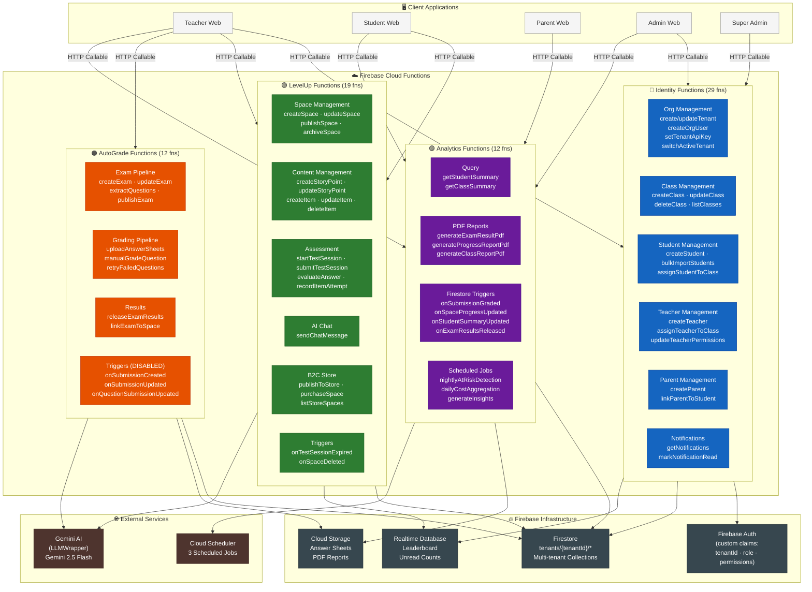
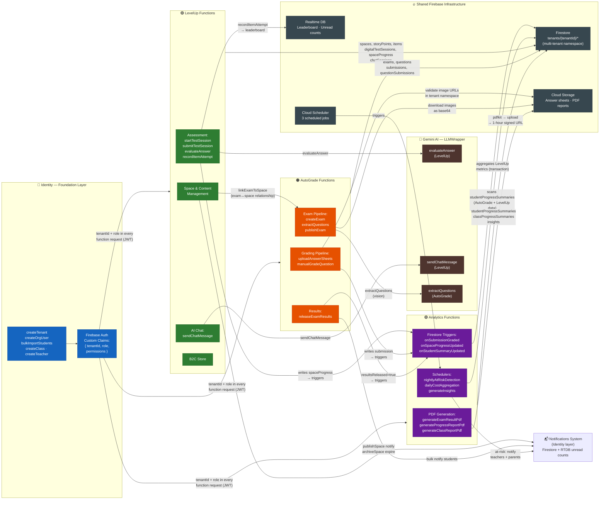

# Cloud Functions Architecture — Auto LevelUp Platform

> **57 Cloud Functions** across **4 Function Groups**: Identity · LevelUp ·
> AutoGrade · Analytics All functions operate under multi-tenant Firestore
> namespace: `tenants/{tenantId}/...`

---

## Diagram 1 — Overall System Architecture



---

## Diagram 2 — LevelUp Function Group

```mermaid
flowchart TD
    %% ── HTTP Callable entry points ──────────────────────────────
    subgraph HTTP["HTTP Callable Functions"]
        direction TB

        subgraph SPC["Space Management"]
            cS["createSpace"]
            uS["updateSpace"]
            pS["publishSpace"]
            aS["archiveSpace"]
        end

        subgraph CNT["Content Management"]
            cSP["createStoryPoint"]
            uSP["updateStoryPoint\n(supports reorder)"]
            cI["createItem"]
            uI["updateItem"]
            dI["deleteItem"]
        end

        subgraph ASS["Assessment"]
            stTS["startTestSession\n(shuffle + max-attempts check)"]
            suTS["submitTestSession\n⏱ 120s timeout"]
            eA["evaluateAnswer\n⏱ 60s · 🔒 5 req/min"]
            rIA["recordItemAttempt"]
        end

        subgraph AIC["AI Chat"]
            sCM["sendChatMessage\n⏱ 30s · 🔒 10 msg/min\nSocratic method"]
        end

        subgraph STR["B2C Store"]
            pTS["publishToStore"]
            puS["purchaseSpace"]
            lSS["listStoreSpaces\n(cursor pagination)"]
        end
    end

    %% ── Background Triggers ─────────────────────────────────────
    subgraph TRG["Background Triggers"]
        oTSE["⏰ onTestSessionExpired\nScheduler: every 5 min"]
        oSD["🔔 onSpaceDeleted\nFirestore: DELETE trigger"]
    end

    %% ── Firebase Services ───────────────────────────────────────
    subgraph FS["Firestore Collections"]
        FS_SPC["spaces"]
        FS_SP["storyPoints"]
        FS_IT["items\n+ answerKeys subcollection"]
        FS_DTS["digitalTestSessions"]
        FS_SPR["spaceProgress"]
        FS_CS["chatSessions\n+ messages subcollection"]
        FS_PUB["tenants/platform_public\n/spaces (store)"]
        FS_NOT["notifications"]
        FS_TS["tenant stats"]
    end

    subgraph EXT["External Services"]
        GEM["🤖 Gemini AI\n(LLMWrapper)"]
        RTDB["⚡ RTDB Leaderboard"]
    end

    %% ── Space Management flows ──────────────────────────────────
    cS -->|"create doc"| FS_SPC
    cS -->|"increment totalSpaces"| FS_TS
    uS -->|"update doc\n(ALLOWED_FIELDS)"| FS_SPC
    pS -->|"status: published"| FS_SPC
    pS -->|"send to class students"| FS_NOT
    aS -->|"status: archived"| FS_SPC
    aS -->|"batch expire (450/batch)"| FS_DTS

    %% ── Content Management flows ────────────────────────────────
    cSP -->|"create doc"| FS_SP
    cSP -->|"increment totalStoryPoints"| FS_SPC
    uSP -->|"update / reorder"| FS_SP
    cI -->|"create item doc\n+ strip answers from payload"| FS_IT
    cI -->|"update totalItems"| FS_SP
    uI -->|"update item + answerKeys"| FS_IT
    dI -->|"cascade delete"| FS_IT
    dI -->|"decrement stats"| FS_SP

    %% ── Assessment flows ────────────────────────────────────────
    stTS -->|"create session\n+ questionOrder"| FS_DTS
    suTS -->|"submit + auto-grade\ndeterministic answers"| FS_DTS
    suTS -->|"upsert progress doc"| FS_SPR
    eA -->|"load item + agent + rubric"| FS_IT
    eA -->|"AI evaluation"| GEM
    eA -->|"save score + token cost"| FS_DTS
    rIA -->|"best score + aggregates"| FS_SPR
    rIA -->|"update ranking"| RTDB

    %% ── AI Chat flows ───────────────────────────────────────────
    sCM -->|"build system prompt\n+ tutor agent"| GEM
    sCM -->|"store messages\n(keep 10-msg preview)"| FS_CS

    %% ── B2C Store flows ─────────────────────────────────────────
    pTS -->|"copy space doc"| FS_PUB
    puS -->|"update consumerProfile\nenrolledSpaceIds + purchaseHistory"| FS_SPC
    lSS -->|"cursor query\n(max 50/page)"| FS_PUB

    %% ── Trigger flows ───────────────────────────────────────────
    oTSE -->|"collectionGroup scan\n+ deadline + 30s grace"| FS_DTS
    oSD -->|"delete storyPoints, items\nagents, sessions, progress\nchatSessions (450/batch)"| FS_SP
    oSD -->|"decrement totalSpaces"| FS_TS
    oSD -->|"delete leaderboard"| RTDB

    %% ── Styling ─────────────────────────────────────────────────
    classDef fn fill:#2E7D32,stroke:#1B5E20,color:#fff,rx:6
    classDef trigger fill:#558B2F,stroke:#33691E,color:#fff,rx:6
    classDef store fill:#37474F,stroke:#263238,color:#fff
    classDef ext fill:#4E342E,stroke:#3E2723,color:#fff

    class cS,uS,pS,aS fn
    class cSP,uSP,cI,uI,dI fn
    class stTS,suTS,eA,rIA fn
    class sCM fn
    class pTS,puS,lSS fn
    class oTSE,oSD trigger
    class FS_SPC,FS_SP,FS_IT,FS_DTS,FS_SPR,FS_CS,FS_PUB,FS_NOT,FS_TS store
    class GEM,RTDB ext
```



---

## Diagram 3 — Identity Function Group

```mermaid
flowchart TD
    %% ── HTTP Callable Functions ─────────────────────────────────
    subgraph HTTP["HTTP Callable Functions"]
        direction TB

        subgraph ORG["Organization Management"]
            cT["createTenant\n🔒 SuperAdmin only\n(atomic transaction)"]
            cOU["createOrgUser\n(teacher/student/parent/scanner)"]
            sTAK["setTenantApiKey\n(Gemini key)"]
            sAT["switchActiveTenant"]
        end

        subgraph CLS["Class Management"]
            cCL["createClass"]
            uCL["updateClass"]
            dCL["deleteClass"]
            lCL["listClasses"]
        end

        subgraph STU["Student Management"]
            cST["createStudent"]
            bIS["bulkImportStudents\n⏱ 540s · 💾 1GiB\n(dry-run · max 500 rows)"]
            aSTC["assignStudentToClass"]
        end

        subgraph TCH["Teacher Management"]
            cTC["createTeacher\n(DEFAULT_TEACHER_PERMISSIONS)"]
            aTCC["assignTeacherToClass"]
            uTP["updateTeacherPermissions"]
        end

        subgraph PAR["Parent Management"]
            cPR["createParent"]
            lPS["linkParentToStudent"]
        end

        subgraph NOT["Notifications"]
            gN["getNotifications\n(cursor · max 50)"]
            mNR["markNotificationRead\n(single or all)"]
        end
    end

    %% ── Disabled Triggers ────────────────────────────────────────
    subgraph DTRG["Triggers — ⛔ DISABLED (pending IAM)"]
        oUC["onUserCreated\nAuth trigger"]
        oUD["onUserDeleted\nAuth trigger"]
        oCDL["onClassDeleted\nFirestore trigger"]
        oSDL["onStudentDeleted\nFirestore trigger"]
    end

    %% ── Firebase Services ────────────────────────────────────────
    subgraph AUTH["Firebase Auth"]
        AU_ACC["Auth Accounts\n(create / update claims)"]
        AU_CLM["Custom Claims\n{ tenantId, role,\n  permissions,\n  activeTenantId }"]
    end

    subgraph FS["Firestore Collections"]
        FS_TN["tenants"]
        FS_TC["tenantCodes\n(uniqueness index)"]
        FS_MB["memberships"]
        FS_ST["students"]
        FS_TC2["teachers"]
        FS_PR["parents"]
        FS_CL["classes"]
        FS_NOT["notifications"]
        FS_TS["tenant stats\n(totalClasses, totalStudents…)"]
    end

    RTDB["⚡ RTDB\nunread notification counts"]

    %% ── Org flows ───────────────────────────────────────────────
    cT -->|"create tenant doc\n+ tenantCode index (transaction)"| FS_TN
    cT -->|"create tenantCode index"| FS_TC
    cT -->|"create admin membership"| FS_MB
    cT -->|"set custom claims"| AU_CLM

    cOU -->|"create Auth account"| AU_ACC
    cOU -->|"create role-specific entity"| FS_ST
    cOU -->|"create membership"| FS_MB
    cOU -->|"set custom claims"| AU_CLM
    cOU -->|"increment tenant stats"| FS_TS

    sTAK -->|"update settings.geminiKeySet"| FS_TN
    sAT -->|"validate membership"| FS_MB
    sAT -->|"update custom claims"| AU_CLM
    sAT -->|"update lastActive"| FS_MB

    %% ── Class flows ─────────────────────────────────────────────
    cCL -->|"create class doc"| FS_CL
    cCL -->|"increment totalClasses"| FS_TS
    uCL -->|"update class doc"| FS_CL
    dCL -->|"delete class doc"| FS_CL
    dCL -->|"decrement totalClasses"| FS_TS
    lCL -->|"query classes"| FS_CL

    %% ── Student flows ───────────────────────────────────────────
    cST -->|"create Auth account"| AU_ACC
    cST -->|"create student entity"| FS_ST
    cST -->|"create membership"| FS_MB
    cST -->|"set custom claims"| AU_CLM

    bIS -->|"batch create Auth accounts"| AU_ACC
    bIS -->|"batch create students (50/batch)"| FS_ST
    bIS -->|"batch create memberships"| FS_MB
    bIS -->|"auto-create parents"| FS_PR
    bIS -->|"completion notification"| FS_NOT

    aSTC -->|"update student.classIds"| FS_ST
    aSTC -->|"update class.studentIds"| FS_CL

    %% ── Teacher flows ───────────────────────────────────────────
    cTC -->|"create Auth account"| AU_ACC
    cTC -->|"create teacher entity\n+ DEFAULT_PERMISSIONS"| FS_TC2
    cTC -->|"create membership"| FS_MB
    aTCC -->|"update teacher.classIds"| FS_TC2
    aTCC -->|"update class.teacherIds"| FS_CL
    uTP -->|"update permissions"| FS_TC2

    %% ── Parent flows ────────────────────────────────────────────
    cPR -->|"create parent entity"| FS_PR
    lPS -->|"update parent.linkedStudentIds"| FS_PR
    lPS -->|"update membership"| FS_MB

    %% ── Notification flows ──────────────────────────────────────
    gN -->|"cursor query (createdAt desc)"| FS_NOT
    mNR -->|"update isRead"| FS_NOT
    mNR -->|"decrement unread count"| RTDB

    %% ── Styling ─────────────────────────────────────────────────
    classDef fn fill:#1565C0,stroke:#0D47A1,color:#fff,rx:6
    classDef disabled fill:#616161,stroke:#424242,color:#fff,rx:6,stroke-dasharray:5 5
    classDef store fill:#37474F,stroke:#263238,color:#fff
    classDef auth fill:#1A237E,stroke:#0D47A1,color:#fff

    class cT,cOU,sTAK,sAT fn
    class cCL,uCL,dCL,lCL fn
    class cST,bIS,aSTC fn
    class cTC,aTCC,uTP fn
    class cPR,lPS fn
    class gN,mNR fn
    class oUC,oUD,oCDL,oSDL disabled
    class FS_TN,FS_TC,FS_MB,FS_ST,FS_TC2,FS_PR,FS_CL,FS_NOT,FS_TS store
    class AU_ACC,AU_CLM auth
```



---

## Diagram 4 — AutoGrade Function Group

```mermaid
flowchart TD
    %% ── Exam Creation Pipeline ──────────────────────────────────
    subgraph CREATE["📝 Exam Creation Pipeline"]
        direction LR
        cE["createExam\n(status: draft)"] --> uE["updateExam\n(pre-publication)"]
        uE --> eQ["extractQuestions\n🤖 Gemini Vision\n⏱ 540s · 💾 2GiB"]
        eQ --> pE["publishExam\n(validates rubric\ncriteria sum = maxMarks)"]
    end

    %% ── Grading Pipeline ────────────────────────────────────────
    subgraph GRADE["📋 Grading Pipeline"]
        direction TB
        uAS["uploadAnswerSheets\n⏱ 300s\n(validates tenant storage namespace)"]

        uAS -->|"pipelineStatus: uploaded"| sSUB["Submission Doc Created"]
        sSUB -->|"🔔 DISABLED TRIGGER"| oSC["⛔ onSubmissionCreated\n(awaiting deletion of HTTPS ver)"]
        oSC -->|"pipelineStatus: grading"| AI_GRD["AI Grading Process"]
        AI_GRD -->|"🔔 DISABLED TRIGGER"| oSU["⛔ onSubmissionUpdated"]
        oSU -->|"pipelineStatus: grading_complete"| COMP["Grading Complete"]
        COMP -->|"🔔 DISABLED TRIGGER"| oQSU["⛔ onQuestionSubmissionUpdated"]
    end

    %% ── Manual Overrides ────────────────────────────────────────
    subgraph MANUAL["✏️ Manual Overrides"]
        mGQ["manualGradeQuestion\n(override AI score + reason)"]
        rFQ["retryFailedQuestions"]
    end

    %% ── Results ─────────────────────────────────────────────────
    subgraph RESULTS["📊 Results"]
        rER["releaseExamResults\n⏱ 300s · 💾 512MiB\n(batch update 450/batch)"]
        lES["linkExamToSpace\n(bridge to LevelUp)"]
    end

    %% ── Storage & AI ────────────────────────────────────────────
    GCS["☁️ Cloud Storage\nAnswer sheet images\n(tenant namespace validated)"]
    GEM["🤖 Gemini AI\n(LLMWrapper)\nGemini 2.5 Flash Vision"]

    %% ── Firestore Collections ───────────────────────────────────
    subgraph FS["Firestore"]
        FS_EX["exams\n(status: draft→published→grading\n→completed→results_released)"]
        FS_QU["exams/{id}/questions\n(rubric criteria per question)"]
        FS_SUB["submissions\n(pipelineStatus pipeline)"]
        FS_QS["submissions/{id}/questionSubmissions\n(per-question scores)"]
        FS_NOT["notifications"]
        FS_TS["exam stats\n(totalSubmissions)"]
    end

    %% ── LevelUp Link ─────────────────────────────────────────────
    LU_SPC["LevelUp Spaces"]

    %% ── Flows ───────────────────────────────────────────────────
    cE -->|"create exam doc"| FS_EX
    pE -->|"status: published"| FS_EX

    eQ -->|"download images as base64"| GCS
    eQ -->|"vision extraction prompt"| GEM
    eQ -->|"save extracted questions + rubrics"| FS_QU
    eQ -->|"status: question_paper_extracted"| FS_EX

    uAS -->|"validate image URLs\nin tenant namespace"| GCS
    uAS -->|"create submission doc"| FS_SUB
    uAS -->|"increment totalSubmissions"| FS_TS
    uAS -->|"exam status → grading\n(first submission)"| FS_EX

    AI_GRD -->|"score per question"| FS_QS

    mGQ -->|"override score + reason"| FS_QS
    rFQ -->|"retry failed questions"| FS_QS

    rER -->|"batch: resultsReleased=true"| FS_SUB
    rER -->|"status: results_released"| FS_EX
    rER -->|"bulk notify students"| FS_NOT

    lES -->|"create exam↔space link"| FS_EX
    lES -->|"reference space"| LU_SPC

    %% ── Styling ─────────────────────────────────────────────────
    classDef fn fill:#E65100,stroke:#BF360C,color:#fff,rx:6
    classDef disabled fill:#616161,stroke:#424242,color:#fff,rx:6,stroke-dasharray:5 5
    classDef store fill:#37474F,stroke:#263238,color:#fff
    classDef ext fill:#4E342E,stroke:#3E2723,color:#fff
    classDef status fill:#FF8F00,stroke:#E65100,color:#fff

    class cE,uE,eQ,pE fn
    class uAS fn
    class mGQ,rFQ fn
    class rER,lES fn
    class oSC,oSU,oQSU disabled
    class FS_EX,FS_QU,FS_SUB,FS_QS,FS_NOT,FS_TS store
    class GCS,GEM ext
    class sSUB,AI_GRD,COMP status
```



---

## Diagram 5 — Analytics Function Group

```mermaid
flowchart TD
    %% ── Input Events from other function groups ─────────────────
    subgraph INPUT["⬅️ Events from Other Function Groups"]
        EV1["LevelUp:\nsubmitTestSession\nrecordItemAttempt\n→ writes spaceProgress"]
        EV2["AutoGrade:\nuploadAnswerSheets\nreleaseExamResults\n→ writes submission"]
    end

    %% ── Firestore Triggers ──────────────────────────────────────
    subgraph TRIGS["🔔 Firestore Triggers"]
        oSPU["onSpaceProgressUpdated\n(Firestore Write:\nspaceProgress/{progressId})"]
        oSG["onSubmissionGraded\n(Firestore Update:\nsubmissions/{submissionId}\nwhen status→graded/complete)"]
        oSSU["onStudentSummaryUpdated\n(Firestore Update:\nstudentProgressSummaries/{studentId})"]
        oERR["onExamResultsReleased\n(Firestore Update:\nwhen resultsReleased=true)"]
    end

    %% ── Aggregation Logic ───────────────────────────────────────
    subgraph AGG["🔢 Aggregation"]
        LU_AGG["LevelUp Aggregation\ntotal points · completion %\nsubject breakdown\nrecent activity (top 10)\nstrengths/weaknesses"]
        AG_AGG["AutoGrade Aggregation\ntotal marks · subject breakdown\nrecent exams (top 10)\naverage percentage\noverall score"]
        CLS_AGG["Class Aggregation\nper-class summary\nfrom all student summaries"]
    end

    %% ── Summary Docs ─────────────────────────────────────────────
    subgraph SUMM["📊 Firestore Summary Collections"]
        FS_SPS["studentProgressSummaries\n(atomic transaction update)"]
        FS_CPS["classProgressSummaries"]
        FS_NOT["notifications"]
    end

    %% ── Scheduled Jobs ──────────────────────────────────────────
    subgraph SCHED["⏰ Scheduled Jobs (Cloud Scheduler)"]
        nARD["nightlyAtRiskDetection\n🕑 2:00 AM UTC daily\n💾 1GiB · ⏱ 540s\n(500 summaries/batch)"]
        dCA["dailyCostAggregation\n(daily)\nLLM cost tracking"]
        gI["generateInsights\n(periodic)\nclass + student recommendations"]
    end

    %% ── Query Functions ─────────────────────────────────────────
    subgraph QUERY["🔍 Query Functions"]
        gSS["getStudentSummary\n(auth: own data for students\nteacher: assigned students)"]
        gCS["getClassSummary\n(auth: assigned classes\nstudents denied)"]
    end

    %% ── PDF Generation ───────────────────────────────────────────
    subgraph PDF["📄 PDF Report Generation (all: ⏱ 120s · 💾 512MiB)"]
        gERP["generateExamResultPdf\n(individual or class summary)\nsubmissions + questions → pdfkit"]
        gPRP["generateProgressReportPdf\n(AutoGrade + LevelUp combined)\nstrengths/weaknesses + at-risk"]
        gCRP["generateClassReportPdf\n(batch fetch 30 students)"]
    end

    GCS["☁️ Cloud Storage\nPDF uploads → 1-hour signed URL"]
    NOTIF["Notify Teachers & Parents\n(for at-risk students)"]
    INSIGHTS["Insight Documents\n(class + student level)"]

    %% ── Trigger chains ───────────────────────────────────────────
    EV1 -->|"Firestore write triggers"| oSPU
    EV2 -->|"Firestore write triggers"| oSG

    oSPU -->|"batch fetch spaces (30/batch)"| LU_AGG
    oSG -->|"batch fetch exams (30/batch)"| AG_AGG

    LU_AGG -->|"transaction write"| FS_SPS
    AG_AGG -->|"transaction write"| FS_SPS

    FS_SPS -->|"update triggers"| oSSU
    oSSU -->|"recalculate class metrics"| CLS_AGG
    CLS_AGG --> FS_CPS

    EV2 -->|"resultsReleased=true"| oERR
    oERR -->|"notify students"| FS_NOT

    %% ── Scheduled flows ──────────────────────────────────────────
    nARD -->|"scan ALL summaries (500/batch)\nevaluateAtRiskRules()"| FS_SPS
    nARD -->|"newly flagged students"| NOTIF

    dCA -->|"aggregate LLM costs"| FS_SPS
    gI -->|"create insights"| INSIGHTS

    %% ── Query flows ──────────────────────────────────────────────
    gSS --> FS_SPS
    gCS --> FS_CPS

    %% ── PDF flows ────────────────────────────────────────────────
    gERP -->|"fetch submissions + questions"| FS_SPS
    gERP -->|"pdfkit → upload"| GCS
    gPRP -->|"fetch AutoGrade + LevelUp data"| FS_SPS
    gPRP -->|"pdfkit → upload"| GCS
    gCRP -->|"batch fetch 30 students"| FS_SPS
    gCRP -->|"pdfkit → upload"| GCS

    %% ── Styling ─────────────────────────────────────────────────
    classDef trigger fill:#6A1B9A,stroke:#4A148C,color:#fff,rx:6
    classDef fn fill:#7B1FA2,stroke:#6A1B9A,color:#fff,rx:6
    classDef sched fill:#4A148C,stroke:#311B92,color:#fff,rx:6
    classDef store fill:#37474F,stroke:#263238,color:#fff
    classDef input fill:#263238,stroke:#37474F,color:#fff
    classDef agg fill:#880E4F,stroke:#6A1B9A,color:#fff

    class oSPU,oSG,oSSU,oERR trigger
    class gSS,gCS fn
    class gERP,gPRP,gCRP fn
    class nARD,dCA,gI sched
    class FS_SPS,FS_CPS,FS_NOT store
    class EV1,EV2 input
    class LU_AGG,AG_AGG,CLS_AGG agg
```



---

## Diagram 6 — Cross-System Data Flow



---

## Function Inventory

### 🔵 Identity — 29 Functions

| Function                   | Trigger                       | Auth                   | Purpose                                                                  |
| -------------------------- | ----------------------------- | ---------------------- | ------------------------------------------------------------------------ |
| `createTenant`             | HTTP Callable                 | SuperAdmin             | Create tenant + tenantCode index (atomic transaction), set custom claims |
| `createOrgUser`            | HTTP Callable                 | TenantAdmin/SuperAdmin | Create user, role-specific entity, membership, set custom claims         |
| `setTenantApiKey`          | HTTP Callable                 | TenantAdmin            | Store Gemini API key flag on tenant settings                             |
| `switchActiveTenant`       | HTTP Callable                 | Authenticated          | Validate membership, rebuild JWT claims, update lastActive               |
| `createClass`              | HTTP Callable                 | TenantAdmin            | Create class, increment `totalClasses` stat                              |
| `updateClass`              | HTTP Callable                 | TenantAdmin            | Update class properties                                                  |
| `deleteClass`              | HTTP Callable                 | TenantAdmin            | Delete class, decrement `totalClasses` stat                              |
| `listClasses`              | HTTP Callable                 | TenantAdmin/Teacher    | Paginated list of tenant classes                                         |
| `createStudent`            | HTTP Callable                 | TenantAdmin            | Create Auth account + student entity + membership + custom claims        |
| `bulkImportStudents`       | HTTP Callable ⏱540s 💾1GiB    | TenantAdmin            | CSV import up to 500 students, dry-run support, auto-creates parents     |
| `assignStudentToClass`     | HTTP Callable                 | TenantAdmin            | Update `student.classIds` + `class.studentIds` bidirectionally           |
| `updateStudent`            | HTTP Callable                 | TenantAdmin            | Update student properties                                                |
| `deleteStudent`            | HTTP Callable                 | TenantAdmin            | Delete student, decrement `totalStudents`                                |
| `createTeacher`            | HTTP Callable                 | TenantAdmin            | Create Auth account + teacher entity with `DEFAULT_TEACHER_PERMISSIONS`  |
| `updateTeacher`            | HTTP Callable                 | TenantAdmin            | Update teacher properties                                                |
| `assignTeacherToClass`     | HTTP Callable                 | TenantAdmin            | Update `teacher.classIds` + `class.teacherIds` bidirectionally           |
| `updateTeacherPermissions` | HTTP Callable                 | TenantAdmin            | Update teacher permissions and managed class list                        |
| `createParent`             | HTTP Callable                 | TenantAdmin            | Create parent entity with `linkedStudentIds`                             |
| `linkParentToStudent`      | HTTP Callable                 | TenantAdmin            | Update `parent.linkedStudentIds` + membership                            |
| `createAcademicSession`    | HTTP Callable                 | TenantAdmin            | Create academic year/semester                                            |
| `updateAcademicSession`    | HTTP Callable                 | TenantAdmin            | Update academic session properties                                       |
| `getNotifications`         | HTTP Callable                 | Required               | Paginated notifications (cursor, max 50, ordered by `createdAt` desc)    |
| `markNotificationRead`     | HTTP Callable                 | Required               | Mark single or all notifications read; decrement RTDB unread count       |
| `onUserCreated`            | Auth Trigger ⛔ DISABLED      | —                      | Create user profile doc on Auth account creation                         |
| `onUserDeleted`            | Auth Trigger ⛔ DISABLED      | —                      | Cleanup user data on Auth account deletion                               |
| `onClassDeleted`           | Firestore Trigger ⛔ DISABLED | —                      | Cascade: remove students from deleted class                              |
| `onStudentDeleted`         | Firestore Trigger ⛔ DISABLED | —                      | Cascade: cleanup student data                                            |

---

### 🟢 LevelUp — 19 Functions

| Function               | Trigger              | Timeout | Purpose                                                                    |
| ---------------------- | -------------------- | ------- | -------------------------------------------------------------------------- |
| `createSpace`          | HTTP Callable        | default | Create learning space, increment `tenant.totalSpaces`                      |
| `updateSpace`          | HTTP Callable        | default | Update space (ALLOWED_FIELDS whitelist validation)                         |
| `publishSpace`         | HTTP Callable        | default | Validate & publish space; notify assigned class students                   |
| `archiveSpace`         | HTTP Callable        | default | Archive space; batch-expire `digitalTestSessions` (450/batch)              |
| `createStoryPoint`     | HTTP Callable        | default | Create story point, increment `space.totalStoryPoints`                     |
| `updateStoryPoint`     | HTTP Callable        | default | Update story point or batch-reorder via `orderIndex` array                 |
| `createItem`           | HTTP Callable        | default | Create item; extract answers → `answerKeys` subcollection; update stats    |
| `updateItem`           | HTTP Callable        | default | Update item + sync `answerKeys` subcollection                              |
| `deleteItem`           | HTTP Callable        | default | Delete item + cascade delete `answerKeys`; decrement stats                 |
| `startTestSession`     | HTTP Callable        | default | Create session with question shuffling, max-attempts enforcement           |
| `submitTestSession`    | HTTP Callable        | 120s    | Submit session; auto-grade deterministic questions; update `spaceProgress` |
| `evaluateAnswer`       | HTTP Callable        | 60s     | AI-evaluate single answer via Gemini; 🔒 rate-limited 5 req/min            |
| `recordItemAttempt`    | HTTP Callable        | default | Record practice attempt; update `spaceProgress`; update RTDB leaderboard   |
| `sendChatMessage`      | HTTP Callable        | 30s     | Socratic AI tutor via Gemini; 🔒 rate-limited 10 msg/min                   |
| `publishToStore`       | HTTP Callable        | default | Copy space to `tenants/platform_public/spaces`                             |
| `purchaseSpace`        | HTTP Callable        | default | Update `user.consumerProfile` (enrolledSpaceIds, purchaseHistory)          |
| `listStoreSpaces`      | HTTP Callable        | default | Cursor-paginated store listing (max 50/page, filter by subject/search)     |
| `onTestSessionExpired` | ⏰ Scheduler (5 min) | default | collectionGroup scan; expire sessions past deadline + 30s grace            |
| `onSpaceDeleted`       | 🔔 Firestore DELETE  | default | Cascade delete all space data (450-op batches) + RTDB leaderboard          |

---

### 🟠 AutoGrade — 12 Functions

| Function                      | Trigger                      | Timeout/Memory | Purpose                                                                     |
| ----------------------------- | ---------------------------- | -------------- | --------------------------------------------------------------------------- |
| `createExam`                  | HTTP Callable                | default        | Create exam, initialise `gradingConfig`, status: `draft`                    |
| `updateExam`                  | HTTP Callable                | default        | Update exam properties before publication                                   |
| `extractQuestions`            | HTTP Callable                | ⏱540s 💾2GiB   | Gemini Vision: download images, extract questions + rubrics                 |
| `publishExam`                 | HTTP Callable                | default        | Validate rubric sums = maxMarks, publish exam                               |
| `uploadAnswerSheets`          | HTTP Callable                | ⏱300s          | Validate tenant-namespaced image URLs, create submission, update exam stats |
| `manualGradeQuestion`         | HTTP Callable                | default        | Override AI-graded score with optional justification reason                 |
| `retryFailedQuestions`        | HTTP Callable                | default        | Re-trigger AI grading for failed question submissions                       |
| `releaseExamResults`          | HTTP Callable                | ⏱300s 💾512MiB | Batch mark `resultsReleased=true` (450/batch); bulk notify students         |
| `linkExamToSpace`             | HTTP Callable                | default        | Create exam ↔ LevelUp space relationship                                    |
| `onSubmissionCreated`         | Firestore CREATE ⛔ DISABLED | —              | Initiate grading pipeline when answer sheet uploaded                        |
| `onSubmissionUpdated`         | Firestore UPDATE ⛔ DISABLED | —              | Monitor pipeline status transitions through grading stages                  |
| `onQuestionSubmissionUpdated` | Firestore UPDATE ⛔ DISABLED | —              | React to individual question grading completion                             |

---

### 🟣 Analytics — 12 Functions

| Function                    | Trigger               | Timeout/Memory | Purpose                                                                  |
| --------------------------- | --------------------- | -------------- | ------------------------------------------------------------------------ |
| `getStudentSummary`         | HTTP Callable         | default        | Read pre-computed `studentProgressSummaries`; access-controlled by role  |
| `getClassSummary`           | HTTP Callable         | default        | Read pre-computed `classProgressSummaries`; students denied              |
| `generateExamResultPdf`     | HTTP Callable         | ⏱120s 💾512MiB | pdfkit: individual or class exam result PDF → Cloud Storage → signed URL |
| `generateProgressReportPdf` | HTTP Callable         | ⏱120s 💾512MiB | Combined AutoGrade + LevelUp progress report → Cloud Storage             |
| `generateClassReportPdf`    | HTTP Callable         | ⏱120s 💾512MiB | Class-level report; batch-fetch 30 students → Cloud Storage              |
| `onSubmissionGraded`        | 🔔 Firestore UPDATE   | default        | Recalculate AutoGrade metrics when submission status → graded            |
| `onSpaceProgressUpdated`    | 🔔 Firestore WRITE    | default        | Recalculate LevelUp metrics when `spaceProgress` changes                 |
| `onStudentSummaryUpdated`   | 🔔 Firestore UPDATE   | default        | Propagate student summary changes → class summary update                 |
| `onExamResultsReleased`     | 🔔 Firestore UPDATE   | default        | Notify students when `resultsReleased` → true                            |
| `nightlyAtRiskDetection`    | ⏰ Scheduler 2AM UTC  | ⏱540s 💾1GiB   | Scan all summaries (500/batch); flag at-risk; notify teachers & parents  |
| `dailyCostAggregation`      | ⏰ Scheduler daily    | default        | Aggregate LLM token costs per tenant                                     |
| `generateInsights`          | ⏰ Scheduler periodic | default        | Create class and student insight/recommendation documents                |

---

## Key Architectural Patterns

### Multi-Tenancy

All collections live under `tenants/{tenantId}/` ensuring complete data
isolation. Every function validates `tenantId` from the caller's JWT custom
claims before touching Firestore.

### Custom Claims Flow

```
createTenant / createOrgUser / createStudent / createTeacher
  → Firebase Admin SDK setCustomUserClaims()
  → { tenantId, role, permissions, activeTenantId }
  → Embedded in every subsequent request JWT
  → Validated by every cloud function before execution
```

### Batch Operation Safety

Firestore maximum batch size = 500 writes. All batch operations in this codebase
cap at **450 writes per batch** to maintain a safe buffer.

### LLM Integration (LLMWrapper)

```
evaluateAnswer  ──┐
sendChatMessage ──┤── LLMWrapper ── Gemini API
extractQuestions──┘

Tracks: clientId · userId · userRole · purpose · operation · resource
Returns: { result, inputTokens, outputTokens, costUSD }
```

### Analytics Aggregation Pipeline

```
User Action
  ↓
LevelUp / AutoGrade writes Firestore doc
  ↓
Firestore trigger (onSpaceProgressUpdated / onSubmissionGraded)
  ↓
Batch fetch related docs → compute metrics → atomic transaction write
  ↓
studentProgressSummaries updated
  ↓
onStudentSummaryUpdated → classProgressSummaries updated
  ↓
nightlyAtRiskDetection (2AM UTC) → evaluate rules → notify stakeholders
```

### Rate Limiting

| Function          | Limit               | Mechanism                        |
| ----------------- | ------------------- | -------------------------------- |
| `evaluateAnswer`  | 5 req/min per user  | Server-side counter in Firestore |
| `sendChatMessage` | 10 msg/min per user | Server-side counter in Firestore |

### Notification Architecture

- **Storage**: `tenants/{tenantId}/notifications/{notifId}` (Firestore)
- **Real-time unread count**: Realtime Database (RTDB) per user
- **Producers**: LevelUp (`publishSpace`, `archiveSpace`), AutoGrade
  (`releaseExamResults`), Analytics (`nightlyAtRiskDetection`,
  `onExamResultsReleased`)
- **Consumer**: Identity `getNotifications` / `markNotificationRead`
