# Space Progress Architecture — Complete Reference

> Auto-LevelUp EdTech Platform — Progress Data Model & Flow

---

## 1. Firestore Data Model (Entity-Relationship)

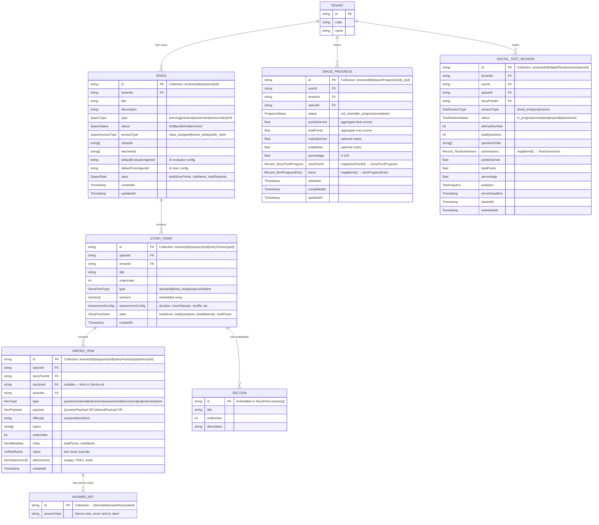

---

## 2. Progress Data Structures (Type Hierarchy)

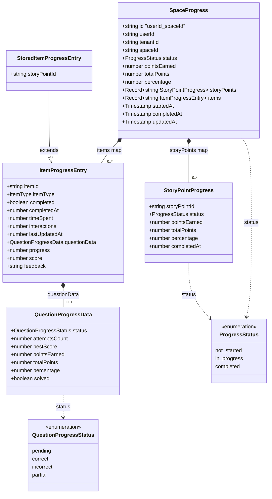

---

## 3. Content Hierarchy (Space → StoryPoint → Item)

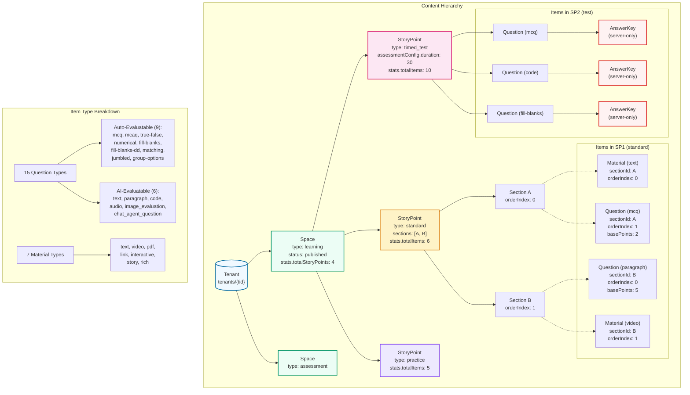

---

## 4. Firestore Document Structure (Actual Paths)

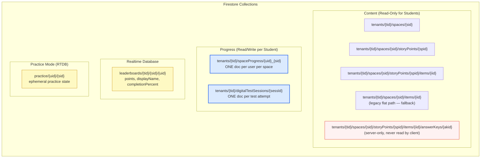

---

## 5. SpaceProgress Document Example

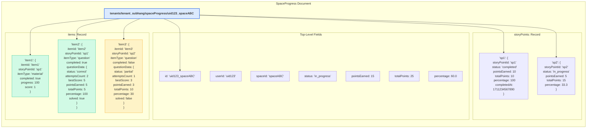

---

## 6. Answer Submission Flow (Standard StoryPoint)

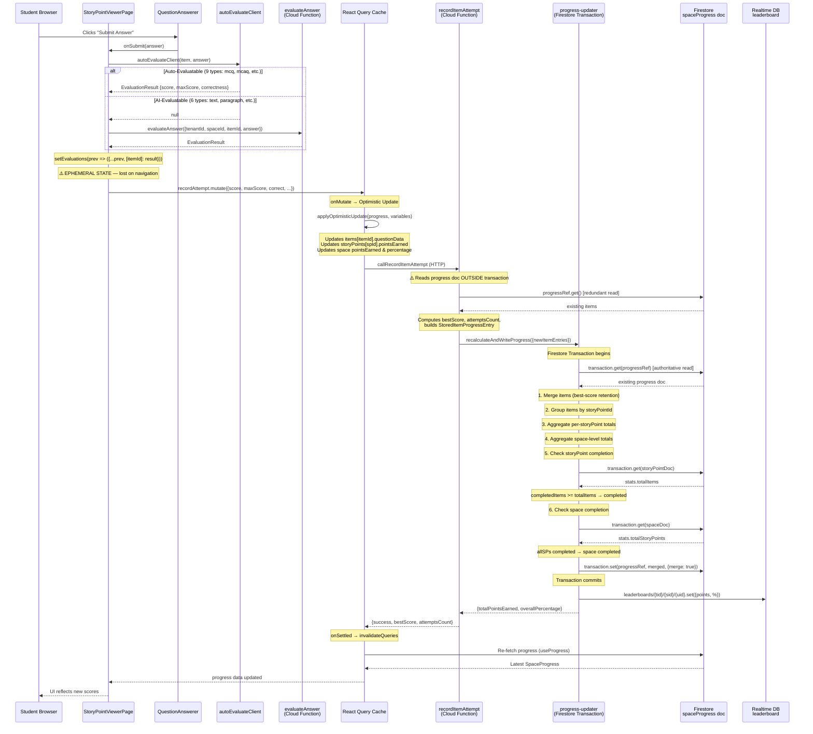

---

## 7. Test Submission Flow

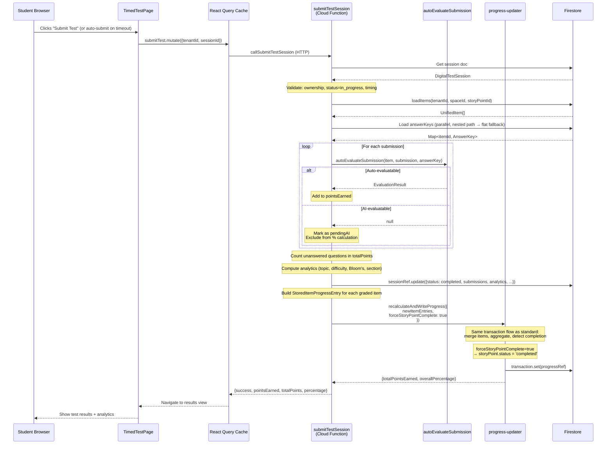

---

## 8. Progress Aggregation Pipeline (Inside Transaction)

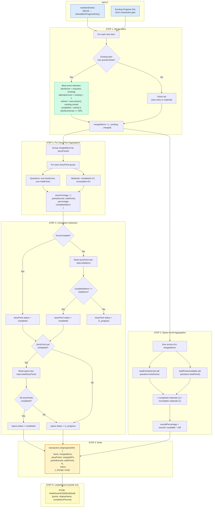

---

## 9. Frontend Data Flow (Hooks → Cache → UI)

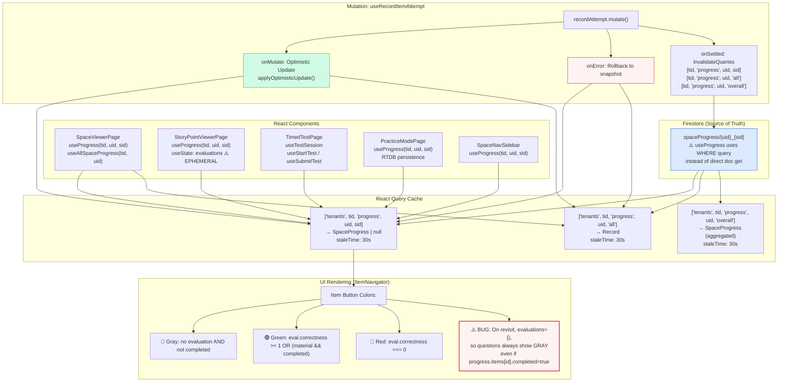

---

## 10. Optimistic Update vs Server Logic (Mismatch Diagram)

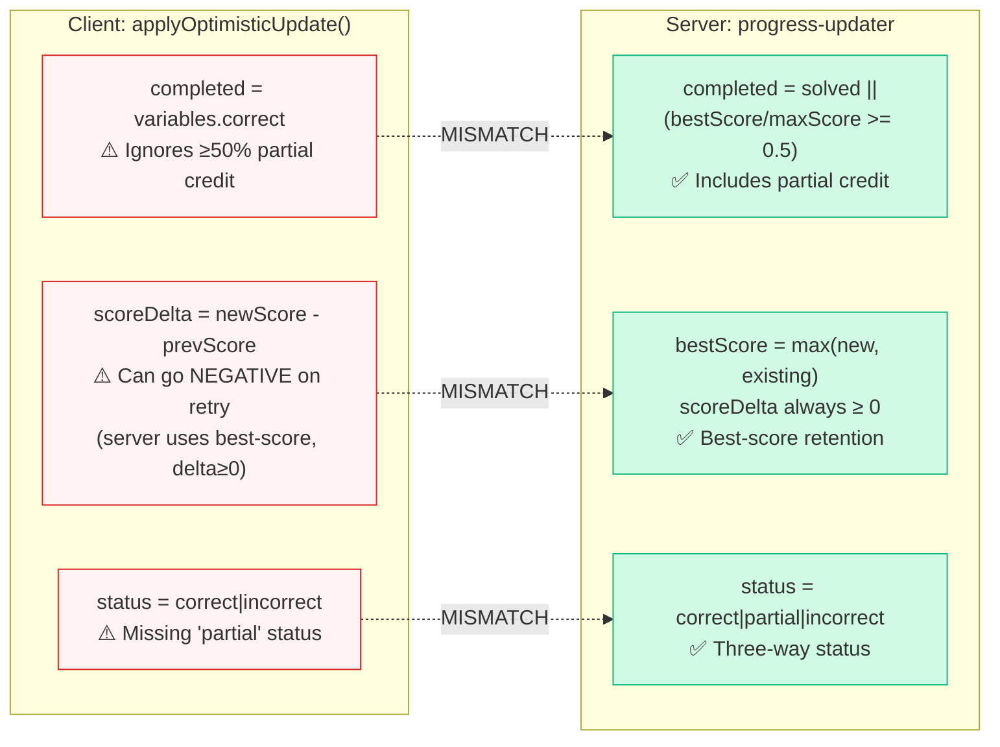

---

## 11. Dual-Path Data Processing (record-item-attempt + progress-updater)

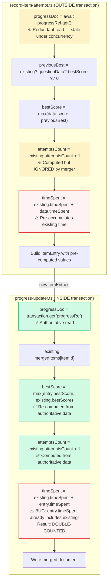

---

## 12. Known Issues Summary

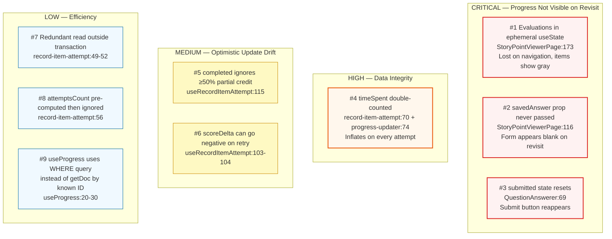

---

## 13. Scoring Rules Summary

| Item Type                       | Scoring Source                    | Completion Rule                         | Points Contribution                |
| ------------------------------- | --------------------------------- | --------------------------------------- | ---------------------------------- |
| **Question (auto-evaluatable)** | Client `autoEvaluateClient()`     | `correct \|\| bestScore/maxScore ≥ 50%` | `bestScore` (best-score retention) |
| **Question (AI-evaluatable)**   | Cloud `evaluateAnswer()`          | `correct \|\| bestScore/maxScore ≥ 50%` | `bestScore` (best-score retention) |
| **Material**                    | Auto-complete on mount            | `score = 1, maxScore = 1`               | `1` when completed, `0` otherwise  |
| **Test question**               | Server `autoEvaluateSubmission()` | `correct \|\| score/maxScore ≥ 50%`     | `bestScore` per attempt            |
| **AI-pending test Q**           | Excluded until graded             | Excluded from %                         | `0` until AI evaluates             |

## 14. Key Files Reference

| Layer        | File                                                             | Purpose                                                                      |
| ------------ | ---------------------------------------------------------------- | ---------------------------------------------------------------------------- |
| **Types**    | `packages/shared-types/src/levelup/progress.ts`                  | SpaceProgress, StoryPointProgress, ItemProgressEntry, QuestionProgressData   |
| **Types**    | `packages/shared-types/src/levelup/space.ts`                     | Space, SpaceStats, SpaceStatus                                               |
| **Types**    | `packages/shared-types/src/levelup/story-point.ts`               | StoryPoint, StoryPointType, AssessmentConfig, StoryPointStats                |
| **Types**    | `packages/shared-types/src/content/item.ts`                      | UnifiedItem, ItemType (7), QuestionType (15), MaterialType (7), all payloads |
| **Types**    | `packages/shared-types/src/levelup/test-session.ts`              | DigitalTestSession, TestSubmission, TestAnalytics                            |
| **Backend**  | `functions/levelup/src/callable/record-item-attempt.ts`          | Records single item attempt (standard/practice)                              |
| **Backend**  | `functions/levelup/src/callable/submit-test-session.ts`          | Submits entire test, grades all questions                                    |
| **Backend**  | `functions/levelup/src/utils/progress-updater.ts`                | Unified transactional progress writer                                        |
| **Hooks**    | `packages/shared-hooks/src/queries/useProgress.ts`               | useProgress, useAllSpaceProgress                                             |
| **Hooks**    | `packages/shared-hooks/src/queries/useRecordItemAttempt.ts`      | Mutation + optimistic update                                                 |
| **Frontend** | `apps/student-web/src/pages/StoryPointViewerPage.tsx`            | Standard story point viewer + item navigator                                 |
| **Frontend** | `apps/student-web/src/pages/TimedTestPage.tsx`                   | Timed test experience                                                        |
| **Frontend** | `apps/student-web/src/pages/PracticeModePage.tsx`                | Practice mode with RTDB persistence                                          |
| **Frontend** | `apps/student-web/src/components/questions/QuestionAnswerer.tsx` | Universal question answerer (15 types)                                       |
| **Frontend** | `apps/student-web/src/utils/auto-evaluate-client.ts`             | Client-side deterministic evaluation                                         |
| **Services** | `packages/shared-services/src/levelup/assessment-callables.ts`   | callRecordItemAttempt, callSubmitTestSession                                 |
